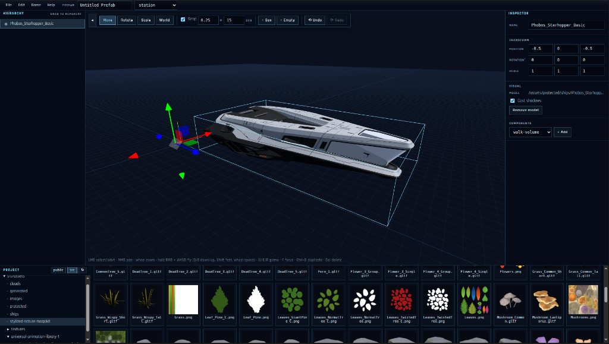
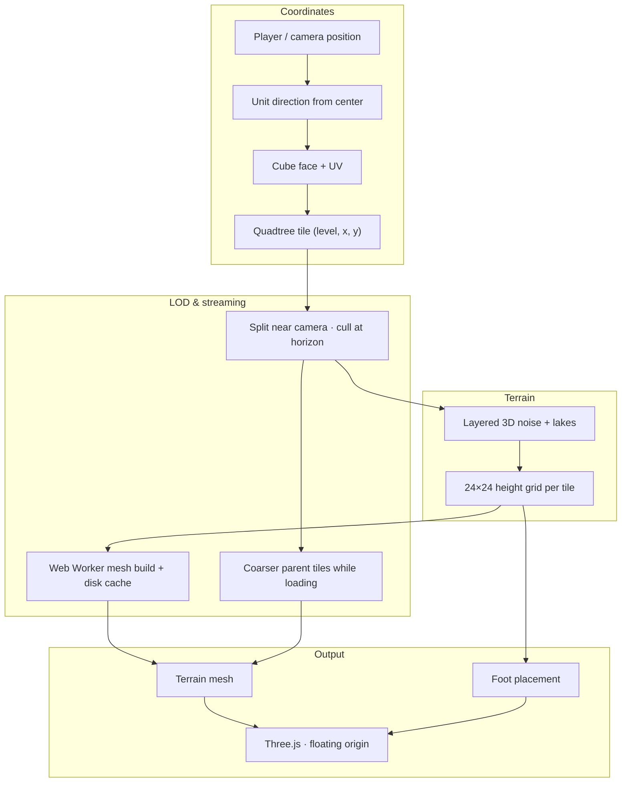
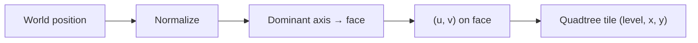
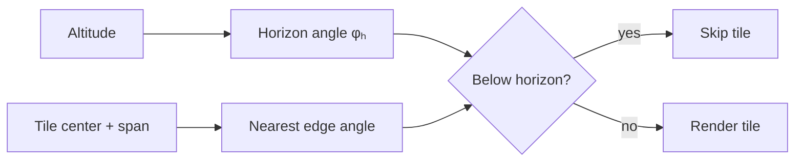
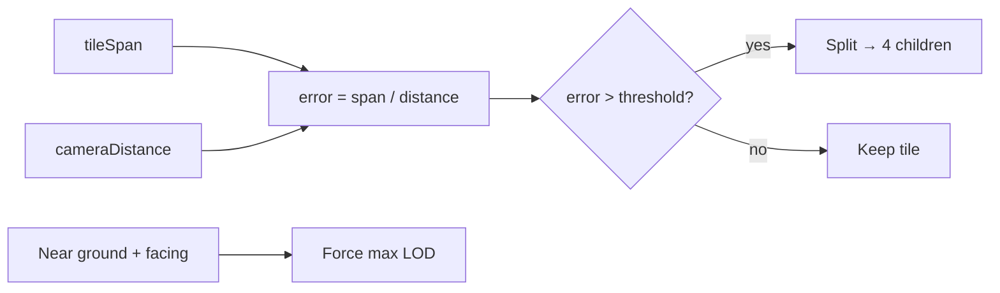
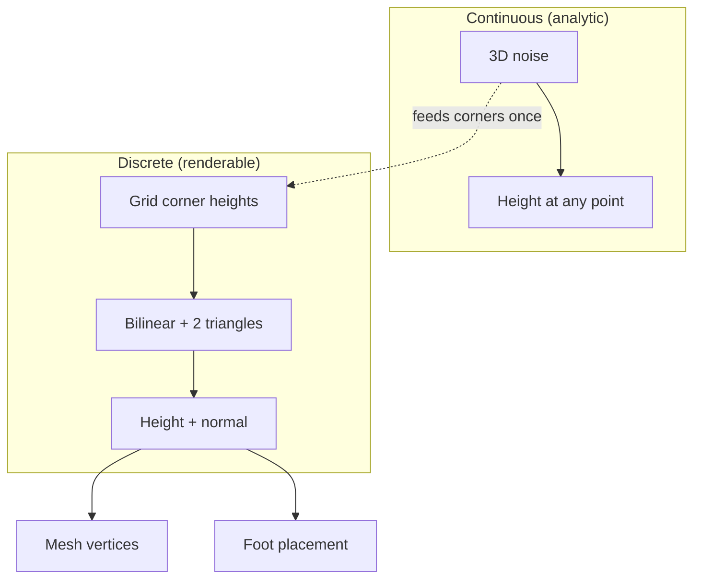
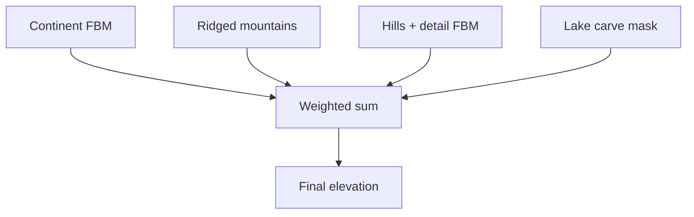
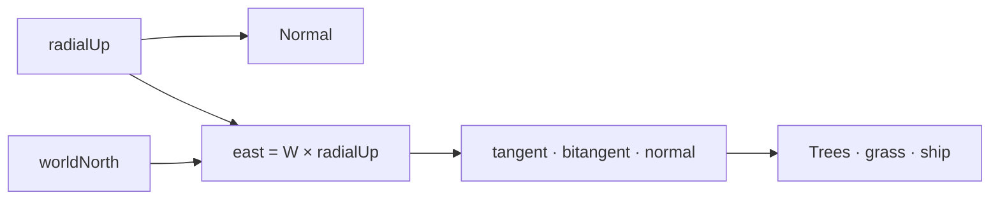
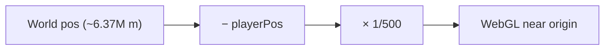

# ClaudeCitizen


[](https://www.buymeacoffee.com/alangreyjoy)

> [!NOTE]
> This is a passion project — if you'd like to show your support, every donation goes straight to feeding the **Claude Fable 5** beast that keeps this thing going.

A browser-based space sandbox inspired by Star Citizen — procedural planets, ship flight, on-foot exploration, and seamless surface-to-orbit transitions. Built with TypeScript, Vite, and Three.js.

The homeworld is **Asteron**: Earth-scale radius, deterministic terrain, lakes, vegetation, volumetric clouds, and a full atmospheric shell.

This project is **100% vibe coded** — built iteratively with AI-assisted development rather than a formal spec. I'm a Staff Software Engineer and Solutions Architect with 17+ years of experience; this is a passion sandbox, not a production product.

**Work in progress.** Phase 1 is FPS weapons and character-controller updates — see the [roadmap](#roadmap).

## Live Play Test

[https://claudecitizen.netlify.app/](https://claudecitizen.netlify.app/)

## Quick start

```bash
npm install
npm run dev
```

Open [http://localhost:4173](http://localhost:4173). You get a title screen with **Play**; dev builds also show **Editor**. Click the canvas to lock the mouse.

## Game editor (dev only)

The in-browser editor assembles **prefabs** — trees of GLB assets, box primitives, and gameplay markers — that the game loads as the orbital station or the player ship. It is only available under `npm run dev`; production builds contain no editor code.



The screenshot above shows the dev-only prefab editor: a Unity-style layout with hierarchy, scene view, inspector, and project browser. Here the Phobos Starhopper is being placed in a station prefab with a `walk-volume` component for on-foot collision.

Open it from the title screen or deep-link with `http://localhost:4173/?boot=editor`.

| Panel | What it does |
| --- | --- |
| **Hierarchy** (left) | Scene tree — click to select, double-click to rename, drag rows to reparent, eye toggles visibility |
| **Scene View** (center) | Orbit camera (LMB drag orbit, MMB pan, wheel zoom), Unity-style flythrough (hold RMB + WASD, `Q`/`E` down/up, `Shift` fast, wheel adjusts fly speed), transform gizmo, click to select, drag assets in to place them |
| **Inspector** (right) | Name, transform fields, box primitive / model settings, and gameplay components |
| **Project** (bottom) | Merged asset browser over `editor/assets/` and `src/assets/` with model thumbnails; drag GLB/GLTF cards into the scene |

Toolbar: **Move / Rotate / Scale** (`W` / `E` / `R`), local/world space, snap toggle with translate (default `0.25 m`) and rotate (default `15°`) increments (hold `Ctrl` to invert snapping while dragging), `+ Box` / `+ Empty`, undo/redo (`Ctrl+Z` / `Ctrl+Shift+Z`), prefab name + kind, **New / Load / Save** (`Ctrl+S`), **Preview Station / Preview Ship** (per kind), Exit. `F` focuses the selection, `Ctrl+D` duplicates, `Del` deletes.

### Prefabs

Saving writes JSON to `src/world/prefabs/data/<id>.prefab.json` (tracked — metadata only, asset urls may point at gitignored protected files). The game bundles these files, and the production build copies only the asset files referenced by those prefabs.

Components are added in the Inspector through a **search/autocomplete box** (type to filter, arrows + Enter to add) that only offers types valid for the current prefab kind. Unity-style placement: adding a spatial component (zones, doors, seats, pads, …) to a model entity creates an **empty child marker** carrying the component, selected and ready to move with the gizmo; adding to an empty attaches directly. Station components:

| Component | Purpose |
| --- | --- |
| `walk-volume` | Walkable floor box per floor (`hab` / `lobby` / `hangar`); edges are collision. Mark hangar mouths with open sides |
| `spawn-point` | Player spawn; the entity's forward (+Z) sets facing |
| `elevator` | Two markers sharing a pair id on different floors form a working elevator (F to ride) |
| `hangar-pad` | Ship parking spot inside a hangar walk volume; place at pad surface height. Parked ships rest at their own prefab-authored gear height above it |
| `interaction` | Shows a prompt within a radius |
| `collider` | Reserved for future physics |

### Previewing a station prefab

The hand-rolled procedural station remains the default. To play a prefab station instead (dev only):

```text
http://localhost:4173/?stationPrefab=<prefab-id>
```

Try the tracked example: `?stationPrefab=demo-station`. The **Preview Station** toolbar button saves and jumps there directly, and the **Back to Editor** banner at the top of the preview returns you to the editor with the same prefab open (press `Esc` first to release the mouse). Walk volumes, spawn, elevators, and hangar pads all come from the prefab's components; the ship terminal/hangar-bank flow still belongs to the procedural station until cutover.

### Ship prefabs (Ship Editor mode)

Setting the prefab kind to `ship` switches the editor into **Ship Editor** mode: the toolbar shows a SHIP EDITOR chip, the component palette narrows to ship types, and the viewport toolbar grows a **Ship** group with **Gear** / **Ramp** toggles plus one button per authored door for articulation preview. Dragging a GLB from a `ships/` folder also offers to start a ship prefab and marks the model as the hull.

The player ship is itself a prefab: the game loads `phobos-starhopper` (`src/world/prefabs/data/phobos-starhopper.prefab.json`) at startup, so its hull model, walkable interior, doors, pilot seat, and ramp all come from components. The hardcoded Starhopper layout remains only as a fallback when the prefab is missing.

Ship components:

| Component | Purpose |
| --- | --- |
| `ship-hull` | Marks the entity whose GLB model is the flyable hull (one per prefab, keep at 0,0,0). `restHeight` sets the parked height above ground; unset lets previews rest the hull on the pad automatically |
| `ship-walk-zone` | Walkable deck rect; entity height sets the floor, `slopeMinUp` slopes ramps/steps, `gate` locks it behind the boarding ramp or a door, `passage` marks doorways |
| `ship-door` | Open/close door bound to GLB nodes (slide meters or hinge radians per node); entity position is the F-interact spot; walk zones gate on its id |
| `pilot-seat` | Seat pose + eye offset (cockpit camera) + stand-up spot |
| `ramp-interact` | Raise/lower ramp prompt — `outside` at the ramp foot or a `deck` panel |
| `ramp-mount` | Ground strip where walking in steps onto the lowered ramp |
| `interaction` / `collider` | Shared with stations |

Use `window.__claudecitizenShipModel.listNodeNames()` in the play/sandbox console (or `node scripts/inspect_glb.mjs <path>`) to find GLB node names for `ship-door` bindings.

### Ship sandbox

**Preview Ship** saves and opens the isolated ship sandbox (dev only):

```text
http://localhost:4173/?shipPrefab=<prefab-id>
```

The ship sits parked on a flat test pad — no planet, station, or flight — so you can verify everything a ship prefab authors: walk the deck, mount/dismount the ramp, open and close every door, take the pilot seat (cockpit camera comes from `pilot-seat.eye`), and toggle the landing gear (`G`). The **Back to Editor** banner returns to the editor with the prefab open. Try it with the tracked default: `?shipPrefab=phobos-starhopper`.

### Importing Synty packs (e.g. POLYGON Sci-Fi Worlds)

1. Export the modular pieces you want from Unity as FBX, then convert to GLB — Blender (`File → Export → glTF 2.0`) or [`gltf-transform`](https://gltf-transform.dev/) both work. One piece per file keeps snapping simple.
2. Drop the GLBs under `editor/assets/protected/synty/sci-fi-worlds/{Buildings,Props,Environment,...}/`. Everything under `editor/assets/` is gitignored by default, exactly like the Starhopper.
3. Verify a file with `node scripts/inspect_glb.mjs <path>` if materials or hierarchy look off; the bake approach in `scripts/bake_ship_textures.py` is the template for fixing Unity trim-sheet materials that do not translate to Three.js PBR.
4. Refresh the editor's Project panel — the files appear under the `assets` root with generated thumbnails, ready to drag into a scene.

Prefab JSON only references asset paths, so prefabs are safe to commit even when they point at protected files; public checkouts simply see missing-model placeholders.

### Runtime character avatars

Skinned Unity character exports can live under `src/assets/protected/characters/`. The runtime keeps the tracked UAL mannequin as the default avatar; local exports can be selected explicitly while their skeleton and animation mapping is tested.

Try alternate exports with `?character=ual-mannequin`, `?character=space-suit-male`, `?character=soldier-male`, `?character=strider-male`, `?character=alien-armor`, `?character=alien-chef`, `?character=alien-combat`, or `?character=alien-rock`.

In the editor Project panel, open `protected/characters`, then use a model card's **Character** or **Anims** action to test a mesh against embedded clips or the built-in UAL clip source in the scene view's **Character Preview** tab.

Unity's Mecanim animator controller does not export to GLTF/GLB as a usable browser state machine. The game keeps the state machine in TypeScript (`Idle_Loop`, `Walk_Loop`, `Sprint_Loop`, jump phases) and retargets baked humanoid clips onto the Unity-style skeleton at load time. Export additional Unity animation clips as baked FBX/GLB clips, then add them to the character avatar catalog or map them onto the existing state names.

## Optional protected assets

Some local development assets are not part of the open-source repo. Put paid or otherwise non-redistributable runtime assets under `editor/assets/protected/`; editor asset files are ignored by git by default. Use `editor/assets/free/` for local assets that are license-safe but still should not be committed automatically.

The Starhopper model is expected at:

```text
editor/assets/protected/ships/Phobos_Starhopper_Basic.glb
```

If it is missing, the game falls back to the tracked placeholder ship.

Production builds scan saved prefab JSON and copy only referenced files from `editor/assets/` into `dist/editor/assets/`. A prefab that uses one protected asset includes that asset in the web build; a local library of unused assets stays out of `dist/`.

## Netlify deployment

Netlify uses `npm run build` and publishes `dist/` via `netlify.toml`.

```bash
npm run deploy:netlify       # draft deploy
npm run deploy:netlify:prod  # production deploy
```

Anything included in a Netlify deploy is publicly downloadable by clients. Keep proprietary source libraries under `editor/assets/protected/`; only reference assets in prefabs when they are allowed to ship in that build.

## Commands

| Script              | Description                                      |
| ------------------- | ------------------------------------------------ |
| `npm run dev`       | Dev server with hot reload (port 4173)           |
| `npm run serve`     | Same as `dev`                                    |
| `npm run build`     | Typecheck + production build to `dist/`          |
| `npm run build:protected` | Compatibility alias for `npm run build` |
| `npm run deploy:netlify` | Draft Netlify deploy |
| `npm run deploy:netlify:prod` | Production Netlify deploy |
| `npm run deploy:netlify:protected` | Compatibility alias for draft Netlify deploy |
| `npm run deploy:netlify:protected:prod` | Compatibility alias for production Netlify deploy |
| `npm run typecheck` | Run TypeScript without emitting                  |
| `npm run demo`      | Headless scripted takeoff / orbit / landing demo |

## Controls

| Input         | On foot / ship deck                             | In ship               |
| ------------- | ----------------------------------------------- | --------------------- |
| Click canvas  | Lock mouse                                      | Lock mouse            |
| Mouse         | Orbit camera                                    | Pitch / yaw           |
| Scroll        | Zoom camera                                     | Zoom camera           |
| `W` / `S`     | Move forward / back                             | Throttle              |
| `A` / `D`     | Strafe                                          | Strafe                |
| `Shift`       | Sprint                                          | Boost                 |
| `Q` / `E`     | —                                               | Roll                  |
| `←` / `→`     | —                                               | Yaw                   |
| `↑` / `↓`     | —                                               | Pitch                 |
| `Space` / `C` | Jump                                            | Lift / descend        |
| `B`           | —                                               | Brake                 |
| `F`           | Enter / exit ship, leave / return to pilot seat | Same                  |
| `V`           | Toggle first / third person                     | Toggle cockpit / external view |
| `R`           | Reset to landing site                           | Reset to landing site |
| `F2`          | HaloBand (comms / missions / ship status)       | HaloBand (comms / missions / ship status) |

Use the **Vegetation** panel (top-left) to tune grass, trees, and fog at runtime.

## What's in the box

- **Procedural planet** — cube-sphere tiles, height sampling, landing sites, lake water
- **Flight** — inertial ship body with radial gravity, drag, and hover assist near the pad
- **Player** — third-person character, ship boarding animations, walkable ship deck
- **Rendering** — tiled terrain meshing (Web Worker), instanced vegetation, star field, Takram atmosphere/clouds, volumetric fog, post-processing

## Roadmap

Living checklist — not a contract. Priorities shift with the vibe.

| Phase             | Focus                                            | Status                |
| ----------------- | ------------------------------------------------ | --------------------- |
| **I — Planet**    | Procedural world, LOD terrain, biomes, water     | Mostly done           |
| **II — Presence** | On-foot play, ship flight, surface ↔ orbit       | Mostly done           |
| **III — Combat**  | FPS weapons, character controller for aim & fire | **Current — Phase 1** |
| **IV — Universe** | More ships, sites, exploration depth             | Planned               |
| **V — Online**    | Backend, persistence, multiplayer                | Future                |

### Phase 1 — FPS combat _(current)_

- [ ] FPS weapon system — equip, fire, reload, weapon swap
- [ ] Character controller — first-person camera rig and aim/look while armed
- [ ] Character controller — movement while armed (strafe, sprint/ADS modifiers, recoil)
- [ ] Weapon models, muzzle flash, and hitscan / projectile hits
- [ ] Combat HUD — crosshair, ammo, weapon state

### Planet & terrain

- [x] Earth-scale cube-sphere planet (Asteron) with deterministic seeded terrain
- [x] Layered noise — continents, ridged mountains, hills, lake basins
- [x] River valleys carved from procedural noise fields
- [x] Biome classification and terrain texture splatting
- [x] Adaptive quadtree LOD with horizon culling
- [x] Web Worker tile meshing + IndexedDB disk cache
- [x] Foot-surface LOD sync (terrain mesh ↔ character controller)
- [x] Floating-origin rendering for planetary scale
- [x] Procedural lakes with water shaders
- [ ] Ocean-scale water and shoreline polish
- [ ] Weather and time-of-day cycles
- [ ] Additional planets / moons

### Flight & ships

- [x] Inertial ship physics — radial gravity, drag, boost, brake, hover assist
- [x] Seamless takeoff, orbit, and landing (no loading screens)
- [x] Pirate ship GLTF with walkable deck and landing pad
- [ ] Additional ship hulls and interiors
- [ ] Deeper flight model — SCM/cruise speeds, afterburner tuning, landing gear
- [ ] Quantum / long-range travel between sites
- [ ] Space stations and orbital structures

### Player & exploration

- [x] Third-person character with walk, sprint, and jump animations
- [x] Enter / exit ship and pilot-seat transitions (mode FSM)
- [x] Procedural landing-site resolution on dry terrain
- [x] Instanced vegetation — grass, trees, rocks, runtime tuning panel
- [ ] First-person ↔ third-person camera toggle (see Phase 1)
- [ ] Points of interest — outposts, wrecks, landmarks
- [ ] Inventory, interaction, and mission hooks
- [ ] EVA / zero-g outside the ship

### Rendering & atmosphere

- [x] Takram atmospheric shell and aerial perspective
- [x] Volumetric clouds with quality presets
- [x] Volumetric fog
- [x] Star field and post-processing (bloom, tone mapping)
- [x] Render quality presets (`?quality=performance|balanced|high`)
- [ ] Dynamic cloud shadows and lighting passes at all quality tiers
- [ ] Ship damage / wear visuals
- [ ] Audio — engines, wind, ambience, UI

### UI & tooling

- [x] HUD — altitude, speed, biome, mode, cache stats
- [x] Minimap with biome coloring and ship/character markers
- [x] Debug menu and FPS counter
- [x] Headless orbit demo (`npm run demo`)
- [x] Architecture notes for agents (`.agents/AGENTS.md`)
- [ ] Chat wired to a real backend (currently local-only)
- [ ] In-game map and waypoint navigation
- [ ] Deployable static build with CSP / HTTPS hygiene

### Online (future)

- [ ] Backend API (`server/` or `api/`) with auth and validation
- [ ] Authoritative multiplayer — client sends intents, server owns state
- [ ] Persistence — accounts, ship loadouts, world state
- [ ] Rate limiting, secrets management, and the rest of `.agents/AGENTS.md` server checklist

## How the planet works

Asteron is **Earth-scale** (~6,371 km radius). You can't treat that as a flat map or shove raw coordinates into WebGL — so the hard parts are all about making a huge sphere feel solid under your feet.

**Cube-sphere, not a UV sphere.** The surface is six cube faces projected onto a sphere. Every point on the planet maps to a face and a `(u, v)` coordinate, then subdivides into a **quadtree of tiles** that get finer near the camera and coarser at the horizon.

**Procedural terrain.** Height comes from layered 3D noise (continents, ridges, hills, detail) plus carved lake basins. Same seed, same world, every time — no heightmap files shipped with the game.

**Adaptive LOD.** Tiles split when you're close and merge when you're far or over the horizon. Meshes build incrementally in a Web Worker (with disk cache), and coarser parent tiles fill in while high-res ones stream in.

**The foot-sync problem.** The visible ground mesh and the character controller don't sample terrain the same way by accident — they share the same discrete height grid. Get that wrong and you float or sink. Keeping mesh LOD and foot placement aligned is the trickiest invariant in the project.

**Floating origin.** The camera/player position recenters the world each frame so Three.js isn't crunching numbers in the millions of meters. You stay near the origin; the planet moves around you.



### The math underneath

Nothing here requires a PhD — but there is real geometry and signal processing holding the planet together.

**Cube-sphere projection.** A world position becomes a unit direction, then the dominant axis (`|x|`, `|y|`, or `|z|`) picks a cube face. The other two components, scaled by that axis, give `(u, v)` coordinates on the face. Map back with a face-specific formula and normalize — you get a point on the sphere without polar singularities.



$$
\hat{\mathbf{d}} = \frac{\mathbf{p}}{\|\mathbf{p}\|}, \qquad
\text{face} = \arg\max\big(|\hat{d}_x|,\, |\hat{d}_y|,\, |\hat{d}_z|\big)
$$

On the **+X** face (others follow the same pattern):

$$
u = -\frac{\hat{d}_z}{|\hat{d}_x|}, \quad v = \frac{\hat{d}_y}{|\hat{d}_x|}, \qquad
\hat{\mathbf{d}}(u,v) = \mathrm{normalize}\,(1,\, v,\, -u)
$$

Tile bounds at LOD level $L$ and index $(x,y)$:

$$
\Delta = \frac{2}{2^L}, \quad
u_0 = -1 + x\,\Delta, \quad v_0 = -1 + y\,\Delta
$$

**Horizon culling.** From altitude we compute how much of the sphere is visible (a cone angle). Each tile has an angular width from its chord span. Tiles whose nearest edge falls below the horizon are skipped — no mesh budget wasted on the back side of the planet.



$$
\phi_h = \arccos\!\left(\frac{R}{R + h}\right), \qquad
\phi_{\mathrm{center}} = \arccos\!\big(\hat{\mathbf{c}} \cdot \hat{\mathbf{u}}_{\mathrm{cam}}\big)
$$

$$
\phi_{\mathrm{half}} = \frac{s}{2R}, \qquad
\phi_{\mathrm{near}} = \max\!\big(0,\; \phi_{\mathrm{center}} - \phi_{\mathrm{half}}\big)
$$

Cull when $\phi_{\mathrm{near}} > \phi_h + \varepsilon$ (with $\varepsilon = 0.03$ rad margin).

**LOD error metric.** Whether a tile splits comes down to projected screen error: `tileSpan / cameraDistance` compared to a threshold that loosens as you climb. Near the ground we force max detail in a radius around the player so the mesh under your feet is always the finest LOD.



$$
\varepsilon_{\mathrm{proj}} = \frac{s}{d}, \qquad
\tau(h) = \max\!\left(\tau_{\min},\; \tau_0 + \mathrm{clamp}_{[0,1]}\!\left(\frac{h}{120\,000}\right) \cdot 1.8\right)
$$

Split when $\varepsilon_{\mathrm{proj}} > \tau(h)$. Below 2 km altitude, tiles within $\approx 900 + 0.35h$ meters and facing the camera force max LOD regardless.

**Dual height sampling.** Terrain noise is continuous — sample anywhere and you get a height. But the mesh only knows about a fixed grid of corner heights. At runtime we locate your `(u, v)` in that grid, bilinearly interpolate between four cached corner points on the sphere (split into two triangles), then project back onto the radial direction for height and surface normal. The mesh and foot controller must use this _same_ grid at the _same_ LOD — not the raw noise function.



Grid corners on the sphere ($h_{ij}$ from analytic noise, cached once):

$$
\mathbf{p}_{ij} = \hat{\mathbf{d}}_{ij}\,\big(R + h_{ij}\big)
$$

Barycentric interpolation within one quad cell ($\alpha = \mathrm{frac}_u$, $\beta = \mathrm{frac}_v$):

$$
\mathbf{p} =
\begin{cases}
(1-\alpha-\beta)\,\mathbf{p}_{00} + \alpha\,\mathbf{p}_{10} + \beta\,\mathbf{p}_{01} & \text{if } \alpha + \beta \le 1 \\[6pt]
(1-\beta)\,\mathbf{p}_{10} + (\alpha+\beta-1)\,\mathbf{p}_{11} + (1-\alpha)\,\mathbf{p}_{01} & \text{otherwise}
\end{cases}
$$

Height and normal returned to gameplay:

$$
h = \mathbf{p} \cdot \hat{\mathbf{d}} - R, \qquad
\hat{\mathbf{n}} = \mathrm{normalize}\!\big((\mathbf{p}_{10}-\mathbf{p}_{00}) \times (\mathbf{p}_{01}-\mathbf{p}_{00})\big)
$$

**Layered noise (FBM + ridged).** Height stacks several octaves of 3D simplex noise at different scales: broad continents, sharp ridged mountains, regional hills, fine detail. Ridged noise (`1 − |n|`, squared) gives crisp peaks instead of smooth blobs. A separate noise field carves lake basins into the result.



Fractional Brownian motion (3D simplex noise, $\gamma = 2$ lacunarity, $p = 0.5$ persistence):

$$
\mathrm{FBM}(\hat{\mathbf{n}};\, s) = \frac{1}{Z}\sum_{i=0}^{O-1} p^i \cdot \mathrm{noise}\!\big(\gamma^i s \cdot \hat{\mathbf{n}}\big), \qquad Z = \sum_{i=0}^{O-1} p^i
$$

Ridged variant (sharp peaks):

$$
\mathrm{ridge}(\hat{\mathbf{n}};\, s) = \frac{2}{Z}\sum_{i=0}^{O-1} p^i \cdot \big(1 - |n_i|\big)^2 - 1
$$

Combined elevation (before lake carving), with mountain mask $m = \mathrm{clamp}_{[0,1]}\big((e + 0.1) \cdot 2\big)$:

$$
e = 0.4\,\mathrm{FBM}_{1.2} + m\big(0.3\,\mathrm{ridge}_{3.5} + 0.15\,\mathrm{ridge}_{400}\big) + 0.05\,\mathrm{FBM}_{1200} + 0.01\,\mathrm{FBM}_{8000}
$$

Final height in meters: $h = \mathrm{clamp}(e,\,-1,\,1) \cdot A$ where $A = 7{,}500$ m on Asteron.

**Tangent frames on a sphere.** "Up" is always radial from planet center. East is `worldNorth × radialUp`. Trees, grass, and the ship build local `(tangent, bitangent, normal)` frames so objects stand upright on curved ground instead of embedding in a flat plane.



$$
\hat{\mathbf{r}} = \frac{\mathbf{p}}{\|\mathbf{p}\|}, \qquad
\hat{\mathbf{e}} = \mathrm{normalize}\!\big(\hat{\mathbf{n}}_{\mathrm{world}} \times \hat{\mathbf{r}}\big)
$$

Local surface frame ($\hat{\mathbf{n}} = \hat{\mathbf{r}}$, reference axis swapped near poles):

$$
\hat{\mathbf{t}} = \mathrm{normalize}\!\big(\hat{\mathbf{a}}_{\mathrm{ref}} \times \hat{\mathbf{n}}\big), \qquad
\hat{\mathbf{b}} = \mathrm{normalize}\!\big(\hat{\mathbf{n}} \times \hat{\mathbf{t}}\big)
$$

**Floating origin.** Render coordinates are `(worldPos − playerPos) × 1/500`. Simulation stays in full-precision meters; WebGL works near zero. The planet slides around you every frame.



$$
\mathbf{p}_{\mathrm{render}} = (\mathbf{p}_{\mathrm{world}} - \mathbf{p}_{\mathrm{player}}) \cdot s, \qquad s = \frac{1}{500}
$$

Altitude from full-precision simulation space:

$$
h = \|\mathbf{p}_{\mathrm{world}}\| - R
$$

See `.agents/AGENTS.md` for architecture conventions; `src/world/` and `src/render/planet_tiles/` for the implementation.

## Project layout

```
src/
  app.ts              Application loop and mode FSM
  math/               Pure vector math
  world/              Planet, surface, coordinates, clouds
  flight/             Ship physics and input
  player/             Character, deck, ship interaction
  render/             Three.js presentation layer
  assets/             GLTF models (ship, vegetation)
editor/
  assets/             Local editor asset library (free/protected)
scripts/              Dev utilities and the orbit demo
.agents/AGENTS.md     Architecture and agent conventions
```

Domain rules live in `world/`, `flight/`, and `player/`. Rendering reads from those modules but does not own simulation state. See `.agents/AGENTS.md` for the full dependency map.

## Stack

- [Vite](https://vite.dev/) — dev server and bundler
- [Three.js](https://threejs.org/) — WebGL renderer
- [@takram/three-geospatial](https://github.com/takram-design-engineering/three-geospatial) — atmosphere and clouds
- [postprocessing](https://github.com/pmndrs/postprocessing) — bloom and tone mapping
- [simplex-noise](https://github.com/jwagner/simplex-noise.js/) — procedural terrain

## License

IDK. Whatever.
