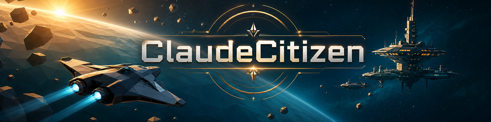
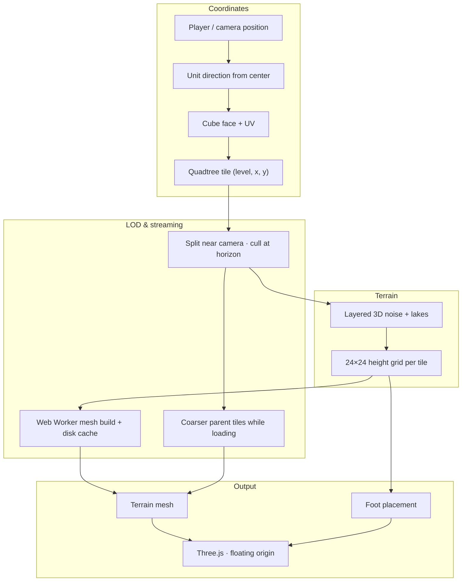
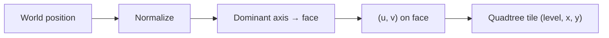
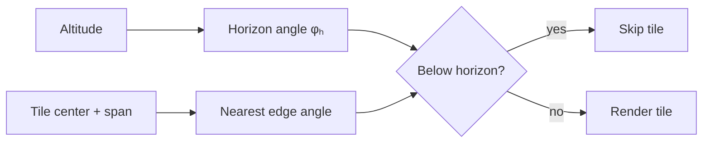
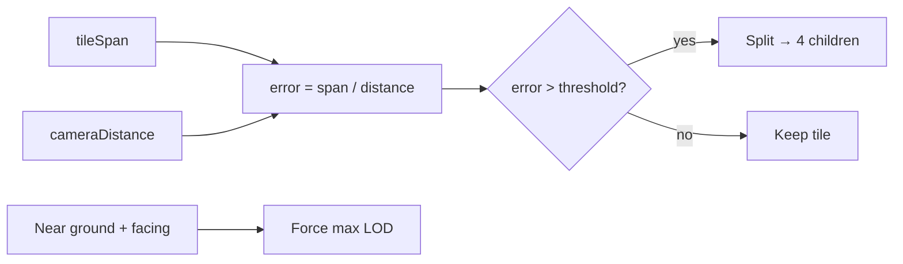
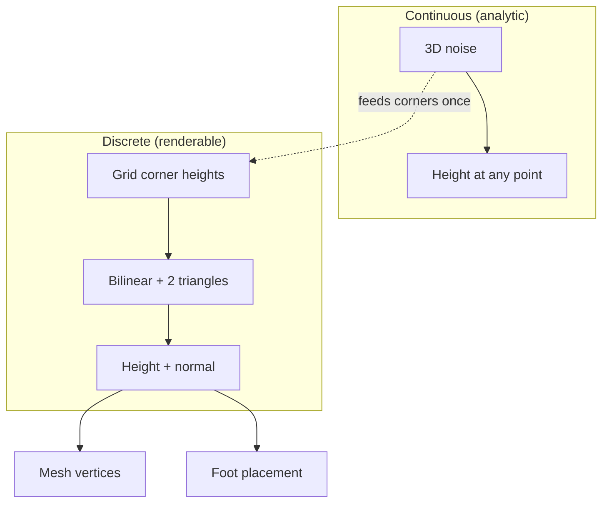
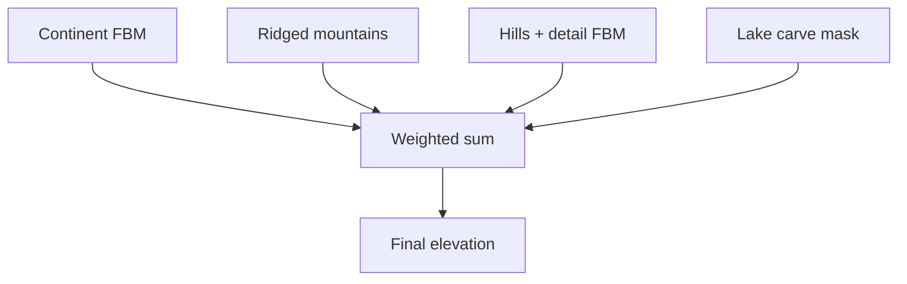
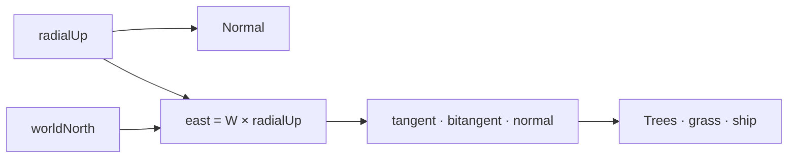
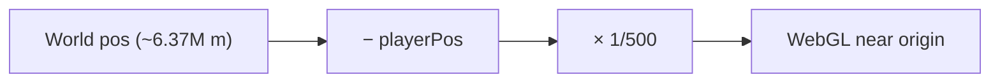

# ClaudeCitizen




<a href="https://www.buymeacoffee.com/alangreyjoy"></a>

A browser-based space sandbox inspired by Star Citizen — procedural planets, ship flight, on-foot exploration, and seamless surface-to-orbit transitions. Built with TypeScript, Vite, and Three.js.

The homeworld is **Asteron**: Earth-scale radius, deterministic terrain, lakes, vegetation, volumetric clouds, and a full atmospheric shell.

This project is **100% vibe coded** — built iteratively with AI-assisted development rather than a formal spec or roadmap. I'm a Staff Software Engineer and Solutions Architect with 17+ years of experience; this is a passion sandbox, not a production product.

**Work in progress.** More Star Citizen–style features are on the way — better ships (not just a pirate ship LOL!), deeper flight and exploration, and whatever else the vibe demands.

## Quick start

```bash
npm install
npm run dev
```

Open [http://localhost:4173](http://localhost:4173). Click the canvas to lock the mouse.

## Commands

| Script              | Description                                      |
| ------------------- | ------------------------------------------------ |
| `npm run dev`       | Dev server with hot reload (port 4173)           |
| `npm run serve`     | Same as `dev`                                    |
| `npm run build`     | Typecheck + production build to `dist/`          |
| `npm run typecheck` | Run TypeScript without emitting                  |
| `npm run demo`      | Headless scripted takeoff / orbit / landing demo |

## Controls

| Input         | On foot / ship deck                             | In ship               |
| ------------- | ----------------------------------------------- | --------------------- |
| Click canvas  | Lock mouse                                      | Lock mouse            |
| Mouse         | Orbit camera                                    | Pitch / yaw           |
| Scroll        | Zoom camera                                     | Zoom camera           |
| `W` / `S`     | Move forward / back                             | Throttle              |
| `A` / `D`     | Strafe                                          | Strafe                |
| `Shift`       | Sprint                                          | Boost                 |
| `Q` / `E`     | —                                               | Roll                  |
| `←` / `→`     | —                                               | Yaw                   |
| `↑` / `↓`     | —                                               | Pitch                 |
| `Space` / `C` | Jump                                            | Lift / descend        |
| `B`           | —                                               | Brake                 |
| `F`           | Enter / exit ship, leave / return to pilot seat | Same                  |
| `R`           | Reset to landing site                           | Reset to landing site |

Use the **Vegetation** panel (top-left) to tune grass, trees, and fog at runtime.

## What's in the box

- **Procedural planet** — cube-sphere tiles, height sampling, landing sites, lake water
- **Flight** — inertial ship body with radial gravity, drag, and hover assist near the pad
- **Player** — third-person character, ship boarding animations, walkable ship deck
- **Rendering** — tiled terrain meshing (Web Worker), instanced vegetation, star field, Takram atmosphere/clouds, volumetric fog, post-processing

## How the planet works

Asteron is **Earth-scale** (~6,371 km radius). You can't treat that as a flat map or shove raw coordinates into WebGL — so the hard parts are all about making a huge sphere feel solid under your feet.

**Cube-sphere, not a UV sphere.** The surface is six cube faces projected onto a sphere. Every point on the planet maps to a face and a `(u, v)` coordinate, then subdivides into a **quadtree of tiles** that get finer near the camera and coarser at the horizon.

**Procedural terrain.** Height comes from layered 3D noise (continents, ridges, hills, detail) plus carved lake basins. Same seed, same world, every time — no heightmap files shipped with the game.

**Adaptive LOD.** Tiles split when you're close and merge when you're far or over the horizon. Meshes build incrementally in a Web Worker (with disk cache), and coarser parent tiles fill in while high-res ones stream in.

**The foot-sync problem.** The visible ground mesh and the character controller don't sample terrain the same way by accident — they share the same discrete height grid. Get that wrong and you float or sink. Keeping mesh LOD and foot placement aligned is the trickiest invariant in the project.

**Floating origin.** The camera/player position recenters the world each frame so Three.js isn't crunching numbers in the millions of meters. You stay near the origin; the planet moves around you.



### The math underneath

Nothing here requires a PhD — but there is real geometry and signal processing holding the planet together.

**Cube-sphere projection.** A world position becomes a unit direction, then the dominant axis (`|x|`, `|y|`, or `|z|`) picks a cube face. The other two components, scaled by that axis, give `(u, v)` coordinates on the face. Map back with a face-specific formula and normalize — you get a point on the sphere without polar singularities.



$$
\hat{\mathbf{d}} = \frac{\mathbf{p}}{\|\mathbf{p}\|}, \qquad
\text{face} = \arg\max\big(|\hat{d}_x|,\, |\hat{d}_y|,\, |\hat{d}_z|\big)
$$

On the **+X** face (others follow the same pattern):

$$
u = -\frac{\hat{d}_z}{|\hat{d}_x|}, \quad v = \frac{\hat{d}_y}{|\hat{d}_x|}, \qquad
\hat{\mathbf{d}}(u,v) = \mathrm{normalize}\,(1,\, v,\, -u)
$$

Tile bounds at LOD level $L$ and index $(x,y)$:

$$
\Delta = \frac{2}{2^L}, \quad
u_0 = -1 + x\,\Delta, \quad v_0 = -1 + y\,\Delta
$$

**Horizon culling.** From altitude we compute how much of the sphere is visible (a cone angle). Each tile has an angular width from its chord span. Tiles whose nearest edge falls below the horizon are skipped — no mesh budget wasted on the back side of the planet.



$$
\phi_h = \arccos\!\left(\frac{R}{R + h}\right), \qquad
\phi_{\mathrm{center}} = \arccos\!\big(\hat{\mathbf{c}} \cdot \hat{\mathbf{u}}_{\mathrm{cam}}\big)
$$

$$
\phi_{\mathrm{half}} = \frac{s}{2R}, \qquad
\phi_{\mathrm{near}} = \max\!\big(0,\; \phi_{\mathrm{center}} - \phi_{\mathrm{half}}\big)
$$

Cull when $\phi_{\mathrm{near}} > \phi_h + \varepsilon$ (with $\varepsilon = 0.03$ rad margin).

**LOD error metric.** Whether a tile splits comes down to projected screen error: `tileSpan / cameraDistance` compared to a threshold that loosens as you climb. Near the ground we force max detail in a radius around the player so the mesh under your feet is always the finest LOD.



$$
\varepsilon_{\mathrm{proj}} = \frac{s}{d}, \qquad
\tau(h) = \max\!\left(\tau_{\min},\; \tau_0 + \mathrm{clamp}_{[0,1]}\!\left(\frac{h}{120\,000}\right) \cdot 1.8\right)
$$

Split when $\varepsilon_{\mathrm{proj}} > \tau(h)$. Below 2 km altitude, tiles within $\approx 900 + 0.35h$ meters and facing the camera force max LOD regardless.

**Dual height sampling.** Terrain noise is continuous — sample anywhere and you get a height. But the mesh only knows about a fixed grid of corner heights. At runtime we locate your `(u, v)` in that grid, bilinearly interpolate between four cached corner points on the sphere (split into two triangles), then project back onto the radial direction for height and surface normal. The mesh and foot controller must use this _same_ grid at the _same_ LOD — not the raw noise function.



Grid corners on the sphere ($h_{ij}$ from analytic noise, cached once):

$$
\mathbf{p}_{ij} = \hat{\mathbf{d}}_{ij}\,\big(R + h_{ij}\big)
$$

Barycentric interpolation within one quad cell ($\alpha = \mathrm{frac}_u$, $\beta = \mathrm{frac}_v$):

$$
\mathbf{p} =
\begin{cases}
(1-\alpha-\beta)\,\mathbf{p}_{00} + \alpha\,\mathbf{p}_{10} + \beta\,\mathbf{p}_{01} & \text{if } \alpha + \beta \le 1 \\[6pt]
(1-\beta)\,\mathbf{p}_{10} + (\alpha+\beta-1)\,\mathbf{p}_{11} + (1-\alpha)\,\mathbf{p}_{01} & \text{otherwise}
\end{cases}
$$

Height and normal returned to gameplay:

$$
h = \mathbf{p} \cdot \hat{\mathbf{d}} - R, \qquad
\hat{\mathbf{n}} = \mathrm{normalize}\!\big((\mathbf{p}_{10}-\mathbf{p}_{00}) \times (\mathbf{p}_{01}-\mathbf{p}_{00})\big)
$$

**Layered noise (FBM + ridged).** Height stacks several octaves of 3D simplex noise at different scales: broad continents, sharp ridged mountains, regional hills, fine detail. Ridged noise (`1 − |n|`, squared) gives crisp peaks instead of smooth blobs. A separate noise field carves lake basins into the result.



Fractional Brownian motion (3D simplex noise, $\gamma = 2$ lacunarity, $p = 0.5$ persistence):

$$
\mathrm{FBM}(\hat{\mathbf{n}};\, s) = \frac{1}{Z}\sum_{i=0}^{O-1} p^i \cdot \mathrm{noise}\!\big(\gamma^i s \cdot \hat{\mathbf{n}}\big), \qquad Z = \sum_{i=0}^{O-1} p^i
$$

Ridged variant (sharp peaks):

$$
\mathrm{ridge}(\hat{\mathbf{n}};\, s) = \frac{2}{Z}\sum_{i=0}^{O-1} p^i \cdot \big(1 - |n_i|\big)^2 - 1
$$

Combined elevation (before lake carving), with mountain mask $m = \mathrm{clamp}_{[0,1]}\big((e + 0.1) \cdot 2\big)$:

$$
e = 0.4\,\mathrm{FBM}_{1.2} + m\big(0.3\,\mathrm{ridge}_{3.5} + 0.15\,\mathrm{ridge}_{400}\big) + 0.05\,\mathrm{FBM}_{1200} + 0.01\,\mathrm{FBM}_{8000}
$$

Final height in meters: $h = \mathrm{clamp}(e,\,-1,\,1) \cdot A$ where $A = 7{,}500$ m on Asteron.

**Tangent frames on a sphere.** "Up" is always radial from planet center. East is `worldNorth × radialUp`. Trees, grass, and the ship build local `(tangent, bitangent, normal)` frames so objects stand upright on curved ground instead of embedding in a flat plane.



$$
\hat{\mathbf{r}} = \frac{\mathbf{p}}{\|\mathbf{p}\|}, \qquad
\hat{\mathbf{e}} = \mathrm{normalize}\!\big(\hat{\mathbf{n}}_{\mathrm{world}} \times \hat{\mathbf{r}}\big)
$$

Local surface frame ($\hat{\mathbf{n}} = \hat{\mathbf{r}}$, reference axis swapped near poles):

$$
\hat{\mathbf{t}} = \mathrm{normalize}\!\big(\hat{\mathbf{a}}_{\mathrm{ref}} \times \hat{\mathbf{n}}\big), \qquad
\hat{\mathbf{b}} = \mathrm{normalize}\!\big(\hat{\mathbf{n}} \times \hat{\mathbf{t}}\big)
$$

**Floating origin.** Render coordinates are `(worldPos − playerPos) × 1/500`. Simulation stays in full-precision meters; WebGL works near zero. The planet slides around you every frame.



$$
\mathbf{p}_{\mathrm{render}} = (\mathbf{p}_{\mathrm{world}} - \mathbf{p}_{\mathrm{player}}) \cdot s, \qquad s = \frac{1}{500}
$$

Altitude from full-precision simulation space:

$$
h = \|\mathbf{p}_{\mathrm{world}}\| - R
$$

See `.agents/AGENTS.md` for architecture conventions; `src/world/` and `src/render/planet_tiles/` for the implementation.

## Project layout

```
src/
  app.ts              Application loop and mode FSM
  math/               Pure vector math
  world/              Planet, surface, coordinates, clouds
  flight/             Ship physics and input
  player/             Character, deck, ship interaction
  render/             Three.js presentation layer
  assets/             GLTF models (ship, vegetation)
scripts/              Dev utilities and the orbit demo
.agents/AGENTS.md     Architecture and agent conventions
```

Domain rules live in `world/`, `flight/`, and `player/`. Rendering reads from those modules but does not own simulation state. See `.agents/AGENTS.md` for the full dependency map.

## Stack

- [Vite](https://vite.dev/) — dev server and bundler
- [Three.js](https://threejs.org/) — WebGL renderer
- [@takram/three-geospatial](https://github.com/takram-design-engineering/three-geospatial) — atmosphere and clouds
- [postprocessing](https://github.com/pmndrs/postprocessing) — bloom and tone mapping
- [simplex-noise](https://github.com/jwagner/simplex-noise.js/) — procedural terrain

## License

IDK. Whatever.
