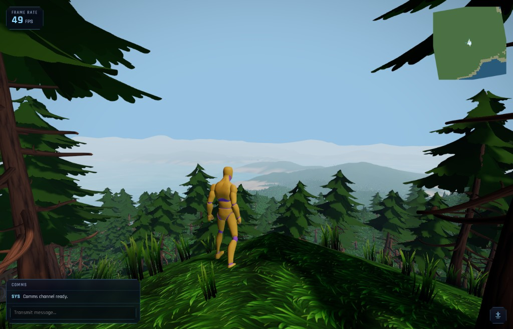

# ClaudeCitizen




[](https://www.buymeacoffee.com/alangreyjoy)

> [!NOTE]
> This is a passion project — if you'd like to show your support, every donation goes straight to feeding the **Claude Fable 5** beast that keeps this thing going.

A browser-based space sandbox inspired by Star Citizen — procedural planets, ship flight, on-foot exploration, and seamless surface-to-orbit transitions. The client uses TypeScript, Vite, and Three.js; online play uses one authoritative Rust backend with native Rapier, shared Rust/WASM prediction, Protobuf over WebTransport, PostgreSQL/SQLx, Redis, and Kubernetes.

The homeworld is **Asteron**: Earth-scale radius, deterministic terrain, lakes, vegetation, volumetric clouds, and a full atmospheric shell.

This project is **100% vibe coded** — built iteratively with AI-assisted development rather than a formal spec. I'm a Staff Software Engineer and Solutions Architect with 17+ years of experience; this is a passion sandbox, not a production product.

**Work in progress.** Phase 1 is third-person weapons and over-the-shoulder character-controller updates.

## Live play test

**[https://claudecitizen.netlify.app/](https://claudecitizen.netlify.app/)**

## Quick start

```bash
npm install
npm run dev
```

Open [http://localhost:4173](http://localhost:4173). Click the canvas to lock the mouse.

## Desktop app

Electron packages the same production web client as a native desktop app. The browser and
Netlify targets remain unchanged.

```bash
# Build the web client and launch it in Electron
npm run desktop

# Connect Electron to the already-running Vite server on port 4173
npm run desktop:dev

# Create an unpacked, Steam-depot-friendly app under release/desktop/
npm run build:desktop

# Create the current platform's distributable archive/package
npm run desktop:package
```

The unpacked output from `build:desktop` is the intended starting point for a Steam depot.
Steamworks integration will live in Electron's main process and cross the isolated preload
bridge; renderer-side Node.js access remains disabled.

## Documentation

Full docs — editor guide, controls, roadmap, planet tech, deployment, and engineering notes:

- **Online:** [https://claudecitizen-docs.netlify.app/](https://claudecitizen-docs.netlify.app/)
- **Local:** `npm run docs:dev` → [http://localhost:3000](http://localhost:3000)

## License

IDK. Whatever.
