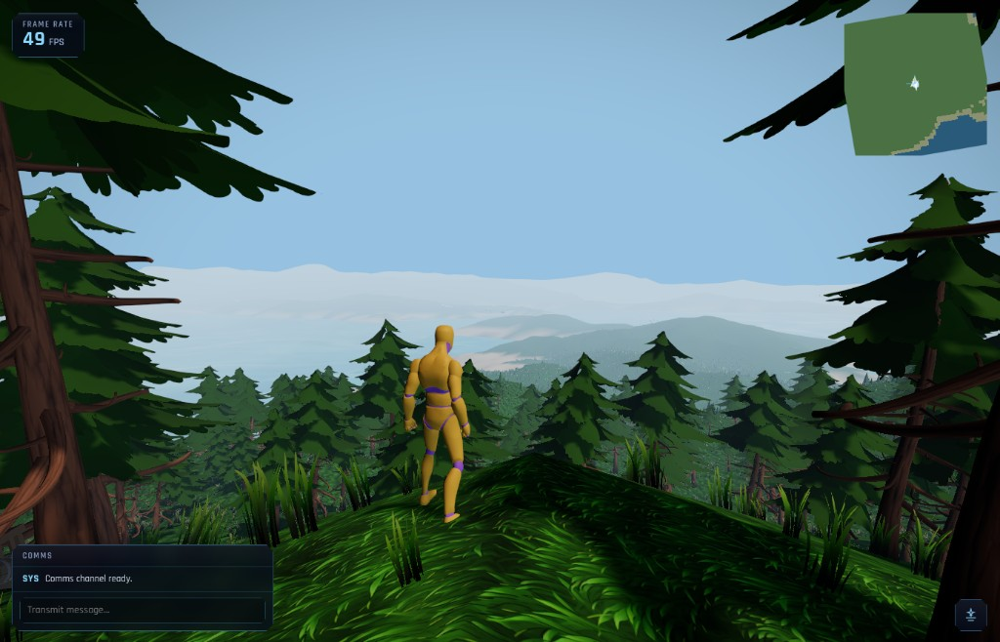
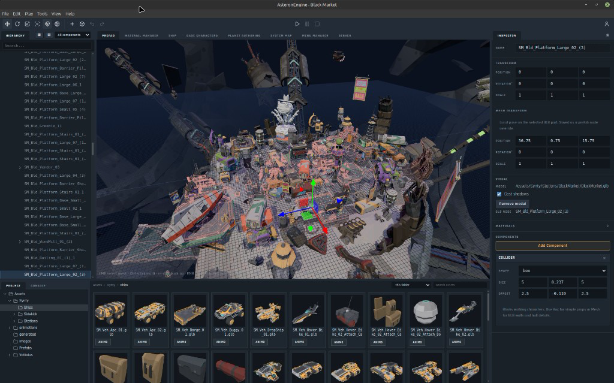

# ClaudeCitizen

[](https://discord.gg/qKWdSKMRCv)





[](https://www.buymeacoffee.com/alangreyjoy)

> [!NOTE]
> Passion project. Vibe coded end to end. Staff Software Engineer / Solutions Architect, 17+ years — this is the sandbox, not a shipping product. Every donation feeds the **Claude Fable 5** beast that keeps this thing going.

**ClaudeCitizen** is an all-in-one space sim: Unity-style editor, game runtime, and authoritative multiplayer backend in one repo.

Author planets, ships, stations, characters, menus, and scenes in **AsteronEngine** — an Electron editor on TypeScript + Three.js. Hit Play in the Game view. Ship a browser build with **File → Build Web**. Run online against one Rust backend (Rapier authority, shared WASM prediction, Protobuf over WebTransport, PostgreSQL/SQLx, Redis).

> Zero billion dollars crowdfunded. Still ships this decade.

Star Citizen–style loop: procedural Earth-scale homeworld **Asteron**, ship flight, on-foot exploration, seamless surface-to-orbit. Scenes are GameObject trees; prefabs, components, and project settings drive everything — no separate web client or admin app.

The goal is simple: put a full space-sim toolkit in anyone's hands — so you can build your own universe without starting from a blank engine.

**Work in progress.** Phase 1 focus: third-person weapons and over-the-shoulder character control.

## Quick start

```bash
npm install
npm run editor:dev
```

Two surfaces only: **AsteronEngine** and the **Rust backend**. The shipped game is a build artifact of the editor.

Cold start opens the **Projects** hub. Create or open a project → editor loads that project's scenes, prefabs, planets, and assets.

## AsteronEngine

```bash
# Day-to-day: Vite HMR + React Fast Refresh
npm run editor:dev

# Production-like Electron launch
npm run editor

# Unpacked editor under release/editor/
npm run build:editor:desktop

# Platform distributable
npm run editor:desktop:package
```

Skip the hub with `--project-root=/path/to/project` or `CLAUDECITIZEN_EDITOR_PROJECT_ROOT`.

**Scenes own content.** A scene (`*.scene.json`) is a GameObject tree; components decide what it is:

| Component         | Role                                                        |
| ----------------- | ----------------------------------------------------------- |
| `game-manager`    | System, planet, spawn mode **and the game flow** (see below) |
| `planet`          | Planet document reference                                    |
| `player-start`    | Spawn pose and mode                                          |
| `prefab-instance` | Places a reusable prefab                                     |
| `ui-screen`       | Title / login / character-create / loading UI                |
| `scene-link`      | Menu-flow transition target                                  |
| `instanced-scene` | Per-player content (habs, hangars)                           |
| `scene-exit`      | In-play portal to another scene (hab → station, hangar → space) |

**The boot scene owns the flow.** One scene of `kind: boot` is the entry point
(`defaultScene` in Project Settings). It never runs gameplay — its Game Manager
names each hop, so the pipeline is yours to configure:

```
Boot ──► Title ──► Character Create ──► Starting Hab ──► Open Space
        (auth)     (no saved appearance)   (gameplay)    (fly a ship through
                                                          a scene-exit)
```

Empty hops are skipped: no Character Create scene falls back to the inline
create gate, and `Require sign-in` off makes an entirely offline game.

**F6** play/stop, **F7** pause — open document in the Game view, unsaved edits included. Right-click a GameObject → **Create Prefab from Selection**.

**Server** tab talks live to the backend: players, catalog (ships, props, items, weapons, backpacks, wearables), game settings.

## Shipping

**File → Build Web** writes the release into the project's build output and stamps `asteron.runtime.json` with backend URL + boot scene from **Project Settings**. Re-stamp that file to retarget deploys. Players sign in with accounts — no client API key.

## Documentation

Full docs — editor guide, controls, roadmap, planet tech, deployment, engineering:

- **Online:** [https://claudecitizen-docs.netlify.app/](https://claudecitizen-docs.netlify.app/)
- **Local:** `npm run docs:dev` → [http://localhost:3000](http://localhost:3000)

## License

IDK. Whatever.
