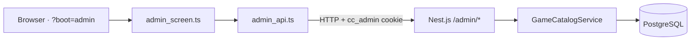

# Admin App overview

The **Admin App** is a browser-based operator console for the ClaudeCitizen Nest.js backend. It lets you inspect registered players and manage the **game catalog** — ship, prop, and item definitions — plus global **game settings** such as starting ARC balance and starter loadouts.

Unlike the [CC Editor](/cc-editor), which authors 3D prefab JSON for the client, the Admin App manages **persistent server data** stored in PostgreSQL.

## What you can do

| Area | Capabilities |
| --- | --- |
| **Users** | Browse accounts and inspect player state (read only) |
| **Ships** | Create and edit ship definitions tied to bundled ship prefabs |
| **Props** | Create and edit hangar/apartment decoration definitions |
| **Items** | Create, edit, and delete inventory item definitions |
| **Game settings** | Configure starting ARC and starter ship/prop/item loadouts |

## Architecture

The Admin App is a lightweight DOM UI — not React — loaded as a separate boot mode from the main game client.

| Path | Role |
| --- | --- |
| `src/app/admin_screen.ts` | Admin UI (login, sidebar, tables, forms) |
| `src/net/admin_api.ts` | Typed fetch helpers for `/admin/*` endpoints |
| `server/src/admin/` | Nest controller, service, guard, and session handling |
| `server/src/game/game.catalog.service.ts` | Catalog CRUD and starter-loadout logic |

## When you need it

Use the Admin App when you are running the full online stack (`npm run dev:infra` + `npm run dev:server`) and want to:

- Seed or tune ship/prop/item catalogs before players sign in
- Adjust what new players receive on first bootstrap
- Inspect account and ship ownership during development

The single-player browser build does **not** require the Admin App. See [Getting started](./getting-started) to run it locally.

## Related docs

- [Getting started](./getting-started) — boot URL, prerequisites, and local setup
- [Authentication](./authentication) — credentials, session cookies, and security
- [Users](./users) — account inspection
- [Ship definitions](./ship-definitions) — playable ship catalog
- [Prop definitions](./prop-definitions) — hangar decoration catalog
- [Item definitions](./item-definitions) — inventory catalog
- [Game settings](./game-settings) — ARC and starter loadouts
- [API reference](./api-reference) — REST endpoints
