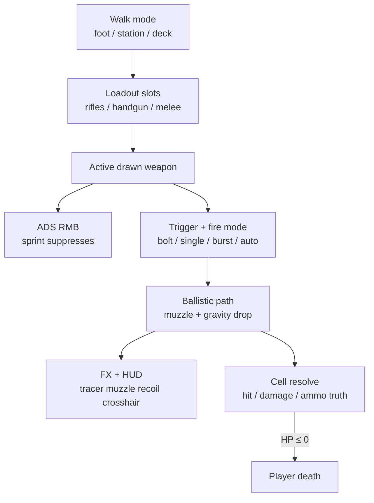
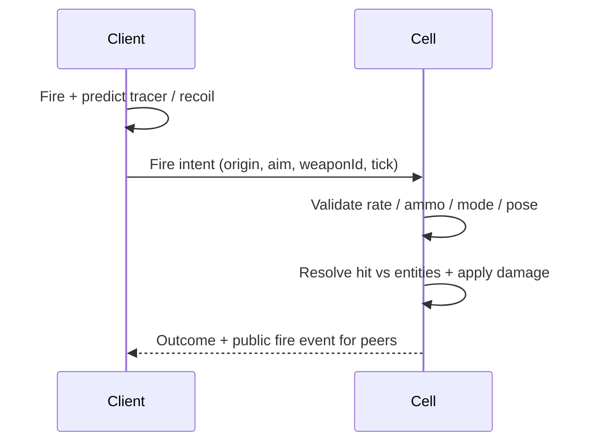

# Character Combat Architecture

Authoritative mental model for **fighting on foot** — the character weapon
loop used while walking a planet, station, or ship deck. Camera is
**third-person** (orbit + ADS); product shorthand often says “FPS,” but the
default view is TPS with firearm feel (crosshair, mag, recoil, tracers).

This is **not** [Ship combat](./ship-combat). Hull hardpoints, lock-on, lead
markers, and Combat flight mode stay on the ship loop. Do not reuse the
character magazine / crosshair path for ship guns, and do not fire character
weapons from `MODE_IN_SHIP`.

Related: [Multiplayer](./multiplayer) (peer loadout / pose / fire; cell hits),
[Character locomotion](./character-locomotion) (walk modes, facing, ADS
suppress, ladders),
[Player](./player) (HP / death from weapon damage),
[Player death](./player-death) (respawn after lethal hits),
[Mobs](./mobs) (PVE combatants; cell HP),
[Content delivery](./content-delivery) (weapons / ammo = live catalog),
[Harvesting](./harvesting) (tools / mining ≠ combat firearms),
[Ship combat](./ship-combat) (different loop),
[HaloBand](./haloband) (Inventory presents loadout; does not own fire),
[Progression](./progression) (soft weapon / content gates later),
[Factions](./factions) (aggro / friendly-fire policy edges).

**This doc is law.** Code today has a solid firearm presentation + local
geometry hit path (`game/combat`, `player/weapon-*`) and catalog
`WeaponDefinition` / ammo — entity damage, melee, and throwables still lag.
Gaps are refactor targets, not permission to keep combat client-authoritative
or to invent a second weapon economy.

## Permanent decision: one character combat loop

Character combat is the fight layer for the **walkable body** in:

| Mode | Armed? |
| --- | --- |
| `MODE_ON_FOOT` (planet) | Yes |
| `MODE_IN_STATION` | Yes |
| `MODE_ON_SHIP_DECK` | Yes |
| `MODE_IN_SHIP` (flying) | **No** — ship loop |
| Bed / ladder / transitions / menus / HaloBand open | **No** fire; input suppress may still block |

### What this rejects

- Merging character guns into [Ship combat](./ship-combat) hardpoints / HUD.
- First-person-only as the permanent camera law (TPS default; ADS may tighten
  FOV / shoulder — still character-centered, not a separate FPS product).
- Client-authoritative damage on peers or mobs.
- Hits that only paint decals forever with no path to cell vitals.
- Paying ammo or weapon unlocks in **AsteronCredits** (AC is Item Mall only —
  [Item Mall](./item-mall)). Soft currency / shops stay **ARC** or craft.
- Treating harvest tools or mining beams as this combat loop
  ([Harvesting](./harvesting)).

## Camera and aim (TPS)

| Layer | Law |
| --- | --- |
| Default view | Third-person orbit around the character |
| ADS | Hold **RMB** while a firearm is drawn → aim posture + camera tighten |
| Sprint | **Suppresses** ADS (no aim pose, no aim zoom) until sprint ends |
| Facing while ADS | Root squares to camera-forward **and** upper body tracks aim — [Character locomotion](./character-locomotion#facing-and-camera-tps) |
| Hip fire | Allowed without ADS; spread / recoil still apply |
| Crosshair | Client HUD only — peers do not need your chrome |

Recoil is an **additive look kick** on the camera (`lookRecoil`), not a permanent
climb of orbit pitch/yaw. Crosshair bloom reads residual recoil. Combat FX
(muzzle, tracer, impact) update **after** the camera rig so billboards do not
swim one frame.

## Loadout and weapon families

Loadout is durable inventory state (cell / catalog). Visible slots peers must
see are under [Multiplayer](./multiplayer#character-presentation-loadout-animation-fire).

### Slots (play bar)

| Slot id | Kind | Role |
| --- | --- | --- |
| `rifle-primary` | Firearm | Primary long gun (often backpack socket) |
| `rifle-secondary` | Firearm | Second rifle when backpack provides socket |
| `handgun` | Firearm | Sidearm |
| `sword` | **Melee** | Close combat (slot exists; melee loop is law below — code may lag) |

Hotkeys **1 / 2 / 3** (and bar UI) select among armed slots; pressing the active
slot may holster. Drawn weapon drives the active **animation stance
controller** (rifle / handgun / rocket / throwable / melee — see
[Character locomotion](./character-locomotion#animation-stance-controllers-unity-style-blend-no-root-motion))
and the active firearm resolver. Holstered weapons still replicate as equipped
mesh state when visible.

### Catalog shape

| Piece | Surface |
| --- | --- |
| `ItemDefinition` + `WeaponDefinition` | Live Postgres catalog — Server Console |
| Ammo `ItemDefinition` (`itemType: ammo`) | Paired via `ammoItemDefinitionId` |
| Weapon **prefab** (`prefabId`) | Project asset → Build Web (mesh, `weapon-combat`, muzzle / barrel markers) |
| Stats | `magazineSize`, `fireModes`, `roundsPerMinute`, `muzzleVelocityMps`, `bulletGravityMps2`, `maxRangeMeters`, `damage` |

Migrations may seed once; ongoing balance edits go through Console
([Content delivery](./content-delivery)). Prefab JSON stores paths and combat
markers — not live DPS numbers.

### Firearm fire modes

Authored list on the weapon (cycle at runtime). Canonical modes:

| Mode | Behavior |
| --- | --- |
| **bolt** | One shot per press; longer bolt delay than RPM alone |
| **single** | Semi — one shot per press at RPM cadence |
| **burst3** | Fixed 3-round burst per press |
| **auto** | Full auto while trigger held |

Empty mag → dry-fire latch (audio / event once until release / reload). Mag
starts full when a fire-state is first created for a weapon in session; durable
mag persistence across sessions is allowed later but must stay server-owned if
added.

## Ballistics and hits

Character firearms use a **ballistic path** (muzzle velocity + authored bullet
gravity along world up), segmented and cast against local geometry:

| Surface | Hit probe |
| --- | --- |
| Planet outdoor | Terrain path sample |
| Station | Station Rapier world ray (exclude NPC capsules from scene queries unless intentionally hitting them) |
| Ship deck | Ship-local Rapier ray |

Shot origin prefers the authored **barrel / muzzle** marker on the weapon
prefab; fallback is eye-height along view forward.

### Authority split

| Concern | Owner |
| --- | --- |
| Local FX path / impact point for presentation | Client (predict) |
| Whether a shot **damages** a player, mob, or destructible | **Cell** |
| Ammo reserve stacks | Server inventory (reload consumes via API / intent) |
| Mag rounds in the gun | Session fire-state today; cell may own when replicated |
| Armor mitigation | Cell (reads equipped wearables when armor rules land) |

`damage` on `WeaponDefinition` is catalog truth for the cell. World-only
geometry hits (terrain / walls) may stay client FX without a damage grant.

Do not let the client decide peer or mob HP. Do not skip fire-event replication
while applying damage (silent killers / ghost guns both fail the presentation
law).

## Melee

`sword` (and future melee slot types) is a **first-class family** in this loop,
not a firearm with zero ammo.

| Rule | Law |
| --- | --- |
| Input | Primary click / attack while melee drawn |
| Resolve | Authored reach + arc or stab volume; cell owns hit / damage |
| Presentation | Swing / impact anim + SFX; peers see attack pose |
| Ammo | None |
| vs firearms | Same walk-mode gate; no mag HUD |

Baseline may lack a live melee resolve — implement toward this, do not remove
the loadout slot or invent a parallel “emote only” sword forever.

## Throwables

Throwables (grenades, flash, smoke, throwable knives, etc.) are **in scope**
for character combat and were missing from the early firearm slice. Law:

| Piece | Law |
| --- | --- |
| Catalog | `ItemDefinition` with a throwable / grenade subtype (or dedicated extension table) — live catalog |
| Carry | Inventory stacks; optional quick-slot / cook input |
| Throw | Aim + release; client predicts arc; **cell** owns fuse, blast, status |
| Damage / CC | Cell applies HP, stagger, vision block, etc. to players / mobs in radius |
| Friendly fire | Same policy table as firearms (below) |
| Never AC | Craft / ARC shop / loot / mission — not AsteronCredits |

Do not implement grenades as local-only particle pops. Do not route throwable
damage through ship missile code.

## Ammo, reload, and economy

- Reserve ammo = inventory stacks of the paired ammo item.
- Reload requests **consume** reserve on the server; failed consume rejects the
  reload (mag does not fill).
- Crafting / shops / mission packs may grant ammo ([Harvesting](./harvesting)
  craft graph, station shops, [Loot tables](./loot-tables)) — **never AC**.
- Dry fire does not consume reserve.

## HUD and presentation

| Element | Owner |
| --- | --- |
| Crosshair spread / punch | Client |
| Mag + reserve + fire mode | Client HUD reading inventory + fire-state |
| Recoil kick | Client feel |
| Muzzle flash / tracer / impact / optional hit decal | Client; peers play from replicated fire events |
| Hit markers / damage numbers | Optional client chrome from **cell** confirmations |

Weapon audio (fire, dry, reload) rides the same presentation path. Prefab
`weapon-combat` carries optional SFX / decal URLs — cosmetic only.

## Friendly fire and valid targets

| Target | Default law |
| --- | --- |
| Peer players | Damageable when PVP rules allow (station safe volumes / faction rules may block) |
| Mobs | Always valid PVE targets when in range — [Mobs](./mobs) |
| Ambient NPCs | **Not** combat HP targets; do not turn townsfolk into bullet sponges — [NPCs](./npc) |
| Harvest nodes | Wrong loop — [Harvesting](./harvesting) |
| Own ship hull while on deck | Do not casually delete the parked hull with small arms; separate destroy rules if ever needed |

Safe-zone / faction standing hooks land with [Factions](./factions) and cell
policy — character combat reads that policy; it does not own it.

## Ownership map (target)

| Concern | Owns |
| --- | --- |
| Walk-mode gate + drawn slot | `game` modes + inventory loadout |
| Fire-state machine (RPM, burst, reload timer) | Pure `player/weapon-fire` (or successor) |
| Ballistic path math | Pure `player/weapon-ballistics` |
| Recoil profile | Pure `player/weapon-recoil` |
| Local geometry cast | `game/combat` + physics / terrain probes |
| Entity hit / damage / death | **Cell** + [Player](./player) / [Mobs](./mobs) |
| Ammo consume / loadout | Server inventory |
| ADS / stance clips | [Character locomotion](./character-locomotion) + animation runtime |
| HUD / FX | `render` (reads; never mutates sim outcomes) |
| Weapon / ammo defs | Catalog (Console) |
| Weapon meshes / markers | Prefabs → Build Web |

Domain modules stay free of Three / DOM. `render/` never decides hits that
matter.

## Multiplayer

Aligned with [Multiplayer](./multiplayer#character-presentation-loadout-animation-fire):

- **Intents:** fire, reload, mode cycle, slot select, melee attack, throwable
  cook / throw.
- **Authority:** entity hits, damage, death, ammo stacks, throwable detonate.
- **Replication:** equipped visible weapons, aim / reload / melee pose, fire
  and throw events for FX.
- Local HUD chrome stays local.

## Invariants

- Character combat ≠ ship Combat mode weapons.
- Default camera is **TPS**; ADS is aim posture, not a product switch to FPS.
- Armed only in foot / station / deck walk modes.
- Firearms need catalog ammo pairing + finite ballistics stats.
- Fire modes are bolt / single / burst3 / auto (authored subset per gun).
- Ballistics include gravity drop; presentation tracers chase the path.
- Cell owns damage to players and mobs; client predicts FX.
- Melee and throwables are part of this loop (implement toward law).
- Ammo and unlocks are not AC.
- Peers see loadout, combat pose, and fire / throw FX.
- NPC capsules stay excluded from casual scene queries unless intentionally
  targeting a promoted combat entity.

## Baseline vs law (today)

| Piece | Baseline | Law |
| --- | --- | --- |
| Firearm fire / modes / reload | Live local + ammo API consume | Same + cell entity hit path |
| Ballistics vs world geo | Live (terrain / station / ship) | Keep for FX; cell confirms entity hits |
| ADS / recoil / crosshair / tracers | Live | Keep; peer fire FX from replication |
| `damage` on weapon def | Catalog field unused for entities | Cell applies to HP |
| Melee (`sword`) | Slot only | Attack resolve + replication |
| Throwables | Missing | Catalog + throw + cell blast / CC |
| Mag persistence | Session-local full on first draw | Optional durable mag — server-owned |
| PVP safe zones | Missing | Cell policy + faction / place rules |
| Armor mitigation | Wearables exist; no DR | Cell reads armor when rules authored |

## Open / later

- Ability weapons / underbarrel attachments / optics mechanical zoom tiers.
- Explicit hip-fire vs ADS spread curves beyond recoil bloom.
- Durable per-weapon mag + chamber state in Postgres.
- Stun / non-lethal throwables and faction-safe CC.
- Destruction of placeables / weak props from small arms.
- Vehicle-from-outside small-arms vs ship hull (almost always **no** — ship
  loop owns hull).
- Aim-assist / console soft lock (must not become client damage aimbot).
