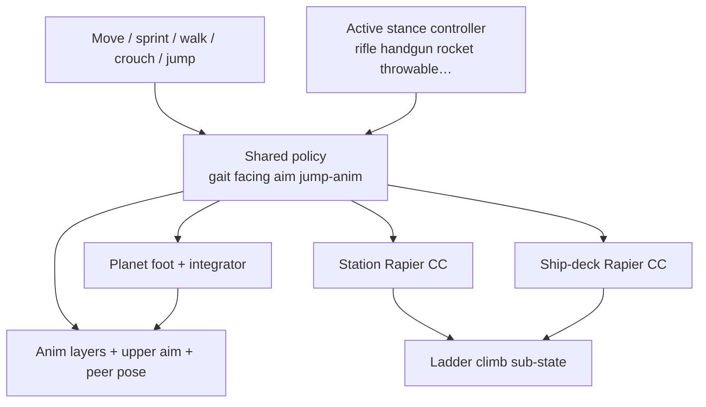

# Character Locomotion Architecture

Authoritative mental model for **moving the walkable body** — walk / run /
sprint, crouch, jump, facing, ladders, and how planet gravity changes outdoor
feel. Default camera is **third-person** orbit (same TPS product as
[Character combat](./character-combat)). Combat owns weapons and ADS *fire*;
this doc owns **how the body moves and faces**, including the aim-facing rule
combat depends on.

Related: [Character combat](./character-combat) (ADS / sprint suppress; armed
only in walk modes), [Planets](./planets) (outdoor *g* scales walk / jump / fall),
[Player](./player) (vitals place split mirrors sealed vs outdoor *g*),
[Multiplayer](./multiplayer) (on-foot position clamp + pose replication),
[Ship flight](./ship-flight) (flying hull ≠ walk controller),
[Space traversal](./space-traversal) / [Game loop](./game-loop) (where the
body stands), [HaloBand](./haloband) (open suppresses walk input),
[Settings](./settings) (character speed baseline must stay authorable),
[NPCs](./npc) (ambient ≠ player character controller).

**This doc is law.** Code today has a solid shared policy
(`character-locomotion`) plus surface integrators (planet / station Rapier /
ship-deck Rapier) and ladder climb. Unity-style blend trees, stance controllers
beyond unarmed / rifle / pistol, outdoor *g* scale on jump/fall, climb clips,
swim / prone / vault, and stamina still lag. Gaps are refactor targets — not
permission to fork a second walk stack per surface, enable root motion,
collapse all weapons into one clip set, yaw the body from idle mouse look, skip
upper-body aim, or skip pose replication.

## Permanent decision: one locomotion policy, three surfaces, Unity-style stance blends

There is **one** character locomotion policy for every walker. Surfaces only
own **how feet contact the world** and which physics API moves the capsule.
**Animation stance controllers** are plural — Unity-style **blend** graphs per
combat family (rifle, handgun, rocket/launcher, throwable, …), **no root
motion**. Authored docs = Char Settings + animation controllers only.

| Surface | Mode | Integrator |
| --- | --- | --- |
| Planet outdoors | `MODE_ON_FOOT` | Foot-surface sample + shared airborne integrator (radial up) |
| Station / Hab / Hangar floors | `MODE_IN_STATION` | Rapier kinematic character controller (station world) |
| Ship deck / pad / hull walk | `MODE_ON_SHIP_DECK` | Rapier in **ship-local** space |

### What this rejects

- A separate “station walk feel” hardcoded apart from character settings +
  sealed *g* (except surface-specific collision).
- Putting the **walk** character controller on the **flying** ship body
  ([Ship flight](./ship-flight) — parked deck stays ship-local Rapier).
- First-person-only as permanent camera law.
- Per-ambient-NPC full character controllers ([NPCs](./npc)).
- Client-free teleport while claiming on-foot multiplayer (clamp stays —
  [Multiplayer](./multiplayer)).
- Treating ladder climb as a separate `GameMode` that drops HUD / combat
  context (it is a **sub-state** of station / deck walk).
- One unarmed clip set for every drawn weapon family.
- Aim that only moves the camera while the torso stays move-facing.
- **Root motion** driving the capsule from clips.
- Idle body yaw from mouse look / orbit (camera-only while idle).
- A third authored “CharacterController” document that duplicates Char
  Settings or animation controllers (name collision with Rapier CC).

## Walk modes and input suppress

| Context | Locomotion? |
| --- | --- |
| Foot / station / deck | Yes |
| Ladder climb (attached) | Climb along rail only — still station / deck mode |
| Seat / bed / transitions | No free walk (pose owned by sit / lie / transition) |
| `MODE_IN_SHIP` (flying) | No — ship flight computer |
| HaloBand open / menu / title flow | Input suppressed; world may keep simulating |

## Gaits and speeds

Canonical gaits (also select clips when not in a special pose):

| Gait | When | Baseline source |
| --- | --- | --- |
| **walk** | Walk toggle **or** crouching (and not sprinting) | `walkSpeedMetersPerSecond` |
| **run** | Default move (walk toggle off, not sprint, not crouch) | `runSpeedMetersPerSecond` |
| **sprint** | Sprint held and **not** crouching | `sprintSpeedMetersPerSecond` |

Rules:

1. **Character settings** (Base Characters → Char Settings /
   `character-settings.json`) own the **Earth-baseline** numbers. Authorable —
   [Settings](./settings).
2. Move input magnitude scales horizontal speed (analog stick / partial WASD).
3. **Crouch blocks sprint.** Crouch uses walk-speed band + crouch clips where
   authored.
4. Jump impulse baseline: `jumpSpeedMetersPerSecond` — outdoor planet *g*
   scales the live impulse (see Jump and airborne).
5. Outdoor planet *g* **scales** walk / run / jump / **fall** baselines — does
   not replace them with a per-planet-id speed table
   ([Planets](./planets#gravity-and-on-foot-feel)).

### Gravity and place

| Place | Locomotion *g* |
| --- | --- |
| Planet surface outdoors | Scale **walk / run / jump impulse / fall acceleration** by `gravityMetersPerSecond2` vs Earth |
| Station / Hab / Hangar / ship interior | Artificial **~1g** — sealed life support (Earth-baseline jump + fall) |
| Gas-giant floating city floors | Station-family → artificial *g*, not “walk on gas” |

Animation / footstep cadence must track **effective** speed so heavy *g* does
not look like a full sprint clip at half motion. Jump hang time and fall speed
must match the same outdoor *g* — do not scale horizontal speed while leaving
fall on a fixed Earth constant (or the reverse).

## Facing and camera (TPS)

| Rule | Law |
| --- | --- |
| Default view | Third-person orbit around the character |
| Move facing | Character turns toward camera-relative move direction |
| Idle facing | **Hold last body yaw.** Mouse / look alone orbits the camera — it does **not** rotate the character while idle (no move input, no effective ADS) |
| Idle + look | Same as idle facing: look is camera-only; body stays planted until move or ADS |
| Active ADS / aim | **Root + legs** square to **camera-forward** on the walk plane **and** the **upper body** (spine / torso / arms) orients to the same aim direction |
| Upper-body aim | While effective aim is active, top half tracks aim — not legs-only facing with a static torso. Moving aim uses an upper overlay / aim layer on the gait; idle ADS may use full-body or upper aim idle without needing move yaw |
| Sprint + move | **Suppresses** effective ADS (facing returns to move; no aim zoom; no upper aim overlay) — shared with [Character combat](./character-combat) |
| Turn rate | Bounded turn toward desired forward when move or ADS demands a new yaw (no instant 180 snap that stalls) |

Eye height / orbit offsets are presentation; locomotion facing is domain
policy. Combat recoil is an **additive look kick** on top of orbit aim — it
must not permanently climb orbit pitch ([Character combat](./character-combat)).

Do not yaw the mesh from orbit look while idle. Do not treat ADS aim as
“camera only” while the mesh keeps move-facing. Peers must see root facing
**and** upper aim posture ([Multiplayer](./multiplayer)).

## Authored documents (what exists — no Unity “CharacterController” twin)

Keep **two** authorable surfaces. Do **not** add a third document named
“character controller” — that name already means the Rapier / surface
capsule integrator and confuses with Unity’s `CharacterController`
component.

| Document | Authoring | Owns |
| --- | --- | --- |
| **Character settings** (`character-settings.json`, Base Characters → Char Settings) | One Earth-baseline profile | Walk / run / sprint / jump speeds; later turn-rate / facing tunables if authorable. Planet *g* **scales** these outdoors |
| **Animation controllers** (`*.controller.json`, Base Characters → Controllers) | **One Unity-style blend controller per combat family** (stance) | Blend trees / parameters / layers / clip bindings — **presentation only** |

Locomotion **policy** (when to face move vs hold idle yaw vs ADS, sprint
suppress, jump phases, *g* scale) lives in code + this law. Settings supply
numbers; animation controllers supply blends. Physics integrators stay
code/modules — not a parallel authored “CharacterController” asset.

Expand Char Settings when facing/capsule knobs need authoring. Expand
animation controllers toward blend trees. Do not invent a third schema that
duplicates either.

## Jump and airborne

Outdoor planet *g* owns the **vertical** arc the same way it owns horizontal
gaits. Sealed interiors stay Earth-baseline (~1g artificial).

| Piece | Law |
| --- | --- |
| Jump impulse | Grounded + jump pressed → upward impulse / Rapier jump from `jumpSpeedMetersPerSecond`, **scaled by outdoor planet *g*** (heavier → weaker hop; lighter → higher float) |
| Air control | Limited steer while airborne (enough to adjust a jump, not fly) |
| Fall gravity | Downward acceleration uses the **same** outdoor `gravityMetersPerSecond2` (vs Earth baseline indoors). Heavier *g* → snappier fall; lighter *g* → longer hang. Optional extra “fall snappiness” multiplier still scales *with* planet *g* — it must not replace it with a fixed Earth fall |
| Anim phases | `jump-start` → `jump-loop` → `jump-land` → `grounded` (timing should read against effective hang, not a fixed Earth clock alone) |
| Coyote / stairs | Brief ungrounded frames on steps must **not** flip to fall clip; landing anim ends when controller reports ground |

Planet outdoor uses radial up + foot surface sample (same LOD grid as terrain —
AGENTS terrain/foot law). Station / deck use Rapier ground reports at sealed
~1g.

## Ladders

Ladders are **one** component + one climb math for station and ship deck.

| Rule | Law |
| --- | --- |
| Authoring | Marker at the **foot**; local +Y climb axis; +Z outward / step-off |
| Mount | Proximity to the full climb line (one marker serves top and bottom) |
| Attach | Interact (**F**); still `MODE_IN_STATION` / `MODE_ON_SHIP_DECK` |
| Climb | Forward / back along rail; motion through the surface character controller |
| Exit | Top step-off, bottom release, or **jump** to drop |
| Anim | Authored `climb_loop` when available; baseline may hold idle — implement toward climb clip |

Do not dual-author separate station vs ship ladder runtimes. Do not promote
climb to a top-level game mode.

## Seats, beds, and transitions

Sitting / lying are **not** free locomotion, but peers must still see the pose
([Multiplayer](./multiplayer)):

| Pose | Entry | Exit |
| --- | --- | --- |
| Seat | Interact near seat → sit transition | Hold exit / stand offset |
| Bed | Interact → `entering-bed` → `in-bed` (look allowed; no flight) | Hold exit → stand at bed offset |
| Exterior hull board | Entry circle → sit (no deck walk on open-frame ships) | Disembark hands back to planet vs hangar resolution |

Transition ownership stays in player / game modes; locomotion policy does not
run free move during them.

## Animation stance controllers (Unity-style blend, no root motion)

There is **one** locomotion **policy** (gaits, facing, ADS suppress, jump
phases). Clip graphs are **not** one shared unarmed set: each combat family
owns its own **animation stance controller** — a Unity **AnimatorController**-
like document: parameters, blend trees / states, layers, and clip sources.
Drawn weapon / throwable selects which controller is live; holstered /
unarmed falls back to the unarmed controller.

### Blend model

| Piece | Law |
| --- | --- |
| Shape | Unity-style: parameters (e.g. speed, moveX/moveZ, crouch, jump phase, ADS) drive **blend trees** and transitions — not a hard one-clip-per-gait switch forever |
| **No root motion** | Clips never advance the capsule. Code / Rapier owns translation and yaw. Strip or ignore root curves; do not “apply root motion” from the mixer |
| Layers | Base loco blend + upper aim / fire overlays (masked) as needed per family |
| Idle | Idle blend / idle state; look input does **not** feed a body-yaw parameter while idle |
| Authoring | Base Characters → Controllers; `*.controller.json` + project clip packs |

| Stance controller | Covers | Notes |
| --- | --- | --- |
| **Unarmed** | Holstered, fists, no drawn combat item | Baseline loco blend + jump |
| **Rifle** | Primary / secondary long guns | Loco blend + ADS idle + moving upper aim |
| **Handgun** | Sidearm | Own loco / jump / aim blends — not rifle retarget |
| **Rocket / launcher** | Shoulder / tube launchers | Own hold + loco / aim set when catalog family ships |
| **Throwable** | Grenades, flash, smoke, thrown knives, etc. | Prep / aim / throw poses + loco while drawn |
| **Melee** (when clips exist) | Sword / close weapons | Attack overlays on loco; see [Character combat](./character-combat) |

Rules:

1. **Policy stays shared.** Do not fork planet vs station gait *math* per
   weapon — only the blend graph / pack changes.
2. **One live stance controller at a time.** Slot select / draw / holster
   switches it; do not blend two families’ full-body loco trees.
3. Controllers are authorable. New combat families add a stance controller —
   they do not invent a second walk physics stack or a root-motion path.
4. Baseline today may ship unarmed + rifle + pistol as discrete states in one
   document; law is **per-family Unity-style blend controllers** (separate
   docs or clearly separated graphs) with **no root motion**. Rockets /
   throwables / melee lag until packs exist — implement toward the table.

Combat owns *which* family is drawn and fire / throw outcomes
([Character combat](./character-combat)); locomotion owns *how* that family’s
body moves and aims.

## Animation layers

| Layer | Role |
| --- | --- |
| Base / full-body | Idle + loco **blend tree** (speed / direction), crouch, jump phases, sprint — from the **active** stance controller |
| Upper overlay | ADS / aim while walking / running (aim clip on upper mask + lower blend) |
| Aim facing | Upper half (split at spine) tracks camera-forward aim; lower half keeps loco blend |
| Stance switch | Active stance controller selects the blend graph for every layer above |
| Root motion | **Off** — mixer does not write world translation / yaw from clips |

Rifle (and every aiming family) while **idle** may use full-body or upper aim
idle. While **moving** with effective ADS, legs keep the loco blend and the
**torso / arms aim where the player is aiming** via the upper overlay — that
is mandatory product law, not a rifle-only quirk. **Sprint** always uses
full-body sprint — never ADS overlay. Upper-parent compensation keeps aim
honest when gait pelvis differs from aim clip (Sidekick runtime). Preserve
blend / action time when swapping full ↔ lower variants of the same gait so
feet do not restart.

## Multiplayer

| Concern | Owner |
| --- | --- |
| On-foot / station / deck **position** | Client report; cell **clamps** (top speed × dt; ship speed when `shipZoneId`) |
| Gait / crouch / ADS / stance / climb / seat / bed flags | Replicated public pose — peers play matching clips + upper aim |
| Jump / land FX | Derived from pose / events as needed |
| Effective *g* top speed | Clamp must use the **same** effective cap the place uses |

Do not treat animation as “cosmetic, skip replication.” Do not remove the
position clamp.

## Ownership map (target)

| Concern | Owns |
| --- | --- |
| Gait / facing / aim-effective / jump-anim helpers | Pure `player/character-locomotion` (+ `animation/resolve-locomotion`) |
| Unity-style stance blend controllers / clip packs | Authored `*.controller.json` (`player/animation` + Base Characters → Controllers) |
| Active stance from drawn weapon | Combat loadout → locomotion stance id |
| Earth-baseline speeds (+ later facing tunables) | Character settings (authorable) — **not** a separate CharacterController asset |
| Planet outdoor integrate | `player/character-controller` + `locomotion-integrator` |
| Station walk | `player/station-walk` + station Rapier CC |
| Deck walk | `player/ship-deck` + ship-local Rapier |
| Ladder math | `world/ladders` + `player/ladder-climb` |
| Mode dispatch / prompts | `game/modes` |
| Camera orbit / eye | `render` + input look state (reads domain facing; idle look ≠ body yaw) |
| Clip playback / blends / upper-lower masks / aim compensation | `render` Sidekick animation runtime (**no root motion**) |
| Peer pose / clamp | Cell + edge + client ([Multiplayer](./multiplayer)) |

Domain stays free of Three / DOM. `render/` never invents a second gait law.

## Invariants

- One shared locomotion **policy** for planet / station / deck.
- Surfaces differ only in ground contact / physics API.
- **Per combat family:** Unity-style animation stance controllers (blend
  trees / parameters / layers; unarmed, rifle, handgun, rocket/launcher,
  throwable, melee when authored).
- **No root motion** — code owns capsule translation and body yaw.
- Idle: mouse look orbits camera only; body holds last yaw until move or ADS.
- Gaits: walk / run / sprint; crouch ⊆ walk band; crouch blocks sprint.
- TPS default; ADS faces camera-forward on the walk plane **and** upper body
  tracks aim; sprint suppresses ADS while moving.
- Outdoor planet *g* scales walk / run / **jump impulse** / **fall
  acceleration**; sealed interiors ~1g.
- Ladder = sub-state of walk modes; one climb math for station + deck.
- Flying ship ≠ walk controller on the flight body.
- HaloBand / menus suppress walk input.
- Peers see locomotion / combat pose (incl. stance + aim); on-foot position is
  report + clamp.
- Ambient NPCs do not use this full controller stack.
- No third authored “CharacterController” document — Char Settings + animation
  controllers only.

## Baseline vs law (today)

| Piece | Baseline | Law |
| --- | --- | --- |
| Shared gait / facing / ADS suppress / jump anim | Live | Keep |
| Planet / station / deck walkers | Live | Keep one policy |
| Stance controllers per combat family | Unarmed + rifle + pistol discrete states in one controller doc; rocket / throwable / melee missing | Per-family Unity-style **blend** controllers; no root motion |
| Blend trees / parameters | Mostly discrete clip switches | Move toward Unity-style blends driven by loco params |
| Root motion | Clips may carry root; must not drive capsule | Explicitly ignore / strip; code owns motion |
| Idle mouse ≠ body yaw | Intent is hold-last facing; tighten if look still yaws mesh | Camera-only look while idle |
| Upper-body aim while moving ADS | Live for rifle (`idle_aiming` upper + compensation) | Keep for every aiming family |
| Character settings baseline speeds | Live (editor Char Settings) | Keep authorable; expand for facing tunables if needed — do **not** add a CharacterController asset |
| Outdoor *g* scale on walk / run / jump / fall | Fall often planet; horizontal + jump impulse mostly Earth baseline | Scale walk / run / jump impulse / fall accel per [Planets](./planets) |
| Ladder climb | Live (idle pose while climbing) | Add climb clip |
| Crouch | Input + rifle crouch clips | Keep; extend unarmed / pistol as clips exist |
| Swim / water volumes | Missing | Authored water loco when planets need it |
| Prone / vault / mantle | Missing | Optional later — do not bolt onto crouch silently |
| Stamina / sprint drain | Missing (unlimited sprint) | Optional later; if added, cell or local with server validate |
| Pose replication | Partial / lagging | Compact gait + stance + aim flags to peers |

## Open / later

- Water / swim and zero-g EVA as explicit locomotion contexts (not fake walk).
- Vault / mantle over low obstacles.
- Prone / slide as separate postures with clip sets.
- Stamina or suit power for sprint / jump on extreme worlds.
- Foot IK / footstep surface materials (cosmetic; still budgeted).
- Console soft move-assist that must not become a teleport.
- Stronger mechanical differentiation of backpack mass on top speed (catalog
  mass → clamp) when inventory weight rules land.
