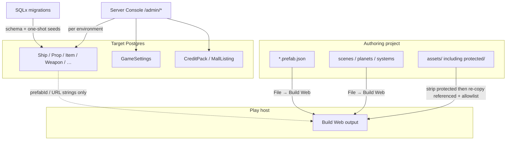
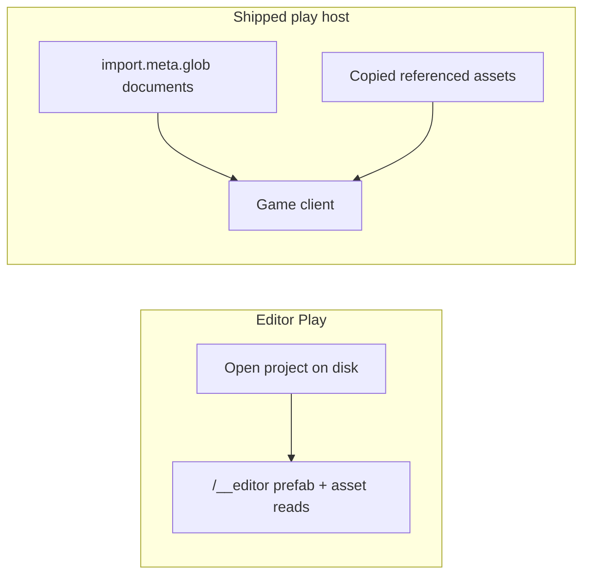
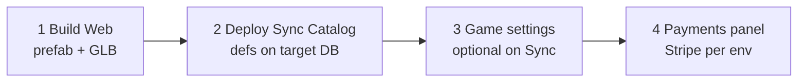
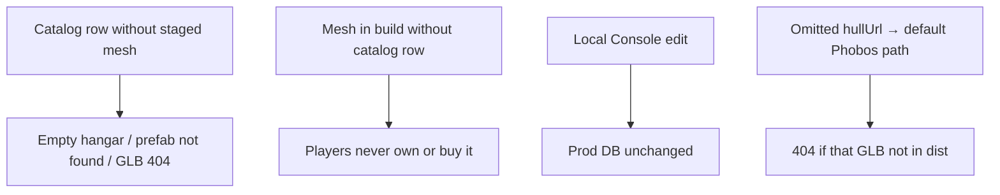

# Content Delivery Architecture

Authoritative mental model for **how authored content reaches play** — project
files, live game catalog, and schema seeds. Do not treat “it worked in editor
Play” as proof that production has the same assets or definitions.

Related: [Build Web](../editor/build-web) (how-to),
[Deployment](../engineering/deployment),
[Server console overview](../server-console/overview),
[Ship definitions](../server-console/ship-definitions),
[Item definitions](../server-console/item-definitions),
[Game settings](../server-console/game-settings),
[Player](./player) (medicine / consumables as live catalog),
[Assets](../assets).

**This doc is law.** Local Server Console edits never auto-sync to prod.
Migrations are not a catalog promote path.

## Permanent decision: three surfaces

| Surface | What lives there | How it reaches an environment |
| --- | --- | --- |
| **Project release** | Scenes, prefabs, planets, systems, `assets/` (including protected packs when staged) | **File → Build Web** → deploy static host; stamps `asteron.runtime.json` |
| **Live catalog** | `ShipDefinition`, props, items, weapons, backpacks, wearables, `GameSettings`, credit packs, mall listings, payment config | Server Console `/admin/*` against **that** backend’s Postgres; **Deploy → Sync Catalog…** to promote editor → release `backendUrl`; or a one-shot seed migration |
| **Migrations** | Schema history + **one-shot** seeds (`WHERE NOT EXISTS` / upsert) | `npm run backend:migrate` or boot with `RUN_MIGRATIONS=true` (defaults **false** in production) |

Never conflate them:

- Catalog rows point at project content by id/URL (`prefabId`, icon URLs, …).
  They do **not** embed meshes. Files exist only if Build Web staged them.
- Editing a ship/item locally in Server Console updates **local** Postgres only.
- A new migration seed does not rewrite rows operators already changed in
  Console.

### Load-path caveat: Editor Play ≠ release

Editor Play (`AUTHORING_ENABLED`) reads the open project live (prefabs via
`/__editor`, assets from the project library). A shipped build loads
`import.meta.glob`-bundled documents and only the assets Build Web copied.

**Local success does not prove release completeness.**

### Protected assets in Build Web

`copyReferencedGameAssets` in `vite.config.ts`:

1. **Deletes** `dist/assets/protected` wholesale (Vite may have copied a tree).
2. **Re-copies** URLs referenced by prefab/scene documents, plus animation
   controller clip URLs, plus an optional allowlist of engine-required assets.
3. Unreferenced protected library files stay out of the deploy.

How-to detail: [Build Web](../editor/build-web), [Assets](../assets).

## Catalog inventory

All of the following are **per-environment** Postgres data. Promote by editing
prod via Server Console, or by adding a seed migration — never by assuming
local Console state ships with the backend binary.

| Catalog | Table(s) | Notes |
| --- | --- | --- |
| Ships | `ShipDefinition` | Stats, shop price, `prefabId` |
| Props | `PropDefinition` | Hangar/hab placeables |
| Items | `ItemDefinition` | Consumables, ammo, materials, … |
| Weapons | `WeaponDefinition` (+ item row) | Damage, mag, fire modes, ammo pairing |
| Backpacks | `BackpackDefinition` (+ item) | Capacity / equip |
| Wearables | `WearableDefinition` (+ item) | Apparel slots |
| Game settings | `GameSettings` singleton | Starting ARC + starter ship/prop/item ids |
| Credit packs | `CreditPack` | Real-money → AsteronCredits |
| Item Mall | `MallListing` | Points at item definitions |
| Payments | `PaymentProvider` | **Prod-specific** secrets/URLs — do not copy local Stripe keys blindly |

Seeds already in `backend/migrations/` (starter Phobos ship, demo props/items,
weapons, wearables, sample mall, …) apply **once**. Later Console edits do not
replay on migrate.

### Do not “sync” to prod

| Data | Why |
| --- | --- |
| Users / players | Live accounts — env-owned |
| Owned ships, inventory, placements, chest | Player state |
| Credit ledger / purchases | Prod commerce history |
| Cell checkpoints / Redis | Ephemeral simulation |

## Promote order (mesh-backed content)

1. Author prefab + assets in the project → **Build Web** / **Deploy → Front End…**.
2. Promote catalog definitions with **Deploy → Sync Catalog…** (exports from
   `editorBackendUrl`, upserts into project `backendUrl`). Requires target admin
   credentials. Does **not** run inside **Deploy → Backend…**.
3. Optionally check **Include game settings** on Sync if new players should get
   updated starters (existing players keep prior grants).
4. Configure Stripe / live Price ids on the **target** env via Server → Payments
   (Sync never writes `PaymentProvider` or `stripePriceId`).

Reverse order fails: catalog without mesh → empty hangar / missing weapon
model; mesh without catalog → players never receive or buy it.

One-shot SQLx seeds (`ON CONFLICT DO NOTHING`) still fill **missing** rows on a
fresh database when migrations run. They are not continuous sync — ongoing
edits go through Sync Catalog.

## Failure modes

| Symptom | Likely miss |
| --- | --- |
| `Ship prefab "…" not found` on play host | Prefab not in Build Web bundle (`import.meta.glob`); worked in editor because `/__editor` saw the project file |
| Protected GLB **404** | Asset not re-copied after protected strip (unreferenced, wrong project root, or missing from allowlist) |
| Hangar empty but bootstrap lists a ship | Backend `prefabId` ok; **client** layout/mesh failed — catalog sync will not fix it |
| New item/weapon exists locally only | Sync Catalog not run against prod (or Console pointed only at localhost) |
| Default hull URL 404 | `ship-model.ts` falls back to hardcoded `PROTECTED_SHIP_URL` (Phobos) when `hullUrl` is omitted — release must still stage that path |

## What this rejects

- Treating migrations as continuous catalog sync from local → prod.
- Assuming Server Console edits follow the backend deploy automatically.
- Using editor Play as the release completeness check.
- Shipping player/inventory dumps between environments as “content promote.”

## Related

- [Build Web](../editor/build-web) — operator steps for the static release
- [Deployment](../engineering/deployment) — backend env + `RUN_MIGRATIONS`
- [Server console overview](../server-console/overview) — `/admin/*` catalog UI
- AGENTS.md — project settings, Build Web staging, protected assets
