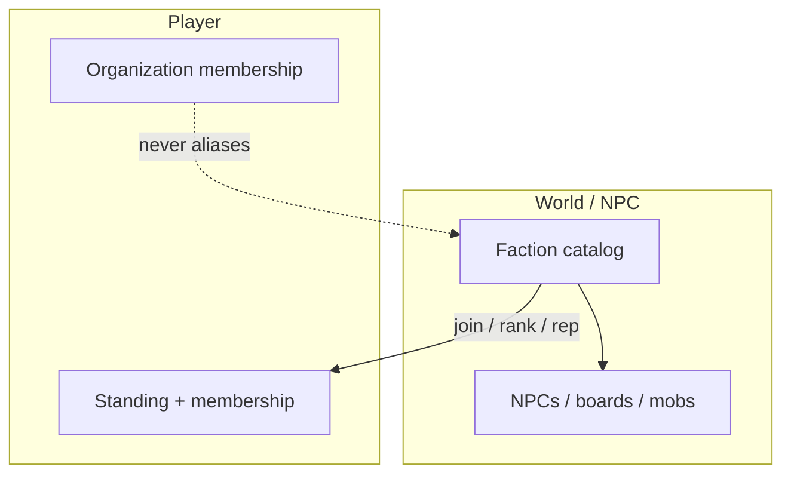

# Faction Architecture

Authoritative mental model for **NPC / world factions** — governments, guilds,
corps, outlaw rings, wildlife sides. Players **relate to** them (standing) and
often **join** them (membership + rank + unlocks). This is the social /
progression layer for *authored* world groups.

**Factions are not player Orgs.** Player-created crews live in
[Organizations](./organizations). Do not store guild membership on `Faction`
rows.

Related: [Organizations](./organizations) (player crews — separate),
[Missions](./missions) (faction boards, join / rank-up contracts),
[NPCs](./npc) (givers wear a faction), [Mobs](./mobs) (aggro side tags),
[Loot tables](./loot-tables) (rank / standing gates),
[Progression](./progression) (character level ≠ faction rank),
[Home Worlds](./home-worlds) (may bias starting allegiance),
[Item Mall](./item-mall) (standing ≠ AC), [Content delivery](./content-delivery),
[Settings](./settings) (catalog defs + optional seeds; not hard-coded rosters),
[HaloBand](./haloband) (later faction pane).

**This doc is law.** Code may lag. Gaps are refactor targets — not permission
to merge player Orgs into catalog factions, grant ranks on the client, or spend
reputation as Mall currency.

## Permanent decisions

### 1. NPC factions vs player Orgs

| | **Faction** (this doc) | **Organization** ([Orgs](./organizations)) |
| --- | --- | --- |
| Who authors | Operators / catalog | Players |
| Who “belongs” | NPCs, mobs, boards; players as **members** or standings | Players only |
| Progression | Standing + rank + skill line | Org roles (leader / officer / …) |
| Purpose | World story, vendors, contracts, aggro | Social crew, shared goals, later bank / claims |

### 2. Joinable guild-factions (primary fantasy)

Product shape matches classic MMO **joinable NPC guilds**:

1. Discover faction via NPC / board / zone story.
2. **Join** (server accept — mission or dialogue intent).
3. Earn **faction XP / standing** from that faction’s contracts and activities.
4. Cross **rank** thresholds → unlock skill line ranks, vendors, boards, titles.
5. Optional **allegiance** factions (home-world / war camps) that bias PvE story
   or later contested space — still catalog, still not player Orgs.

Not every tagged side is joinable. Wildlife / predator tags are **aggro-only**.

### 3. Three faction kinds

| Kind | Join? | Standing? | Example use |
| --- | --- | --- | --- |
| **`joinable`** | Yes | Yes (drives rank) | Authority constabulary, traders’ guild, merc league, outlaw ring |
| **`standing-only`** | No | Yes | Minor zone group; vendor discounts without membership |
| **`aggro-side`** | No | Optional / none | `wildlife`, `predator` — combat matrix only |

A `joinable` faction always has ranks. Standing-only may use the same numeric
scale without a membership row.

### 4. Catalog defs; player rows are state

| Piece | Where |
| --- | --- |
| `Faction` (+ ranks, skill line ids, relations) | Live catalog |
| `PlayerFactionStanding` | Durable player state |
| `PlayerFactionMembership` (joined at, rank id, faction XP) | Durable player state |
| NPC / mob / board `factionId` | Prefab / MobDef / MissionDef |

Promote defs via Console. Never promote player standings / memberships as
“content.”

### 5. Reputation / faction XP is not a currency

- Not ARC, not AC.
- Cannot buy ranks with AsteronCredits.
- Shops may *require* rank or standing; they do not sell “exalted” as an item.

## What this rejects

- Player Orgs stored as `Faction` rows.
- Client-trusted join / rank-up.
- One blurry “reputation” that also means guild rank.
- Forcing every mob species into a joinable guild.
- Hardcoding enemy matrices only in client code.

## Membership and ranks

### Join / leave

| Action | Server checks |
| --- | --- |
| **Join** | Eligible (prereq mission / level / exclusive rules); create membership at rank 0 / initiate |
| **Leave** | Allowed unless `locked` allegiance; strip joinable unlocks that require membership; standing may remain |
| **Kick** (rare) | Crime / story beat — authored, not player Org kick |

**Exclusivity (authored per faction):**

- `exclusiveGroup` — at most one joinable membership in that group (e.g. one
  primary allegiance).
- Default: many joinable guilds can be held at once (traders + mercs + …).

### Rank ladder

Ranks are catalog rows on the faction (not free strings):

| Field | Meaning |
| --- | --- |
| `rankIndex` | 0..N order |
| `id` / `title` | `initiate`, `associate`, … |
| `factionXpRequired` | Cumulative faction XP to attain |
| `unlocks[]` | Skill line rank, board access, vendor tier, title, ability id |

**Faction XP** (separate from character XP — [Progression](./progression)):

- Granted by missions tagged with that `factionId`, turn-ins, authored
  activities.
- `apply_faction_xp_delta` (idempotent) may also bump numeric **standing** so
  standing-only consumers stay consistent.
- Character level gates *access*; faction XP gates *rank*.

Derived **standing rank** bands (hostile → allied) still exist for
non-members and standing-only factions — see scale below. For members, UI
prefers **membership rank title**; standing band is secondary.

## Standing scale (non-member / standing-only)

Same numeric shape as before; used when not emphasizing membership rank:

| Value band | Rank id | Typical meaning |
| --- | --- | --- |
| ≤ −3000 | `hostile` | Attack on sight; boards locked |
| −2999 .. −1000 | `unfriendly` | Markups; limited offers |
| −999 .. 999 | `neutral` | Default |
| 1000 .. 2999 | `friendly` | Discounts; mid contracts |
| ≥ 3000 | `allied` | Best boards; unique vendors |

Thresholds on `Faction.rankThresholds[]`. Clamp e.g. −10000…10000.
Missing standing row ⇒ `defaultStanding` (usually 0).

For **members**, keep standing ≥ friendly floor while in good standing, or
derive display from membership rank — pick one rule in implementation and
stick to it (prefer: membership rank is source of truth for unlocks; standing
still updates for aggro / rival factions).

## Skill lines (faction progression chrome)

Each `joinable` faction may own one **faction skill line** (catalog):

| Rank unlock | Examples |
| --- | --- |
| Passive | Passive board access, faction chat channel (cosmetic), badge |
| Mid | Vendor tier, passive bonuses, emotes / titles |
| High | Elite contracts, unique gear recipes / items, ability |

Skill line ranks unlock **only** via faction rank — not character level alone,
not AC. Abilities still validate on the server when used.

## Allegiance (optional home-world bias)

[Home Worlds](./home-worlds) may set a **starting allegiance** `factionId`
(join or standing bias) — temperate / gas-giant / volcanic fantasy without
locking the player out of other joinable guilds unless those guilds share an
`exclusiveGroup`.

Do not require allegiance for basic station use.

## Factions toward each other

| Edge | Use |
| --- | --- |
| `FactionRelation` (A, B, friendly / hostile / neutral) | NPC / mob aggro and mission rivalry deltas |
| Rival joinable pairs | Completing A’s war contract may hurt standing with B |

Wildlife: one `wildlife` / `predator` **aggro-side**, not per-species guilds.

## Who reads faction state

| Consumer | Reads |
| --- | --- |
| [Missions](./missions) | `minReputation`, `minFactionRank`, `requiresMembership` |
| NPC shops / dialogue | Rank / standing locks; price multipliers |
| [Loot tables](./loot-tables) | Standing or rank gates |
| [Mobs](./mobs) | Mob `factionId` + player standings / allegiance |
| HaloBand | Membership list, rank, skill line progress |

## Deltas

| Source | Effect |
| --- | --- |
| Faction mission complete | Faction XP + standing; rival hit optional |
| Generic mission with `factionId` reward | Standing / XP as authored |
| Fail / abandon | Optional small negative |
| Crime vs faction NPCs (later) | Standing down; possible expulsion |
| Operator | Console grant |

All through idempotent apply helpers — never ad hoc `UPDATE`.

## Display

- HaloBand: **Factions** pane — joined guilds, ranks, skill lines; standings
  list for standing-only.
- Mission board / NPC: faction badge + required rank.
- Nameplate / HUD: optional allegiance icon (budgeted).

## Seed factions (suggested ids — operators replace)

| Id | Kind | Fantasy |
| --- | --- | --- |
| `asteron-authority` | joinable / allegiance | Lawful stations, main security boards |
| `commerce-guild` | joinable | Traders, delivery contracts |
| `mercenary-league` | joinable | Clear / bounty boards |
| `outlaw-ring` | joinable | Illegal cargo (later); exclusive vs authority optional |
| `wildlife` | aggro-side | Fauna combat matrix |

## Bridge to Organizations

| Rule | Meaning |
| --- | --- |
| Orthogonal | Org membership does not set NPC faction rank |
| No shared bank with factions | Faction rewards → personal inventory / ARC |
| Optional later | Org may show a *preferred* allegiance badge (cosmetic); still personal standing |
| Party / Org group finder | May filter by shared allegiance — presentation only |

Full player-crew law: [Organizations](./organizations).

## Ownership

| Concern | Layer |
| --- | --- |
| Faction / rank / skill line / relation defs | Catalog + Console |
| Standing + membership + faction XP | Postgres player state |
| Apply XP / standing / join | Backend faction service |
| Mission / shop / loot / aggro consumers | Those systems |
| UI | HaloBand / boards / NPC chrome |

## Invariants

- Faction ≠ Organization.
- Joinable guilds: membership + rank + optional skill line.
- Aggro-sides do not require join.
- Catalog defs; durable player rows.
- Faction XP / standing ≠ ARC ≠ AC.
- Server join / rank / deltas only; idempotent.
- Character level and faction rank are separate tracks
([Progression](./progression) vs this doc).

## Open / later

- Console CRUD + seed joinable guilds + skill lines.
- Crime / expulsion hooks.
- Contested-space allegiance PvP (explicit extension).
- Faction strongholds as instances.

## See also

- [Organizations](./organizations)
- [Missions](./missions)
- [NPCs](./npc)
- [Mobs](./mobs)
- [Progression](./progression)
- [Home Worlds](./home-worlds)
- [Content delivery](./content-delivery)
