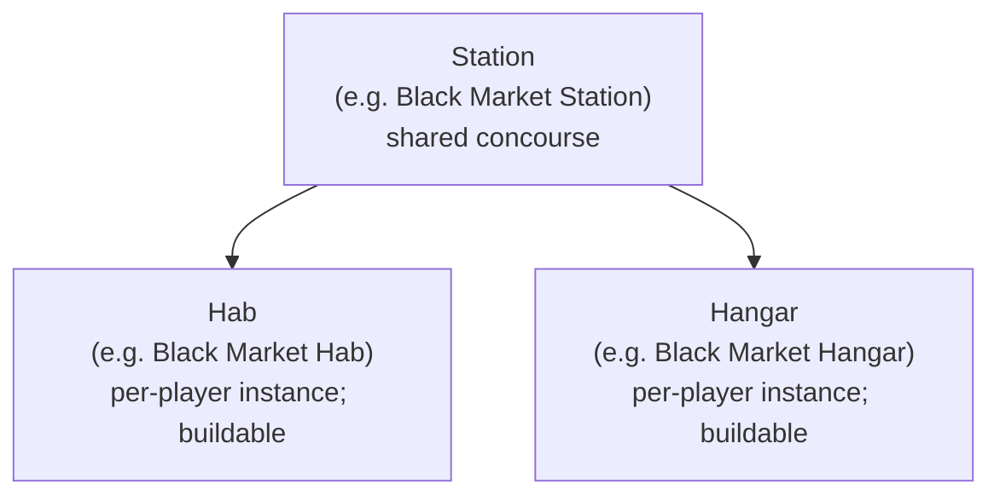
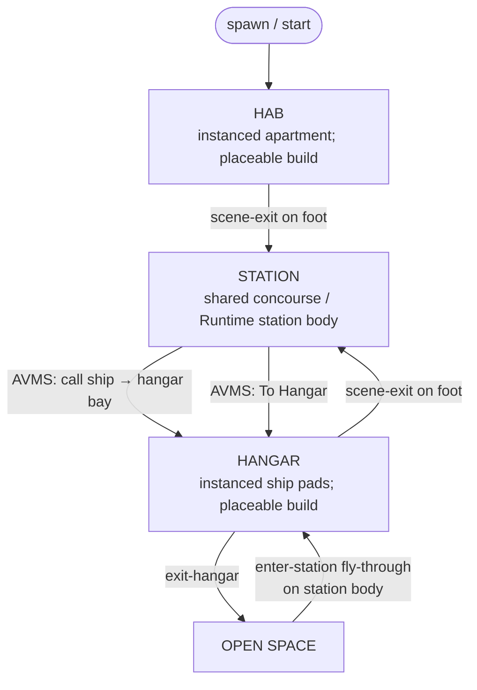

# Basic Game Loop Architecture

Authoritative mental model for how a player moves between places **after** boot
lands them in a starting scene. Do not invent a second travel path; on-foot
places move via `scene-exit` (and AVMS hangar shortcuts that still go through
the same scene-request path). Ship Open Space ↔ Hangar uses dedicated boarding
markers — full law in [Space traversal](./space-traversal).

**Where the session begins** (Title → Character Create → Starting Scene) lives
in [Scene flow](./scene-flow). **Who owns truth / who sees whom** during
instance travel lives in [Multiplayer](./multiplayer).

Related editor authoring: [Game flow](../editor/game-flow.md) (boot / Game
Manager how-to), [Station authoring](../editor/station-authoring.md),
[Scene Exit](../editor/components/scene-exit.md),
[Enter Station](../editor/components/enter-station.md),
[Exit Hangar](../editor/components/exit-hangar.md),
[Hangar Open Space Exit](../editor/components/hangar-open-space-exit.md),
[AVMS terminal](../editor/components/avms-terminal.md).

Star systems and the ecliptic catalog: [Star Map / Star System](./star-map).
System-scale flight / quantum / cull / blips: [Space traversal](./space-traversal).
Piloting: [Ship flight](./ship-flight).

## Permanent decision: station family ownership

A **Station** owns its paired interiors. Hab and Hangar are not free-floating
world places — they belong to that station so multiple stations can each have
their own pair.

**Authoring home:** the [Star Map](./star-map) (`SystemStationEntry` on the
system document) is the catalog. Each station lists:

| Field | Meaning |
| --- | --- |
| `sceneId` | Station body — a scene with **`Runtime: station`** (giant prefab placed into Open Space); see [Space traversal](./space-traversal) |
| `habSceneId` | That station's Hab scene (`Runtime: hab`) |
| `hangarSceneId` | That station's Hangar scene (`Runtime: hangar`) |

Hab/Hangar are **not** separate ecliptic markers — only ownership scene ids.
The station concourse / hull is still a `.scene.json` document, but play places
it like a prefab inside the `Runtime: open-space` host. Example: Black Market
Station → `blackmarket` / `blackmarkethab` / `blackmarkethanger`.

AVMS **To Hangar** uses the terminal's Hangar Scene when set; otherwise it
falls back to the active station entry's `hangarSceneId`. Cell tokens
(`@hangar`, `@apartment`) resolve the per-player instance — see
[Multiplayer](./multiplayer).

- One station → one hab + one hangar (per that station's family).
- Another station (different concourse) gets its **own** hab and hangar.
- When wiring exits / AVMS destinations, stay inside the same station family
  unless the design explicitly crosses stations.

### Instanced Hab / Hangar + building

- **Hab** and **Hangar** are **instanced** (per-player). Each player gets their
  own copy for that station family — not a shared public cell like the Station
  concourse.
- Players can **build** in their hab and hangar with **placeable objects**
  (props / build-mode placements). Station concourse is not a player build
  space.
- If a player has a **team**, team members can **follow into** that player's hab
  or hangar (enter the owner's instance with them). Strangers stay out.
  Authority / replication for follow-in and placeables: [Multiplayer](./multiplayer).

## Player loop (happy path)

On foot and AVMS move Hab ↔ Station ↔ Hangar. **Ships** enter and leave through
Open Space boarding markers — [Space traversal — Station boarding](./space-traversal#station-boarding-ship--hangar--station).

### Steps

1. **Spawn in Hab** — starting place for the player (their instanced quarters
   for that station family). Which family's hab boot picks is authored on the
   boot `game-manager` `startingSceneId` (and related world defaults) —
   [Scene flow](./scene-flow). Placeable build allowed.
2. **Hab → Station** — player uses a `scene-exit` to leave the hab and enter
   the shared station concourse.
3. **AVMS on Station** — at an AVMS terminal, player can **call a ship** so it
   is delivered to their hangar bay. Runtime resolves pads from that family's
   hangar scene (`hangarSceneId` / terminal Hangar Scene), not from the Station
   concourse layout; the hull appears when the player enters the hangar.
4. **Station → Hangar** — from inside the AVMS UI, **To Hangar** moves the
   player to that station family's **instanced** hangar. Placeable build
   allowed. Hangar → Station on foot is a `scene-exit` back to the concourse.
5. **Hangar → Open Space** — hangar uses **`exit-hangar`** (not a `@space`
   `scene-exit` as the designed path). Runtime resolves the owning station via
   Star Map `hangarSceneId`, finds that station body's nested
   **`hangar-open-space-exit`** marker, and spawns the ship **in-ship** at that
   mouth pose in the Open Space host.
6. **Open Space → Hangar** — ship flies through **`enter-station`** on the
   station body (open-air or closed bay — same component). Lands in that
   station family's hangar instance. From there, on-foot `scene-exit` reaches
   the station concourse.

### Station ↔ Hab return

Station → Hab is the same family: a `scene-exit` (or AVMS / UI shortcut that
still issues a scene request) into that station's `habSceneId` instance.
Authors place the return portal on the concourse; do not invent a second
teleporter stack.

## Travel primitives (this loop)

| Move | Component / path | Notes |
| --- | --- | --- |
| Hab ↔ Station ↔ Hangar (on foot) | `scene-exit` / AVMS | Shared or instance cell via tokens — [Multiplayer](./multiplayer) |
| Hangar → Open Space | `exit-hangar` | Arrival `in-ship` at nested mouth |
| Open Space → Hangar | `enter-station` | Hangar instance; then on-foot to concourse |

Do not use a hangar `scene-exit` targeting `@space` as the designed departure
path once `exit-hangar` exists. Do not page-reload to change place.

## Invariants

- Hab / Station / Hangar in one family share the same station identity
  conceptually (Black Market → Black Market Hab + Black Market Hangar).
- Hab and Hangar are **per-player instances**; Station concourse is shared.
  Building with placeables is hab/hangar only.
- Team members may enter a teammate's hab/hangar instance (follow-in);
  strangers stay out.
- Do not hard-code a single global hab or hangar if the project has multiple
  stations.
- AVMS "call ship" and "To Hangar" are station-side; destinations resolve to
  **that station's** hangar.
- Ship Open Space ↔ Hangar uses `enter-station` / `exit-hangar`; mouth pose is
  the station body's nested `hangar-open-space-exit` — not a free-floating
  global portal and not a Station picker on the hangar exit.
- On-foot travel between Hab / Station / Hangar stays `scene-exit` / AVMS —
  not page reload, not a second teleporter system.
- Station bodies follow [Space traversal](./space-traversal): scene document +
  `Runtime: station` (giant prefab in the Open Space host). Do not fork back
  into "prefab-only" vs "world-swap scene" as two truths.
- Boot / entry hops are not this doc — [Scene flow](./scene-flow).

## Open / later

- Authoring polish for Station → Hab return portals (placement templates,
  prompts) — law above; UX may catch up.
- Optional `scene-exit` tokens that resolve Hab/Hangar **scenes** from the
  active station family (today portals may still name concrete scene ids; cells
  already use `@apartment` / `@hangar`). Prefer family tokens over hard-coded
  ids when refactoring portals.
- Align `enter-station` arrival fantasy (seated vs on-foot in hangar) with
  [Space traversal](./space-traversal) open items — product pick, then code.
