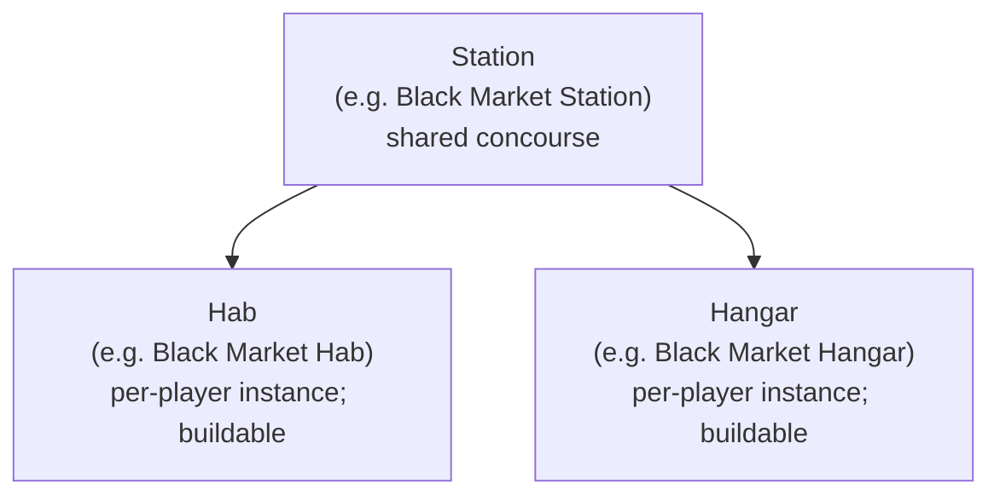
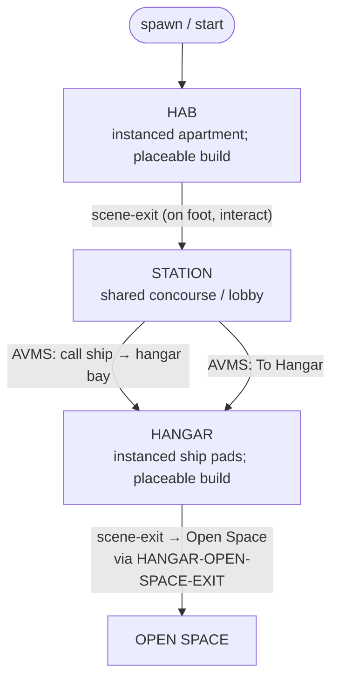

# Basic Game Loop Architecture (draft)

Raw first draft. Authoritative mental model for how a player moves between places.
Do not invent a second travel path; places move via `scene-exit` (and AVMS hangar
shortcut that still goes through scene request).

Related editor authoring: [Game flow](../editor/game-flow.md) (boot / Game Manager),
[Station authoring](../editor/station-authoring.md), [Scene Exit](../editor/components/scene-exit.md),
[AVMS terminal](../editor/components/avms-terminal.md).

## Station family (ownership)

A **Station** owns its paired interiors. Hab and Hangar are not free-floating
world places — they belong to that station so multiple stations can each have
their own pair.

- One station → one hab + one hangar (per that station's family).
- Another station (different concourse) gets its **own** hab and hangar.
- When wiring exits / AVMS destinations, stay inside the same station family
  unless the design explicitly crosses stations.

### Instanced Hab / Hangar + building

- **Hab** and **Hangar** are **instanced** (per-player). Each player gets their own
  copy for that station family — not a shared public cell like the Station.
- Players can **build** in their hab and hangar with **placeable objects**
  (props / build-mode placements). Station concourse is not a player build space.
- If a player has a **team**, team members can **follow into** that player's hab
  or hangar (enter the owner's instance with them).

## Player loop (happy path)

### Steps

1. **Spawn in Hab** — starting place for the player (their instanced quarters for that station family). Placeable build allowed.
2. **Hab → Station** — player uses a `scene-exit` to leave the hab and enter the shared station concourse.
3. **AVMS on Station** — at an AVMS terminal, player can **call a ship** so it is delivered to their hangar bay.
4. **Station → Hangar** — from inside the AVMS UI, **To Hangar** moves the player to that station family's **instanced** hangar. Placeable build allowed.
5. **Hangar → Open Space** — hangar has a `scene-exit` set to **Open Space**. That exit sends the player to the Station component named **`HANGAR-OPEN-SPACE-EXIT`** (same station family).

## Invariants (draft)

- Hab / Station / Hangar in one family share the same station identity conceptually (Black Market → Black Market Hab + Black Market Hangar).
- Hab and Hangar are **per-player instances**; Station is shared. Building with placeables is hab/hangar only.
- Team members may enter a teammate's hab/hangar instance (follow-in); strangers stay out.
- Do not hard-code a single global hab or hangar if the project has multiple stations.
- AVMS "call ship" and "To Hangar" are station-side; destinations resolve to **that station's** hangar.
- Hangar open-space exit targets the Station marker `HANGAR-OPEN-SPACE-EXIT` — not a free-floating global portal.
- Travel between places stays scene-based (`scene-exit` / scene request) — not page reload, not a second teleporter system.

## Open / later

- Return paths (Hangar → Station, Station → Hab, Open Space → Hangar).
- Boarding / fly-through trigger details on the hangar exit.
- How boot / Game Manager `startingSceneId` picks which station family's hab.
- Backend cell tokens (`@apartment`, `@hangar`, etc.) vs authored scene ids.
