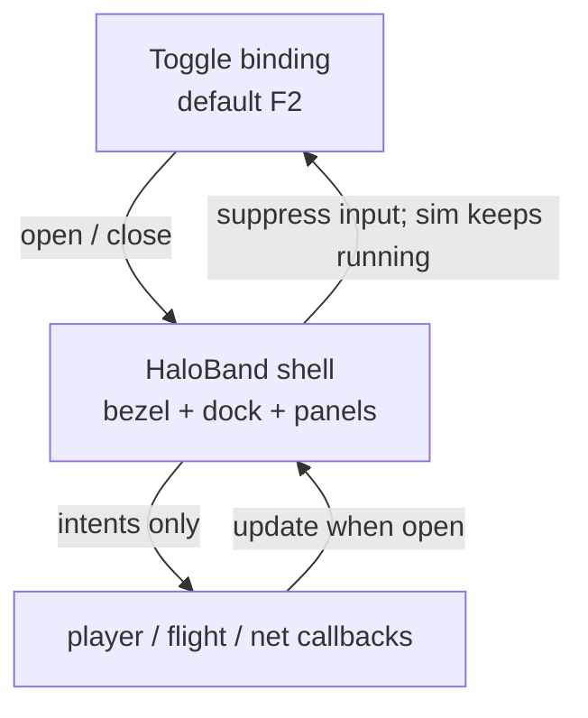

# HaloBand Architecture

Authoritative mental model for the **HaloBand** — the player's personal
wearable device. It is the in-play shell for personal apps (status, chat,
missions, Star Map nav, portable inventory, Item Mall, active-ship status).
It is **presentation + input routing**, not a second simulation or a second
inventory authority.

Related: [Player](./player) (vitals Home tiles read),
[Star Map](./star-map) / [Ship flight](./ship-flight) (Map tab + quantum
route), [Ship combat](./ship-combat) (Ship tab hull / shields),
[Content delivery](./content-delivery) (Mall listings / credit packs as live
catalog), [Multiplayer](./multiplayer) (chat + inventory outcomes stay
cell/server-owned), [NPCs](./npc) / [Mobs](./mobs) (Missions tab mirrors
contracts; NPC verbs vs PVE), [Item Mall](./item-mall) (AC storefront + packs),
[Stripe](./stripe) (Payment Element pay UI),
[Payments](../server-console/payments) (operator how-to), editor
[Menu Manager](../editor/menu-manager) (preview only).

**This doc is law.** Code may lag (Missions stub, Inventory equip split, holo
backdrop unwired). Gaps are refactor targets — not permission to fork a second
personal-device UI or put Mall / chat / inventory outcomes on the client alone.

## Permanent decision: one personal device shell

There is **one** HaloBand. Tabs are apps on that device, not competing
fullscreen products.

| App (tab) | Job |
| --- | --- |
| **Home** | At-a-glance vitals, environment, vehicles, notifications; contracts teaser |
| **Comms** | Proximity / session chat send + receive |
| **Missions** | Active contracts / mission log (product later; tab reserved) |
| **Map** | In-play Star Map (ecliptic) — select body, Set / Clear Route for quantum |
| **Inventory** | Portable inventory browse (+ eventually equip / consume — one inventory UX) |
| **Mall** | AsteronCredits storefront + credit packs (online only) |
| **Ship** | Active hull status when the player is in a ship-related mode |

### What this rejects

- A second “phone / PDA / datapad” overlay that duplicates HaloBand apps.
- HaloBand owning simulation truth (vitals drain, Mall balance, inventory
  stacks, nav route physics, chat fan-out).
- Opening HaloBand as a **pause** of the world — only **input suppress**.
- Authoring HaloBand layout through Menu Manager as a shipped menu document
  (preview is fine; the play device stays engine-owned / hardcoded for now).
- Showing **Mall** when there is no live mall wiring (hide the tab).
- Showing **Ship** when the player is not in a ship-related mode.
- Conflating dock **ARC** (soft currency) with Mall **AsteronCredits (AC)**.

## Open / close and input

- Default toggle: binding id `haloBand` (**F2**). Esc closes when open.
- On open: exit pointer lock; `setInputSuppressed(true)` so locomotion /
  flight / combat keys die while typing and dock navigation work.
- On close: clear suppress; world was never paused for HaloBand alone.
- Preview mode (Menu Manager): embedded, no F2/Esc listeners, opens on create.

Do not fold HaloBand into `isPaused()` unless product deliberately freezes
sim for the device. Today: suppress ≠ pause.

## Ownership

| Concern | Layer |
| --- | --- |
| Shell DOM, dock, tab routing, open state | `render/effects/hud/haloband*` |
| Home / Inventory / Ship panel paint | `haloband-panels.ts` (reads params + callbacks) |
| Map panel | `system-map-panel.ts` → `flight/nav-route.ts` |
| Mall panel | `haloband-mall.ts` → REST mall / packs / checkout |
| Vitals / environment numbers | `player/` domain; HaloBand only displays |
| Chat send / receive | World client / cell edge; HaloBand mirrors lines |
| Inventory stacks / purchase | Server + `player/inventory`; HaloBand reads via callbacks |
| Play wiring | `play-session-overlays*` → `createHaloBand` + mall callbacks |
| Menu Manager preview | `editor/menus/*` — mock world, **no** Mall |

`player/` / `flight/` stay free of HaloBand DOM. `render/` never decides Mall
grants, inventory mutations, or chat authority.

## Currencies on the device

| Currency | Where on HaloBand | Role |
| --- | --- | --- |
| **ARC** | Dock balance | Earned soft currency (shops, etc.) |
| **AsteronCredits (AC)** | Mall tab balance | Bought / granted; spends only in Item Mall |

Never display AC as ARC or let a client “add credits” after Stripe Checkout —
webhook grants only ([Payments](../server-console/payments)).

## Tabs (law + baseline)

### Home

At-a-glance personal status: vitals bars, environment sample, active vehicle
summary, recent notification lines (often mirrored from Comms). Contracts /
mission teaser may stay empty until Missions ships.

### Comms

Chat UI. Send goes through the network client; receive appends into Comms and
feeds Home notifications. Offline / failed dial: local-only or SYS/NET lines —
do not invent a second chat bus for HaloBand.

### Missions

**Reserved tab.** Product: mission / contract log tied to Star Map mission
markers and backend persistence. NPC verbs (offer, talk-to, give-to, take-from,
turn-in) and cell ownership: [NPCs](./npc). Kill/escort creatures: [Mobs](./mobs).
Baseline: static empty placeholder. Do not re-purpose the tab for unrelated UI;
do not hide it without an explicit product cut.

### Map

In-play view of the **active** Star System catalog (ecliptic), not the editor
Star Map authoring surface. Select a body → **Set Route** / **Clear Route**
writes the shared nav-route store used by quantum. Closing HaloBand must
**not** clear the route. Language should track [Star Map](./star-map)
(product name Star Map; code may still say System Map).

### Inventory

Canonical **portable inventory** surface on the personal device: filter, grid,
detail. Equip / consume / drop must share the same inventory state as any
quick overlay (today’s **I** Personal Inventory). Law target: **one**
inventory UX — HaloBand Inventory is the device app; a hotkey may deep-link
or mirror it, never fork stacks. Baseline may still split browse (HaloBand)
vs equip (Personal Inventory); that split is debt.

### Mall

Item Mall for **AsteronCredits**. Visible only when mall callbacks are wired
(live bootstrap). Listings + credit packs; Stripe Checkout opens outside the
game; balance refresh after webhook-backed purchase poll. Omit callbacks →
hide tab (editor preview, offline). Catalog rows are live Postgres, not
Build Web files ([Content delivery](./content-delivery)).

### Ship

Hull / shields / speed / rig summary for the **active** ship when
`world.mode` is ship-related (in ship, deck, enter/leave pilot transitions).
Hidden on foot / in station walk. Ship vitals stay the combat / flight
pipeline — HaloBand only reads ([Ship combat](./ship-combat)).

## Update budget

When open, play feeds `HaloBandUpdateParams` (`world`, surfaces, planet).
Heavy panel paints (Home / Ship) throttle; closed HaloBand does not paint
tabs every frame. Keep DOM work out of the hot path when closed. Lazy-create
Map and Mall panels on first open of that tab.

## Holo backdrop

The shell may host a WebGPU / canvas holo layer behind UI chrome for presence.
Baseline: DOM canvas stub / module exported but not required for tab
functionality. Holo is cosmetic — never gate apps on it.

## Multiplayer

| Feature | Authority |
| --- | --- |
| Chat text | Server / cell edge fan-out; client displays |
| Inventory mutate / Mall buy | Server; client refreshes from response |
| Nav route | Local pilot intent store → quantum; peers follow flight law elsewhere |
| Vitals display | Reads local / reconciled vitals; outcomes stay [Player](./player) / cell |

Do not treat HaloBand open state as replicated presence. Peers do not need to
see your device UI.

## Invariants

- One HaloBand shell; tabs are apps on it.
- Open → input suppress; not world pause.
- HaloBand is presentation; domain + server own outcomes.
- Mall tab only when mall wiring exists; Ship tab only in ship modes.
- ARC dock ≠ AC Mall.
- Map Set Route persists after close; feeds quantum via nav-route store.
- Missions tab reserved until mission system lands.
- Inventory must not fork from Personal Inventory / server stacks.
- Not a Menu Manager–authored play document (preview only).
- `render/` does not import authority; callbacks only.

## Baseline vs law (today)

| Piece | Baseline | Law |
| --- | --- | --- |
| Shell + dock + tabs | Live (`haloband*`, play chrome DOM) | Same |
| F2 / Esc / suppress | Live | Suppress ≠ pause |
| Home vitals / env / notifications | Live (soft vitals may lag player law) | Display only; [Player](./player) owns model |
| Comms chat | Live when world session up | Server fan-out |
| Missions | Static empty stub | Reserved app |
| Map + Set Route | Live ecliptic panel | Star Map language; quantum dest |
| Inventory | Browse / filter / detail | Canonical portable inventory UX |
| Equip / consume | Often **I** Personal Inventory | Same state; merge UX toward HaloBand |
| Mall | Live online; hidden offline / preview | AC + webhook grants only |
| Ship tab | Live in ship modes | Read-only hull status |
| Holo backdrop | Unwired / optional | Cosmetic later |
| Menu Manager | Preview + tab jump; no Mall | Preview only |

## Key files (today)

| Path | Role |
| --- | --- |
| `src/render/effects/hud/haloband.ts` | Controller: open, tabs, chat, update |
| `src/render/effects/hud/haloband-types.ts` | Tabs, update params, mall callbacks |
| `src/render/effects/hud/haloband-dom.ts` | Build / collect device markup |
| `src/render/effects/hud/haloband-panels.ts` | Home / Inventory / Ship paint |
| `src/render/effects/hud/haloband-mall.ts` | Mall storefront UI |
| `src/render/effects/hud/haloband-holo.ts` | Holo backdrop (optional) |
| `src/render/effects/hud/system-map-panel.ts` | Map tab |
| `src/flight/nav-route.ts` | Shared Set Route store |
| `src/app/play-session-overlays-helpers.ts` | Play create + mall + chat mirror |
| `src/editor/menus/catalog.ts` | Menu Manager `haloband` entry |

## Open / later

- Missions / contracts data model, persistence, Star Map mission markers.
- Unify Inventory equip/consume into HaloBand (or make **I** a deep-link).
- Wire holo backdrop for device presence.
- Align Map / dock copy with Star Map product naming.
- Home contracts tile fed by real mission state.
- Optional: pause-on-open as an explicit product mode (default stays suppress).
- Peer-visible “using device” cosmetic (default: no).
