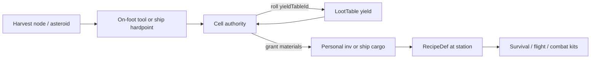

# Harvesting Architecture

Authoritative mental model for **harvesting** — extracting materials from the
world for survival and craft. Two extractors share one pipeline: **on-foot**
(tools vs planet / wreck nodes) and **ship** (mining hardpoints vs asteroids /
debris). Yields are catalog materials that feed **recipes** (Minecraft-like
space crafting). This is a **web** MMO with authoritative cells — space sim +
survival sim, not a client-side gather sandbox.

Related: [Loot tables](./loot-tables) (yield rolls), [Player](./player)
(hunger / thirst / meds from crafted consumables), [Ship combat](./ship-combat)
(mining ≠ combat guns), [Character combat](./character-combat) (firearms ≠
harvest tools), [Ship flight](./ship-flight) (pilot posture while
mining), [Space traversal](./space-traversal) / [Star Map](./star-map)
(asteroid belts), [Missions](./missions) (gather objectives),
[Content delivery](./content-delivery) (markers vs catalog),
[Multiplayer](./multiplayer) (shared node / asteroid HP),
[Progression](./progression) (soft recipe / tool gates),
[Item Mall](./item-mall) (AC ≠ harvest).

**This doc is law.** Code may lag (no harvest nodes / recipes yet). Gaps are
refactor targets — not permission to invent ore on the client, strip asteroids
with blasters, or grant AsteronCredits from mining.

## Permanent decisions

### 1. One pipeline, two extractors

Harvest always means: **damage / channel a harvestable → cell rolls yield →
materials land in an inventory**. Extractor kind only changes reach, tool /
hardpoint rules, and which inventory receives the grant.

| Extractor | Actor | Targets | Grant destination |
| --- | --- | --- | --- |
| **On-foot** | Walking character + handheld tool | Flora, geology, ice, salvage, fluid nodes | Personal inventory |
| **Ship** | Piloted hull + mining hardpoint | Asteroids, free rocks, debris clusters | Ship cargo hold |

Do not invent a second economy for “space ore” vs “planet mats.” Same
`ItemDefinition` materials, same craft recipes.

### 2. Cell owns deplete, contest, and grant

Node / asteroid **HP** (or charge), depletion, respawn timers, yield rolls, and
inventory grants are **cell** outcomes. Client may predict swing / beam VFX and
show prompts from proximity. Client-local `Math.random` never creates stacks.

Peers in interest see the same shared HP on contested nodes and asteroids
([Multiplayer](./multiplayer)).

### 3. Yields reuse loot tables

Harvest calls a catalog **`LootTable`** (or the same roller with harvest
context) via `yieldTableId` on the node def. Same invariants as
[Loot tables](./loot-tables): server RNG, idempotent grants, nesting caps,
**never AC**. Tiny ARC sprinkle is allowed but should stay rare for harvest
(prefer materials).

Do not embed drop lists in prefab JSON when a table id exists.

### 4. Crafting is the sink, not a second gather

**Recipes** (`RecipeDef` catalog rows) consume tagged materials at authored
craft stations (field kit, hab / station bench, ship fabricator). Crafting
never invents resources; it only spends inventory the player already owns.
Minecraft mental model: know the recipe, bring mats, get the item — space
flavored (schematics, fabricators, refineries).

Survival consumables (rations, filters, med kits) and flight sustain (hull
patches, coolant, ammo) share that craft graph.

### 5. Catalog defs; project placements

| Piece | Surface |
| --- | --- |
| `HarvestNodeDef`, tool tiers, `RecipeDef`, material tags | Live catalog (Server Console) |
| Yield contents | `LootTable` ids |
| `harvest-node` markers, dens, asteroid prefabs, craft-station markers | Editor → [Build Web](./content-delivery) |
| Meshes / VFX / SFX | Project assets |

## What this rejects

- Client RNG inventing ore, timber, or ice.
- Paying **AsteronCredits** from harvest or craft ([Item Mall](./item-mall)).
- Using **Combat** blasters / missiles as mining tools (separate hardpoint /
  tool tags).
- Infinite undamaged nodes in shared space (no scarcity, no MP fairness).
- Embedding full recipe ingredient lists or yield tables in placement docs.
- Treating ship cargo as personal bag without an explicit transfer step.
- Pausing the simulation to harvest (input suppress OK; world keeps ticking —
  same spirit as [HaloBand](./haloband)).
- “Add multiplayer later” for depleting asteroids or contested veins.

## On-foot harvest

### Feel

Player approaches an authored `harvest-node` (or dens-spawned interactable) on
planet surface, wreck interiors, or station outskirts. Interact hold / tool
swing channels damage into node HP. **Tool tier** must meet **node hardness**;
underspec tools are slow and burn durability faster. Outdoor harvest still
applies planet temp / air stress ([Player](./player), [Planets](./planets)).

### Node families

| Family | Examples | Survival / craft hook |
| --- | --- | --- |
| **Flora** | Timber, fiber, fruit, herbs | Rations, bandages, fuel, meds |
| **Geology** | Ore vein, crystal outcrop | Ingots, plating, catalysts |
| **Organic** | Eggs, resin, mycelium | Rations, toxins → medicine |
| **Salvage** | Crate, wreck panel | Scrap, wiring, seals |
| **Fluid** | Spring, condensate, ice melt | Thirst, coolant |

Mob **corpses** are not harvest nodes — death rolls stay on the mob /
[loot table](./loot-tables) path. Optional “butcher” can be a loot-pane verb on
a corpse, not a flora swing.

### Tools

Handheld tools are catalog items (pick, axe, knife, scavenger kit, …) with
tier, durability, and allowed node-family tags. Broken tools stop extract until
repaired or replaced (craft sink).

## Ship harvest

### Feel

Pilot engages **mining** hardpoints (laser, drill, scoop, tractor) on asteroid
fields, free-floating rocks, and large low-orbit deposits. This is **not**
Combat mode weapon fire ([Ship combat](./ship-combat)). Prefer Traverse (or a
dedicated mining posture) with mining modules active. Capacitor / heat limits
bound AFK strip rates.

Ore streams into **ship cargo** (mass / volume gated). Full hold requires dump
at a station refinery, transfer to personal inv, or craft aboard a ship
fabricator.

### Targets

| Target | Hardpoint | Typical yield |
| --- | --- | --- |
| Metal asteroid | Mining laser / drill | Ore chunks |
| Ice asteroid | Scoop / heater beam | Water ice, volatiles |
| Rare isotope rock | Precision laser | Craft catalysts |
| Debris cluster | Tractor / claw | Scrap, salvage parts |
| Gas plume (later) | Atmospheric scoop | Fuel gases |

Asteroids in shared Open Space are **cell entities** with shared HP — peers see
strip progress (same duty as mob HP visibility).

Belt / field placement: Star Map dens or open-space prefab markers
([Star Map](./star-map), [Space traversal](./space-traversal)).

## Domain model

### `HarvestNodeDef` (catalog)

| Field (conceptual) | Meaning |
| --- | --- |
| `id` | Stable id |
| `name` / `description` | Operator UX |
| `family` | `flora` \| `geology` \| `organic` \| `salvage` \| `fluid` \| `asteroid` \| `debris` |
| `hardness` | Minimum tool / hardpoint tier |
| `maxHp` | Deplete budget |
| `yieldTableId` | [Loot table](./loot-tables) for materials |
| `respawnSeconds` | 0 = one-shot until dens refresh |
| `extractorMask` | `onFoot` \| `ship` \| `both` |
| `toolTags` / `hardpointTags` | Allowed extractors |
| `claimMode` | `personalCredit` (default) \| `sharedHp` \| optional short exclusive channel |

### Placement (project)

| Component / marker | Role |
| --- | --- |
| `harvest-node` | Places a node instance → `HarvestNodeDef` id + optional overrides |
| Harvest dens | Budgeted spawn of nodes (planet / wreck) — dens in project, def in catalog |
| Asteroid / belt dens | Open Space rock entities from defs |
| `craft-station` | Bench / fabricator / field-kit interactable → recipe set filter |

### Materials

Harvest grants ordinary **`ItemDefinition`** rows tagged for craft
(`organic`, `metal`, `crystal`, `volatile`, `edible`, `scrap`, …). Tags let
recipes accept “any metal ore” without listing every id. Icons / meshes follow
item defs → Build Web.

### Tools and hardpoints

| Kind | Catalog home | Notes |
| --- | --- | --- |
| Handheld tool | Item + tool stats | Durability, tier, family tags |
| Mining module | Ship module / hardpoint def | Power draw, heat, tier — **not** a blaster row |

## Crafting bridge

### `RecipeDef` (catalog)

| Field (conceptual) | Meaning |
| --- | --- |
| `id` | Stable id |
| `stationKinds` | `fieldKit` \| `habBench` \| `stationFabricator` \| `shipFabricator` \| `refinery` |
| `inputs[]` | `{ itemDefinitionId }` or `{ tag, qty }` |
| `output` | `{ itemDefinitionId, qty }` |
| `craftSeconds` | Server-timed channel |
| `minPlayerLevel` / faction gate | Soft unlock ([Progression](./progression), [Factions](./factions)) |
| `grid` / `schematic` | Optional shaped layout for UX (Minecraft-like); server validates counts / shape |

### Stations

| Station | Typical outputs |
| --- | --- |
| **Field kit** | Rations, bandages, filter cartridges, torch fuel |
| **Hab / station bench** | Tools, outfit pieces, placeables, meds, ammo |
| **Ship fabricator** | Hull patches, mining charges, fuel / coolant cells |
| **Refinery** | Ore → ingot (intermediate craft hop) |

### Example chains

| Inputs (harvest) | Station | Output | Loop |
| --- | --- | --- | --- |
| Fruit + ice melt | Field kit | Ration pack | Hunger / thirst |
| Herb + resin | Hab bench | Med injector | HP + toxicity trade |
| Timber + scrap | Hab bench | Pickaxe T2 | Faster geology |
| Metal ore ×N | Refinery → bench | Ingot → plating | Placeables / repair |
| Asteroid ore + crystal | Ship fabricator | Hull patch kit | Combat survivability |
| Ice asteroid + scrap | Ship fabricator | Coolant cell | Mining heat / life support |
| Isotope + wiring | Station fabricator | Blaster capacitor | Ship combat ammo |

Craft execution is **server-owned**: validate station proximity / ship power,
deduct inputs, start timer, grant output with an idempotency key. Client shows
progress UI only.

Crafting XP is **out of scope** until [Progression](./progression) defines a
profession track — do not silently dump craft XP into character level.

## Authority and multiplayer

| Concern | Owner |
| --- | --- |
| Node / asteroid HP + respawn | Cell |
| Yield roll + inventory / cargo grant | Cell + inventory APIs |
| Tool durability burn | Cell (on successful channel ticks) |
| Craft deduct + grant | Cell or station service (same idempotent pattern) |
| Swing / beam VFX, prompts | Client prediction / presentation |
| Peer visibility of strip progress | Interest snapshot (entity HP) |
| Mission gather credit | Mission service — catalog item ids, not fake counters ([Missions](./missions)) |

**Contest default:** damage credit window → personal yield eligibility (assist
friendly). Asteroids default to **shared HP** with per-attacker personal rolls
on break / tick grants as designed per def. Rare nodes may use a short exclusive
channel lock — opt-in per def, not global FFA grief.

**Cargo vs bag:** ship hold is ship inventory. Moving mats to personal inventory
is an explicit transfer intent (docked, or cargo console). Do not auto-merge.

## Content delivery

| Surface | What |
| --- | --- |
| **Build Web** | Markers, dens, asteroid prefabs, craft stations, meshes / VFX |
| **Catalog** | `HarvestNodeDef`, tools / modules, `RecipeDef`, material tags, yield `LootTable`s |
| **Migrations** | Schema + one-shot seed recipes / nodes only |

Editor Play reading local nodes does not prove release completeness
([Content delivery](./content-delivery)).

## Ownership summary

| Concern | Layer |
| --- | --- |
| Node / recipe / tool CRUD | Server Console + catalog |
| Placement / dens / prefabs | AsteronEngine project |
| Extract + deplete + grant | Cell |
| Craft validate + grant | Cell / station service |
| Presentation (prompts, beams, craft UI) | Client / HaloBand or world HUD |
| Mission gather progress | Mission service |

## Invariants

- One material pipeline; on-foot and ship only change extractor + grant bag.
- Cell owns HP, yields, and craft grants; client never invents stacks.
- Yields via loot-table roller; **no AC** from harvest or craft.
- Mining hardpoints ≠ combat weapons.
- Recipes spend tagged catalog items at authored stations.
- Shared space: depleting targets are visible to interest peers.
- Survival and flight kits both come from the same craft graph.
- Design multiplayer contest with the feature — not after.

## Suggested build order

| Phase | Slice | Playable outcome |
| --- | --- | --- |
| 1 | On-foot nodes + yield + personal inv | Chop / mine → mats in bag |
| 2 | Hab craft bench + starter recipes | Rations, pick, bandage |
| 3 | Tool tiers + hardness + durability | Extract progression |
| 4 | Ship mining + asteroid dens + cargo | Belt strip → hold |
| 5 | Ship fabricator + refinery hop | Ore → ingot → hull patch |
| 6 | MP contest + mission gather credit | Co-op belts / contracts |
| 7 | Gas scoop / rare isotopes / faction gates | Late space economy |

## Open / later

- Console CRUD for `HarvestNodeDef` / `RecipeDef` + seed tables.
- Vegetation / surface-spawn workers emitting harvest interactables (cache
  bump rules if placement code changes).
- Atmospheric scoop and gas-giant harvest.
- Profession XP track for craft / mining ([Progression](./progression)).
- Org-shared cargo / claim rules ([Organizations](./organizations)) — keep
  orthogonal to personal default.
- Dedicated crafting architecture doc if recipe UX grows past this bridge.

## See also

- [Loot tables](./loot-tables)
- [Player](./player)
- [Missions](./missions)
- [Ship combat](./ship-combat) / [Ship flight](./ship-flight)
- [Star Map](./star-map) / [Space traversal](./space-traversal)
- [Content delivery](./content-delivery)
- [Multiplayer](./multiplayer)
- [Progression](./progression)
- [Item Mall](./item-mall)
