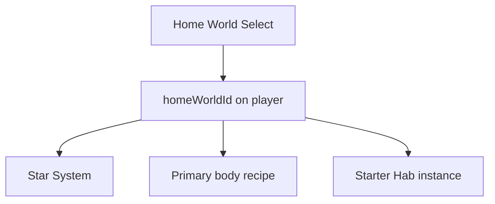
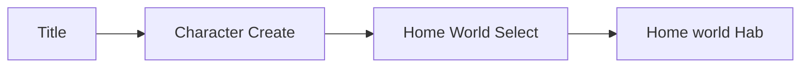

# Home Worlds Architecture

Authoritative mental model for **where a new player belongs** — the home
world chosen after character create, and what that choice binds (Star System,
primary body, starter station family / Hab). Environment stress those worlds
put on the body lives in [Player](./player). Where death sends you lives in
[Player death](./player-death).

Related: [Scene flow](./scene-flow) (Home World Select hop),
[Star Map](./star-map) (system + body catalog),
[Planets](./planets) (primary body recipe; rocky vs gas giant),
[Basic game loop](./game-loop) (station family Hab ownership),
[Space traversal](./space-traversal) (Runtime / sealed interiors),
[Multiplayer](./multiplayer) (per-player Hab instance).

**This doc is law.** Code and planet documents may lag. Gaps are refactor
targets — not permission to skip the select hop or invent a second “spawn
planet” flag beside home world.

## Permanent decision: home world binds the starter life

A **home world** is a named starter offer. Choosing one at signup sets:

| Binding | Meaning |
| --- | --- |
| **Star System** | The system the player’s session starts in |
| **Primary body** | The planet / gas giant that owns the home environment recipe |
| **Starter station family** | The Station → Hab → Hangar pair the player’s first Hab belongs to |

It is **not** “any planet on the map.” It is one curated package per choice.

### What this rejects

- Boot `startingSceneId` as a single global Hab for every player once home
  worlds exist — starting Hab **resolves from** `homeWorldId`.
- Letting the client invent a home world id not in the project’s offer list.
- Treating a gas giant’s cloud deck as walkable planet terrain.
- Changing home world as a casual in-play setting (sticky at create; change is
  later product).

## Signup hop

After [Character Create](./scene-flow), if the player has **no** `homeWorldId`,
the pipeline shows **Home World Select** (`Runtime: flow`). Confirming a
choice persists `homeWorldId` (and the bound system / body / starter Hab ids
the project maps to that offer). Then the session lands in that world’s
**starter Hab**.

Returning players with a saved home world skip the hop.

Order:

Boot still owns the pipeline fields; home-world resolution supplies the
concrete starting Hab / `systemId` / `planetId` for that player —
[Scene flow](./scene-flow).

## Starter catalog (initial three)

Projects may author more later. The **initial** offers are:

| Id | Name | Kind | Environment (surface / outdoors) | Where life starts |
| --- | --- | --- | --- | --- |
| `asteron` | **Asteron** | Temperate rocky (existing) | Earth-like terrain; **breathable** air; mild temperature band | Station family Hab on / near Asteron |
| `virelia` | **Virelia** | Gas giant | **No land terrain.** Cloud / gas envelope is not a foot surface. Atmosphere is **not** a free-walk outdoors. | **Floating cities** — station-family platforms (Hab / concourse / hangar) in the cloud deck |
| `korrath` | **Korrath** | Volcanic rocky | Mustafar-like: extreme heat, lava / ash; outdoors **hostile** (heat ± air as authored) | Sealed station family Hab; surface is for equipped / later play |

### Asteron

Default temperate home. Planet surface uses normal terrain + player vitals
temp/air rules ([Player](./player)). Starter Hab is the soft onboarding path;
players can walk outdoors without immediate environmental death under the
mild band.

### Virelia

Gas giant. **Do not** ship a walkable terrain mesh for the “surface.” Play
space is authored floating-city / platform content using the same station
family model ([Game loop](./game-loop)): Hab, station concourse, hangar, then
Open Space of Virelia’s system. Falling off a platform into the deep atmosphere
is a death / recovery case under [Player death](./player-death) — not a planet
foot-placement path.

Sealed interiors stay life-supported. There is no planet-surface HUD strip
for “standing on Virelia’s ground” because there is no ground.

### Korrath

Volcanic hellscape. Outdoors applies a **hot** temperature band (and
breathability as authored — often hostile). Unprotected surface time drains
HP. Starter life is sealed Hab / station so new players are not burned on
spawn. Surface sorties are intentional, not the default lobby.

## Environment vs home world

Home world picks **which** planet recipe applies when the body is on that
world’s surface (or whether surface exists at all). Body recipe law:
[Planets](./planets). Stress rules themselves stay in [Player](./player):

| Home world | Typical outdoors stress |
| --- | --- |
| Asteron | Mild — survivable unprotected |
| Virelia | No walkable outdoors; platforms sealed |
| Korrath | Extreme heat — lethal without protection (suit later) |

## Authority and persistence

| Concern | Owner |
| --- | --- |
| Offer list (which home worlds exist) | Project / catalog authoring |
| Player `homeWorldId` | Durable account / character record (backend) |
| Select UI | Flow scene + client |
| Binding resolve → Hab / system / body | Server bootstrap + scene flow |
| Hab instance | Per-player instance cell — [Multiplayer](./multiplayer) |

Do not store home world only in localStorage as the source of truth.

## Invariants

- New characters must choose a home world before first Hab spawn.
- Home world binds system + primary body + starter station family.
- Initial three: **Asteron** (temperate rocky), **Virelia** (gas giant /
  floating cities), **Korrath** (volcanic rocky).
- Virelia has no land terrain; floating cities use station-family Runtime.
- Home world is sticky at create; casual change is out of scope.
- Starting Hab resolves from home world — not one global `startingSceneId`
  for every account once this law is live.
- Death default respawn uses home Hab — [Player death](./player-death).

## Baseline vs law (today)

| Piece | Baseline | Law |
| --- | --- | --- |
| Starter place | Single boot `startingSceneId` / Asteron-centric | Per-player home world → Hab |
| Home World Select | Absent | Flow hop after Character Create |
| Virelia / Korrath | Absent | Catalogued offers (content may lag) |

## Open / later

- Paid or rare home-world transfer.
- More offers beyond the initial three.
- EVA / heat suits for Korrath surface and Virelia exterior platforms.
- Editor validation: each home-world offer maps to a real system body +
  `habSceneId`.
