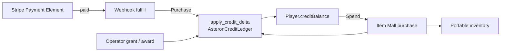

# Item Mall Architecture

Authoritative mental model for **real-money → AsteronCredits → Item Mall** —
credit packs, the AC ledger, Mall listings over item definitions, and the
in-play storefront. Operator setup steps live in
[Payments and the Item Mall](../server-console/payments); this doc owns the
**permanent decisions** agents must not work around.

Related: [Content delivery](./content-delivery) (packs / listings = live
catalog), [HaloBand](./haloband) (Mall tab = play surface),
[Stripe](./stripe) (in-game Payment Element; not hosted Checkout pages),
[Player](./player) (consumables / medicine after purchase),
[Multiplayer](./multiplayer) (balances and inventory mutate on the server),
[API reference](../server-console/api-reference) (route table).

**This doc is law.** Code may lag on sellable types, gameplay awards, or
offline preview. Gaps are refactor targets — not permission to grant AC from
checkout redirects, merge ARC with AC, or `UPDATE creditBalance` outside the
ledger.

## Permanent decision: two currencies, one mall spend sink

| Currency | Column | How it enters | How it leaves |
| --- | --- | --- | --- |
| **ARC** | `Player.arcBalance` | Gameplay, starter grants | Station shops, ships, props, hangar build |
| **AsteronCredits (AC)** | `Player.creditBalance` | Stripe purchase (webhook), operator grant / award | **Item Mall only** |

Real-money value must never become farmable soft currency. Mall prices stay
independent of the ARC economy. Do not let station shops accept AC or the
Mall accept ARC.

### What this rejects

- Granting AC on `create_checkout`, success redirect, client confirm, or poll
  alone.
- Updating `creditBalance` without `apply_credit_delta` + ledger row +
  idempotency key.
- Spending AC outside the Item Mall (or spending ARC inside it).
- Touching raw card numbers in engine code — pay UI is Stripe Elements
  ([Stripe](./stripe)).
- Returning raw Stripe secrets to any client (masked `sk_••••` only;
  publishable `pk_` is the client credential).
- Treating Mall listings as Build Web project files — they are Postgres
  catalog ([Content delivery](./content-delivery)).
- Widening sellable item types on the Console alone — server allowlist and
  Console picker must move together.

## Surfaces

| Surface | Owns |
| --- | --- |
| **Server Console → Commerce** | Payments (Stripe config), Credit Packs, Item Mall listings, Purchases log, per-user grant + ledger |
| **Postgres** | `CreditPack`, `MallListing`, `CreditPurchase`, `AsteronCreditLedger`, `PaymentProvider`, `Player.creditBalance` |
| **Player REST** | `GET /game/mall`, `POST /game/mall/purchase`, `GET /payments/packs`, `POST /payments/checkout`, purchase poll, Stripe webhook |
| **HaloBand Mall tab** | Browse listings + packs, start checkout, poll balance, buy with AC |
| **Domain types** | `src/player/mall/types.ts` — pure shapes / normalize / client-side block reasons |

Offline / editor Play without a live bootstrap **hides** the Mall tab (no
fake storefront). Menu Manager HaloBand preview likewise omits mall wiring.

## Credit packs (real money → AC)

A **CreditPack** is an operator-curated real-money bundle (`credits` +
`bonusCredits` → `totalCredits`, `priceCents`, optional `stripePriceId`).

How the player **pays** (HaloBand wallet: default card or Payment Element,
saved `pm_…`, purchase history — not hosted redirect as product path) is
[Stripe](./stripe). How credits **land**:

1. HaloBand → buy pack → authenticated checkout creates a pending purchase
   and a Stripe session (target: Elements; baseline: hosted URL).
2. Stripe fires webhook → server verifies HMAC on **raw body** →
   `fulfill_checkout` → `apply_credit_delta(Purchase)` keyed on Stripe event
   id (replays are no-ops).
3. Client polls purchases / mall so the UI catches up — poll is display only.

`checkoutEnabled` false (no Stripe) → packs UI says purchases unavailable;
do not show dead Buy buttons that pretend to work.

Refunds / disputes (`charge.refunded`, `charge.dispute.created`) reverse
granted AC through the same ledger; balance clamps at zero with the requested
vs applied delta recorded.

## Item Mall (AC → inventory / props)

The Mall storefront is curated in Server Console and browsed in HaloBand.
Listings spend **AsteronCredits** and grant durable ownership (inventory
stacks and/or placeable entitlements).

### Listing shapes

| Shape | Grants | Notes |
| --- | --- | --- |
| **Single item** | One `ItemDefinition` (quantity / stack rules) | Baseline `MallListing` today |
| **Outfit pack** | **One or more** wearable / backpack `ItemDefinition`s in a single AC purchase | Bundle SKU — e.g. full suit; still one listing price |
| **Placeable** | Quantity of one `PropDefinition` into **building inventory** | Same pool Build Mode uses to place in habs / hangars |

- Delist / hide never deletes the underlying definition or its ARC shop price.
- Same item may sell for ARC at a station shop and for AC in the mall.
- Listing fields that matter: price (AC), storefront category, hold limit,
  featured, live, sort order; packs carry an ordered list of definition ids.

Player flow (all shapes):

1. `GET /game/mall` → active listings + `creditBalance` (grouped for UI).
2. `POST /game/mall/purchase` `{ listingId, quantity? }` in one transaction:
   lock balance → validate listing → `apply_credit_delta(Spend)` → grant
   inventory and/or **building inventory** → return new balance + state.
3. HaloBand refreshes from the response. Client may disable buttons early;
   **server remains authority**.

### Storefront categories (law)

HaloBand Mall browses by **top-level category**, then (for outfits) the same
slot tabs as station **Outfitters**:

| Top-level | What players buy |
| --- | --- |
| **Consumables** | Food, drink, medicine, other `consumable` items |
| **Outfits** | Wearables + backpacks; slot tabs below |
| **Placeables** | Hab / hangar build props → **building inventory** |

**Outfits** slot tabs (shared with Outfitters — do not invent a second
taxonomy):

| Tab id | Player-facing label (examples) |
| --- | --- |
| `head` | Head / Helmet |
| `torso` | Torso / Body |
| `arms` | Arms / Shoulders |
| `legs` | Legs |
| `feet` | Feet |
| `back` | Back (backpacks) |

Players buy **single pieces** under a tab (helmet, body, shoulders, legs, …)
or an **outfit pack** that lands multiple pieces in one purchase. Packs should
still appear under Outfits (and may show which slots they fill). Station
Outfitters remain the **ARC** walk-up vendor; Mall is the **AC** personal
device store — same slot language, different currency.

**Placeables:** Mall spends AC and adds the purchased `PropDefinition` into
the player’s **building inventory** (prop id + quantity) — the same stock
Build Mode already uses. From that inventory the player places props in
**habs and hangars**. Do not invent a second “mall-only” prop stash; do not
dump placeables into portable `PlayerItem` inventory. ARC hangar/apartment
prop purchase paths may still exist; Mall is the AC intake into that same
building inventory. Cap / max-per-space rules stay on `PropDefinition` and
placement, not a separate Mall fiction.

### Sellable allowlists

| Catalog | Allowed in Mall (law) | Baseline today |
| --- | --- | --- |
| `ItemDefinition` | `consumable`, `clothing`, `armor`, `backpack` (and outfit **packs** of those) | `consumable` only |
| `PropDefinition` | Hab / hangar placeables | Not mall-wired |

Server allowlist (`SELLABLE_ITEM_TYPES` in `mall.rs`) and Console picker
(`MALL_SELLABLE_ITEM_TYPES` in `defaults.ts`) must move **together**. Pack
and placeable listing shapes need matching Console + purchase validation —
operators must not create a listing purchase would reject.

Quantity cap per request (`MAX_PURCHASE_QUANTITY`, today 99) applies to
stackable singles; unique gear / packs follow owned-copy rules like Outfitters
(already owned → cannot buy again unless product says otherwise).

## Ledger chokepoint

**`payments::ledger::apply_credit_delta` is the only legal mutation of
`Player.creditBalance`.**

| Reason (conceptual) | Source |
| --- | --- |
| Purchase | Stripe webhook fulfillment |
| Spend | Mall purchase |
| Grant | Operator support / manual refund |
| Award | Operator promo / (later) gameplay prize |
| Refund / dispute | Stripe webhook reverse |

Every call writes one append-only `AsteronCreditLedger` row in the same
transaction and carries an idempotency key. Never `UPDATE "creditBalance"`
directly.

## Secrets and config

| Mechanism | Role |
| --- | --- |
| `PAYMENTS_ENCRYPTION_KEY` | AES-256-GCM wrap for DB-stored Stripe secrets |
| Console **Commerce → Payments** | Store masked secret + webhook secret when env unset; publishable key for Elements ([Stripe](./stripe)) |
| `STRIPE_SECRET_KEY` / `STRIPE_WEBHOOK_SECRET` | Env overrides; **env always wins** |

Catalog sync may promote packs / listings between environments but must **not**
copy `stripePriceId` secrets / `PaymentProvider` ciphertext as casual catalog
rows — payment provider config stays environment-local.

## Ownership

| Concern | Layer |
| --- | --- |
| AC balance + ledger | `backend/.../payments/ledger.rs` |
| Stripe session + webhook | `backend/.../payments/` |
| Mall list + purchase | `backend/.../mall.rs` |
| Operator CRUD | `admin_payments.rs` + Server Console Commerce panels |
| Domain shapes | `src/player/mall/types.ts` |
| REST client | `src/net/api.ts` |
| Play UI | `haloband-mall.ts` via HaloBand callbacks |
| Play wiring | `createPlayMallCallbacks` in play-session overlays |

Client never invents balance. HaloBand never owns commerce outcomes.

## Multiplayer / authority

Mall and payments are **REST + Postgres**, not cell tick. Still:

- Peers do not need to see your Mall UI.
- Inventory granted by mall purchase is the same portable inventory peers may
  eventually see equipped ([Multiplayer](./multiplayer) character
  presentation) — grant path stays server-side.
- Do not “optimistically” add AC or items locally and reconcile later.

## Invariants

- ARC ≠ AC; AC spends only in Item Mall.
- Money AC grants: Stripe webhook fulfillment only.
- All AC mutations: `apply_credit_delta` + ledger + idempotency.
- Webhook: verify signature on raw bytes before JSON parse.
- MallListing layers catalog definitions (item, outfit pack, or placeable);
  delist ≠ delete definition.
- Sellable allowlists: server ↔ Console in lockstep; outfits use Outfitters
  slot tabs; placeables are a Mall category.
- Packs / listings / payment config = live catalog per environment.
- HaloBand Mall tab only when live mall wiring exists.
- Card data never enters engine code as PAN — Stripe Elements iframe
  ([Stripe](./stripe)).
- Refund / dispute reverse via ledger; balance ≥ 0.

## Baseline vs law (today)

| Piece | Baseline | Law |
| --- | --- | --- |
| Two currencies | Live | Same |
| Ledger chokepoint | Live | Same |
| Webhook-only purchase grant | Live | Same |
| Credit packs + Console CRUD | Live | Same; pay UI → [Stripe](./stripe) |
| Mall listings + purchase | Live | Same |
| HaloBand Mall tab | Live online; hidden offline | Same |
| Sellable types | `consumable` only | Consumables + outfits (pieces + packs) + placeables |
| Outfit categories | N/A | Same slots as Outfitters (`head`…`back`) |
| Outfit packs | Absent | One AC SKU → multiple item defs |
| Placeables in Mall | Absent (ARC build purchase) | AC → same building inventory → place in hab/hangar |
| `CreditReason::Award` gameplay | Admin UI only; no game caller | Optional later prize path through ledger |
| Menu Manager mall preview | No wiring | Optional mock; never fake grants |
| Catalog sync of Stripe secrets | Refused / env-local | Keep refused |

## Key files (today)

| Path | Role |
| --- | --- |
| `backend/crates/server/src/mall.rs` | List / purchase; sellable allowlist |
| `backend/crates/server/src/payments/ledger.rs` | `apply_credit_delta` |
| `backend/crates/server/src/payments/routes.rs` | Packs, checkout, webhook |
| `backend/crates/server/src/admin_payments.rs` | Operator packs / mall / grant |
| `backend/migrations/0018_asteron_credits.sql` | Schema + seed packs / listings |
| `src/player/mall/types.ts` | Client domain types |
| `src/net/api.ts` | Player mall / payments clients |
| `src/render/effects/hud/haloband-mall.ts` | Storefront UI |
| `src/editor/react/panels/server/MallPanel.tsx` | Console listings |
| `src/editor/react/panels/server/defaults.ts` | `MALL_SELLABLE_ITEM_TYPES` |

## Open / later

- Widen allowlists + Console pickers for `clothing` / `armor` / `backpack`;
  outfit pack listing schema (`itemDefinitionIds[]` or equivalent).
- HaloBand Mall category chrome (Consumables / Outfits / Placeables) and
  Outfitters-matching slot tabs.
- `PropDefinition` mall listing + purchase → increment **building inventory**;
  Build Mode places those props in habs / hangars.
- Gameplay `Award` callers (events, seasons) still through the ledger.
- Optional Menu Manager mock mall for art direction (display only).
- Cross-env catalog promote rules for packs without leaking Stripe price
  secrets (already guarded — keep guarded).

Operator walkthrough: [Payments and the Item Mall](../server-console/payments).
Payment Element / session UI: [Stripe](./stripe).
Outfitters ARC vendor (same slot tabs): [Outfitters](../editor/components/outfitters).
