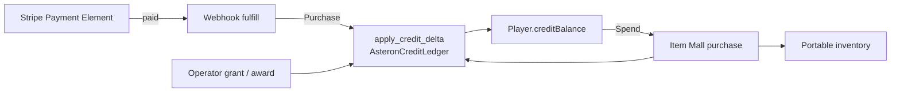

# Item Mall Architecture

Authoritative mental model for **real-money → AsteronCredits → Item Mall** —
credit packs, the AC ledger, Mall listings over item definitions, and the
in-play storefront. Operator setup steps live in
[Payments and the Item Mall](../server-console/payments); this doc owns the
**permanent decisions** agents must not work around.

Related: [Content delivery](./content-delivery) (packs / listings = live
catalog), [HaloBand](./haloband) (Mall tab = play surface),
[Stripe](./stripe) (in-game Payment Element; not hosted Checkout pages),
[Player](./player) (consumables / medicine after purchase),
[Multiplayer](./multiplayer) (balances and inventory mutate on the server),
[API reference](../server-console/api-reference) (route table).

**This doc is law.** Code may lag on sellable types, gameplay awards, or
offline preview. Gaps are refactor targets — not permission to grant AC from
checkout redirects, merge ARC with AC, or `UPDATE creditBalance` outside the
ledger.

## Permanent decision: two currencies, one mall spend sink

| Currency | Column | How it enters | How it leaves |
| --- | --- | --- | --- |
| **ARC** | `Player.arcBalance` | Gameplay, starter grants | Station shops, ships, props, hangar build |
| **AsteronCredits (AC)** | `Player.creditBalance` | Stripe purchase (webhook), operator grant / award | **Item Mall only** |

Real-money value must never become farmable soft currency. Mall prices stay
independent of the ARC economy. Do not let station shops accept AC or the
Mall accept ARC.

### What this rejects

- Granting AC on `create_checkout`, success redirect, client confirm, or poll
  alone.
- Updating `creditBalance` without `apply_credit_delta` + ledger row +
  idempotency key.
- Spending AC outside the Item Mall (or spending ARC inside it).
- Touching raw card numbers in engine code — pay UI is Stripe Elements
  ([Stripe](./stripe)).
- Returning raw Stripe secrets to any client (masked `sk_••••` only;
  publishable `pk_` is the client credential).
- Treating Mall listings as Build Web project files — they are Postgres
  catalog ([Content delivery](./content-delivery)).
- Widening sellable item types on the Console alone — server allowlist and
  Console picker must move together.

## Surfaces

| Surface | Owns |
| --- | --- |
| **Server Console → Commerce** | Payments (Stripe config), Credit Packs, Item Mall listings, Purchases log, per-user grant + ledger |
| **Postgres** | `CreditPack`, `MallListing`, `CreditPurchase`, `AsteronCreditLedger`, `PaymentProvider`, `Player.creditBalance` |
| **Player REST** | `GET /game/mall`, `POST /game/mall/purchase`, `GET /payments/packs`, `POST /payments/checkout`, purchase poll, Stripe webhook |
| **HaloBand Mall tab** | Browse listings + packs, start checkout, poll balance, buy with AC |
| **Domain types** | `src/player/mall/types.ts` — pure shapes / normalize / client-side block reasons |

Offline / editor Play without a live bootstrap **hides** the Mall tab (no
fake storefront). Menu Manager HaloBand preview likewise omits mall wiring.

## Credit packs (real money → AC)

A **CreditPack** is an operator-curated real-money bundle (`credits` +
`bonusCredits` → `totalCredits`, `priceCents`, optional `stripePriceId`).

How the player **pays** (HaloBand wallet: default card or Payment Element,
saved `pm_…`, purchase history — not hosted redirect as product path) is
[Stripe](./stripe). How credits **land**:

1. HaloBand → buy pack → authenticated checkout creates a pending purchase
   and a Stripe session (target: Elements; baseline: hosted URL).
2. Stripe fires webhook → server verifies HMAC on **raw body** →
   `fulfill_checkout` → `apply_credit_delta(Purchase)` keyed on Stripe event
   id (replays are no-ops).
3. Client polls purchases / mall so the UI catches up — poll is display only.

`checkoutEnabled` false (no Stripe) → packs UI says purchases unavailable;
do not show dead Buy buttons that pretend to work.

Refunds / disputes (`charge.refunded`, `charge.dispute.created`) reverse
granted AC through the same ledger; balance clamps at zero with the requested
vs applied delta recorded.

## Item Mall (AC → inventory)

A **MallListing** is a **layer** over an existing `ItemDefinition`:

- Delist / hide never deletes the item or changes its ARC shop price.
- Same item may sell for ARC at a station and for AC in the mall.
- Fields that matter: price (AC), category, hold limit per player (`0` /
  null = unlimited), featured, live, sort order.

Player flow:

1. `GET /game/mall` → active listings + `creditBalance`.
2. `POST /game/mall/purchase` `{ listingId, quantity }` in one transaction:
   lock balance → validate listing / type / stack / hold limit →
   `apply_credit_delta(Spend)` → add inventory → return new balance +
   inventory.
3. HaloBand refreshes from the response. Client
   `mallPurchaseBlockedReason` may disable buttons early; **server remains
   authority**.

### Sellable types

Phase one: **`consumable` only** (`SELLABLE_ITEM_TYPES` in `mall.rs`, mirrored
by `MALL_SELLABLE_ITEM_TYPES` in Console `defaults.ts`). Widening is an
explicit product change — update **both** allowlists together. Operators
must not be able to create a listing the purchase endpoint would reject.

Quantity cap per request (`MAX_PURCHASE_QUANTITY`, today 99) prevents a
fat-finger drain.

## Ledger chokepoint

**`payments::ledger::apply_credit_delta` is the only legal mutation of
`Player.creditBalance`.**

| Reason (conceptual) | Source |
| --- | --- |
| Purchase | Stripe webhook fulfillment |
| Spend | Mall purchase |
| Grant | Operator support / manual refund |
| Award | Operator promo / (later) gameplay prize |
| Refund / dispute | Stripe webhook reverse |

Every call writes one append-only `AsteronCreditLedger` row in the same
transaction and carries an idempotency key. Never `UPDATE "creditBalance"`
directly.

## Secrets and config

| Mechanism | Role |
| --- | --- |
| `PAYMENTS_ENCRYPTION_KEY` | AES-256-GCM wrap for DB-stored Stripe secrets |
| Console **Commerce → Payments** | Store masked secret + webhook secret when env unset; publishable key for Elements ([Stripe](./stripe)) |
| `STRIPE_SECRET_KEY` / `STRIPE_WEBHOOK_SECRET` | Env overrides; **env always wins** |

Catalog sync may promote packs / listings between environments but must **not**
copy `stripePriceId` secrets / `PaymentProvider` ciphertext as casual catalog
rows — payment provider config stays environment-local.

## Ownership

| Concern | Layer |
| --- | --- |
| AC balance + ledger | `backend/.../payments/ledger.rs` |
| Stripe session + webhook | `backend/.../payments/` |
| Mall list + purchase | `backend/.../mall.rs` |
| Operator CRUD | `admin_payments.rs` + Server Console Commerce panels |
| Domain shapes | `src/player/mall/types.ts` |
| REST client | `src/net/api.ts` |
| Play UI | `haloband-mall.ts` via HaloBand callbacks |
| Play wiring | `createPlayMallCallbacks` in play-session overlays |

Client never invents balance. HaloBand never owns commerce outcomes.

## Multiplayer / authority

Mall and payments are **REST + Postgres**, not cell tick. Still:

- Peers do not need to see your Mall UI.
- Inventory granted by mall purchase is the same portable inventory peers may
  eventually see equipped ([Multiplayer](./multiplayer) character
  presentation) — grant path stays server-side.
- Do not “optimistically” add AC or items locally and reconcile later.

## Invariants

- ARC ≠ AC; AC spends only in Item Mall.
- Money AC grants: Stripe webhook fulfillment only.
- All AC mutations: `apply_credit_delta` + ledger + idempotency.
- Webhook: verify signature on raw bytes before JSON parse.
- MallListing layers ItemDefinition; delist ≠ delete item.
- Sellable types: server allowlist ↔ Console picker in lockstep.
- Packs / listings / payment config = live catalog per environment.
- HaloBand Mall tab only when live mall wiring exists.
- Card data never enters engine code as PAN — Stripe Elements iframe
  ([Stripe](./stripe)).
- Refund / dispute reverse via ledger; balance ≥ 0.

## Baseline vs law (today)

| Piece | Baseline | Law |
| --- | --- | --- |
| Two currencies | Live | Same |
| Ledger chokepoint | Live | Same |
| Webhook-only purchase grant | Live | Same |
| Credit packs + Console CRUD | Live | Same; pay UI → [Stripe](./stripe) |
| Mall listings + purchase | Live | Same |
| HaloBand Mall tab | Live online; hidden offline | Same |
| Sellable types | `consumable` only | Widen only with product + both allowlists |
| `CreditReason::Award` gameplay | Admin UI only; no game caller | Optional later prize path through ledger |
| Menu Manager mall preview | No wiring | Optional mock; never fake grants |
| Catalog sync of Stripe secrets | Refused / env-local | Keep refused |

## Key files (today)

| Path | Role |
| --- | --- |
| `backend/crates/server/src/mall.rs` | List / purchase; sellable allowlist |
| `backend/crates/server/src/payments/ledger.rs` | `apply_credit_delta` |
| `backend/crates/server/src/payments/routes.rs` | Packs, checkout, webhook |
| `backend/crates/server/src/admin_payments.rs` | Operator packs / mall / grant |
| `backend/migrations/0018_asteron_credits.sql` | Schema + seed packs / listings |
| `src/player/mall/types.ts` | Client domain types |
| `src/net/api.ts` | Player mall / payments clients |
| `src/render/effects/hud/haloband-mall.ts` | Storefront UI |
| `src/editor/react/panels/server/MallPanel.tsx` | Console listings |
| `src/editor/react/panels/server/defaults.ts` | `MALL_SELLABLE_ITEM_TYPES` |

## Open / later

- Widen `SELLABLE_ITEM_TYPES` (weapons, wearables, …) with product + both
  allowlists.
- Gameplay `Award` callers (events, seasons) still through the ledger.
- Richer Mall UX (categories, featured rail, purchase confirm).
- Optional Menu Manager mock mall for art direction (display only).
- Cross-env catalog promote rules for packs without leaking Stripe price
  secrets (already guarded — keep guarded).

Operator walkthrough: [Payments and the Item Mall](../server-console/payments).
Payment Element / session UI: [Stripe](./stripe).
