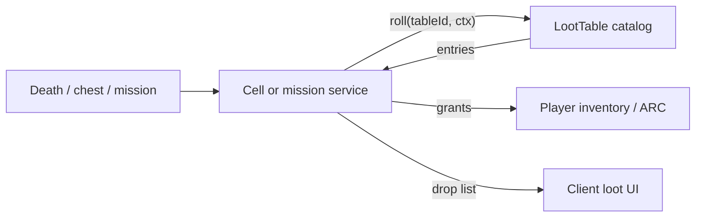

# Loot Table Architecture

Authoritative mental model for **loot tables** — reusable weighted drop
definitions that the server rolls when something pays out items (or small ARC).
Primary consumers: [Mobs](./mobs) on death, world chests / salvage, optional
mission reward packs, and [Harvesting](./harvesting) node / asteroid yields.
This is a **web** MMO with authoritative cells.

Related: [Mobs](./mobs) (death rolls), [Missions](./missions) (may reference
tables for item packs), [Harvesting](./harvesting) (yieldTableId),
[Content delivery](./content-delivery) (tables = catalog),
[Item Mall](./item-mall) (AC shop ≠ loot), [Multiplayer](./multiplayer)
(who may claim), [Progression](./progression) (level gates on entries),
[Factions](./factions) (NPC guild / standing gates),
[Organizations](./organizations) (player Orgs — orthogonal).

**This doc is law.** Code may lag (no `LootTable` rows yet). Gaps are refactor
targets — not permission to spawn drops on the client, embed loot JSON in every
prefab, or treat Mall purchases as loot rolls.

## Permanent decisions

### 1. One table format, many callers

A **`LootTable`** is a catalog row. Callers pass `lootTableId` + roll context
(player id, cell, source entity id, seed). The **same** table shape serves mobs,
chests, salvage cans, mission “loot pack” rewards, and [harvest](./harvesting)
node / asteroid yields.

Do not invent a second drop DSL per feature.

### 2. Server rolls; client shows

RNG and grant happen on the **cell / mission service**. Client may play VFX and
show a loot pane from the **authoritative drop list**. Client-local `Math.random`
never creates inventory.

### 3. Personal loot by default (co-op friendly)

When a mob dies in shared space, each eligible participant gets a **personal
roll** (or a personal claim window on a shared roll list) — peers do not
need-greed fight over every scrap by default.

| Mode | When |
| --- | --- |
| **Personal** (default) | Each credited killer / assister gets their own roll results |
| **Shared corpse** (opt-in per table / encounter) | One pile; first-claimer or party rules — explicit flag only |
| **Solo instance** | Same personal path; no peers |

Credit eligibility uses the same assist / tag rules as [Mobs](./mobs) /
[Missions](./missions). No credit → no roll.

### 4. Tables live in catalog; contents are item ids

| Piece | Surface |
| --- | --- |
| `LootTable` + entries | Live catalog (Server Console) |
| Item / prop / currency grant targets | Catalog ids (`itemDefinitionId`, optional ARC amount) |
| Who drops what | `MobDefinition.lootTableId`, chest component → table id, mission reward → table id |
| Meshes / icons | Project assets via item defs → Build Web |

Never embed full drop lists in prefab JSON when a `lootTableId` exists.

## What this rejects

- Client-authored drop lists as truth.
- Paying **AsteronCredits** from loot (ARC soft drops OK in tiny amounts;
  AC never).
- Unbounded nested table recursion.
- One global FFA corpse as the only mode in public PVE.
- Duplicating the same 20 entries on every mob instead of shared tables /
  nested refs.

## Table model

### `LootTable` (catalog)

| Field (conceptual) | Meaning |
| --- | --- |
| `id` | Stable id |
| `name` / `description` | Operator UX |
| `maxRolls` | How many **independent** entry picks this table attempts (default 1) |
| `guaranteedEntries[]` | Always grant (ignore weight) |
| `entries[]` | Weighted / chance pool |
| `nestedTableIds[]` | Optional child tables rolled after / as picks |
| `claimMode` | `personal` \| `shared` (default personal) |
| `despawnSeconds` | Corpse / bag lifetime when shared |

### Entry

| Field | Meaning |
| --- | --- |
| `weight` | Relative weight inside the pool (integer ≥ 0) |
| `chance` | Optional absolute 0..1 gate before weight pick (or use weight-only) |
| `itemDefinitionId` | Item grant (omit if ARC-only or nested) |
| `qtyMin` / `qtyMax` | Inclusive stack range |
| `arcMin` / `arcMax` | Optional soft-currency sprinkle (keep tiny) |
| `nestedLootTableId` | Roll another table instead of / in addition to item |
| `minPlayerLevel` / `maxPlayerLevel` | Gate vs [Progression](./progression) |
| `minReputation` | `{ factionId, standing }` — [Factions](./factions) |
| `uniqueOnce` | At most one of this entry per roll session |
| `rare` | UI tag only (does not change math) |

**Pick algorithm (weight pool):** among entries that pass gates, pick
proportional to `weight`. Repeat up to `maxRolls` (with or without replacement —
table flag `withReplacement`, default true for trash, false for unique rares).

**Guaranteed** entries always apply first, then weighted rolls.

### Nesting

Child tables share the same roller. Cap depth (law: **≤ 3**). Cycle detection
required. Prefer shallow composition (“common salvage” + “wildlife organ”) over
deep trees.

## Roll context

Every roll carries:

| Input | Use |
| --- | --- |
| `playerId` | Grant target + personal bag |
| `sourceKind` / `sourceId` | Mob entity, chest id, mission completion id |
| `idempotencyKey` | `sourceId + playerId + tableId + ordinal` — replays no-op |
| `rngSeed` | Server seed (cell tick / hash); never client |
| `playerLevel` | Entry gates |
| `reputationSnapshot` | Entry gates |

## Claim UX

| Path | Behavior |
| --- | --- |
| **Auto-loot** (default for personal trash) | Grants straight to inventory if space; overflow → personal bag entity |
| **Loot pane** | Player opens bag / corpse UI; Take / Take All |
| **Full inventory** | Leave in bag until space or despawn; do not delete silently without log |

Shared mode: one world bag; claim intents are server-validated (range +
eligibility).

## ARC and AC

- Small **ARC** on entries is allowed (pocket change).
- **Never** grant AsteronCredits from loot ([Item Mall](./item-mall)).
- Mission pay ARC stays on the mission reward path; loot tables are for
  **item-shaped** (and tiny ARC) drops — a mission may call a table for items
  *and* pay ARC separately.

## Ownership

| Concern | Layer |
| --- | --- |
| Table CRUD | Server Console + catalog |
| Roll execution | Cell (combat / chest) or mission service |
| Inventory grant | Inventory APIs (same as shops / mission items) |
| ARC sprinkle | Soft-currency path (not AC ledger) |
| Presentation | Client loot UI / VFX |
| Who references tables | MobDef, chests, mission rewards |

## Invariants

- Server RNG + idempotent grants.
- Personal loot default in shared PVE.
- Catalog tables; id references only.
- Nesting depth capped.
- No AC from loot.
- Entry gates may read level / reputation — roller still server-side.

## Open / later

- First Console CRUD + seed tables for starter wildlife.
- Need/greed / master-looter as optional party flags (not default).
- Conditioned drops (event weeks) via table variants, not client hacks.
- Salvage multiplayer tools sharing one wreck table.

## See also

- [Mobs](./mobs)
- [Missions](./missions)
- [Progression](./progression)
- [Factions](./factions)
- [Organizations](./organizations)
- [Harvesting](./harvesting)
- [Content delivery](./content-delivery)
