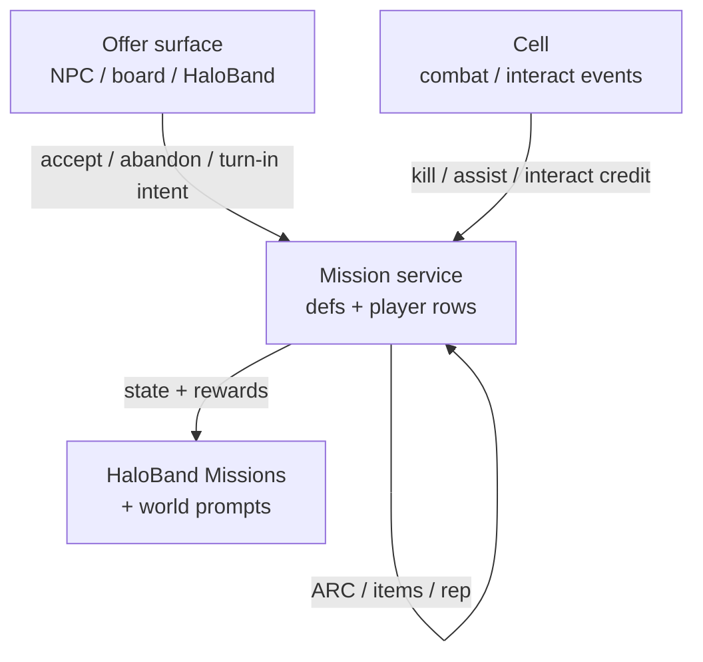
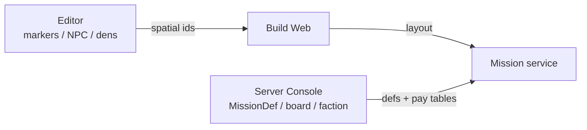
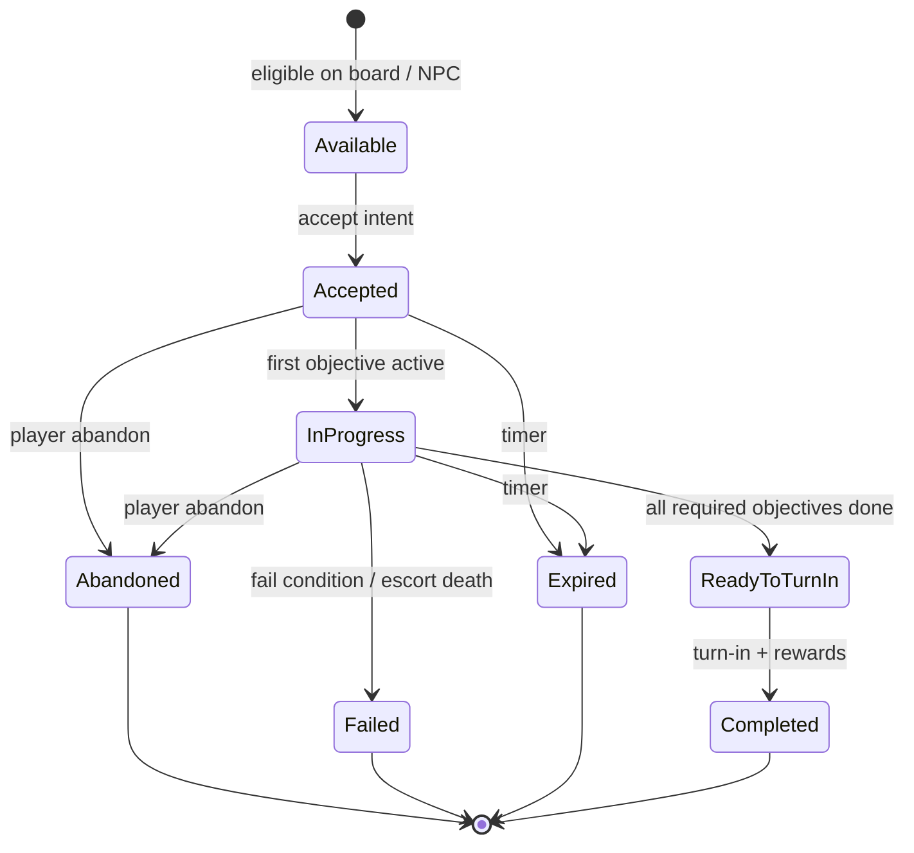
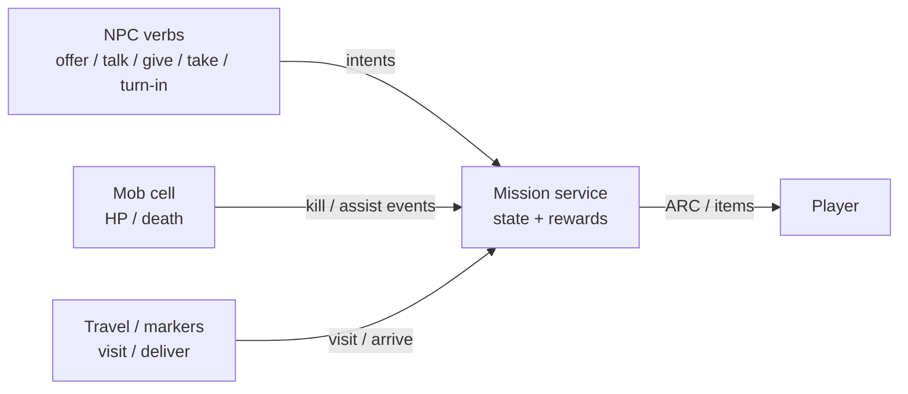

# Mission Architecture

Authoritative mental model for **missions** (also called **contracts**) —
accept, track, complete, and get paid for work in the world. Product shape is
**traditional MMO quests plus station contract boards**: deliver, fight,
investigate, escort, recover, talk chains — with soft-currency pay, item
rewards, and later reputation.

This is a **web** game (TypeScript + Three.js / WebGPU, Rapier, authoritative
cells).

Related: [NPCs](./npc) (offer / talk / give / take / turn-in verbs),
[Mobs](./mobs) (kill / escort creatures; cell combat),
[HaloBand](./haloband) (Missions tab = log UI only),
[Multiplayer](./multiplayer) (cell events → mission credit),
[Star Map](./star-map) (mission markers on the ecliptic),
[Content delivery](./content-delivery) (mission defs as live catalog),
[Item Mall](./item-mall) (**AC ≠ mission pay**),
[Factions](./factions) (NPC join / rank gates + rewards),
[Organizations](./organizations) (player crews — orthogonal),
[Progression](./progression) (mission XP),
[Loot tables](./loot-tables) (optional item pack rolls),
[Harvesting](./harvesting) (gather / deliver materials from nodes / mining),
[Character combat](./character-combat) (kill credit via cell hit events),
[Player](./player) / [Player death](./player-death) (fail / abandon while dead),
[Game loop](./game-loop) / [Space traversal](./space-traversal) (travel to
objectives).

**This doc is law.** Code may lag (HaloBand Missions stub; no mission tables
yet). Gaps are refactor targets — not permission to grant rewards on the
client, to pay **AsteronCredits** for contracts, or to fold mission state into
NPC ambient sims or mob AI.

## Permanent decisions

### 1. Mission state is server-owned

Accept, progress, fail, abandon, expire, and **reward grants** are backend
outcomes (mission service + cell events). Client owns UI, map markers, and
cosmetic prompts only.

HaloBand **Missions** never mutates progress itself ([HaloBand](./haloband)).
NPC dialogue never grants pay on click alone ([NPCs](./npc)).

### 2. Pay is ARC (and items / reputation) — never AC

| Reward | Currency / asset | Rule |
| --- | --- | --- |
| **Contract pay** | **ARC** | Soft currency; same wallet as station shops |
| **Item grants** | Inventory items / keys / gear | Catalog `itemDefinitionId`s; server grant |
| **Reputation** | Faction standing (when live) | Server delta; never client trust |
| **AsteronCredits (AC)** | — | **Forbidden** as mission reward |

Real-money value must not become farmable. Missions feed the **ARC** economy
and gear loop — not the Item Mall ([Item Mall](./item-mall)).

Optional later: unlock flags, title strings, ship/prop grants via catalog ids —
still server-side, still not AC.

### 3. Defs live in catalog; places live in the project

Same three-surface split as [Content delivery](./content-delivery) / [Mobs](./mobs).

| Piece | Surface | Who edits |
| --- | --- | --- |
| **MissionDefinition** (type, objectives template, pay, rewards, timers, faction, prerequisites) | Live catalog | Server Console `/admin/*` |
| **MissionBoard** / pool / rotation (which defs available where) | Live catalog | Server Console |
| **Faction** / reputation rows | Live catalog | Server Console |
| **Star Map mission markers** (ecliptic pose, link `missionDefinitionId` or objective tag) | Project system doc | AsteronEngine Star Map |
| **NPC offer / turn-in / objective tags** on `npc-placement` | Prefab / scene | Editor |
| **Combat dens** for kill objectives | Editor dens → `packId` | Editor + mob catalog ([Mobs](./mobs)) |
| **Instance layouts** (private ambush / delivery drop) | Scenes / prefabs | Editor → Build Web |

Defs store **ids** (NPC placement ids, marker ids, pack ids, item ids) — not
embedded quest novels or full loot JSON.

### 4. MMO verbs + station contract surfaces

Classic MMO **objective verbs** ([NPCs](./npc)): offer / accept, talk-to,
give-to, take-from, turn-in, plus kill / escort / visit / deliver that touch
[Mobs](./mobs) and travel.

**Offer surfaces:** walk-up NPC, station **mission board**
(kiosk), and HaloBand contract browser (read + accept when in range / eligible).
One state machine behind all surfaces.

## What this rejects

- Client-authoritative complete / reward (“I finished locally, sync later”).
- Paying **AsteronCredits** (or Stripe) for finishing a contract.
- Embedding full mission scripts only in prefab JSON with no catalog row.
- Using ambient NPC crowd ids as durable objective targets.
- Private client-only boss/kill progress in a public shared space (same fight =
  shared cell; credit rules are server — [Mobs](./mobs), [Multiplayer](./multiplayer)).
- HaloBand as the authority for quest log truth.
- Ship Combat dogfight scores as mission complete without an explicit mission
  objective type (ship PVE contracts are a later extension).

## Contract types (product taxonomy)

Types are **catalog enums** (or tags). A single `MissionDefinition` has one
primary type for UI filters; objectives inside may mix verbs.

| Type | Player fantasy | Typical objectives | Notes |
| --- | --- | --- | --- |
| **Delivery / courier** | Haul package A → B | Take item → travel → give-to / drop-off marker | Illegal variant = higher ARC + risk later |
| **Hauling** | Multi-box / cargo mass | Pickup volume → destination | May need ship cargo when that systems lands |
| **Mercenary / clear** | Clear hostiles | Kill N / clear den / survive wave | Hooks [Mobs](./mobs) |
| **Bounty** | Named target | Kill tagged mob or scripted hostile | Open-world or instance |
| **Investigation** | Go look | Visit / scan / interact at POI or marker | Often chains into combat or recovery |
| **Recovery / salvage** | Retrieve goods | Reach site → take item → return | POI / wreck dens |
| **Escort** | Protect asset | Escort NPC / beacon through threats | Mob ambushes; fail on escort death |
| **Gather / harvest** | Collect materials | Loot / gather N items | Prefer catalog items, not fake counters |
| **Talk / social** | Lore / intro | Talk-to chain across NPCs | Soft pay or unlock; still server flags |
| **Rescue / SAR** | Extract person or beacon | Reach → interact → return / defend | Later |
| **Race / timed trial** | Beat clock | Reach gates / finish line | Optional; not required for MVP |

**MVP slice (recommended):** Delivery, Mercenary/clear, Talk chain, Visit /
investigation, Recovery. Add bounty / escort / haul when mobs + cargo exist.

Ship-only contracts (bounty in space, quantum escort) stay **out of scope**
until ship combat + contacts can emit mission events — then extend this doc,
do not overload on-foot types silently.

## Objectives

Each mission has an ordered or parallel **objective list**. Progress is
idempotent server counters / flags.

| Objective kind | Completes when | Event source |
| --- | --- | --- |
| `talk-to` | Valid interact with tagged NPC / placement | Cell interact |
| `give-to` | Items transferred to NPC / drop | Cell + inventory |
| `take-from` | Items granted from NPC / crate | Cell + inventory |
| `deliver-item` | Carry item to marker / NPC (may combine take + give) | Cell + inventory |
| `visit` | Enter radius / activate Star Map mission or POI marker | Cell presence / interact |
| `kill` | Kill count / tagged target dead (assist rules apply) | Mob death events |
| `clear-den` | Den pack wiped or boss phase done | Mob / dens |
| `escort` | Escort reaches end without fail condition | Cell escort sim |
| `survive` | Timer while conditions hold | Cell |
| `craft-or-own` | Inventory contains item(s) | Inventory service |
| `turn-in` | Final interact at giver / board | Mission service |

Rules:

1. Client may show progress optimistically from replicated state; **server
   counters win**.
2. Kill / assist credit uses the same server rules as [Mobs](./mobs) (tag,
   damage threshold, last-hit — product-tunable, not client-chosen).
3. Objective targets are **stable ids** (placement id, marker id, mob def id,
   den id) — not ephemeral ambient crowd actors.
4. Multi-step missions may unlock later objectives only after prior ones
   complete (gated stages).

## Lifecycle

| State | Meaning |
| --- | --- |
| **Available** | Shown on board / NPC; not yet on the player |
| **Accepted** | On log; objectives may not have started |
| **InProgress** | At least one objective active |
| **ReadyToTurnIn** | Requirements met; pay pending turn-in (or auto-complete if authored) |
| **Completed** | Rewards granted once (idempotent) |
| **Failed** | Fail condition hit; optional cooldown / reputation penalty later |
| **Abandoned** | Player dropped; optional cooldown |
| **Expired** | Wall-clock or session timer elapsed |

**Auto-complete vs turn-in:** delivery / talk chains usually require turn-in at
a giver or board. Pure kill contracts may auto-complete when the last kill
lands **if** the def sets `autoCompleteOnObjectives`. Default prefer explicit
turn-in so pay UX stays readable.

**Death:** dying does not auto-fail unless the def says so (escort / timed
defend). Respawn continues the contract ([Player death](./player-death)).

## Offer surfaces

| Surface | Role |
| --- | --- |
| **NPC giver** | Dialogue offer / accept / turn-in ([NPCs](./npc)) |
| **Mission board** | Station kiosk / terminal listing available contracts from a board pool |
| **HaloBand Missions** | Personal log: tracked, active, ready-to-turn-in, history; accept when eligible |
| **Star Map marker** | Spatial authorship + in-play blip / route target for an objective — not a second quest DB |

Boards reference **board ids** → pool of `MissionDefinition`s (weighted,
reputation-gated, one-shots). NPCs reference **offer ids** on the same defs.

## Pay and rewards

### Pay table (on `MissionDefinition`)

| Field (conceptual) | Meaning |
| --- | --- |
| `arcReward` | Base ARC on successful complete |
| `arcBonusPerfect` | Optional bonus (no damage to cargo, timer under par) |
| `xpReward` | Character XP on complete ([Progression](./progression)) |
| `itemRewards[]` | `{ itemDefinitionId, qty, chance? }` — or `lootTableId` pack |
| `lootTableId` | Optional [loot table](./loot-tables) roll for item pack |
| `reputationRewards[]` | `{ factionId, delta }` standing and/or faction XP ([Factions](./factions)) |
| `unlockFlags[]` | Server flags / titles |
| `threatTier` | UI + scaling hint (also filters board) |
| `minPlayerLevel` | Soft / hard gate ([Progression](./progression)) |
| `minReputation` / `minFactionRank` | Standing or membership rank ([Factions](./factions)) |
| `requiresFactionMembership` | Must have joined that NPC faction |
| `expiresAfterSeconds` | Optional wall clock after accept |
| `cooldownSeconds` | Re-offer delay after complete / abandon / fail |
| `maxActive` / `repeatable` | One-shot vs daily / repeatable |

Grants run **once** per completion id (idempotent). Prefer a single
`apply_mission_rewards` (or equivalent) that:

1. Credits **ARC** through the soft-currency path used by shops (not
   `apply_credit_delta` / AsteronCredit ledger).
2. Grants items through inventory APIs (and/or loot-table roller).
3. Applies reputation deltas ([Factions](./factions)).
4. Applies XP ([Progression](./progression)).
5. Writes a completion / ledger row for audits and anti-double-claim.

### Risk / reward fantasy

Higher **threat tier** → higher ARC and better item tables — balanced in
Console, not hardcoded in client. Illegal / smuggling tags may add ARC and
fail/criminal hooks later; do not invent a second wallet for “dirty money”
unless product explicitly adds one.

### What players see

- Board / NPC: title, type, threat, ARC range, faction, time limit.
- HaloBand: tracked objective text, progress `3/5`, destination hint, Set Route
  when a Star Map / marker target exists ([HaloBand](./haloband) Map).

## Prerequisites and gating

| Gate | Example |
| --- | --- |
| Reputation / rank min | Faction standing or membership rank ([Factions](./factions)) |
| Faction membership | `requiresFactionMembership` |
| Prior mission | Complete tutorial chain id |
| Min level | `minPlayerLevel` ([Progression](./progression)) |
| Skill / cert (later) | Ship size class for haul |
| Location | Must accept at station X / while in system Y |
| Party size | Optional; default solo-capable |
| Inventory space | Checked at reward time; soft-block turn-in if full |

Failed gates hide or lock the offer on the server response — client filter is
cosmetic.

## Multiplayer

Design with peers from day one ([Multiplayer](./multiplayer)):

| Concern | Law |
| --- | --- |
| **Shared fight** | Kill objectives in public space use cell mobs; peers see the fight |
| **Credit** | Server assist / tag rules decide who gets kill progress |
| **Personal log** | Each player has their own `PlayerMission` row unless the def is a **shared party contract** (explicit flag later) |
| **Turn-in** | Per player by default; each who earned credit may turn in their own accepted copy |
| **Instances** | Some defs spawn a **private / party instance** cell (delivery ambush, boss room). Authored like Hab/Hangar instances — not client-only scenes |
| **Grief** | Do not allow one player to complete another’s personal deliver-item by stealing the quest item without server transfer rules |

Party-shared single reward pool is a later product flag — default is
**personal contracts**, shared world.

## Mission ↔ NPC ↔ Mob bridge

- Townsfolk stay [NPCs](./npc).
- Creatures stay [Mobs](./mobs).
- Only **mission state** bridges them (same diagram spirit as NPC mission
  bridge).

## Authoring model

### Console (catalog)

| Row | Owns |
| --- | --- |
| `MissionDefinition` | Type, stages/objectives template, pay, rewards, timers, gates, auto-complete flag |
| `MissionBoard` | Station / location pool → weighted def ids |
| `Faction` | Display + reputation scale — [Factions](./factions) |
| Game settings | Global caps (max active missions, abandon cooldown defaults) |

### Editor (project)

| Place | Use |
| --- | --- |
| Star Map **Mission** marker | Ecliptic target; links def or objective tag ([Star Map](./star-map)) |
| `npc-placement` offer / turn-in / objective ids | Service NPC hooks ([NPCs](./npc)) |
| Mission board prop / interact | Points at `MissionBoard` id (catalog) |
| Mob dens | Kill / clear targets ([Mobs](./mobs)) |
| POI / instance scenes | Investigation / recovery layouts |

### Runtime resolve

1. Player opens board / talks to giver → server lists eligible defs.
2. Accept → create `PlayerMission` (accepted).
3. Cell / inventory / interact events advance objectives.
4. Turn-in (or auto-complete) → rewards once → completed.

Missing def id or marker → log + skip offer (same class as missing ship
`prefabId`).

## Ownership

| Concern | Layer |
| --- | --- |
| Mission defs / boards / factions | Catalog + Server Console |
| Player mission rows / completion history | Postgres (durable) |
| Objective credit from combat | Cell → mission service |
| Interact / give / take | Cell + inventory + mission service |
| Spatial markers / offer placements | Editor project → Build Web |
| HaloBand Missions / Home teaser | Client presentation |
| World prompts / tracker HUD | Client presentation |
| ARC pay | Soft-currency path (not AC ledger) |
| AC / Stripe | [Item Mall](./item-mall) / [Stripe](./stripe) — out of band |

Domain code should live as a dedicated mission module / backend service — not
as flags inside `src/npc/` population or mob AI.

## Baseline vs law (today)

| Piece | Baseline | Law |
| --- | --- | --- |
| HaloBand Missions | Empty stub | Log + track against server state |
| Mission defs | None | Catalog + Console CRUD |
| NPC verbs | Documented; stub | Wire to mission service |
| Kill credit | N/A (no mobs) | Cell events → mission |
| Star Map mission kind | Authored marker kind | Links defs / objectives |
| Pay | — | ARC + items; never AC |

## Invariants

- Server owns accept / progress / fail / rewards.
- Mission pay = **ARC** (+ items / rep) — **never AC**.
- Defs in catalog; places in project (Build Web).
- HaloBand presents; does not author truth.
- NPC verbs and mob kills feed one mission state machine.
- Objective targets are stable authored ids.
- Personal contracts by default; shared world combat.
- Idempotent reward grants.
- Design multiplayer credit and instances with the feature — not later.

## Open / later

- First `MissionDefinition` / board schema + Console CRUD + HaloBand log.
- Delivery + talk + visit MVP without mobs; then mercenary when mobs land.
- Faction reputation UI and gates — [Factions](./factions).
- Character XP rewards + level gates — [Progression](./progression).
- Illegal cargo / criminality hooks.
- Party-shared contracts flag.
- Ship-space contract types (bounty / escort in Open Space).
- Cargo hauling tied to ship cargo holds.
- Mission Beacon / share contract codes (social).
- Dynamic / procedural contract generation (always catalog-backed templates).

## See also

- [NPCs](./npc) — offer / dialogue / give-take verbs
- [Mobs](./mobs) — kill / escort creatures
- [Factions](./factions) — NPC join / rank / standing
- [Organizations](./organizations) — player Orgs (orthogonal)
- [Progression](./progression) — mission XP
- [Loot tables](./loot-tables) — reward packs
- [Harvesting](./harvesting) — gather materials / mining credit
- [HaloBand](./haloband) — Missions tab
- [Star Map](./star-map) — mission markers
- [Content delivery](./content-delivery) — catalog vs Build Web
- [Item Mall](./item-mall) — why AC is not mission pay
- [Multiplayer](./multiplayer) — cell events and interest
