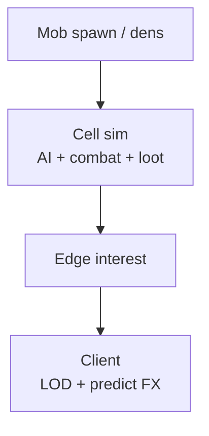
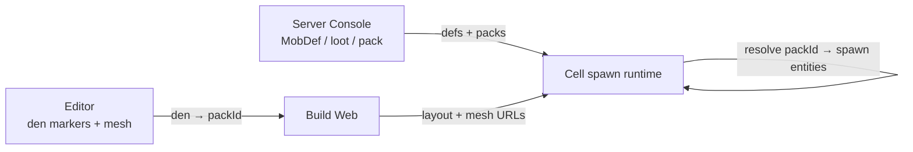

# Mob Architecture

Authoritative mental model for **mobs** — PVE **combatants** and wild fauna:
monsters, animals, hostiles, prey. Mobs exist to be fought, avoided, hunted,
or used as mission kill/escort targets. This is a **web** game (TypeScript +
Three.js / WebGPU, Rapier, authoritative cells).

**Mobs are not NPCs.** Shopkeepers, dialogue, mission givers, and ambient
townsfolk live in [NPCs](./npc). Do not implement PVE as “hostile NPCs” bolted
onto the crowd pipeline.

Related: [NPCs](./npc) (social / economic / mission characters),
[Multiplayer](./multiplayer) (cell owns combat outcomes),
[Player](./player) (character HP / death from mob damage),
[Player death](./player-death) (respawn after lethal mob fight),
[Ship combat](./ship-combat) (**ship** weapons / hull — different loop),
[Space traversal](./space-traversal) / [Star Map](./star-map) (where encounters
may live), [Content delivery](./content-delivery) (mob defs / loot tables as
catalog), [HaloBand](./haloband) (mission UI only).

**This doc is law.** Code may lag (no mob pipeline yet). Gaps are refactor
targets — not permission to drive mob AI on the client alone, to reuse full
player avatars for every creature in a pack, or to conflate on-foot PVE with
ship Combat-mode dogfights.

## Permanent decisions

### 1. Mob ≠ NPC

| | **Mob** | **NPC** ([NPCs](./npc)) |
| --- | --- | --- |
| Job | PVE combat / wildlife | Talk, shop, missions, ambient fill |
| Interact | Aggro, attack, loot | Dialogue, vendor, give/take |
| Authority default | **Always cell** in shared space — replicated to interested peers | Ambient local; service NPCs when outcomes shared |
| Density | Encounter packs, not 100-town fill | ~100 ambient townsfolk is an NPC problem |
| Other players | See + help (same HP bar / aggro) | Ambient fill may differ per client |

Mission objectives like “kill 5 X” or “escort through wolves” **reference**
mobs; the mission state machine stays with NPC/mission services
([NPCs](./npc)), while the creatures are mob entities.

### 2. Cell owns PVE — and peers see the fight

Hits, death, loot rolls, leash reset, and credit for mission kills are
**cell-owned**. Client may predict VFX and local feel; server decides HP and
drops.

**Mobs are network-synced** through the normal cell → edge interest → client
pipeline ([Multiplayer](./multiplayer)). Anyone whose interest includes that
mob sees the same creature, pose, and combat state. Other players can watch,
assist, steal aggro, or help burn a boss — that is the product, not an
optional later bolt-on.

| Synced (interested viewers) | Not synced that way |
| --- | --- |
| Mob entity existence, def id, pose, HP / phase | Ambient **NPC** crowd fill (local) |
| Aggro / attack events peers need to see | Continent-wide wildlife with no interest |
| Death + who may loot / assist credit | Client-only “my private mob” |

Flavor-only birds that never interact and never drop may stay cosmetic later —
**hostiles, huntables, elites, bosses, and mission mobs do not.** If a second
player should help, it is a cell entity from spawn.

### 3. Frame + interest budgets own packs

A fight must stay playable on web: bounded active mobs in interest, LOD
presentation, amortized AI. Do not spawn unbounded fauna into one cell view.

### What this rejects

- Mobs as rows in the **ambient NPC** crowd with a “hostile” flag.
- Client-authoritative mob HP / loot (“I killed it locally, sync later”).
- Full **player Sidekick / UAL** avatars as the default creature mesh.
- One Rapier character controller per mob at ship-scale density without caps.
- Using **ship Combat** HUD / missiles / lead pipes for on-foot fauna (separate
  loop — [Ship combat](./ship-combat)).
- Replicating every wildlife entity continent-wide; interest culls.

## Roles

| Role | Meaning |
| --- | --- |
| **Hostile** | Aggros on range / threat; fights until dead, flee, or leash |
| **Neutral wildlife** | Ignores player until provoked (or never) |
| **Prey / ambient fauna** | Flavor animals; may flee; optional hunt loot |
| **Elite / boss** | Scripted or denser stats; still mob entity kind, harder budget exceptions |
| **Mission mob** | Same mob pipeline; mission service listens for kill / tag credit |

## Combat loop (on-foot / surface / interior)

Ship hull fight stays in [Ship combat](./ship-combat). Mob fight is the
**character** combat layer (firearms, melee later, abilities later).

| Stage | Owner |
| --- | --- |
| Spawn / despawn / leash home | Cell |
| Threat / aggro table | Cell |
| Movement / attack choose | Cell AI (tick-budgeted) |
| Hit apply → HP | Cell ([Player](./player) for player vitals; mob HP on mob entity) |
| Death → loot / XP / mission credit | Cell; idempotent grants |
| Presentation / hurt VFX | Client from replicated events |

Player death from mob damage follows [Player death](./player-death).

### Leash and reset

Mobs that chase too far **leash** home, reset threat, and restore encounter
state. Exact radii are tunable; law is: no infinite cross-cell kiting without
a handoff rule. Cell boundaries + interest must remain honest
([Multiplayer](./multiplayer)).

### Loot

- Loot table on mob / encounter def (catalog).
- Roll on cell at death (or interact-corpse if product requires).
- Inventory grants server-side; no client-spawned currency.

## Presentation (FPS)

Mobs share the same **web** constraint as NPC crowds: skinned player tech × N
kills the frame.

| Band | What draws |
| --- | --- |
| Culled / far | Nothing or ultra-cheap proxy |
| Mid | Instanced / low-poly creature mesh |
| Near combat | Higher mesh + attack clips; still creature rig, not Sidekick |
| Boss / focus | Small hard cap for hero mesh |

Rules:

1. Creature kits are **authored mob meshes** (or shared mob atlases), not modular
   player avatars.
2. Cap near skinned mobs in a fight; leftovers use cheaper LOD.
3. Frustum + interest cull.
4. Death / break-apart FX stay budgeted (readability over debris storms —
   same spirit as ship destroy law, different art).

## Motion and AI

Ambient NPC roam (probe-then-commit) is **not** mob combat AI.

| Need | Approach |
| --- | --- |
| Wander in den | Simple roam / authored points; may reuse probe ideas **inside** encounter radius |
| Chase / flank | Cell AI toward threat; prefer cheap steering + occasional probes over full navmesh flood |
| Full navmesh | Not required to ship first mobs; revisit per biome if corridors demand it — still not the NPC town default |
| Attack tells | Server attack windows; client anim from replicated state |

Do not run 50 full pathfinders every tick. Budget AI slices (N mobs per tick).

## Spawn and authoring

### Permanent decision: Editor places dens; Console owns defs

Same three-surface split as [Content delivery](./content-delivery). Do not put
mob **stats** only in prefab JSON, and do not paint dens in the Server Console.

| Piece | Surface | Who edits | Reaches play how |
| --- | --- | --- | --- |
| **Mob definition** (HP, damage, mesh/prefab id, faction, aggro, AI profile) | Live **catalog** (Postgres) | Server Console `/admin/*` | Per environment; Sync Catalog / one-shot seed |
| **Loot tables** | Live catalog | Server Console | Same |
| **Pack templates** (weighted mob sets, elite odds) | Live catalog | Server Console | Dens **reference** pack ids — rebalance without Rebuild Web |
| **Spawn den / volume** (pose, radius, leash home, which pack id, max alive, respawn policy id) | **Project** (scene / prefab / planet / POI) | AsteronEngine editor | **File → Build Web** |
| **Creature meshes / GLBs** | Project `assets/` | Editor / art | Build Web copy (referenced) |
| **Global PVE knobs** (spawn rate scale, max mobs per cell view) | `GameSettings` or catalog | Server Console | Live; no rebuild |

### Why this split

- **Where** a pack lives is spatial authoring (station corridor, planet dens,
  Star Map POI wreck). That is editor + Build Web — same as stations / POIs /
  NPC placements.
- **What** spawns and how hard it hits is live ops / balance. Console catalog
  matches ships, items, weapons — tune prod without a front-end rebuild.
- Dens store **ids** (`packId`, optional `mobDefinitionId` overrides), never
  embed full stat blocks. Catalog points at mesh/`prefabId` strings; files
  exist only if Build Web staged them.

### Den authoring (editor)

Conceptual markers (land with implementation):

| Place | Typical use |
| --- | --- |
| Station / interior prefab | Rare indoor threats, mission ambush volumes |
| Planet / surface volume | Wildlife dens, hunt zones |
| Star Map **POI** prefab | Wreck fauna, boss arena on arrival ([Star Map](./star-map)) |
| Mission instance layout | Encounter dens tied to a contract |

Den fields (conceptual): `id`, `packId`, pose / radius, `leashRadius`,
`maxAlive`, `respawnSeconds` or policy id, optional difficulty tier.

Hab/Hangar player-build instances are **not** free mob zoos unless an authored
den says so.

### Console authoring (catalog)

| Row | Owns |
| --- | --- |
| `MobDefinition` | Combat identity: stats, presentation id, loot table id, faction |
| `LootTable` | Drop rolls |
| `MobPack` (or equivalent) | Weighted list of mob defs + counts / elite chance |
| Game settings | Global spawn / interest caps |

Operators change packs and stats per environment. They do **not** move dens
across the planet in `/admin`.

### Runtime resolve

1. Cell loads dens from the **shipped** scene/planet/POI layout (or checkpoint).
2. For each den, look up `packId` in **this environment’s** catalog.
3. Spawn / respawn cell entities from that pack; missing pack id → log + skip
   (same class of failure as missing ship `prefabId`).

### What this rejects

- Authoring mob HP only inside a prefab component with no catalog row.
- A Console map UI that places dens instead of the editor.
- Migrations as continuous balance promote (one-shot seeds OK).
- Assuming local Console packs exist on prod without Sync Catalog.
- Dens that embed loot JSON instead of `lootTableId`.

Stations may host interior threats later; most wildlife is planet / POI /
mission instance.

## Network

Mobs in a shared space are **cell entities**, replicated like other gameplay
bodies — not local-only cosmetics.

- Edge **interest** decides which connections receive which mobs (same
  `interest ≤ cell size` rule as players / ships).
- Peers in interest see the fight and can contribute damage / healing / CC;
  cell resolves one HP pool and one death.
- Bosses / elites: same pipeline; optionally raise replicate rate or interest
  radius while engaged — still one cell truth.
- Wire stays compact: mob def id, pose, HP (or band), AI phase, attack event
  ids — not full animation graphs.
- Far idle packs: lower rate or proxy; combat participants get fuller updates.
- Mission kill / assist credit: server rules (tag, damage threshold, last-hit);
  clients never self-award.
- Party / help is emergent from shared cell state — do not invent a second
  “invite to my private mob instance” unless product explicitly instances the
  whole encounter cell.

### What this rejects

- Spawning a mob only on one client and telling others “trust me.”
- Per-player private boss HP while standing in the same public space.
- Packing mob appearance as player character profiles.
- Replicating every wildlife entity planet-wide with no interest cull.

## Ownership

| Concern | Layer |
| --- | --- |
| Mob defs / loot / packs | Catalog + Server Console ([Content delivery](./content-delivery)) |
| Spawn dens / volumes | Editor project → Build Web (markers reference pack ids) |
| Creature meshes | Project assets → Build Web |
| AI + combat + loot | Backend cell |
| Prediction / FX | Client + shared sim-core where applicable |
| Presentation LOD | `render/` mob path (separate from NPC crowd and player avatar) |
| Mission kill objectives | Mission service listens to cell events; UI via HaloBand |
| Ship PVE (capital fauna, etc.) | Later; do not overload on-foot mob doc — may need ship-targeted extension |

Domain code for mobs should not live as a hostile flag inside `src/npc/`
population. Prefer a distinct `mob/` (or backend mob module) when implemented.

## Relationship to other combat

| Loop | Doc |
| --- | --- |
| On-foot / surface PVE vs creatures | **This doc** |
| Player firearms vs players / (later) mobs | [Multiplayer](./multiplayer) + this doc for mob HP |
| Ship vs ship | [Ship combat](./ship-combat) |
| NPC shop / talk / mission | [NPCs](./npc) |

## Invariants

- Mob ≠ NPC.
- Mobs in shared space are **network-synced** cell entities; peers in interest
  see and can help on the same HP / death.
- Cell owns HP, death, loot, aggro, leash, mission kill / assist credit.
- Interest + LOD + AI tick budgets are mandatory on web.
- Default mesh ≠ player Sidekick pipeline.
- Ship Combat mode is a different loop.
- Mission “kill / escort” hooks mobs; townsfolk stay NPCs.

## Open / later

- First mob catalog (`MobDefinition` / loot / packs) + Console CRUD + den
  markers in editor that reference `packId`.
- On-foot weapon hit → mob HP path (cell).
- Loot corpses / auto-loot policy.
- Planet wildlife density vs station interior hostiles.
- Elite / boss encounter scripting.
- Whether any space fauna shares ship combat hardpoints (explicit extension).
- Optional nav assists for tight caves — still separate from NPC town nav law.

## See also

- [NPCs](./npc)
- [Multiplayer](./multiplayer)
- [Ship combat](./ship-combat)
- [Player](./player) / [Player death](./player-death)
