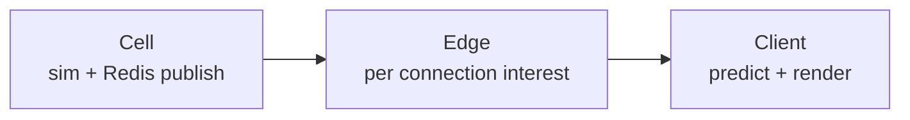

# Multiplayer Architecture

Authoritative mental model for **who owns truth**, **what peers see**, and
**how place changes** stay one cell story. Travel *places* are defined in
[Basic game loop](./game-loop) and [Space traversal](./space-traversal); this
doc owns **authority and replication** for those moves (and for shared
gameplay generally) — including **ships in Open Space** and the **on-foot
character** (loadout, animation, firearm fire) so a second player is not a
nametag on an empty body.

Related: [Scene flow](./scene-flow) (session start only),
[Ship flight](./ship-flight) / [Ship combat](./ship-combat) (cell-owned flight
and damage), [Character combat](./character-combat) (on-foot / TPS firearms —
different fight loop, **same** peer visibility duty),
[Character locomotion](./character-locomotion) (gait / pose peers must match),
[Player](./player) (cell-owned character vitals / medicine /
death), [Player death](./player-death) (respawn resolve),
[Home Worlds](./home-worlds) (starter Hab bind),
[NPCs](./npc) / [Mobs](./mobs) (service NPCs vs PVE; ambient cosmetic),
[Content delivery](./content-delivery) (wearables / weapons / backpacks as
live catalog), editor **Debug → Multiplayer** harness.

**This doc is law.** Code may lag (instance follow-in, placeable replication,
quantum peer visibility, character presentation sync). Gaps are refactor
targets — never an excuse to ship client-authoritative outcomes or “add MP
later.”

## Permanent decision: design multiplayer in parallel

Every gameplay feature, state change, interaction outcome, scene travel path,
and entity that peers must see or affect answers up front:

1. Who owns the truth (cell vs client)?
2. What intents / snapshots carry it?
3. What does a second player observe?

Local-only stubs are fine for **cosmetics that stay non-authoritative** (e.g.
friendly station NPC roam — [NPCs](./npc)). They are not an excuse to defer
authority for real outcomes, travel, inventory, combat, or shared world state.

### Pipeline stages (do not conflate)

| Stage | Owns |
| --- | --- |
| **Cell** | Simulation. Publishes full cell state to one Redis channel. Knows nothing about who is watching. Single-writer, Redis lease, PostgreSQL epoch fence. |
| **Edge** | One per connection. Claims the viewer's cell, observes the neighbourhood, decides what *this* viewer needs. |
| **Client** | Mirrors the edge's per-connection state, predicts with shared sim-core WASM, interpolates, renders. |

Shared prediction core: `sim-core` (native authority + browser WASM). Wire
contract: `proto/world.proto` over WebTransport. Durable: PostgreSQL.
Ephemeral routing / fan-out: Redis.

### What this rejects

- WebSocket fallback, second backend, client-authoritative combat / loot /
  travel outcomes, or a second prediction implementation.
- “We'll add multiplayer later” for shared gameplay.
- Two mechanisms that pick a cell for the same move (they race; loser sees one
  place and is simulated in another).

## Presence body: `world.mode`, not “has a ship”

Every player owns an active ship. Presence must describe the body the player
**is** — walking character vs flying hull — keyed off **mode**, never off
“ship instance exists.”

| Mode context | Presence publishes |
| --- | --- |
| On foot / station / deck | Character position (and deck carry rules when `shipZoneId` set) |
| `MODE_IN_SHIP` (flying) | Flying hull pose |

Wrong body → frozen peers in hangars or “nobody online.” One decision site for
that mapping (today `presenceShipBody` / equivalent) — do not scatter.

Peers in interest must **see the ship** when you fly (hull pose, and combat
public state per [Ship combat](./ship-combat)) — not only your character capsule
when parked / on foot.

## Character presentation: loadout, animation, fire

A second player in interest must see **you**, not a blank avatar with a name.
On-foot / seated character presentation is shared world state — same duty as
flying hulls. Do not ship a local-only FPS loop and promise peer visuals later.

### What peers must observe

| Layer | Peers see |
| --- | --- |
| **Body appearance** | Saved character appearance (face / body recipe) |
| **Equipped loadout** | Visible slots that change the mesh: weapons (drawn / holstered as posture requires), backpacks, wearables, and other catalog items that attach to the character |
| **Locomotion / pose** | Walk / run / sprint / idle, ADS / aim posture, reload, climb, seat / bed poses — enough that the peer avatar matches what you are doing |
| **Firearm fire** | When you fire: muzzle presentation, tracer / projectile travel as product requires, and hit feedback peers need for shared combat (impact / damage outcomes stay cell-owned with [Player](./player) vitals) |

Ship hardpoint fire stays under [Ship combat](./ship-combat). This section is
the **on-foot / character** path — full fight law in
[Character combat](./character-combat).

### Authority vs presentation

| Concern | Owner |
| --- | --- |
| Equip / unequip / inventory truth | Cell (durable loadout); peers get public equipped state |
| Hit detection / damage / death from firearms | Cell — [Player](./player) |
| Pose / animation / drawn-weapon posture | Replicated public presentation (intents or compact state); each client drives its own avatar from that |
| Muzzle / tracer / cosmetic fire FX | Derived from replicated fire events — every interested viewer plays them; do not local-only |
| Local HUD (crosshair, mag count, recoil punch) | Client only — peers do not need your full FPS chrome |

### Wire shape (law, not today’s schema)

- **Identity + body appearance** → profile / structural path once per viewer
  (`EntityProfile` or successor) — not per-tick.
- **Equipped loadout** that changes visible mesh → structural or reliable
  update when it changes (equip events), not stuffed into every datagram.
- **Pose / locomotion / aim flags** → compact per-tick or event churn peers
  need to keep avatars honest.
- **Fire events** → reliable or loss-tolerant event stream so peers play the
  shot; cell resolves whether the shot **matters** (damage).

Do not put full appearance JSON, full inventory, or full clip catalogs on the
hot per-tick path. Do not treat “peers see a capsule” as done.

### What this rejects

- Local-only equipped guns / backpacks / wearables while peers see an unarmed
  body.
- Local-only muzzle flash / tracers / fire anim while damage somehow syncs
  (or the reverse: silent peer guns that still kill you with no FX).
- “Animation is cosmetic, skip replication” for locomotion and combat postures
  other players must read.
- A second ad-hoc peer-avatar channel that bypasses cell → edge interest.

## On-foot vs flight authority

| Context | Truth | Notes |
| --- | --- | --- |
| **On foot** | Client position reported; cell **clamps** toward it (max top-speed × dt) | Authority world has capsules, not full station/terrain geometry — dead-reckon alone walks through walls. Clamp prevents teleport exploits. |
| **On moving ship deck** | Clamp / velocity limits use **ship** speed | Judging deck motion by on-foot caps rejects every passenger intent. |
| **Ship flight** | Cell Rapier full authority | Client predicts with shared core. |
| **Ship combat damage / destroy** | Cell | Client predicts FX / HUD — [Ship combat](./ship-combat). |
| **Character vitals** (HP, hunger, thirst, toxicity, medicine, death) | Cell | Client owns HUD only — [Player](./player). |
| **Character respawn** | Cell | Custom point if valid, else home-world Hab — [Player death](./player-death). |

Do not “restore” pure server dead-reckoning of on-foot position without station
geometry to back it. Do not remove the clamp. Do not put character heal /
death on the client because on-foot *position* is client-reported.

## Authored markers are the only in-play place change

[Scene flow](./scene-flow) boot / `game-manager` decides where a session
**begins**. Every move after that is an authored marker — nothing else:

| Move | Component | Lives on |
| --- | --- | --- |
| Hab ↔ Station ↔ Hangar (on foot) | `scene-exit` | Walkable scenes |
| Hangar → Open Space | `exit-hangar` | `Runtime: hangar` |
| Open Space → Hangar | `enter-station` | `Runtime: station` body |
| System A → System B | `warp-gate` | Star Map body — [Space traversal](./space-traversal) |

Elevators-as-cell-pickers are gone. Do not reintroduce a second cell-picker.

`loginInstanceForScene` is the **only** other thing allowed to choose a cell,
and only for a **fresh** session.

### Tokens and targets

| Token / field | Role |
| --- | --- |
| `networkInstanceId` `@apartment` / `@hangar` / `@space` (or literal) | Resolve per-player or shared cell from session bootstrap — never bake private instance ids into prefab documents |
| `sceneId` `@space` | Resolve through flow `openSpaceSceneId` |
| Unknown `@` tokens | Resolve to nothing — do not load as literal ids |

Scene swap target rides **in memory** (`SceneExitTarget` / equivalent on
`onRequestScene`). Do **not** send Transition on the outgoing world connection:
swap tears the session down and dials a new one; that Transition would race the
reconnect for the Postgres write that picks the new cell.

`exit-hangar` → always `arrival: 'in-ship'`. `enter-station` → hangar instance
(product may refine seated vs on-foot arrival; cell must match the hangar
instance either way).

## Hab / Hangar instances and team follow-in

Law from [game loop](./game-loop): Hab and Hangar are **per-player instances**;
Station concourse is shared; teammates may **follow in**; strangers stay out;
placeables are hab/hangar only.

| Concern | Law |
| --- | --- |
| **Owner instance** | Cell id derived from owner player + station family + `@apartment` / `@hangar` (or successor tokens). |
| **Follow-in** | Teammate joins **owner's** instance cell — same cell, visible peers, shared placeables. Not a copy of the scene with a different invisible cell. |
| **Strangers** | Denied at the travel / instance gate — they never enter the owner's cell. |
| **Placeables** | Instance-owned durable state (checkpoint / DB as product requires); replicate to everyone in that instance cell. Concourse has no player build authority. |
| **Station concourse** | Shared public cell for that station body / room policy — not the owner's private instance. |

Until code matches: treat missing follow-in / placeable sync as **open
implementation**, not as permission to make build local-only forever.

## Cells vs interest

An **authority cell is not a view distance.** Grid sizes cells and interest
radii separately with one invariant: **`interest ≤ cell size`**, so a viewer's
interest sphere stays covered by the neighbourhood of cells the edge
subscribes to (e.g. 3×3×3). Shrink a cell below interest → peers across a
boundary go invisible with a healthy connection.

Open Space / quantum / Warp Gate interest across system-scale distances must
respect the same rule — do not invent a second visibility channel that bypasses
edge interest.

## Wire path discipline

| Rule | Why |
| --- | --- |
| Never size snapshots against `MAX_DATAGRAM_BYTES` alone | Sanity bound ≠ path MTU; use `Connection::max_datagram_size()` |
| Structural frames → reliable stream | Baseline, entity enter/leave — nothing restates them |
| Pure state churn → datagram | Loss costs one tick; idle entities may send nothing |
| Identity / body appearance → `EntityProfile` (or successor) once per viewer | Not per-tick — appearance on the hot path blew MTU before |
| Equipped visible loadout → reliable / structural on change | Peers must remesh weapons / backpack / wearables without per-tick catalogs |
| Fire + compact pose flags → event / churn path | Peers play shots and match locomotion; cell owns hit outcomes |
| Checkpoint ≠ wire Snapshot | Wire is lossy by design |

## Origins (CORS vs WebTransport)

`CLIENT_ORIGIN` is CORS. `WEBTRANSPORT_ALLOWED_ORIGINS` is checked separately
on the QUIC handshake and must include every origin that dials (including
editor / debug). Wrong allowlist → site loads, chat echoes, **no peers**. See
deploy docs.

## Ownership map

| Concern | Owns |
| --- | --- |
| Cell sim + publish | Backend cell |
| Interest fan-out | Edge / replication |
| Presence body choice | Client publish path keyed by mode |
| Scene travel resolve | Game / station exit → in-memory target → new session cell |
| Flight / combat outcomes | Cell (+ shared prediction) |
| Character loadout / fire / pose presentation | Cell durable equip + replicated public presentation; cell hit resolve |
| Cosmetic ambient NPCs | Local until promoted |
| Service NPCs (shop / dialog / mission) | Cell + interest ([NPCs](./npc)) |
| Mobs (PVE) | Cell + interest ([Mobs](./mobs)) |

## Invariants

- Design authority + replication with the feature — not after.
- One cell-picker family for in-play moves: authored markers (+ login for
  fresh session only).
- Presence follows `world.mode` / pilot posture, not ship existence.
- Peers in interest see **flying ships** and **on-foot characters** with
  appearance, equipped gear, locomotion / combat pose, and firearm fire FX —
  not blank proxies.
- On-foot: client report + clamp; flight: cell Rapier; combat damage: cell;
  character vitals / medicine / death: cell ([Player](./player));
  respawn: cell ([Player death](./player-death)).
- Hab/Hangar instances are real cells; follow-in shares the owner's cell;
  placeables replicate there.
- `interest ≤ cell size`; no second invisible-peer path.
- No WebSocket fallback / dual backend / dual prediction core.
- Scene-swap target in memory — do not race Transition on the dying connection.

## Baseline vs law (today)

| Piece | Baseline (typical) | Law |
| --- | --- | --- |
| Cell / edge / client | Shipped pipeline | Keep; do not fork |
| Presence body | Mode-aware path exists | Never regress to ship-exists |
| On-foot clamp | Shipped | Keep |
| Marker travel | `scene-exit` / boarding | Keep; migrate `@space` hangar exits to `exit-hangar` |
| Character appearance / loadout / pose / fire | Open / lagging | Peers see gear + anim + shots (section above) |
| Team follow-in | Partial / open | Owner instance cell + deny strangers |
| Placeable sync | Open | Instance durable + replicate |
| Quantum / Warp Gate peers | Open | Same interest rules; document when implementing |

## Open / later

- Quantum travel peer visibility / interest during spool–travel–drop-out.
- Warp Gate host swap: cell handoff + what peers in each system see.
- Placeable build schema + checkpoint format for hab/hangar instances.
- Promote service NPCs (shop / dialogue / mission) to cell entities when
  outcomes are shared ([NPCs](./npc) — ambient stay local).
- Mobs as distinct cell entities for PVE ([Mobs](./mobs) — not hostile NPCs).
- Ship–ship collider LOD vs interest at Open Space ranges
  ([Ship flight](./ship-flight)).
- Compact on-foot pose / fire wire schema and network LOD for crowded
  stations (still must convey drawn weapon + fire at near LOD).
