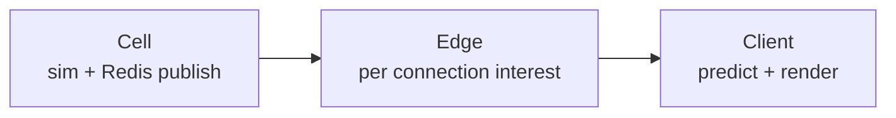

# Multiplayer Architecture

Authoritative mental model for **who owns truth**, **what peers see**, and
**how place changes** stay one cell story. Travel *places* are defined in
[Basic game loop](./game-loop) and [Space traversal](./space-traversal); this
doc owns **authority and replication** for those moves (and for shared
gameplay generally).

Related: [Scene flow](./scene-flow) (session start only),
[Ship flight](./ship-flight) / [Ship combat](./ship-combat) (cell-owned flight
and damage), editor **Debug → Multiplayer** harness.

**This doc is law.** Code may lag (instance follow-in, placeable replication,
quantum peer visibility). Gaps are refactor targets — never an excuse to ship
client-authoritative outcomes or “add MP later.”

## Permanent decision: design multiplayer in parallel

Every gameplay feature, state change, interaction outcome, scene travel path,
and entity that peers must see or affect answers up front:

1. Who owns the truth (cell vs client)?
2. What intents / snapshots carry it?
3. What does a second player observe?

Local-only stubs are fine for **cosmetics that stay non-authoritative** (e.g.
friendly station NPC roam). They are not an excuse to defer authority for real
outcomes, travel, inventory, combat, or shared world state.

### Pipeline stages (do not conflate)

| Stage | Owns |
| --- | --- |
| **Cell** | Simulation. Publishes full cell state to one Redis channel. Knows nothing about who is watching. Single-writer, Redis lease, PostgreSQL epoch fence. |
| **Edge** | One per connection. Claims the viewer's cell, observes the neighbourhood, decides what *this* viewer needs. |
| **Client** | Mirrors the edge's per-connection state, predicts with shared sim-core WASM, interpolates, renders. |

Shared prediction core: `sim-core` (native authority + browser WASM). Wire
contract: `proto/world.proto` over WebTransport. Durable: PostgreSQL.
Ephemeral routing / fan-out: Redis.

### What this rejects

- WebSocket fallback, second backend, client-authoritative combat / loot /
  travel outcomes, or a second prediction implementation.
- “We'll add multiplayer later” for shared gameplay.
- Two mechanisms that pick a cell for the same move (they race; loser sees one
  place and is simulated in another).

## Presence body: `world.mode`, not “has a ship”

Every player owns an active ship. Presence must describe the body the player
**is** — walking character vs flying hull — keyed off **mode**, never off
“ship instance exists.”

| Mode context | Presence publishes |
| --- | --- |
| On foot / station / deck | Character position (and deck carry rules when `shipZoneId` set) |
| `MODE_IN_SHIP` (flying) | Flying hull pose |

Wrong body → frozen peers in hangars or “nobody online.” One decision site for
that mapping (today `presenceShipBody` / equivalent) — do not scatter.

## On-foot vs flight authority

| Context | Truth | Notes |
| --- | --- | --- |
| **On foot** | Client position reported; cell **clamps** toward it (max top-speed × dt) | Authority world has capsules, not full station/terrain geometry — dead-reckon alone walks through walls. Clamp prevents teleport exploits. |
| **On moving ship deck** | Clamp / velocity limits use **ship** speed | Judging deck motion by on-foot caps rejects every passenger intent. |
| **Ship flight** | Cell Rapier full authority | Client predicts with shared core. |
| **Ship combat damage / destroy** | Cell | Client predicts FX / HUD — [Ship combat](./ship-combat). |

Do not “restore” pure server dead-reckoning of on-foot position without station
geometry to back it. Do not remove the clamp.

## Authored markers are the only in-play place change

[Scene flow](./scene-flow) boot / `game-manager` decides where a session
**begins**. Every move after that is an authored marker — nothing else:

| Move | Component | Lives on |
| --- | --- | --- |
| Hab ↔ Station ↔ Hangar (on foot) | `scene-exit` | Walkable scenes |
| Hangar → Open Space | `exit-hangar` | `Runtime: hangar` |
| Open Space → Hangar | `enter-station` | `Runtime: station` body |
| System A → System B | `warp-gate` | Star Map body — [Space traversal](./space-traversal) |

Elevators-as-cell-pickers are gone. Do not reintroduce a second cell-picker.

`loginInstanceForScene` is the **only** other thing allowed to choose a cell,
and only for a **fresh** session.

### Tokens and targets

| Token / field | Role |
| --- | --- |
| `networkInstanceId` `@apartment` / `@hangar` / `@space` (or literal) | Resolve per-player or shared cell from session bootstrap — never bake private instance ids into prefab documents |
| `sceneId` `@space` | Resolve through flow `openSpaceSceneId` |
| Unknown `@` tokens | Resolve to nothing — do not load as literal ids |

Scene swap target rides **in memory** (`SceneExitTarget` / equivalent on
`onRequestScene`). Do **not** send Transition on the outgoing world connection:
swap tears the session down and dials a new one; that Transition would race the
reconnect for the Postgres write that picks the new cell.

`exit-hangar` → always `arrival: 'in-ship'`. `enter-station` → hangar instance
(product may refine seated vs on-foot arrival; cell must match the hangar
instance either way).

## Hab / Hangar instances and team follow-in

Law from [game loop](./game-loop): Hab and Hangar are **per-player instances**;
Station concourse is shared; teammates may **follow in**; strangers stay out;
placeables are hab/hangar only.

| Concern | Law |
| --- | --- |
| **Owner instance** | Cell id derived from owner player + station family + `@apartment` / `@hangar` (or successor tokens). |
| **Follow-in** | Teammate joins **owner's** instance cell — same cell, visible peers, shared placeables. Not a copy of the scene with a different invisible cell. |
| **Strangers** | Denied at the travel / instance gate — they never enter the owner's cell. |
| **Placeables** | Instance-owned durable state (checkpoint / DB as product requires); replicate to everyone in that instance cell. Concourse has no player build authority. |
| **Station concourse** | Shared public cell for that station body / room policy — not the owner's private instance. |

Until code matches: treat missing follow-in / placeable sync as **open
implementation**, not as permission to make build local-only forever.

## Cells vs interest

An **authority cell is not a view distance.** Grid sizes cells and interest
radii separately with one invariant: **`interest ≤ cell size`**, so a viewer's
interest sphere stays covered by the neighbourhood of cells the edge
subscribes to (e.g. 3×3×3). Shrink a cell below interest → peers across a
boundary go invisible with a healthy connection.

Open Space / quantum / Warp Gate interest across system-scale distances must
respect the same rule — do not invent a second visibility channel that bypasses
edge interest.

## Wire path discipline

| Rule | Why |
| --- | --- |
| Never size snapshots against `MAX_DATAGRAM_BYTES` alone | Sanity bound ≠ path MTU; use `Connection::max_datagram_size()` |
| Structural frames → reliable stream | Baseline, entity enter/leave — nothing restates them |
| Pure state churn → datagram | Loss costs one tick; idle entities may send nothing |
| Identity / appearance → `EntityProfile` once per viewer | Not per-tick — appearance on the hot path blew MTU before |
| Checkpoint ≠ wire Snapshot | Wire is lossy by design |

## Origins (CORS vs WebTransport)

`CLIENT_ORIGIN` is CORS. `WEBTRANSPORT_ALLOWED_ORIGINS` is checked separately
on the QUIC handshake and must include every origin that dials (including
editor / debug). Wrong allowlist → site loads, chat echoes, **no peers**. See
deploy docs.

## Ownership map

| Concern | Owns |
| --- | --- |
| Cell sim + publish | Backend cell |
| Interest fan-out | Edge / replication |
| Presence body choice | Client publish path keyed by mode |
| Scene travel resolve | Game / station exit → in-memory target → new session cell |
| Flight / combat outcomes | Cell (+ shared prediction) |
| Cosmetic NPCs | Local until promoted |

## Invariants

- Design authority + replication with the feature — not after.
- One cell-picker family for in-play moves: authored markers (+ login for
  fresh session only).
- Presence follows `world.mode` / pilot posture, not ship existence.
- On-foot: client report + clamp; flight: cell Rapier; combat damage: cell.
- Hab/Hangar instances are real cells; follow-in shares the owner's cell;
  placeables replicate there.
- `interest ≤ cell size`; no second invisible-peer path.
- No WebSocket fallback / dual backend / dual prediction core.
- Scene-swap target in memory — do not race Transition on the dying connection.

## Baseline vs law (today)

| Piece | Baseline (typical) | Law |
| --- | --- | --- |
| Cell / edge / client | Shipped pipeline | Keep; do not fork |
| Presence body | Mode-aware path exists | Never regress to ship-exists |
| On-foot clamp | Shipped | Keep |
| Marker travel | `scene-exit` / boarding | Keep; migrate `@space` hangar exits to `exit-hangar` |
| Team follow-in | Partial / open | Owner instance cell + deny strangers |
| Placeable sync | Open | Instance durable + replicate |
| Quantum / Warp Gate peers | Open | Same interest rules; document when implementing |

## Open / later

- Quantum travel peer visibility / interest during spool–travel–drop-out.
- Warp Gate host swap: cell handoff + what peers in each system see.
- Placeable build schema + checkpoint format for hab/hangar instances.
- Promote friendly NPCs to cell entities when dialogue / combat / inventory
  need shared outcomes.
- Ship–ship collider LOD vs interest at Open Space ranges
  ([Ship flight](./ship-flight)).
