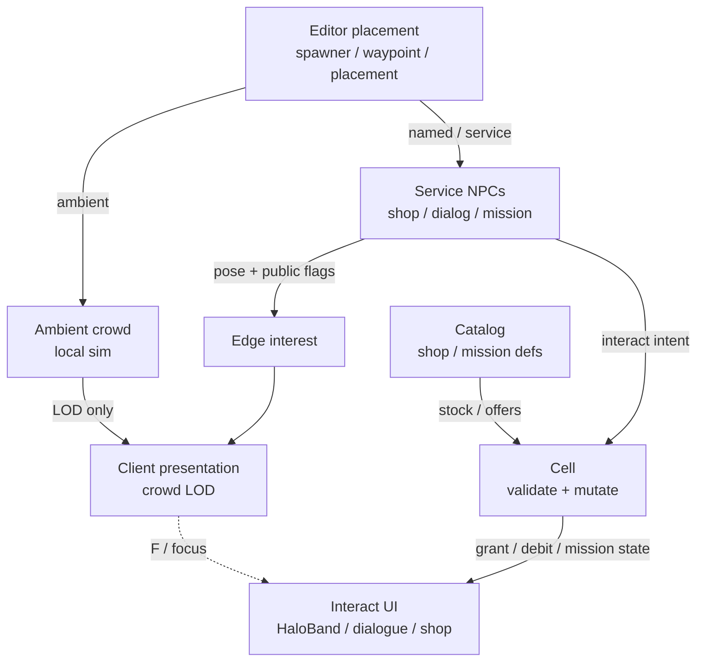
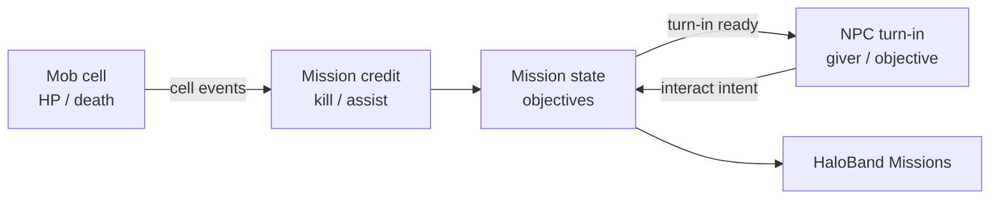

# NPC Architecture

Authoritative mental model for **NPCs** — non-player **characters** that fill
stations and cities and that players **talk to, buy from, and mission with**.
Think classic MMO townsfolk: ambient crowd, shopkeepers, bark / dialogue,
mission givers, and mission targets (talk / give / take). This is a **web**
game (TypeScript + Three.js / WebGPU, Rapier, authoritative cells).

**NPCs are not mobs.** PVE monsters, animals, and combat fauna live in
[Mobs](./mobs). Do not merge the two pipelines.

Related: [Missions](./missions) (contract state / ARC pay — this doc owns
NPC verbs only; rep/XP/loot packs live in sibling laws), [Mobs](./mobs),
[Multiplayer](./multiplayer) (cell owns shop / mission / dialogue outcomes),
[Basic game loop](./game-loop), [Space traversal](./space-traversal),
[Player](./player), [HaloBand](./haloband) (Missions tab presents contracts;
does not own them), [Content delivery](./content-delivery) (shops, items,
mission defs as live catalog), [Item Mall](./item-mall) (AC mall ≠ ARC vendor
NPC shops), editor NPC components (`npc-spawner`, `npc-waypoint`,
`npc-placement`).

**This doc is law.** Code may lag hard (crowd still uses player avatars; shops
are mostly screen terminals; missions stub). Gaps are refactor targets — not
permission to treat ambient NPCs as Sidekick clones, to put shop / mission
truth on the client, or to implement PVE combat as “angry NPCs.”

## Permanent decisions

### 1. NPC ≠ mob

| | **NPC** | **Mob** ([Mobs](./mobs)) |
| --- | --- | --- |
| Role | Character in the social / economic / mission layer | PVE combatant (monster, animal, hostile fauna) |
| Typical interact | Talk, shop, accept / turn in missions, give / take items | Fight, flee, leash, drop loot |
| Default stance | Friendly or neutral | Hostile or prey / predator AI |
| Density problem | ~100 ambient **fill** in stations / cities | Encounter packs; different spawn + combat budget |
| Kill / loot | Not the default loop | Core loop |

An NPC may become hostile in a scripted beat; that does not make every mob an
NPC. Prefer the **mob** pipeline once the entity’s job is combat.

### 2. Frame budget owns ambient fill

A station or city concourse must sustain on the order of **~100 ambient NPCs**
under a normal quality preset without stealing the player’s framerate. Caps
and LODs exist to hit that.

### 3. Interactive NPCs are MMO services on cell authority

Shopkeepers, dialogue, mission givers, and mission give/take are **shared
gameplay**. Cell (or durable server services behind the cell) owns outcomes.
Client owns prompts, UI, and prediction of cosmetic reaction only.

## Budgets (keep separate)

| Budget | Job | Scale target |
| --- | --- | --- |
| **Sim** | Position, facing, idle / route / roam | Hundreds cheap; amortize |
| **Presentation** | GPU / mixer | LOD ladder; ambient ≠ player avatar |
| **Interaction** | Shop / dialog / mission intents | Few concurrent; server-validated |
| **Network** | Who sees whom | Ambient local; service NPCs interest-culled |

Never pay a hero skinned avatar for an ambient body. Never replicate 100
ambient transforms so shops “line up.”

### What this rejects

- Ambient NPCs as **full Synty / Sidekick / UAL player avatars**.
- Per-NPC character controllers for walking.
- Full **navmesh** as ambient default ([Motion](#motion-probe-then-commit-not-navmesh)).
- Client-authoritative shop purchases, mission complete, or item give/take.
- Building mission / shop logic on “every client’s ambient NPC id matched.”
- Folding **mobs** into `npc/` as hostile variants of townsfolk.
- Conflating **ARC vendor** NPC shops with **AsteronCredits** Item Mall.

## Roles

| Role | Meaning | Presentation | Authority |
| --- | --- | --- | --- |
| **Ambient crowd** | Fill; mill / patrol; optional bark | LOD crowd only | Local (or seed); no shared outcomes |
| **Shopkeeper** | Sells / buys with ARC (or authored currency) | Near / hero when interacted | Cell + catalog; ledger-style inventory mutations |
| **Dialogue NPC** | Bark, gossip, lore trees | Near when in conversation | Cell (or content service) for branches that grant items / flags; pure flavor may be local |
| **Mission giver** | Offer / accept / abandon / turn-in | Near / hero in dialogue | Cell owns mission state |
| **Mission objective NPC** | Talk-to, give-to, take-from | Near when objective-active | Cell validates objective complete |
| **Named / service** | Unique face without shop yet | Budgeted higher LOD | Promote when any shared outcome appears |

Ambient is the density problem. Service NPCs are **few** per interest volume.
Do not spawn 100 shopkeepers; do not draw 100 ambient as shopkeepers.

**Hostile PVE** → [Mobs](./mobs), not a row on this table.

## MMO interaction law

Product shape matches common MMO towns: walk up, **F** / interact, talk or
open vendor / mission UI. Exact UI chrome can live in world panels or HaloBand;
**authority does not move with chrome.**

### Shopkeepers

- Player intent: open shop, buy, sell, (later) repair / services.
- Server checks: range / interact eligibility, stock, price, currency, inventory
  space; then mutates inventories / ARC (or authored soft currency).
- Presentation: NPC may stand at a counter **or** a terminal may remain as an
  authored vendor screen ([baseline food/weapon shops](../editor/components/food-shop)).
  Both are fine; **NPC shopkeeper** is the character-facing form of the same
  commerce outcomes — do not invent a second wallet.
- ARC dock shops ≠ AC Item Mall ([Item Mall](./item-mall), [HaloBand](./haloband)).

### Dialogue

| Kind | Example | Authority |
| --- | --- | --- |
| **Bark / ambient line** | Random hello when near | May be local / seeded cosmetic |
| **Conversation tree** | Multi-node talk | Client shows tree; **grants / flags / mission hooks** resolve on server |
| **Gossip with effect** | “Here’s a key” / reputation | Always server |

Do not treat “I clicked the dialogue option” as item grant on the client.

### Missions (contracts)

Full law: [Missions](./missions). HaloBand **Missions** tab is presentation
([HaloBand](./haloband)). Mission **state** (accepted, objectives, rewards) is
server-owned; pay is **ARC** (never AC).

NPC-facing mission verbs (MMO-standard):

| Verb | Player does | Server checks |
| --- | --- | --- |
| **Offer / accept** | Talk to giver → accept | Eligibility, prerequisites, quest log caps |
| **Talk to** | Speak with objective NPC | Correct NPC id, range, mission stage |
| **Give to** | Hand item(s) to NPC | Items present, stage, consume / transfer |
| **Take from** | Receive item(s) from NPC | Stage, inventory space, grant |
| **Turn in** | Complete at giver (or turn-in NPC) | Objectives done; grant rewards once (idempotent) |

Kill / escort / gather that target **mobs** or world props still update the
**same** mission state machine — mob combat itself is [Mobs](./mobs).

Creatures stay on the mob pipeline; townsfolk stay NPCs. Only **mission state**
bridges them — full contract law: [Missions](./missions).

### Interact gating

- Range + line-of-sight / facing rules are product-tunable; cheating them must
  fail on the server (distance clamp, cell position), not only in UI.
- One interactive focus at a time per player (shop **or** dialogue **or**
  mission panel) unless product explicitly stacks.
- Ambient crowd members are **not** interactable by default; service roles are
  authored (`npc-placement` or future service components), not inferred from
  crowd spawn.

## Baseline vs law (today)

| Piece | Baseline (typical) | Law |
| --- | --- | --- |
| Crowd sim | Analytic roam / route; probe-then-commit; 32 cap | Keep; raise density after LOD |
| Presentation | Player avatar per NPC | Ambient LOD ladder; hero only for interact focus |
| Shops | Screen markers (weapon / food / outfitters…) | Keep commerce outcomes; NPC shopkeeper is alternate face |
| Dialogue / missions | Stub / absent | Cell-owned mission + dialogue grants |
| Authority | Local cosmetic NPCs | Ambient local; service NPCs promoted |
| Pathfinding | No navmesh | Keep for ambient — see below |
| PVE monsters | None as mobs | [Mobs](./mobs) — separate |

Root cause of “10 NPCs → ~10 FPS”: presentation, not roam math.

## Presentation law (the FPS fix)

Ambient NPCs are **not** the player character pipeline.

### LOD ladder (required)

Distances are order-of-magnitude; tune per quality preset. Law is the **shape**.

| Band | Approx range | What draws | Animation |
| --- | --- | --- | --- |
| **Culled** | Outside interest / far | Nothing | None |
| **Crowd far** | Far | Billboard / impostor / instanced proxy | Flipbook / none |
| **Crowd mid** | Medium | Low-poly / GPU-instanced body | Shared cheap cycle |
| **Near** | Close | Mid detail; still not full modular Sidekick by default | Short shared clip set |
| **Hero** | Tiny hard cap (in dialogue / shop / mission focus) | Higher fidelity if justified | May approach player tech; **single-digit cap** |

Rules:

1. Default ambient = Crowd mid or cheaper.
2. Hard caps on near / hero; interact focus bumps importance.
3. Frustum + distance cull presentation; sim may sleep far.
4. No per-ambient equipment attach / ADS layers.
5. Share GPU resources (instancing, atlas tint / outfit id).
6. Nameplates / quest markers / shop icons are HUD — distance-gate; do not
   wake hero meshes for every marker on screen.

## Motion: probe-then-commit, not navmesh

**Keep commit-and-go** for ambient (and for most service NPCs that idle or
short-patrol). **No** full Recast navmesh as default.

| Approach | Use when |
| --- | --- |
| Authored waypoint graph | Corridors, stairs, loops |
| Roam disc + rejection sampling | Open floors; keep disc clear |
| Probe-then-commit | Cast once on pick; rare re-probe for doors |
| Coarse portal / region graph (later) | City blocks without triangle navmesh |
| Full navmesh | **Rejected** as ambient default |

Service NPCs often **stand** at a counter or pace a tiny authored path — they
do not need city-wide pathfinding to sell gear.

Sim rules: no per-NPC walk controller; near-only capsules; global cast budget;
amortize FSM; cosmetic seed divergence OK for ambient
([Multiplayer](./multiplayer)).

## Culling (client)

| Layer | Culls |
| --- | --- |
| Sim interest | Sleep far ambient by region |
| Presentation LOD | Band selection |
| Frustum | Off-camera mid/near |
| Importance | In-dialogue / shop / active objective bumps LOD |
| Quality preset | Shrinks near caps and max alive |

## Network

### Ambient

- Not cell entities; no per-tick crowd replication.
- Local (optional shared seed). Do not wire ambient transforms.

### Service NPCs (shop / dialog / mission)

1. Explicit **cell entity kind** (not a fake player).
2. Edge **interest** culls who receives pose + public flags (quest available,
   shop open).
3. Compact wire: catalog / placement id + pose + behavior — not Sidekick
   blobs.
4. Interact intents are reliable / request-response; grants are server
   idempotent.
5. Presentation still uses NPC LOD; hero only for local interact focus.

### What this rejects

- Replicating the whole ambient crowd for “same town.”
- Client-granted mission rewards or shop items.
- Using mob combat replication for townsfolk.

## Ownership

| Concern | Layer |
| --- | --- |
| Spawner / waypoint / placement | Prefab + `world/npc` + `station-runtime` |
| Definitions / populations | `npc/catalog` → live catalog later |
| Population sim | `npc/` domain |
| Nav probe | `physics/station-npc-capsules` |
| Crowd LOD render | `render/` — not player avatar default |
| Shop / mission / dialogue UI | HUD / HaloBand / world panels |
| Shop / mission / dialogue outcomes | Backend cell + catalog (+ inventory) |
| PVE combatants | [Mobs](./mobs) — separate ownership |

`npc/` must not import `three` / `render/`. `render/` must not own grants.

## Authoring model

| Component | Role |
| --- | --- |
| `npc-spawner` | Ambient population; `route` or `roam` |
| `npc-waypoint` | Route graph node |
| `npc-placement` | Named / service character (shop, dialog, mission hooks attach here) |

Future fields (conceptual — land with implementation): shop id, dialogue id,
mission offer ids, objective tags. Do not embed full quest JSON in the prefab
when catalog rows exist ([Content delivery](./content-delivery)).

## Invariants

- NPC ≠ mob.
- ~100 ambient budget; LOD mandatory on web.
- Ambient presentation ≠ player Sidekick / UAL.
- Probe-then-commit; no full navmesh default.
- Shop / mission / give / take / turn-in = server outcomes.
- Ambient local; service NPCs interest-culled.
- ARC vendor ≠ AC Mall.
- `QUERY_GROUPS_EXCLUDE_NPCS` for rays that must ignore crowd capsules.

## Open / later

- Crowd LOD renderer; then raise alive caps.
- NPC shopkeeper face on top of existing ARC shop outcomes.
- Dialogue trees + bark tables.
- Mission state machine + HaloBand Missions tab wiring — [Missions](./missions).
- Coarse city portals (still not Recast).
- Catalog-backed NPC / dialogue defs in Server Console (mission defs: [Missions](./missions)).
- Scripted “NPC turns hostile” handoff into [Mobs](./mobs) if needed.

## See also

- [Missions](./missions)
- [Mobs](./mobs)
- AGENTS.md § Friendly station NPCs (baseline; defer here on presentation +
  interactions)
- Editor: [NPC spawner](../editor/components/npc-spawner),
  [NPC waypoint](../editor/components/npc-waypoint),
  [NPC placement](../editor/components/npc-placement)
