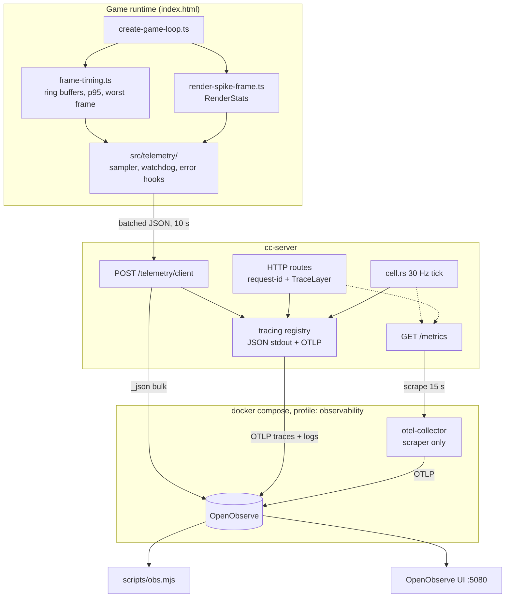

# Observability

How a failure gets from a player's machine or a server tick into something you
can read back.

The design goal is **diagnosis from data**, not dashboards: "why is FPS low on
planets" and "what threw this 500, with a stack trace" have to be answerable by
querying, without reproducing the fault. Everything below follows from that.

## Pipeline



## Design decisions

**OpenObserve replaces Loki + Tempo + Prometheus + Grafana.** One binary for all
three signals, and — the reason it was chosen over that stack — one `_search`
endpoint with SQL across all of them. Correlating a client frame sample to a
backend 5xx is a single query rather than a cross-datasource join.

**The collector exists only to scrape.** OpenObserve accepts OTLP pushes but has
no scraper, and the backend's metrics are a Prometheus endpoint. Backend traces
and logs go straight to OpenObserve and never pass through the collector.

**The client does not speak OTLP.** It posts compact JSON to
`POST /telemetry/client`, which stamps identity and forwards. The browser SDK
was rejected on four counts: ~100 kB on a bundle already carrying three.js and
WASM; a span-per-frame model that does not fit a 60 fps loop; a public ingest
endpoint being an unauthenticated write path into the log store; and the SDK
duplicating across a 2–6 worker terrain pool plus the vegetation pool.

The cost is that there is no distributed client→server trace. Correlation is by
`sessionId` (client-minted, on every request as `X-Client-Session`) plus
`requestId` (server-minted, returned as `x-request-id` and exposed through CORS).

**Frames are metrics, never spans.** 60 spans/sec/player is unaffordable and
unreadable. `frame-timing.ts` already aggregates into ring buffers; the sampler
exports that summary every 10 s and emits separate `freeze` events for the
outliers a summary hides.

**Export is off unless configured.** With `OTEL_EXPORTER_OTLP_ENDPOINT` unset,
the backend behaves exactly as it did before any of this existed — a bare
`cargo run` never attempts an export, and `/telemetry/client` returns 202 and
drops. Telemetry must never be the reason something does not start.

## What is recorded

### Backend metrics (`/metrics`)

| Metric | Why it exists |
|---|---|
| `cc_cell_tick_duration_seconds` | The 30 Hz tick uses `MissedTickBehavior::Skip`, so an overrun is absorbed silently. This is the only way a late cell is distinguishable from a healthy one. |
| `cc_cell_tick_overrun_total` | Count of ticks over the fixed timestep. |
| `cc_cell_entities` | Distribution, not a gauge — every cell task writing one gauge would overwrite the others. |
| `cc_cell_fanout_dropped_total` | Load shedding, previously only a `warn!` with nothing to graph. |
| `cc_cells_owned`, `cc_world_sessions_active` | Node occupancy. |
| `cc_frame_publish_fallback_total` | Snapshots too big for a datagram — an early symptom of snapshot bloat. |
| `cc_http_requests_total`, `cc_http_request_duration_seconds` | Labelled by **matched** route. |
| `cc_db_pool_connections`, `cc_db_pool_idle` | Pool saturation looks like "the database is slow" while Postgres is idle. |

**Cardinality rule, non-negotiable:** `player_id`, `cell_id`, `entity_id` and
`session_id` are never metric labels — each distinct value is a permanent time
series. They belong in log fields and trace attributes. Labels stay limited to
matched route, method, status, and fixed enums.

### Backend logs

One line per request (`request completed`, with status and latency) and one
detailed line per 5xx carrying `error`, `error_chain` and `backtrace`. The chain
matters: a failed insert surfaces as "error returned from database" at the top
with the unique-constraint violation three links down. The backtrace requires
`RUST_BACKTRACE=1`, which both compose files now set.

### Client events

`kind: 'frame'` every 10 s, `kind: 'freeze'` for stalls ≥ 250 ms, `kind: 'error'`
for uncaught exceptions and rejections, `kind: 'boot'` once.

The field to read first on any frame sample is **`outsideJsMs`** — wall-clock
time minus `simMs` and `renderMs`. High `outsideJsMs` against a low `jsMs` means
the frame is going to GPU submit, the compositor, or vsync, and profiling the
call tree is wasted effort. It has been computed every frame for a long time and
never left the machine before this.

Also carried: `terrainWorkerBuilds` (false means the worker pool died and tiles
are being built on the main thread — a prime suspect for planet-surface
stutter), `terrainBuildMsAverage`/`Peak`, draw calls, texture bytes, JS heap, and
the GPU vendor/device to group by.

Errors are deduped by message plus first stack frame, and reported at the 1st,
10th, 100th and 1000th occurrence — a fault firing every frame costs four
records, not thousands.

## Running it

```bash
npm run dev:infra            # postgres, redis, mailpit
npm run dev:observability    # openobserve + otel-collector (compose profile)
npm run dev:server
```

Then set the two variables so the backend actually exports — in `backend/.env`
for a local `cargo run`, or in the compose environment:

```
OTEL_EXPORTER_OTLP_ENDPOINT=http://localhost:5080/api/default
OTEL_EXPORTER_OTLP_HEADERS=Authorization=Basic <base64 of email:password>
```

**Confirm the backend actually exports.** It logs `OTLP export enabled` at
startup when the endpoint is set, and says nothing when it is not. Absence of
that line with healthy-looking JSON on stdout is the signature of an unset
`OTEL_EXPORTER_OTLP_ENDPOINT` — logs and traces go nowhere and OpenObserve looks
merely empty rather than misconfigured.

Three things that bite on a first run:

- **`ZO_ROOT_USER_PASSWORD` must pass a complexity check** — 8–128 characters
  with a lowercase, an uppercase, a digit and a symbol. OpenObserve panics at
  startup otherwise, and the only symptom is a container restart loop with one
  line in `docker logs`.
- **The collector scrapes `host.docker.internal:3000` in development**, because
  `npm run dev:server` runs the Rust server on the host rather than as the
  `backend` compose service. Production overrides it to `backend:3000`.
- **Ingest is authenticated, and a missing credential fails quietly.** With no
  `Authorization` header the scrape still succeeds and the *export* 401s, so the
  only evidence is `Exporting failed. Dropping data.` in the collector's log.
  `docker logs claude-citizen-otel-collector-1 | grep -i error` is the first
  thing to check when metrics do not arrive.

The client ingest URL is derived from that same endpoint
(`<base>/client/_json`), so there is no third variable to keep in sync.
`CLIENT_TELEMETRY_INGEST_URL` overrides it if OTLP points somewhere that is not
OpenObserve.

### Querying

```bash
export OBS_PASSWORD=...            # OBS_USER defaults to admin@claude-citizen.com
npm run obs errors -- --since 1h        # 5xx with chain + backtrace + request_id
npm run obs slow-frames -- --since 24h  # worst client sessions, ranked
npm run obs frames -- --session <id>    # one player's frame history
npm run obs freezes -- --since 24h      # stalls, worst first
npm run obs tick -- --since 1h          # cell tick p99, overruns, sessions
npm run obs logs -- --grep 'fan-out'
npm run obs sql 'SELECT * FROM "client" WHERE fps < 20'
```

The named subcommands are canned SQL so a diagnosis does not start by
rediscovering the schema; `sql` is the escape hatch.

## Security

- **`/metrics` is blocked at Caddy.** It is unauthenticated by design — meant
  for the collector over the compose network — and would otherwise publish live
  player counts, cell topology and node ids on the public API domain.
- **OpenObserve is loopback-only**, in development and production. Its login is
  served over plain HTTP; reach it with
  `ssh -N -L 5080:127.0.0.1:5080 <user>@<host>`.
- **Ingest is authenticated.** OTLP endpoints require an `Authorization` header,
  so the exporter, the collector and `obs.mjs` all need credentials.
- **`playerId` is stamped server-side** from the session cookie, never read from
  the request body.
- **`/telemetry/client` is unauthenticated on purpose.** A crash on the title
  screen, before any login, is exactly the report worth keeping. It is rate
  limited per session and capped at 256 events per batch, under the global
  512 KB body limit.

## Out of scope

Editor renderer and Electron main-process telemetry — the editor loads from
`cceditor://app`, whose requests are proxied through a main-process header
allow-list that drops anything not `content-type` or `accept`. Distributed
client→server trace propagation. Alerting. Migrating the existing `console.*`
call sites to a logger. `sim-core` instrumentation — it compiles to WASM and
ships to every player.
