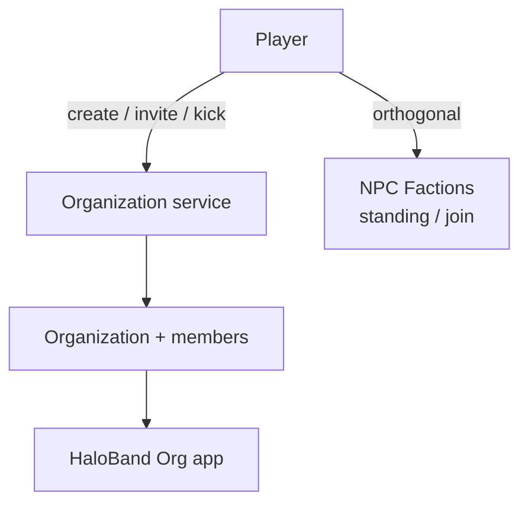
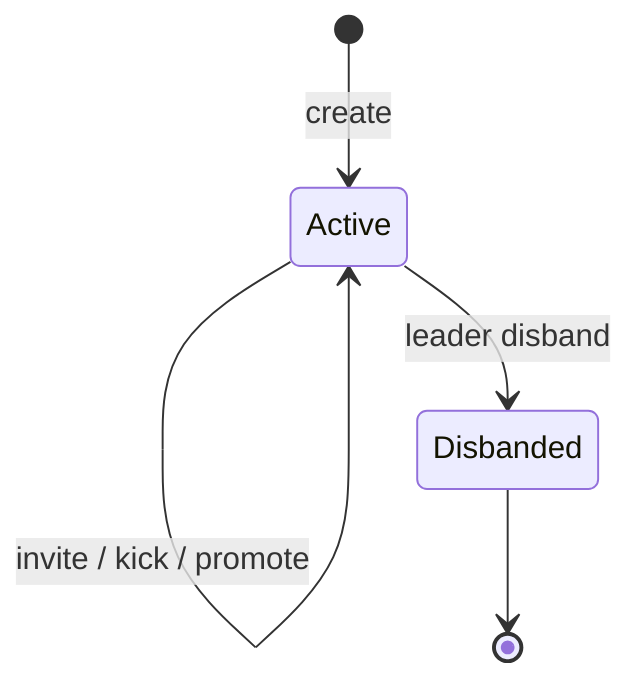

# Organization Architecture

Authoritative mental model for **Organizations** (**Orgs**) — player-created
crews / companies. Orgs are how players group with each other for social play,
shared identity, and later shared resources.

**Orgs are not NPC factions.** World guilds, allegiances, and reputation live in
[Factions](./factions). A player can be in an Org **and** hold faction
memberships; neither system aliases the other.

Related: [Factions](./factions) (NPC joinable guilds / standing),
[Missions](./missions) (personal contracts; optional Org group content later),
[Multiplayer](./multiplayer) (party vs Org — related but not identical),
[HaloBand](./haloband) (later Org app), [Progression](./progression),
[Item Mall](./item-mall) (Org cosmetics may sell for AC later — still not
faction rank), [Content delivery](./content-delivery) (no Org rows in catalog
promote).

**This doc is law.** Code may lag (no Org tables yet). Gaps are refactor
targets — not permission to invent client-only guilds, put Org banks on the
client, or reuse `Faction` catalog rows for player crews.

## Permanent decisions

### 1. Players create Orgs; operators do not author membership

| Piece | Where |
| --- | --- |
| `Organization` (name, tag, bio, heraldry ids, settings) | Durable Postgres — **player state**, not catalog |
| `OrganizationMember` (player, org, role, joined at) | Durable Postgres |
| Invites / applications | Durable + expiry |
| NPC faction defs | Catalog — [Factions](./factions) only |

Sync Catalog must **never** copy Orgs between environments as content.

### 2. One primary Org (MVP)

| Rule | MVP law |
| --- | --- |
| Membership | A player belongs to **at most one** Org |
| Create | Costs ARC (or is free once — GameSettings); unique name + short tag |
| Leave | Allowed; leader must transfer or disband first |
| Disband | Leader only; empties members |

Multi-Org membership is an explicit later flag — do not silently allow alts of
the data model without product sign-off.

### 3. Server owns membership truth

Create, invite, accept, kick, promote, demote, leave, disband are **server
intents**. Client shows roster and chrome only.

### 4. Roles (not faction ranks)

Org **roles** are crew permissions. They are not faction standing ranks.

| Role | Powers (MVP) |
| --- | --- |
| **Leader** | All; transfer leadership; disband; edit profile |
| **Officer** | Invite; kick members below officer; edit motd |
| **Member** | Chat; see roster; leave |

More roles (recruiter, banker) land with features that need them.

## What this rejects

- Treating Orgs as catalog `Faction` entries.
- Client-authoritative roster (“I added my friend locally”).
- Org rank granting NPC faction skill lines.
- Spending AC to buy faction exalted — Org shop cosmetics ≠ faction progression.
- Unlimited Org count per player without a product change.
- Using ambient NPC crowd ids as Org members.

## Identity

| Field | Rule |
| --- | --- |
| `name` | Unique per environment (case-insensitive); length limits |
| `tag` | Short unique tag (e.g. 2–5 chars) for nametags / chat |
| `heraldry` | Emblem / colors from allowlisted assets or AC cosmetics later |
| `motd` | Officer+ editable |
| `recruiting` | Open apply vs invite-only |

Profanity / reserved-name filters are server-side.

## Lifecycle

| Event | Outcome |
| --- | --- |
| **Create** | Player becomes Leader; debit create fee if any |
| **Invite** | Pending invite to target player; expiry |
| **Accept** | Join if not in another Org; clear invite |
| **Kick** | Member removed; not Leader |
| **Transfer leader** | Old leader → Member or leave; new Leader |
| **Disband** | All members cleared; Org row archived / deleted |

## Social features (phased)

| Feature | Phase |
| --- | --- |
| Roster + roles + invites | MVP |
| Org chat channel | MVP or soon after |
| Motd / recruiting flag | MVP |
| Org emblem on nametag | Soon |
| Shared mission / party prefer Org mates | Later |
| Org bank / shared hangar stash | Later — server inventory, not client |
| Org claims / stations | Much later — needs multiplayer claim law |
| Org vs Org rivalry boards | Later; still ≠ NPC faction war unless authored bridge |

## Bridge to Factions

| Rule | Meaning |
| --- | --- |
| Orthogonal progression | Org role ≠ faction rank |
| Personal rewards | Mission ARC / XP / faction XP go to the **player** |
| Optional filter | Group finder: “same allegiance faction” — cosmetic matchmaking |
| No auto-join | Joining an Org never joins an NPC faction |
| Cosmetics | Org heraldry can be AC Mall — does not bump faction standing |

When showing UI, keep **Factions** and **Organizations** as separate HaloBand
apps (or clearly separated sections).

## Bridge to party / multiplayer

| Concept | Law |
| --- | --- |
| **Party** | Short-lived group for instances / XP share rules — [Multiplayer](./multiplayer) / mission assist |
| **Org** | Durable membership |

Party invite ≠ Org invite. Org members may get a one-click “invite roster mate
to party” helper — still two systems.

## Pay and economy

| Action | Currency |
| --- | --- |
| Create Org | ARC (soft) preferred for MVP |
| Heraldry packs / rename tokens | Optional AC Mall later |
| Org bank deposit | Player ARC / items — server vault |

Never grant AsteronCredits from Org activities. Never sell NPC faction rank.

## Display

- HaloBand **Org** app: roster, invites, motd, leave / manage.
- Nametag: `[TAG] DisplayName` when in Org (distance-gated).
- Comms: optional Org tab alongside proximity chat.

## Ownership

| Concern | Layer |
| --- | --- |
| Org + member + invite rows | Postgres player/social state |
| Create / invite / kick / roles | Backend Org service |
| Chat | Chat / Comms pipeline with Org channel id |
| UI | HaloBand |
| NPC faction standing | [Factions](./factions) only |

## Invariants

- Organization ≠ Faction.
- At most one Org per player (MVP).
- Server-owned membership and roles.
- Org state is not catalog content.
- Org cosmetics / fees ≠ faction progression.
- Party and Org are different lifetimes.

## Open / later

- Schema + HaloBand Org app + invite flow.
- Org chat.
- Multi-membership / alliances between Orgs.
- Org bank + permission bits.
- Territory / claim hooks (explicit architecture add-on).

## See also

- [Factions](./factions)
- [Missions](./missions)
- [Multiplayer](./multiplayer)
- [HaloBand](./haloband)
- [Item Mall](./item-mall)
