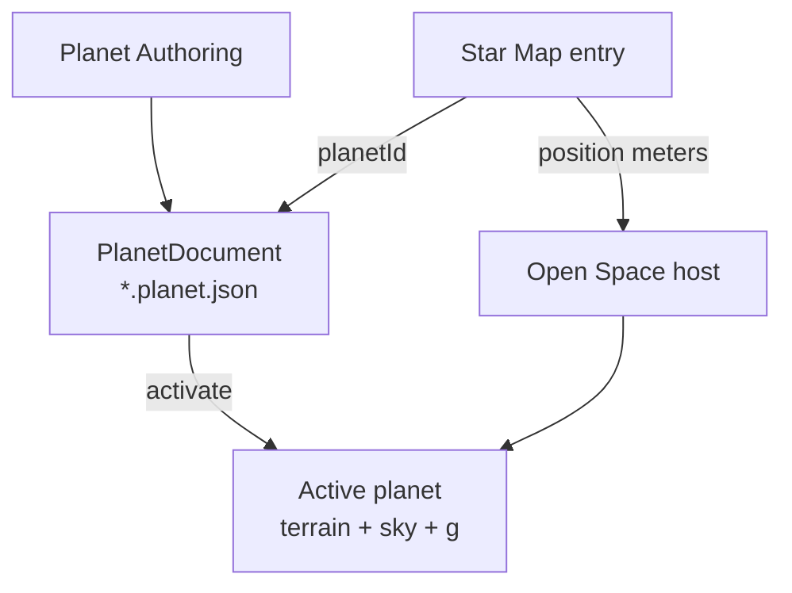
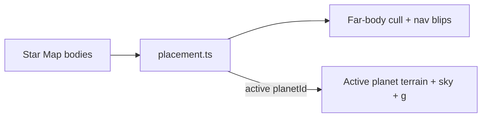

# Planets Architecture

Authoritative mental model for **planets and moons as playable bodies** — the
`*.planet.json` document that owns a body's recipe (size, gravity, atmosphere
shell, terrain, sky, surface life-support), how the [Star Map](./star-map)
places that body, and how Open Space picks an **active** planet for terrain /
atmosphere / gravity.

Related: [Star Map](./star-map) (ecliptic placement + `planetId` link),
[Space traversal](./space-traversal) (Open Space host, far-body cull, active
terrain), [Ship flight](./ship-flight) (atmospheric *g* + drag shell),
[Ship physics](./ship-physics) (atmosphere vs vacuum coast),
[Player](./player) (surface temperature + breathable air stress / HUD),
[Home Worlds](./home-worlds) (which body recipe binds starter life),
[Content delivery](./content-delivery) (planets ship via Build Web),
[Mobs](./mobs) (surface dens / wildlife on walkable bodies),
[Planet Authoring](../editor/planet-authoring) (editor how-to).

**This doc is law.** Code and planet documents may lag (breathable /
temperature-band fields, gas-giant body kind, multi-planet terrain, Random /
Presets UI). Gaps are refactor targets — not permission to invent a second
“planet settings” blob in scenes, hardcode Asteron physics in flight, or treat
sky scattering as life support.

## In plain English

A **planet document** is the recipe for one world: how big it is, how hard
gravity pulls, how thick the air shell is for ships, what the ground looks
like, what the sky looks like, and (later) whether you can breathe outside.

- Authors edit that recipe in the **Planet Authoring** tab.
- The **Star Map** only says *where* that world sits in the star system.
- Players feel the recipe when they walk outside or fly near the body —
including **how heavy their steps feel**. Heavy gravity makes walking and
running harder; light gravity makes them floatier / easier.

You do **not** need to hand-tune every slider for every new world. Planet
Authoring gives two shortcuts next to each other:

1. **Presets** dropdown — pick one of **10** named starting recipes and apply
   it to the open document.
2. **Random** button — roll a new recipe (new seed + sensible random knobs).

Both write into a normal planet document you preview / tweak / save. Neither
is a live server “loot a planet” for players.

## Permanent decision: one document owns the body recipe

A **PlanetDocument** (`*.planet.json`) is the full recipe for **one** celestial
body that can be linked from a Star Map planet or moon entry. The map decides
**where** the body sits in the system; the document decides **what** that body
*is*.

| Piece | Owner |
| --- | --- |
| Body recipe (id, radius, gravity, atmosphere shell, terrain, sky, surface env, vegetation, surface spawns) | **PlanetDocument** — project file |
| Ecliptic pose / parent / name on the map | **Star Map** system document entry (`planetId` → document id) |
| Which body is “home” for a new player | **Home world** offer → primary body id ([Home Worlds](./home-worlds)) |
| Live catalog (ships, items, …) | **Not** planets — planets are **Build Web** content ([Content delivery](./content-delivery)) |

### What this rejects

- Embedding gravity / atmosphere / terrain knobs on `game-manager` or scene
  `Runtime` instead of the planet document.
- Promoting planet recipes through Server Console / Postgres as continuous
  catalog (migrations may one-shot seed; live edits are project files).
- Treating `atmosphereHeightMeters` or Bruneton sky as automatically
  **breathable** ([Player](./player)).
- Two planets sharing one terrain / atmosphere stack at once (today: one
  **active** planet at world origin; switching bodies swaps the stack).
- Treating a gas giant’s cloud deck as walkable land terrain
  ([Home Worlds](./home-worlds) — Virelia).

## Naming

| Product term | Meaning | Code today |
| --- | --- | --- |
| **Planet document** | Body recipe file | `PlanetDocument`, `*.planet.json`, `src/world/planets/` |
| **Planet / moon map entry** | Star Map body that links a document | `system.planets[]`, `planetId` |
| **Active planet** | Body whose terrain + sky + *g* stack is live | `activatePlanetDocument`, world origin convention |
| **Surface** | Walkable outdoors on a rocky body | On-foot planet mode; not sealed interiors |

Prefer **planet document** when talking about the recipe. Prefer **map body**
when talking about ecliptic placement. Do not say “the system’s planet
settings” as if they lived on the system document itself.

## Delivery and authoring

| Concern | Path |
| --- | --- |
| Author | AsteronEngine **Planet Authoring** tab → project `*.planet.json` |
| **Presets** | Planet Authoring **Presets** dropdown (10 named recipes) → apply to open document |
| **Random** | Planet Authoring **Random** button → rolls a new recipe into the open document (or creates one) |
| Ship | **File → Build Web** (with scenes, prefabs, systems, assets) |
| Load (editor Play) | Open project documents via `/__editor` |
| Load (release) | Bundled / staged project overlay in the web build |
| Cache | Terrain / vegetation / surface-spawn IndexedDB keys fingerprint planet fields; **code** mesh/placement changes bump cache versions (AGENTS.md terrain cache rules) |

Planets are **not** Server Console catalog rows. Operators do not retune radius
or gravity in `/admin` for a live env — they ship a new project build (or edit
the project the Play session reads).

### Presets dropdown (Planet Authoring)

**Law:** Next to **Random**, Planet Authoring exposes a **Presets** dropdown
with **exactly ten** named starting recipes (engine-owned). Choosing one
**applies** that preset’s knobs into the open planet document. Author then
previews, tweaks, renames, and saves.

| Rule | Meaning |
| --- | --- |
| Ten presets | The catalog below is the initial locked set; rename / retune values in code, do not silently drop below ten without updating this law |
| Apply ≠ new file | Preset overwrites recipe fields on the **current** document (keep `id` unless author creates new); does not invent a second untitled buffer by default |
| Editor-only | Same as Random — authoring aid, not Play |
| Star Map separate | Applying a preset does **not** place a Star Map body |
| Home worlds overlap | Some presets mirror home-world *feel* (Asteron / Virelia / Korrath); they are authoring shortcuts, not a second home-world system |

#### The ten presets

| # | Id | Label | Kind | Plain feel |
| --- | --- | --- | --- | --- |
| 1 | `temperate-rocky` | Temperate rocky | Rocky / walkable | Earth-like mild band; breathable; Asteron-class starting point |
| 2 | `volcanic-hostile` | Volcanic hostile | Rocky / walkable | Mustafar / Korrath-class: extreme heat, ash, hostile outdoors |
| 3 | `gas-giant` | Gas giant | Gas giant / no land | Virelia-class envelope; no foot terrain; platforms are station-family |
| 4 | `desert` | Desert | Rocky / walkable | Arid dunes / bare rock; hot days, sparse vegetation |
| 5 | `ice-world` | Ice world | Rocky / walkable | Frozen crust, low temp band; thin life |
| 6 | `ocean-world` | Ocean world | Rocky / walkable | Mostly water; small landmasses / archipelagos |
| 7 | `jungle` | Jungle | Rocky / walkable | Wet, dense vegetation, warm / humid band |
| 8 | `barren-airless` | Barren airless | Rocky / walkable | Moon-like; little or no breathable air; grey rock; often **lighter *g* / floatier steps** |
| 9 | `high-gravity` | High gravity | Rocky / walkable | Heavy *g*; harder ship escape; **slower / labored walk and run** |
| 10 | `toxic-atmosphere` | Toxic atmosphere | Rocky / walkable | Thick visible sky / flight shell, but **unbreathable** outdoors |

Exact numeric recipes live in engine code (or a small preset table next to
Planet Authoring). Law owns the **ids, labels, and intent** above so UI and
docs stay aligned.

### Random button (Planet Authoring)

**Law:** Planet Authoring exposes a **Random** control **next to Presets**. One
click generates a **random planet recipe** — at minimum a new `seed`, plus
randomized knobs in the safe authorable ranges (physics, height / regions /
hydrology / biomes / palette / sky / vegetation as the generator supports).
Author then previews, tunes, renames, and saves a normal `*.planet.json`.

Optional later: Random can bias toward the last-selected preset’s *kind*
(e.g. “random desert-ish”) — not required for MVP; default Random is full
recipe roll.

| Rule | Meaning |
| --- | --- |
| Editor-only | Random runs in AsteronEngine authoring — not a player-facing “roll a planet” in Play |
| Still a document | Output is a normal PlanetDocument the author owns; Save writes project files |
| Deterministic after roll | Once saved, the `seed` + knobs replay the same world; Random again = new roll |
| Star Map separate | Random does **not** auto-place the body on a Star Map; author (or a later helper) links `planetId` |
| Not live catalog | No Console / Postgres path; same Build Web delivery as hand-authored planets |

What this rejects: generating planets only at runtime with no saveable doc;
hiding Random / Presets behind a separate tool outside Planet Authoring;
treating either as a way to bypass home-world offers for players.

## Document shape (law groups)

Exact JSON lives in `src/world/planets/schema.ts` (+ `sky-schema.ts`). Law groups
the fields so features know which bucket to extend.

### Identity

| Field | Role |
| --- | --- |
| `id` | Stable document id; Star Map `planetId` and home-world primary body point here |
| `name` | Display name |
| `seed` | Deterministic terrain / climate / spawn RNG root |

### Body physics (flight + presentation)

| Field | Role |
| --- | --- |
| `radiusMeters` | Body radius; places the surface and atmosphere shell |
| `gravityMetersPerSecond2` | Near-surface gravity strength (m/s²). Drives **ship** pull inside the atmosphere shell **and** **on-foot** walk / run / jump feel on that body’s surface. Vacuum ships: no planetary pull. |
| `atmosphereHeightMeters` | Radial shell above the surface where the ship is **in atmosphere** (drag + *g*). Not “breathable height.” |
| `dragSeaLevel` | Sea-level aerodynamic drag scale for flight in atmosphere |

Heavier *g* → harder / longer ship escape under the same thrust, **and**
slower / heavier on-foot locomotion. Lighter *g* → easier escape and floatier
strides. Do not hardcode Earth *g* in the flight computer **or** character
locomotion when a planet surface is active.

### Gravity and on-foot feel

**Law:** planet `gravityMetersPerSecond2` affects **walking and running** (and
jump arc) when the character is **on foot outdoors** on that body. This is
part of the fun of different worlds — not only a ship number.

| Planet *g* vs Earth (~9.8) | Walk / run | Jump |
| --- | --- | --- |
| **Heavier** (e.g. high-gravity preset) | Slower top speed; strides feel labored; sprint costs more effort to reach | Lower peak / snappier fall |
| **Earth-like** (temperate rocky / Asteron) | Baseline from character settings | Baseline |
| **Lighter** (small / moon-like / low *g*) | Faster or floatier horizontal motion; longer glide between steps | Higher / floatier hang time |

Rules:

1. **Character settings** still own the **Earth-baseline** walk / sprint / jump
   numbers (Base Characters → Char Settings). Planet *g* **scales** those —
   it does not replace them with a second unrelated speed table.
2. Scale from Earth: roughly `g / 9.80665` (exact curve tunable; clamp so
   ultra-heavy worlds stay playable and ultra-light worlds do not become
   cartoon teleport).
3. **Sealed interiors** (station / Hab / Hangar / ship cabin) use **artificial
   ~1g** locomotion — they do **not** inherit the outdoor planet’s heavy or
   light *g*. Same split as vitals: outdoors feels the world; indoors is life
   support ([Player](./player)).
4. Gas-giant floating cities = station-family floors → artificial *g*, not
   “walking on gas.”
5. Animation / footstep cadence should track effective speed so heavy *g*
   does not look like moonwalking at half speed with a full sprint clip.
6. Multiplayer: peers see the scaled motion; cell clamps still respect the
   effective top speed for that place ([Multiplayer](./multiplayer)).

What this rejects: only applying planet *g* to ships; applying outdoor *g*
inside Habs; a second hardcoded walk-speed list per planet id that bypasses
`gravityMetersPerSecond2`.

### Terrain and surface look (rocky / walkable bodies)

| Group | Role |
| --- | --- |
| `terrainAmplitudeMeters` | Height relief scale |
| `height` / `regions` / `hydrology` / `biomes` | Procedural landform + biome classification |
| `palette` | Surface / water colors |
| `vegetation` | Grass / tree density and asset urls |
| `spawning` | Surface prop / rock catalog |
| `spawnHint` | Optional landing / start hint |

**Mesh and feet must sample the same LOD grid** — full invariant list in
`AGENTS.md` (Terrain mesh vs foot placement). This architecture doc does not
fork that law.

Gas giants and other **non-land** bodies still have a PlanetDocument for
radius / gravity / atmosphere / sky, but **do not** expose a foot terrain
surface. Floating cities use station-family Runtime in the cloud deck —
[Home Worlds](./home-worlds).

### Sky (presentation only)

The `sky` block (day length, Bruneton scattering, sun, moon, stars, clouds,
night lift) is the **look** of the atmosphere. Editing sky **must not**
invalidate terrain / vegetation caches. Sky is not life support.

### Surface life-support (vitals)

Owned by the planet document for **outdoors on that body**. Conceptual fields
(exact keys land with implementation; do not invent a parallel scene flag):

| Field (conceptual) | Meaning |
| --- | --- |
| Surface temperature band | Cold / nominal / hot range the body feels on foot outdoors |
| Breathable (or air mix) | Whether unprotected lungs survive that atmosphere |

Rules carried from [Player](./player):

- Stress applies on **planet surface** only — not in stations, habs, hangars, or
  ship interiors (sealed life support).
- Open Space / vacuum without a suit = no air (not a planet strip).
- Thick unbreathable atmosphere is allowed: visual sky + flight shell can exist
  while breathable is false.
- HUD shows planet temp / atmosphere **only on planet surface**.

Until authored fields exist, baseline code may derive temp-like readouts from
biome samples — that is a **compat** path. New worlds (Korrath heat, toxic air)
must move to explicit planet fields, not more client heuristics.

## Body kinds

Projects may author more; law names the split that home worlds already require:

| Kind | Terrain | Outdoors vitals | Typical play |
| --- | --- | --- | --- |
| **Rocky / temperate** (e.g. Asteron) | Full procedural land | Mild band; breathable when authored | Hab → station → surface walks |
| **Rocky / hostile** (e.g. Korrath) | Full land; extreme recipe | Hot / hostile as authored | Sealed Hab first; surface later with gear |
| **Gas giant** (e.g. Virelia) | **No land terrain** | No “standing on ground” HUD | Floating cities (station family) in the envelope |

Do not encode “is home world” on the planet document. Home world is a **player
offer** that *points at* a body. The same Asteron document can exist without
being anyone’s home.

## Active planet and world origin

Open Space places **every** map body at true ecliptic meters
(`src/world/systems/placement.ts` is the **only** map→play conversion). The
**active** planet is a rendering / sampling convention:

1. World origin sits on the active planet (terrain stack requirement).
2. Other planets / stations / moons are still placed at real offsets; far bodies
   cull but keep pilot **nav** blips ([Space traversal](./space-traversal)).
3. Activating another planet **swaps** the terrain / sky / gravity stack — it
   does not mean two full terrain worlds run at once.

Do not filter station ownership or quantum targets to “children of the active
planet only” — that historically hid other planets’ stations. Placement and
nav list every body; only the **terrain mesh** is single-active.

## Flight vs on-foot vs sealed

| Context | What the planet document drives |
| --- | --- |
| Ship in atmosphere shell | `gravityMetersPerSecond2`, drag / `atmosphereHeightMeters`, sea-level drag |
| Ship in vacuum | No planetary *g*; residual space drag / coupled assist only ([Ship physics](./ship-physics)) |
| On foot outdoors (rocky) | Terrain; biomes; vegetation; spawns; temp / breathable stress; **walk / run / jump scaled by `gravityMetersPerSecond2`** |
| Station / Hab / Hangar / ship interior | No surface vitals stress; **artificial ~1g** locomotion (not outdoor planet *g*) |

## Multiplayer

- Planet **documents** are identical for every peer in a build (project files).
- Cell ownership / interest still follow place and mode
  ([Multiplayer](./multiplayer)) — standing on a planet surface is a cell like
  any other shared space.
- Do not invent client-only planet physics for one peer; flight *g* and
  surface stress outcomes that affect HP / death are server-owned when those
  loops are live.

## Baseline vs target

| Area | Baseline (today) | Target law |
| --- | --- | --- |
| Recipe file | `PlanetDocument` + Planet Authoring | Same |
| Physics knobs | `radius` / `gravity` / `atmosphereHeight` / `dragSeaLevel` | Same |
| Sky | Authored `sky` block | Same |
| Surface vitals fields | Mostly derived / incomplete | Explicit temp band + breathable on document |
| Body kind | Implied by content | Explicit kind (rocky vs gas giant / no-terrain) |
| Home worlds | Asteron doc live; Virelia / Korrath may lag | Full recipes + map entries |
| Multi-planet terrain | Single active origin | Same constraint until terrain stack is multi-body |
| **Presets** in Planet Authoring | Absent | Dropdown of **10** named presets; apply to open doc |
| **Random** in Planet Authoring | Absent | **Random** button rolls a saveable planet recipe |
| On-foot *g* scale | Fall uses planet *g*; walk/sprint mostly Earth baseline | Walk / run / jump **scaled** by planet *g* outdoors |

## Invariants

- One **PlanetDocument** per body recipe; identity is `id`, not file path.
- Star Map **links** documents; it does not duplicate gravity / terrain.
- Planets ship via **Build Web**, not continuous catalog sync.
- **Active** planet owns terrain + sky + atmospheric *g*; far bodies place and
  blip without a second terrain world.
- `atmosphereHeightMeters` / sky ≠ breathable.
- Surface temp / air stress only outdoors on a walkable body —
  [Player](./player).
- Gas giants have no land terrain; platforms are station-family.
- `placement.ts` is the sole ecliptic→play meter path; world origin = active
  planet by convention.
- Terrain mesh and foot sampling stay synchronized (AGENTS.md).
- Planet Authoring **Presets** (10) and **Random** produce normal, saveable
  PlanetDocuments — not player runtime rolls.
- Outdoor on-foot walk / run / jump scale with planet
  `gravityMetersPerSecond2`; sealed interiors stay ~1g artificial.

## Open / later

- Explicit `breathable` / temperature-band (and later radiation) on the schema.
- Explicit body kind + validation (gas giant must not require foot terrain).
- Virelia / Korrath planet documents + Star Map entries matching home offers.
- Moon documents sharing the same schema with parented map entries.
- Multi-planet simultaneous terrain (only if the render/physics stack stops
  assuming a single origin).
- EVA suits and planet-specific hazard gear as catalog items that *gate*
  surface stress — still read the planet’s recipe, do not bypass it.
- **Presets** + **Random** UX (side-by-side; optional Random bias from last
  preset kind; undo after apply; optional “also add Star Map entry”).
- On-foot *g* scale curve + animation / footstep retiming; clamp table for
  extreme high / low gravity presets.
