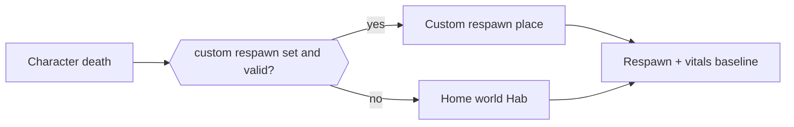

# Player Death Architecture

Authoritative mental model for **what happens when the character dies** —
causes of death, respawn place precedence, and vitals restored on wake. Body
vitals that *cause* death live in [Player](./player). Default home place lives
in [Home Worlds](./home-worlds).

Related: [Scene flow](./scene-flow) (first spawn only),
[Basic game loop](./game-loop) (Hab / station places),
[Multiplayer](./multiplayer) (cell-owned death + instance Hab),
[Ship combat](./ship-combat) (hull destroy ≠ character death by itself).

**This doc is law.** Code may lag. Gaps are refactor targets — not permission
to soft-fail into a ghost mode or let the client pick an arbitrary teleport.

## Permanent decision: respawn to home Hab, unless a valid custom point is set

When the character dies, the cell resolves **one** respawn target:

1. If the player has a **custom respawn** set and it is still **valid** → spawn
   there (station, other planet facility, claimed bed / terminal, etc.).
2. Otherwise → spawn in the player’s **home-world Hab** instance
   ([Home Worlds](./home-worlds)).

### What this rejects

- Client-chosen “respawn anywhere on the map” without a prior set point.
- Ghost / spectator as the **default** after death (may exist later as a
  product mode; it is not the law’s default).
- Treating ship hull destroy as automatic character death without an explicit
  eject / kill rule (ship loop stays [Ship combat](./ship-combat)).
- Leaving lethal toxicity on the body so respawn immediately re-kills.

## What counts as death

From [Player](./player), the character dies when:

| Cause | Condition |
| --- | --- |
| Trauma / environment / starve / dehydrate | **HP ≤ 0** |
| Medication overdose | **Toxicity ≥ lethal threshold** (even at full HP) |

Cell declares death. Client plays presentation; it does not self-authorize
respawn place.

## Respawn precedence

| Priority | Target | Notes |
| --- | --- | --- |
| 1 | **Custom respawn** | Player-set point at a station, other planet, bed, claim beacon, etc. Must still exist and be allowed for that player. |
| 2 | **Home-world Hab** | Always available fallback — the Hab bound at home-world select. |

Invalid custom examples (fall through to home Hab): destroyed claim, revoked
access, missing scene, wrong instance ownership.

How the player **sets** a custom point (bed interact, station terminal, map
pin) is product UX for a later slice. This law only owns **precedence**.

Death mid-flight / in Open Space still uses the same table — recover to custom
or home Hab, not “respawn in vacuum at the wreck” unless a custom point is
literally there.

## Vitals on respawn

Respawn must leave the character **playable**. Lock:

| Vital | On respawn |
| --- | --- |
| **HP** | Full (100%) |
| **Medication toxicity** | **Reset to 0** (avoids instant re-death after OD) |
| **Hunger** | Refill to a safe full (or high mid) baseline |
| **Thirst** | Refill to a safe full (or high mid) baseline |

Do not respawn at HP 1 with lethal toxicity still applied. Ongoing drain
timers resume after wake under normal [Player](./player) rules.

## Multiplayer

| Concern | Owner |
| --- | --- |
| Death declaration | Cell |
| Respawn target resolve | Cell (reads `homeWorldId` + custom respawn record) |
| Hab / instance cell | Same instance rules as live Hab — [Multiplayer](./multiplayer) |
| Death / wake FX | Client presentation from cell event |

Peers see death / wake as public events as product requires; they do not vote
on where you respawn.

## Ownership (when implemented)

| Concern | Layer |
| --- | --- |
| Death predicate (HP / toxicity) | `player/` domain + cell |
| Respawn precedence | Pure resolve + durable player record |
| Scene load to Hab / custom place | Scene host / travel path (same as authored place change, not a second teleporter stack) |
| Set-custom-respawn interact | Later UX on beds / terminals |

## Invariants

- Death from HP ≤ 0 or lethal toxicity ([Player](./player)).
- Respawn: valid custom point, else **home-world Hab**.
- Home Hab always exists as fallback once home world is chosen.
- On respawn: full HP, toxicity 0, hunger/thirst safe baseline.
- Cell owns death and respawn resolve; client owns FX / HUD.
- No default ghost mode; no client free-teleport respawn.
- Ship hull destroy does not silently mean character death.

## Baseline vs law (today)

| Piece | Baseline | Law |
| --- | --- | --- |
| Character death / respawn | Absent or ad hoc reload | Precedence table above |
| Home Hab fallback | Single starter scene | Per-player home world Hab |
| Custom respawn | Absent | Optional set point with validity check |

## Open / later

- Bed / terminal / claim UX to set and clear custom respawn.
- Short death cam or insured-item loss economy.
- Optional ghost / spectate mode as an explicit product choice.
- Eject / escape-pod rules when a ship is destroyed with the pilot aboard.
- Cooldown or material cost on rapid suicide-respawn.
