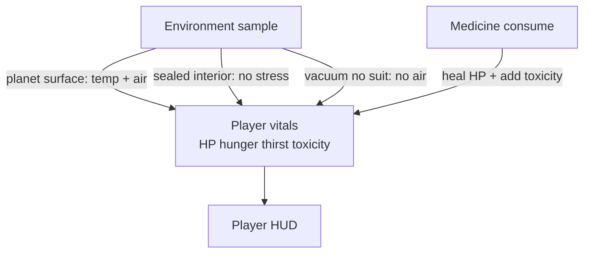
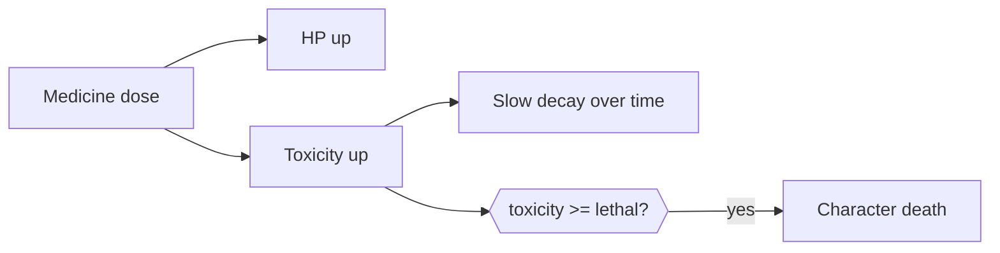

# Player Architecture

Authoritative mental model for the **on-foot / seated character’s vitals** —
hit points, hunger, thirst, environmental stress (temperature + breathable
air), medication toxicity, and which of those the HUD shows when. This is the
**player body** loop, not ship hull shields / hull HP.

Related: [Basic game loop](./game-loop) (where the character stands),
[Space traversal](./space-traversal) (planet surface vs sealed interiors vs
Open Space), [Home Worlds](./home-worlds) (Asteron / Virelia / Korrath;
signup bind), [Player death](./player-death) (respawn after vitals kill you),
[Multiplayer](./multiplayer) (cell-owned death / medicine; peers also see
loadout / pose / firearm fire — that doc),
[Content delivery](./content-delivery) (medicine as live catalog items),
[Ship combat](./ship-combat) (hull vitals are a **different** pipeline).

**This doc is law.** Code may lag. Gaps are refactor targets — not permission
to invent a second vitals model or a client-only heal path.

## Permanent decision: one character vitals model

The playable character has **one** vitals state for the body, regardless of
mode (on foot, seated in a ship, in bed, climbing). Ship **shields / hull**
are not player HP. Do not merge them.

| Vital | Role |
| --- | --- |
| **HP** | Body integrity. Reaches 0 → character death. |
| **Hunger** | Food need. Drains over time; empty → HP damage over time. |
| **Thirst** | Water need. Drains over time; empty → HP damage over time (typically faster than hunger). |
| **Medication toxicity** | Accumulated load from medicine / pills. Crosses lethal threshold → death even if HP is high. |
| **Environment stress** | Temperature + breathable air sampled from the **place** the body is in — not a stored bar, but a live input into HP (and HUD on planet). |

### What this rejects

- Client-authoritative HP / death / medicine apply (“local heal, sync later”).
- Conflating **ship hull** vitals with **player** HP.
- Showing planet temperature / atmosphere HUD inside stations, habs, hangars,
  or ship interiors.
- Infinite medicine spam with no toxicity cost.
- Migrations as the continuous path for medicine item defs (catalog + Console).

## Vitals

Ranges are product-tunable (Game Settings / constants); law is the **shape**.

| Vital | Full | Empty / lethal |
| --- | --- | --- |
| HP | 100% healthy | 0 → death |
| Hunger | Sated | 0 → starve damage to HP over time |
| Thirst | Hydrated | 0 → dehydrate damage to HP over time |
| Toxicity | 0 clear | ≥ lethal threshold → death |

- Hunger and thirst **drain continuously** while the character is alive.
- Food and drink (catalog consumables) refill hunger / thirst. Exact item
  loop is adjacent product work; it feeds this model, it does not fork it.
- Damage from starve / dehydrate / environment / combat all write the **same**
  HP channel. Death is HP ≤ 0 **or** toxicity ≥ lethal threshold. What happens
  next is [Player death](./player-death) — not a soft reload of the page.

## Home world and environment

Which planet recipe (and whether a walkable surface exists) comes from the
player’s **home world** and wherever they travel afterward —
[Home Worlds](./home-worlds). Initial offers: **Asteron** (temperate rocky),
**Virelia** (gas giant / floating cities, no land terrain), **Korrath**
(volcanic / extreme heat). Stress rules below still apply; home world only
picks the body and starter Hab.

## Environment stress

Players are sensitive to **planet temperatures** and need **breathable air**.
Planets may author an atmosphere that is **not** breathable.

### When stress applies

| Place | Temperature | Breathable air | Notes |
| --- | --- | --- | --- |
| **Planet surface** (on foot outdoors) | Yes — from planet recipe | Yes — from planet recipe | Extreme cold / heat damages HP over time. Unbreathable air damages / kills over time. |
| **Stations, habs, hangars, ship interiors** | No stress | Sealed life support | Always treated as safe air and temperate for vitals. |
| **Open Space / vacuum** without a sealed suit | N/A (no surface band) | No air | Lethal over time. **EVA / sealed suit** is later; law names the gap. |

Do not apply planet surface temp/air rules inside a sealed `Runtime: station`
/ `hab` / `hangar` scene or a ship cabin. Do not treat Open Space as “fine
because the ship exists nearby” — the **body’s** place decides; a character
outside a hull without a suit has no air.

### Planet authoring (law names, not a schema patch here)

The active planet document owns surface environment for vitals:

| Field (conceptual) | Meaning |
| --- | --- |
| Surface temperature band | Authored cold / nominal / hot range the body feels on that world |
| Breathable flag (or air mix) | Whether unprotected lungs can survive that atmosphere |

Exact JSON keys land with the implementation. Sky / Bruneton scattering and
`atmosphereHeightMeters` (flight *g* shell) are **not** automatically
“breathable” — a thick unbreathable soup is allowed.

### HUD vs damage

Planet **temperature** and **atmosphere / breathability** appear on the HUD
**only while on planet surface**. Stress damage still follows the table above
even when a HUD strip is hidden (e.g. vacuum: no planet strip, still dying).

## Medicine and toxicology

Players may take **medicine or pills** (live catalog consumables — item
definitions, not Build Web–only props).

| On consume | Effect |
| --- | --- |
| Heal | Restores HP (amount from item def) |
| Toxicity | Adds to **medication toxicity** (amount from item def) |

Rules:

1. Every healing dose **must** add toxicity. No zero-toxicity miracle heal in
   the base model (antidotes / special clears are a later product slice).
2. Toxicity **decays slowly** over time while alive.
3. If toxicity crosses the **lethal threshold**, the character dies — even at
   full HP. That is the hard stop on “too much medicine.” Respawn clears
   toxicity so wake is playable — [Player death](./player-death).
4. Cell applies consume + HP + toxicity in one authoritative outcome. Client
   predicts HUD only.

Medicine defs live in the **Postgres catalog** and are edited per environment
via Server Console — [Content delivery](./content-delivery). Do not ship a
parallel hard-coded heal table that bypasses items.

## Player HUD

Visibility is part of the law, not polish.

| Element | When shown |
| --- | --- |
| **Hunger** | Always (while alive / in play) |
| **Thirst** | Always |
| **Toxicology report** | Always (current toxicity vs lethal — clear bar still visible) |
| **Planet temperature** | **Only on planet surface** |
| **Planet atmosphere / breathability** | **Only on planet surface** |
| **HP** | **Only when below 100%** |

Hidden does not mean unused: vacuum asphyxiation and sealed-interior safety
still run when the planet strip is off. Full HP stays off-HUD so the chrome
stays quiet until the body is hurt.

Peers do not need full vitals bars. Multiplayer may show damage / death FX
only; local HUD owns the full report.

## Multiplayer

| Concern | Owner |
| --- | --- |
| Hunger / thirst drain ticks | Cell (or cell-validated) |
| Environment HP damage | Cell |
| Medicine consume intent | Client intent → cell apply |
| HP / toxicity / death | Cell |
| Respawn place | Cell — [Player death](./player-death) |
| HUD bars / toxicology / planet strip | Client presentation |

- Death and medicine outcomes are shared gameplay — design replication with
  the feature ([Multiplayer](./multiplayer)). Do not ship local-only HP for
  the local body and promise sync later.
- Peers must also see equipped gear, locomotion / combat pose, and firearm
  fire — not vitals-only. Law lives under **Character presentation** in
  [Multiplayer](./multiplayer); this doc does not own that wire.
- On-foot **position** remains client-reported + clamp; vitals are not
  position. Do not put heal authority on the client because “on-foot is
  client-ish.”
- After death: custom respawn if valid, else **home-world Hab**
  ([Home Worlds](./home-worlds), [Player death](./player-death)).

## Ownership (when implemented)

| Concern | Layer |
| --- | --- |
| Vitals state + drain + thresholds | `player/` domain (pure) |
| Environment sample from place / planet | `world/` + scene runtime place |
| Consume / death outcomes | Cell + intents |
| HUD strips | `render` play chrome (reads vitals; never mutates them) |

`player/` stays free of Three / DOM. `render/` never decides death.

## Invariants

- One character vitals model: HP, hunger, thirst, medication toxicity.
- Ship hull / shields ≠ player HP.
- Planet surface: temp + breathable air from planet recipe; may be lethal.
- Sealed stations / habs / hangars / ship interiors: no temp/air stress.
- Vacuum without sealed suit: no breathable air (suit / EVA later).
- Medicine heals HP and **always** adds toxicity; lethal toxicity kills.
- Toxicity decays slowly; antidotes later.
- HUD: hunger, thirst, toxicology always; planet temp/atmo on planet only;
  HP only below 100%.
- Cell owns vitals outcomes; client owns HUD presentation.
- Medicine items are live catalog, not migration churn.
- Lethal vitals → [Player death](./player-death); starter place →
  [Home Worlds](./home-worlds).

## Baseline vs law (today)

| Piece | Baseline | Law |
| --- | --- | --- |
| Character HP / hunger / thirst | Absent or ad hoc | One vitals model |
| Planet temp / breathable | Flight *g* / sky only | Surface vitals + HUD on planet |
| Medicine / toxicity | Absent | Heal + toxicity + lethal threshold |
| Player HUD strips | Combat / flight chrome | Rules table above |
| Home world / death respawn | Single starter / absent | [Home Worlds](./home-worlds) / [Player death](./player-death) |
| Authority | N/A | Cell for outcomes |

## Open / later

- EVA / sealed suit (vacuum and hostile air survivable when worn).
- Antidotes or toxicity clears as catalog items.
- Food / drink item loop and starve/dehydrate tuning curves.
- Disease, infection, or other status effects beyond medication toxicity.
- Cold / heat presentation (shiver, frost FX) as cosmetics on top of HP drain.
- Peer-visible vitals bars (default: damage / death FX only).
- Home-world transfer and custom-respawn UX — see those docs’ Open / later.
