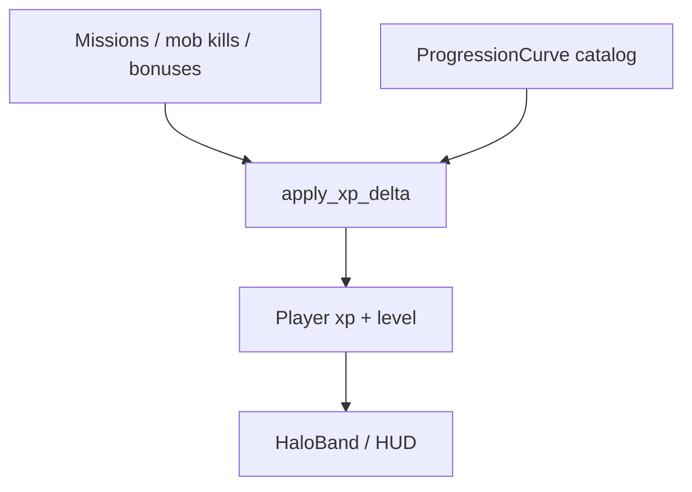

# Progression Architecture

Authoritative mental model for **character progression** — experience points
(XP), **soft character level**, and how those gate content without turning the
game into a mandatory power-creep treadmill. Fits a web MMO with station
contracts and traditional MMO readability (a level number players
understand).

Related: [Player](./player) (vitals ≠ level), [Player death](./player-death)
(no XP loss on death), [Missions](./missions) (mission XP rewards),
[Mobs](./mobs) (kill XP), [Loot tables](./loot-tables) (level-gated entries),
[Factions](./factions) (faction XP / rank — separate track),
[Organizations](./organizations) (player Orgs — no XP),
[Item Mall](./item-mall) (AC ≠ XP),
[Content delivery](./content-delivery), [HaloBand](./haloband) (later XP bar).

**This doc is law.** Code may lag (no level columns yet). Gaps are refactor
targets — not permission to level-up on the client, sell XP for AsteronCredits,
or make raw level the only DPS multiplier that silences skill.

## Permanent decisions

### 1. Soft level, not hard class treadmill

Each player character has:

| Field | Meaning |
| --- | --- |
| `xp` | Cumulative experience (durable) |
| `level` | Derived from XP via the **progression curve** (also stored for cheap reads; recompute on grant) |

Level is a **soft gate and readability signal**: unlocks higher threat-tier
missions, board pools, some loot entries, and mild passive bonuses. It is
**not**:

- A deep skill-tree / certification grind (out of scope for v1; may appear later
  as a parallel system).
- A gear-score wall where under-level players deal 1% damage forever.
- Account-wide battle pass XP mixed into character XP without an explicit
  product.

One playable character per account remains the baseline; if alts appear later,
XP stays **per character**.

### 2. Server grants XP; curve is catalog-tunable

All XP awards go through one **`apply_xp_delta`** (name flexible) with
idempotency keys. The **curve** (XP required per level) lives in catalog /
`GameSettings` so operators retune without shipping a client.

### 3. No XP loss on death

Dying resets vitals per [Player death](./player-death). **XP and level do not
drop.** Fail a mission → no mission XP (and no complete rewards); that is not
death penalty.

### 4. XP is not AC and not ARC

| Resource | Role |
| --- | --- |
| XP / level | Progression |
| ARC | Soft money |
| AC | Real-money Mall only |

Never convert AC → XP or XP → AC. Tiny ARC on level-up is optional flavor;
do not make leveling a money printer.

## What this rejects

- Client-side level-up (“I hit 20 locally”).
- Buying levels with AsteronCredits.
- Extreme combat scaling where level gap alone decides every fight (prefer
  gear + aim + numbers; level soft-caps content access).
- Separate undocumented XP currencies per activity without a sink into the
  same character XP (or an explicit second track).
- Requiring max level to use basic stations / flight.

## Level cap and curve

### Caps

| Knob | Suggested default | Notes |
| --- | --- | --- |
| `maxLevel` | **50** | Comfortable MMO arc; raise via catalog later |
| Starting level | **1** | `xp = 0` |

### Curve algorithm (canonical)

XP **required to advance from level L to L+1**:

$$
\Delta(L) = \mathrm{round}\bigl(A \cdot L^{B} + C\bigr)
$$

Suggested defaults (Console-tunable; not magic sacred numbers):

| Param | Default | Role |
| --- | --- | --- |
| $A$ | `100` | Scale |
| $B$ | `1.85` | Super-linear growth (classic MMO feel) |
| $C$ | `50` | Floor so early levels are not free |

**Cumulative XP** to *be* level $L$ (L ≥ 1):

$$
\mathrm{totalXp}(L) = \sum_{k=1}^{L-1} \Delta(k)
$$

with $\mathrm{totalXp}(1) = 0$.

Store either:

1. **Params** $A,B,C$ + `maxLevel` in `ProgressionCurve` / GameSettings, and
   compute on grant, or
2. An authored **array** `xpToNext[1..maxLevel-1]` for full hand-tune.

Law preference: **params for MVP**, optional override array later. Snapshot
`level` on the player row after each grant.

### Level-up side effects

On crossing a level boundary (may multi-level on a huge grant):

1. Update `level`.
2. Optional: grant `levelUpArcReward` (small, from settings) — once per level
   via idempotent key.
3. Optional: unlock flags / titles from a catalog `LevelReward` table.
4. Emit UI event (presentation).
5. **Do not** auto-inflate weapon damage by huge % — if combat bias exists,
   keep it mild (e.g. ≤1–2% effective per level band) or prefer content gates
   only for MVP.

## XP sources

| Source | Rule |
| --- | --- |
| **Mission complete** | `MissionDefinition.xpReward` (+ optional perfect bonus). Granted with mission rewards ([Missions](./missions)). |
| **Mob kill** | From `MobDefinition.xpReward` (or tier table), modified by level gap. |
| **First discovery** (later) | POI / system visit bonus; idempotent per player. |
| **Operator grant** | Console only. |

No XP for: Mall purchases, Stripe, idle time, chat, or crafting until an
authored recipe says so.

### Kill XP and level gap

Let $L_p$ = player level, $L_m$ = mob level (from MobDef).

Base $X_0 =$ mob `xpReward`.

$$
X = X_0 \cdot m(\Delta), \quad \Delta = L_m - L_p
$$

| $\Delta$ | Multiplier $m$ (suggested) |
| --- | --- |
| ≤ −5 | `0` (grey — no XP) |
| −4 .. −1 | `0.25 … 0.8` (lerp) |
| 0 .. +2 | `1.0` |
| +3 .. +5 | `1.1 … 1.25` |
| ≥ +6 | Cap `1.25` (no crazy farming up) |

Assist credit: split or full copy per assist rules — prefer **full personal XP
for each eligible assister** capped by a per-mob budget (e.g. max 4 assisters)
so co-op is not punished. Exact split is Console-tunable; law is server-side
and fair-by-default for help.

## Content gating (soft)

| Gate | Example |
| --- | --- |
| Mission / board | `minPlayerLevel` / `recommendedLevel` |
| Loot entry | `minPlayerLevel` / `maxPlayerLevel` ([Loot tables](./loot-tables)) |
| Shop tier (later) | High-end ammo vendor |
| Zone warning | “Recommended 15+” — soft, not hard wall unless authored |

Players may still *enter* most spaces under-level; boards and rewards
communicate risk. Hard blocks only when the def sets `enforceMinLevel`.

## Multiplayer

- XP grants are **per player** from server events (same kill may grant multiple
  personal awards under assist rules).
- Never trust a client “share XP” packet.
- Instance missions grant on that player’s completion path.

## Display

- HaloBand Home / character sheet: level + XP bar into next.
- Mission board: recommended level + XP reward preview.
- Floating combat text optional; keep budgeted.

## Ownership

| Concern | Layer |
| --- | --- |
| Curve / max level / gap multipliers | Catalog or GameSettings |
| `Player.xp` / `Player.level` | Postgres |
| `apply_xp_delta` | Backend progression service |
| Mission XP field | Mission catalog |
| Mob XP field | Mob catalog |
| UI bar | HaloBand / HUD |

## Baseline vs law

| Piece | Baseline | Law |
| --- | --- | --- |
| Level / XP | Absent | Soft level + cumulative XP |
| Curve | — | Parametric $\Delta(L) = A L^{B} + C$ |
| Death | Vitals reset | No XP loss |
| Combat power | Gear / aim | Soft gates; mild or no per-level DPS |

## Invariants

- Server-only XP deltas; idempotent.
- Level derived from curve; cap enforced.
- No XP loss on death.
- XP ≠ ARC ≠ AC.
- Soft content gates preferred over hard DPS walls.
- Kill XP respects level-gap multipliers.
- Co-op assists get fair personal XP under server rules.

## Open / later

- Columns + `apply_xp_delta` + HaloBand XP bar.
- Mission + mob XP fields in Console.
- Prestige / seasonal track (must not silently reset main level).
- Skill trees / certifications as a **parallel** system (ship size certs, etc.).
- Crafting / mining XP sink into the same character XP or a tagged profession
  track ([Harvesting](./harvesting)).

## See also

- [Missions](./missions)
- [Mobs](./mobs)
- [Loot tables](./loot-tables)
- [Harvesting](./harvesting)
- [Factions](./factions)
- [Organizations](./organizations)
- [Player](./player) / [Player death](./player-death)
- [Content delivery](./content-delivery)
