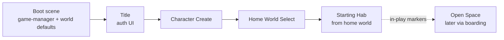

# Scene Flow Architecture

Authoritative mental model for **how a session begins** — from project boot to
the first gameplay scene. In-play travel after that (Hab ↔ Station ↔ Hangar ↔
Open Space) lives in [Basic game loop](./game-loop) and
[Space traversal](./space-traversal). Cell / instance choice during travel:
[Multiplayer](./multiplayer). Home world offers and bindings:
[Home Worlds](./home-worlds). Death respawn is **not** this pipeline —
[Player death](./player-death).

Related editor how-to: [Game flow](../editor/game-flow.md).

**This doc is law.** Editor templates and runtime may still carry legacy
`game-manager` on a title scene — treat that as back-compat, not the pattern to
copy.

## Permanent decision: boot owns the pipeline

A scene of **`kind: boot`** is the entry document. The project's `defaultScene`
(and release `asteron.runtime.json`) should point at it. Boot **never** runs
gameplay: it reads the pipeline off its **`game-manager`** and hands off
in-process via `scene-host` — never by reloading the page with new URL params.

Every hop is a **`game-manager` field**, so order is a **project decision**, not
an engine constant:

| Field | Role |
| --- | --- |
| `titleSceneId` | Auth / title UI scene |
| `characterCreateSceneId` | Appearance create when player has none saved |
| `homeWorldSelectSceneId` | Home world picker when player has no `homeWorldId` ([Home Worlds](./home-worlds)) |
| `startingSceneId` | Fallback / template first gameplay scene — **resolved per home world** when home worlds are live (usually that family's Hab) |
| `openSpaceSceneId` | Open Space host for `@space` / `exit-hangar` resolution |
| `loadingSceneId` | Optional loading document between hops |
| `requireAuth` | Unset means true — offline flow when false |
| `skipTitleWhenSignedIn` | Returning players may skip Title |
| `systemId` / `planetId` / spawn | World defaults; overridden by chosen home world bindings when set |

Leave a hop empty and it is **skipped** — no title scene means boot may host
title UI itself; no character-create scene falls back to an inline create gate;
no home-world select scene is only valid while a project still uses a single
global starter (legacy). Once home worlds ship, the select hop is required for
new characters.

### What this rejects

- Inferring entry order from `scene.kind` alone once the pipeline is authored.
- A second module that decides Title vs Create vs Home vs Starting precedence.
- Putting a second `game-manager` on Title / Character Create / Home World
  Select as the *design* (flow is configured in exactly one place — boot).
- Using boot / `game-manager.systemId` as the **in-play** path between Star
  Systems (that is Warp Gate — [Star Map](./star-map) /
  [Space traversal](./space-traversal)). Boot only picks the **starting**
  system — and with home worlds, that starting system comes from the chosen
  home world.
- One global `startingSceneId` Hab for every account once home worlds are live
  — starting Hab **resolves from** `homeWorldId`.

## One precedence rule

`resolveSceneFlowStep` (`src/world/scenes/scene-runtime.ts`) is the **single**
pure, stage-driven precedence function. Boot and post-auth hand-off both call
it so they cannot drift.

| Stage (conceptual) | Next hop |
| --- | --- |
| Needs sign-in | Title |
| Signed in, title not skipped | Title (non-blocking when already authed, per flags) |
| No saved appearance | Character Create |
| No `homeWorldId` | Home World Select |
| Otherwise | Starting Hab (from home world binding) |

Deep links into a specific scene outrank the pipeline after auth: the player
asked for a place. If the backend cannot be reached, prefer falling through to
Starting Hab over stranding on Title forever.

`src/app/scene-flow.ts` is the impure driver (session + bootstrap).
`scene-host.ts` only dispatches — no second entry policy inline.

## SceneEntryFlow travels with the session

The resolved flow (including `systemId` / `planetId` / spawn defaults,
`homeWorldId`, and `openSpaceSceneId`) rides the session as
**`SceneEntryFlow`**. Title, Character Create, and Home World Select
deliberately author **no** `game-manager`, so world defaults are not
duplicated on those documents.

Later hops that need `@space` or open-space scene id resolve through that
carried flow — hangar prefabs can name `@space` without knowing any project's
concrete open-space scene id ([Multiplayer](./multiplayer) travel tokens).

## Starting scene and station family

Once home worlds are live, the first gameplay scene is the **starter Hab**
bound to the player’s `homeWorldId` (`Runtime: hab`), coherent with the Star
Map station family that owns that `habSceneId` —
[Home Worlds](./home-worlds), [Game loop](./game-loop).

Boot may still author a template `startingSceneId` for offline / legacy
projects. Do not invent a second “spawn catalog” beside home-world offers +
Star Map ownership.

- Open Space is **not** the default first hop; players reach it via
  [game loop](./game-loop) boarding after hangar.
- Death respawn reuses home Hab (or a custom point) via
  [Player death](./player-death) — it does **not** re-run Title → Create.

## Runtime field vs kind

Menu / boot / loading / character-create / home-world-select documents use
**`Runtime: flow`**. Read `runtime` for how to treat the document; `kind` stays
editor taxonomy and boot back-compat. When they disagree, fix the document —
[Space traversal](./space-traversal).

## Ownership map

| Concern | Owns |
| --- | --- |
| Authored pipeline fields | Boot scene `game-manager` |
| Pure hop precedence | `resolveSceneFlowStep` (one function) |
| Session + bootstrap | `scene-flow` driver |
| Home world binding → Hab / system / body | Player record + home-world catalog |
| Load / switch / dispose | `scene-host` |
| In-play place changes | Markers only — not this pipeline |
| Death respawn | [Player death](./player-death) — not this pipeline |

## Invariants

- Boot owns entry; one `game-manager` pipeline per project entry document.
- One pure precedence rule; no second entry-order site; do not re-key off
  `kind`.
- Scene switches are in-process; never reload-the-page navigation.
- Title / Character Create / Home World Select do not own a competing Game
  Manager as the design.
- New characters choose a home world before first Hab spawn
  ([Home Worlds](./home-worlds)).
- `openSpaceSceneId` and world defaults travel with `SceneEntryFlow`.
- Starting system / Hab come from home world when set; Warp Gate changes
  system during play.
- After Starting Hab, only authored travel markers change place
  ([game loop](./game-loop), [multiplayer](./multiplayer)).

## Open / later

- Stronger editor validation: each home-world offer maps to a Star Map
  family's `habSceneId`.
- Loading-scene UX polish (still one hop field).
- Migrate legacy title-scene `game-manager` projects onto boot-only flow.
- Migrate single-global `startingSceneId` projects onto home-world resolve.
