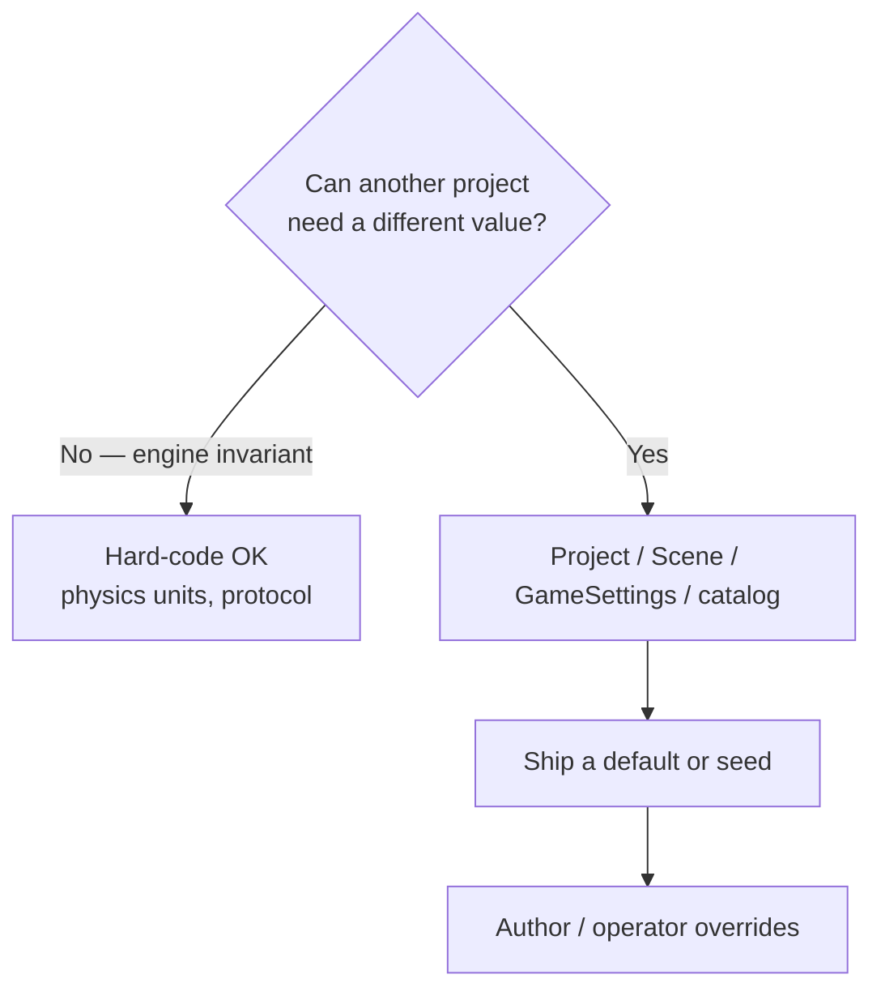
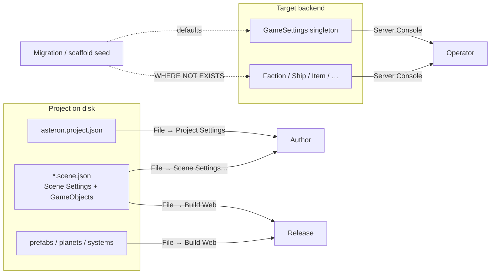

# Settings Architecture

Authoritative mental model for **configurable values** in AsteronEngine.
The engine ships games for **other projects**, not only ClaudeCitizen. Anything
that another studio reasonably needs to change without forking engine source
belongs in a settings or catalog surface — not a hard-coded constant.

Related: [Content delivery](./content-delivery) (Build Web vs catalog vs
migrations), [Projects and settings](../editor/projects-and-settings)
(how-to for `asteron.project.json`),
[Building scenes](../editor/building-scenes) (Scene Settings vs components),
[Game settings](../server-console/game-settings) (Console how-to),
[Space traversal](./space-traversal) / [Scene flow](./scene-flow)
(`Runtime` and boot fields as authored settings),
[Factions](./factions) / [Missions](./missions) / [Progression](./progression) /
[Loot tables](./loot-tables) / [Mobs](./mobs) / [Home Worlds](./home-worlds)
(catalog-authored world content; seeds OK),
[Character locomotion](./character-locomotion) (walk / sprint / jump baselines
authorable),
[Item Mall](./item-mall) / [Stripe](./stripe) (commerce catalog + env secrets).

**This doc is law.** Code may lag (some ClaudeCitizen ids still live in source).
Gaps are refactor targets — not permission to add new hard-coded world content
or env knobs in engine modules.

## Permanent decisions

### 1. If it can be a setting, it is a setting

Ask once before shipping a constant:

> Would another AsteronEngine project need a different value without editing
> TypeScript / Rust?

If **yes** → put it on the correct surface below (with a default). Do **not**
leave ClaudeCitizen-only truth as the sole path in engine source.

### 2. Defaults and seeds are fine — encouraged

Shipping a playable out-of-box experience is good. **Defaults and seeds are
not a loophole to avoid settings; they are how settings start.**

| Kind | OK examples |
| --- | --- |
| **Field defaults** | Schema / UI default for a new Scene Setting or Project Setting field |
| **New Project scaffold** | Starter `asteron.project.json`, boot/title scenes, sample prefab |
| **One-shot migration seeds** | Starter `GameSettings` row, faction / ship / loot catalog rows (`WHERE NOT EXISTS`) |
| **Fallback when unset** | Empty starter list → pick first catalog ship once — still Console-editable |

What stays wrong: treating the seed as permanent immutable law, or reading a
hard-coded id with no settings/catalog path to change it.

### Surfaces (never conflate)

| Surface | Store | Who edits | Examples |
| --- | --- | --- | --- |
| **Project settings** | `<project>/asteron.project.json` | Author — **File → Project Settings…** | `name`, `backendUrl`, `editorBackendUrl`, `defaultScene`, `defaultShipPrefab`, `build.outDir`, content-pack paths |
| **Scene settings** | Fields on the open `*.scene.json` (`SceneDocument`) | Author — **File → Scene Settings…** | `runtime` (`open-space` / `station` / `hab` / `hangar` / `flow`), `kind` (editor taxonomy / boot), other scene-level startup options — **not** GameObject components |
| **Game settings** | Postgres `GameSettings` singleton | Operator — Server Console **Game Settings** | Starting ARC, starter ship/prop/item ids, global live knobs (XP curve params when not their own table, PVE budget scales, …) |
| **Catalog definitions** | Postgres definition tables | Operator — Server Console CRUD | Factions, ships, items, weapons, missions, loot tables, mob defs, mall listings |
| **Project documents (content)** | Prefab / planet / system trees + scene **GameObjects** | Author — editor; ship via **Build Web** | Geometry, markers, planet recipes — components on entities, not Scene Settings fields |
| **Player client prefs** | Browser `localStorage` (`src/settings/game-settings.ts`) | End player — in-game menu | Render quality, volumes, input — **not** `GameSettings` |

**Scene Settings vs components:** scene-level options (`runtime`, `kind`, …) live
in **File → Scene Settings…** on the document. Contents of the scene are
components on GameObjects (`player-start`, `prefab-instance`, `scene-exit`,
…). Do not invent a hard-coded branch in `scene-host` that another project
would need to fork — expose a Scene Setting or a component.

**Naming trap:** TypeScript `GameSettings` in `src/settings/game-settings.ts` is
**player graphics / audio / input prefs**. Server `GameSettings` is the
operator singleton. Do not merge the names in docs or APIs without a qualifier
(`ClientGamePrefs` vs `GameSettings` row).

### What this rejects

- Hard-coding ClaudeCitizen faction ids, starter ships, home-world offers, or
  XP curves as the **only** path with no settings/catalog override. (Seeding
  those same rows is **good**.)
- Hard-coding which scenes are hangars / open-space / flow in engine code —
  authors set **Scene Settings → Runtime** (with a sensible default on new
  scenes).
- Putting live env knobs (starter ARC, grant lists) in `asteron.project.json`
  or Build Web output — those belong on `GameSettings` per backend (seed the
  singleton; operators edit).
- Putting authoring wiring (`defaultScene`, build outDir, editor backend URL)
  only in Postgres — authors need them offline in the project file (scaffold
  defaults OK).
- Putting per-scene knobs only in Project settings or GameSettings — each scene
  document owns its Scene Settings; Project settings name the **boot** scene id,
  not every scene’s runtime.
- Treating migrations as continuous catalog sync — seeds are **one-shot**
  ([Content delivery](./content-delivery)); they must not clobber operator edits.
- Inventing a parallel “engine.ini” for game or scene content.
- Refusing to seed because “everything must be empty until the operator
  types” — empty Postgres / blank New Project is a worse product.

## Choosing a surface

| Question | Prefer |
| --- | --- |
| Needed to **open / build / point** the project before a live backend exists? | **Project settings** |
| Applies to **this scene document** (what it *is* at play, startup options)? | **Scene settings** |
| Changes **per deployed environment** without rebuilding the client? | **Game settings** (or catalog) |
| Many named entities authors/operators CRUD? | **Catalog** (+ optional seed) |
| Geometry / markers / placed content inside a scene? | **GameObject components** → Build Web |

## Catalog + seeds (factions example)

**Factions** ([Factions](./factions)): operators define the world roster in
Console. The engine **should** seed a starter set (e.g. Authority, Traders,
Outlaws, wildlife aggro sides) so empty Postgres is not blank — same pattern
as starter ship definitions and the `GameSettings` singleton. After seed:

- Operators edit / delete / add freely.
- New migrations must not clobber operator edits (`WHERE NOT EXISTS` /
  upsert-by-id only for engine-owned seed ids).
- Runtime code reads catalog / settings ids — never assumes a fixed roster
  that cannot be changed without a code change.

Same **defaults + seeds** pattern for: progression curve rows, loot tables,
mission boards, home-world offers when they are catalog, mall baseline
listings, Scene Setting field defaults, New Project scaffolds.

## Invariants

1. **Multi-project first.** New knobs live on Project / Scene / GameSettings /
   catalog — hard-code only true engine invariants (protocol, SI units,
   non-tunable safety clamps).
2. **Defaults + seeds encouraged.** Every new setting/catalog surface ships a
   sensible default or one-shot seed; override stays on that surface.
3. **One owner per value.** Do not duplicate the same knob across Project
   settings, Scene settings, and `GameSettings`.
4. **Read `runtime`, not `kind`, for what a scene *is* during play** —
   [Space traversal](./space-traversal) / AGENTS.md. `kind` stays editor
   taxonomy + boot back-compat.
5. **Seeds ≠ promote path.** Seeds bootstrap; Console + Deploy → Sync Catalog
   promote live rows ([Content delivery](./content-delivery)).
6. **Client prefs stay client.** Graphics distances and volumes never become
   server `GameSettings` unless product explicitly makes them account-synced.
7. **Secrets stay server env / encrypted provider rows** — never project or
   scene JSON shipped to players ([Stripe](./stripe), JWT, DB URLs).

## Baseline vs law

| Area | Today | Law |
| --- | --- | --- |
| Project settings | `asteron.project.json` + Project Settings modal | Keep; grow only authoring/release fields |
| Scene settings | `SceneDocument.runtime` / `kind` (+ Scene Settings UI) | Grow scene-level options here; not hard-coded host branches |
| GameSettings | Starting ARC + starter definition id lists | Grow live singleton knobs here (or dedicated catalog tables when many rows) |
| Factions / missions / loot | Law docs; catalog may lag | Console CRUD + optional one-shot seeds |
| Client `src/settings/game-settings.ts` | Player prefs in localStorage | Keep separate from server `GameSettings` |

## Open / later

- Account-synced client prefs (optional) — still not operator GameSettings.
- Per-project “content pack” toggles beyond Sidekick path — Project settings
  or pack manifests, not hard-coded feature flags in runtime.
- Additional Scene Settings fields as products need them — always document +
  schema, never silent engine forks per title.
