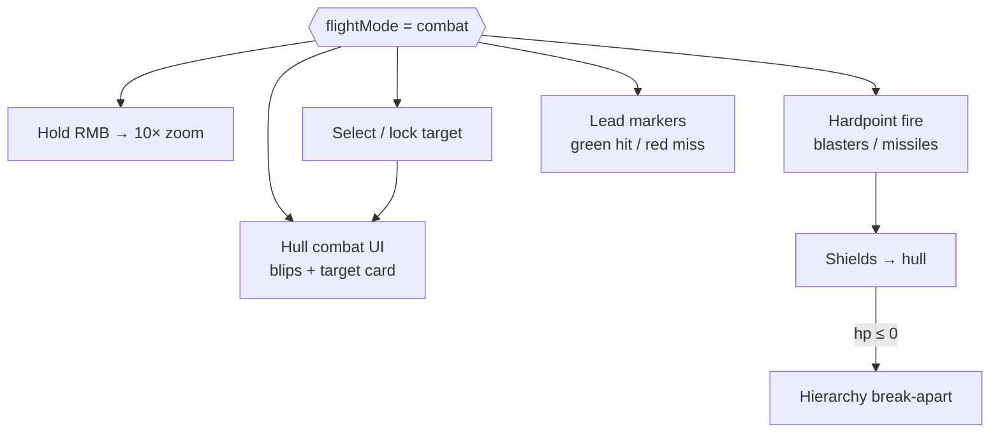

# Ship Combat Architecture

Authoritative mental model for **fighting in a ship** once the pilot is in
**Combat** flight mode (`world.flightMode === 'combat'`). Covers hardpoint
weapons (blasters + missiles), fire modes, targeting / lock-on, lead markers,
combat zoom, hull combat UI, vitals (shields → hull), and default destruction
(hierarchy break-apart).

Related: [Ship flight](./ship-flight) (Combat as a flight posture; modes cycle),
[Ship physics](./ship-physics) (vacuum coast while dogfighting),
[Space traversal](./space-traversal) (Open Space host; nav vs combat blips),
[Multiplayer](./multiplayer) (cell-owned damage / destroy),
[Ship controller](../editor/components/ship-controller) (hull vitals on the
prefab).

**This doc is law.** Code today may have Combat as a HUD/mode label and unused
ship vitals helpers — treat gaps as refactor targets, not as proof weapons are
out of scope. On-foot firearm combat (`game/combat`, character weapons) is a
**different** loop; do not reuse its magazine/crosshair path for ship hardpoints.
Peers must still see on-foot loadout / pose / fire —
[Multiplayer](./multiplayer#character-presentation-loadout-animation-fire).

## Permanent decision: Combat mode owns the fight loop

Ship combat is gated on **Combat** flight mode (tap **U** from Traverse). While
Combat is active, the pilot gets:

| Layer | Owns |
| --- | --- |
| Flight posture | Same flight computer → Rapier path as Traverse ([Ship flight](./ship-flight)) |
| Weapons | Authored hardpoints on the ship prefab (blasters, missiles) |
| Targeting | Soft select + hard lock-on against other ships |
| Aim assist read | **Lead markers** (circular) on every relevant contact |
| Combat camera | Hold **RMB** → **10× zoom** |
| Combat HUD | Hull UI: blips, markers, target card (3D wireframe preview + vitals) |
| Outcomes | Cell-authoritative damage on shields then hull; destruction FX on death |

Traverse stays “fly somewhere.” Nav stays travel (quantum). Combat is the only
mode that arms hardpoints and shows the full combat HUD. Do not fire ship
weapons from Traverse or Nav; do not open quantum from Combat.

### What this rejects

- Ship guns that work in Traverse / Nav (Combat is the fight posture).
- Reusing the on-foot weapon crosshair / mag HUD as the ship combat UI.
- Instant delete-on-death with no readable wreck beat.
- Lead-less “aim at the ship model center” as the only cue — distance demands
  a **lead** pip.
- Client-only damage outcomes for peer ships (cell owns hit resolve; client
  predicts presentation).

## Weapons

Ships mount **hardpoints**. Two families:

| Family | Role |
| --- | --- |
| **Blaster** | Hitscan or short-travel energy / projectile bolts from fixed or gimballed hardpoints. Primary dogfight gun. |
| **Missile** | Guided or unguided rocket. Slower, higher damage, ammo-limited. |

Hardpoints are authored on the ship prefab (marker + weapon def). Balance per
hull / per weapon — not a single global “ship DPS” knob unless every ship feels
wrong.

### Blaster fire modes

Each blaster chooses one fire mode:

| Mode | Behavior |
| --- | --- |
| **Semi** | One bolt per trigger press. |
| **Burst** | Fixed N-bolt burst per press (authored count + intra-burst interval). |
| **Full chain** | Holds fire at authored RPM while trigger held; stops on release or overheat / empty if those caps exist. |

Trigger input while Combat + hardpoint selected. Gimbal / fixed mount policy is
per hardpoint; aim reference is the combat reticle / lead, not free mouse paint
unless the hardpoint is explicitly turreted.

### Missiles

| Variant | Behavior |
| --- | --- |
| **Locking** | Requires a **hard lock** on the current target before launch (or before guidance arms). Seeker tracks the locked ship after fire. |
| **Non-locking** | Fires on trigger with no lock. Dumb / fire-and-forget along aim / lead at launch; no mid-course target swap. |

Locking missiles **do not** replace the soft target / hard lock UI — they
consume the same lock state. Non-locking missiles still benefit from lead
markers for the aim point at launch.

Ammo, reload, and magazine rules are per weapon def. Do not invent a second
inventory stack for “ship only” that bypasses the same durability / catalog
patterns peers must see.

## Targeting and lock-on

Two layers:

| Layer | Meaning |
| --- | --- |
| **Soft contact** | Other ships in interest / sensor range appear as blips and may show lead markers. |
| **Hard lock** | Pilot designates one ship as the **locked target**. A lock marker stays attached to that ship until cleared, out of range, or the target dies. |

- Lock input is Combat-only (exact binding TBD in input settings; do not hard-code
  a second mode cycle).
- Only **one** hard lock at a time for the local pilot (MVP).
- Locked or not, contacts that are valid fire solutions still show a **leader**.

### Lead markers (“leaders”)

Every relevant contact (locked **or** unlocked) shows a **circular lead
marker** — the point the pilot aims at so a bolt / missile fired *now* meets
the target given relative velocity and distance (“leading the target”).

| Lead color | Meaning |
| --- | --- |
| **Green** | Current weapon solution predicts a **hit** on that hull (or a live round just registered a hit — presentation may flash). |
| **Red** | Solution predicts a **miss** (wrong aim, out of range, occluded, or weapon not ready). |

The lead is a **presentation of ballistics / prediction**, not a second physics
body. Domain owns the predicted intercept; `render/` draws the circle. Do not
snap the ship nose to the lead — dual-reticle flight aim still applies
([Ship physics](./ship-physics)).

## Combat zoom

While `flightMode === 'combat'` and the pilot **holds right mouse button**,
the combat camera zooms by **10×** (FOV / focal length equivalent — pick one
implementation and keep it stable).

- Release RMB → return to Combat default FOV.
- Zoom does not change flight computer gains by itself; if feel needs tighter
  aim at 10×, tune separately and document it — do not silently rescale torque.
- Traverse / Nav ignore this hold for combat zoom (free-look / other RMB uses
  stay those modes’ own rules).

## Hull combat UI

Combat mode mounts its **own hull UI** (not the on-foot ammo strip, not Nav
body blips alone):

| Element | Role |
| --- | --- |
| **Contact blips** | Ships (and later turrets / threats) in sensor / interest range on a radar-style or canopy projection. |
| **Markers** | Soft contact markers, hard-lock diamond / bracket, lead circles. |
| **Target card** | Shown for the **locked** (or selected) target. |

**Nav body blips vs contact blips:** Star Map bodies (planets, stations, POIs,
Warp Gates) stay **nav** markers — [Space traversal](./space-traversal#nav-body-blips-vs-combat-contact-blips).
Combat contact blips are a **separate** set (peers / hostiles). Combat may show
nav underneath or filterable; it must not delete nav bodies or treat a station
blip as a lockable combat contact. Lead / lock UI attaches only to combat
contacts.

### Target card (locked / selected ship)

When a ship is targeted for lock-on (hard lock), the hull UI shows:

| Field | Content |
| --- | --- |
| **3D preview** | Small viewport of the target hull — **blue wireframe** shader (not a photo plate). |
| **Ship name** | Authored / catalog display name of the target hull. |
| **Player name** | Pilot / owner display name when known (peers via profile; NPCs / unmanned as authored). |
| **Shields** | Current / max shields. |
| **Hull HP** | Current / max hull. |

Wireframe preview is presentation-only; it must not allocate a second full
prefab load every frame — clone / impostor / simplified mesh from the already-
resident hull, budgeted.

Own-ship shields / hull remain on the existing HaloBand / vitals readouts;
combat UI adds **hostile / target** readouts, it does not replace own vitals.

## Vitals and damage

One vitals block per flying ship instance (already sketched on
`ship-controller` → `ShipSpec` / `ShipVitals`):

1. Incoming damage hits **shields** first.
2. Overflow hits **hull HP**.
3. Shield regen (authored `shieldRegenPerSec`) runs when rules allow (out of
   recent hit window if product adds one).
4. `hp ≤ 0` → **destroyed**.

Crash / ship–ship Rapier impulses may also feed the same vitals pipeline
([Ship flight](./ship-flight) contacts) — one damage door, not a parallel HP
system.

**Authority:** cell applies damage and destruction; clients predict local FX and
HUD. Presence / snapshots carry enough vitals for peers to see shield/hull
state on the target card and blips.

## Destruction (default)

Default death is a **hierarchy break-apart**, not an instant despawn:

1. Hull reaches `hp ≤ 0`.
2. Gameplay: ship becomes non-pilotable / non-firing; physics may switch to a
   wreck policy (debris bodies or kinematic settle — pick one and stick to it).
3. Presentation: **release the GLB node hierarchy** — parts separate from the
   root with modest impulse and authored FX (sparks, flash, smoke).
4. Timing must be **readable**. Parts drift and tumble at human-scale speeds —
   not near-instant scatter at extreme velocities. Prefer a multi-second wreck
   beat the attacker and victim can see.

Do not default to “delete mesh + particle puff only.” Do not fling debris at
unreadable speeds. Optional later: persistent wreck field, salvage — not
required for the default law.

## Ownership map (target)

| Concern | Owns |
| --- | --- |
| Combat mode gate | `flight` modes + `MODE_IN_SHIP` frame |
| Hardpoint defs / fire modes | prefab schema + ship runtime bake |
| Fire / ballistics / lead math | domain (`flight/` or dedicated ship-combat module — pure) |
| Lock state | domain + game mode frame |
| Damage / shields / destroy | domain vitals + **cell** authority |
| Combat zoom | input + camera feel (Combat only) |
| Blips / lead / lock markers / target card | `render` HUD (reads domain) |
| Hierarchy break-apart FX | `render` (reads destroy event) |
| On-foot guns | `game/combat` — **out of this doc’s loop** |

`flight/` (or a pure ship-combat sibling under domain) stays free of Three /
DOM. `render/` never decides hits.

## Multiplayer

- **Intents:** fire, lock acquire / clear, weapon select.
- **Authority:** hit detection, damage application, destroy flag on the cell.
- **Replication:** target identity, vitals, lock-relevant public state peers need
  for markers; destruction event so every viewer plays the break-apart.
- Do not ship “local-only hull HP” for peer ships and promise sync later.

## Invariants

- Ship weapons and combat HUD only while **Combat** mode.
- Hold **RMB** in Combat → **10×** zoom; release restores default Combat FOV.
- Weapons are **blasters** (semi / burst / full chain) and **missiles**
  (locking / non-locking).
- Hard lock keeps a persistent marker on the locked ship.
- Relevant contacts always show a **lead** circle; green = hit solution / hit,
  red = miss.
- Nav body blips (Star Map) and combat contact blips are separate sets —
  [Space traversal](./space-traversal#nav-body-blips-vs-combat-contact-blips).
- Locked target card: blue wireframe 3D preview + ship name + player name +
  shields + hull.
- Damage: shields then hull; one vitals pipeline with crash damage.
- Default death: **slow, readable** GLB hierarchy break-apart + FX.
- On-foot firearm loop stays separate; peer visibility for that loop is
  [Multiplayer](./multiplayer#character-presentation-loadout-animation-fire).
- Cell owns combat outcomes; client predicts presentation.

## Baseline vs law (today)

| Piece | Baseline | Law |
| --- | --- | --- |
| Combat mode | Mode + reticle CSS | Arms hardpoints + combat HUD + zoom |
| Ship vitals | Spec + unused `applyDamageToShip` | Live damage + destroy |
| Blasters / missiles | None | Authored hardpoints |
| Lock / lead | None | Soft contacts + hard lock + leaders |
| Combat zoom | None | Hold RMB ×10 in Combat |
| Target card | None | Wireframe + names + vitals |
| Destruction | Unused `isShipDestroyed` | Hierarchy break-apart |

## Open / later

- Turret seats as separate gunner stations (role already exists on seats).
- Overheat / capacitor / power priority (weapons vs engines vs shields).
- Countermeasures (flares / noise) vs locking missiles.
- Friendly-fire and station / civ exclusion volumes.
- Persistent wrecks and salvage.
- Atmosphere-specific ballistic / drag on bolts and missiles.
- Stronger mechanical flight differentiation Combat vs Traverse beyond HUD /
  weapons (still one demand → Rapier path).
