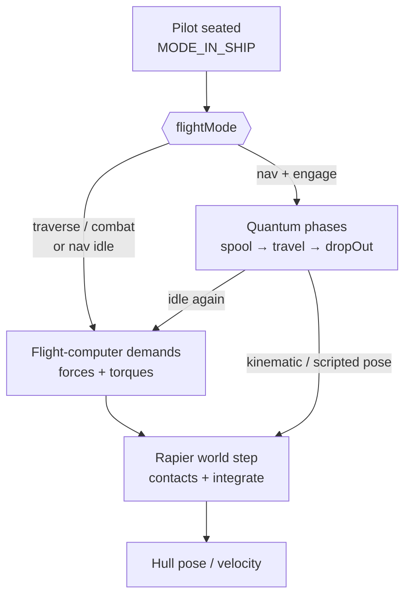
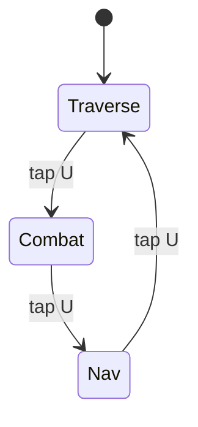
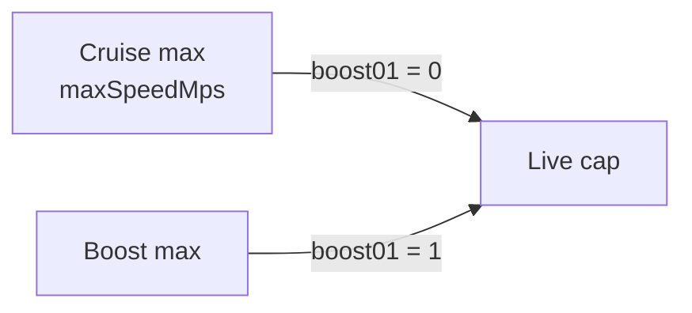
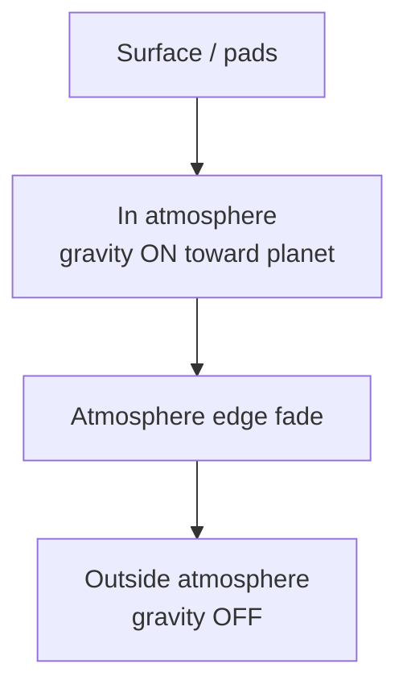
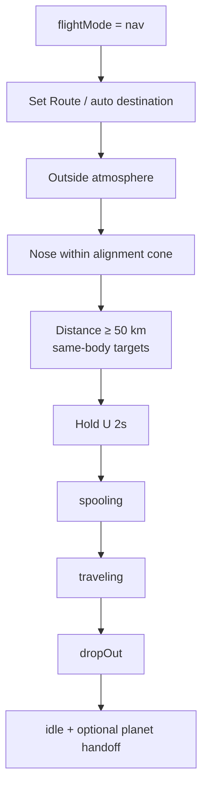

# Ship Flight Architecture

Authoritative mental model for **piloting a ship** once the player is seated
(`MODE_IN_SHIP`). Covers flight modes, controls, flight computer → Rapier force demand,
speed caps, boost, contacts (land / crash / ship–ship), and how Nav mode gates
quantum travel.

Related: [Space traversal](./space-traversal) (Open Space host, quantum
destinations, Warp Gates), [Basic game loop](./game-loop) (Hangar ↔ Open Space
boarding), [Scene flow](./scene-flow) (boot / starting system),
[Multiplayer](./multiplayer) (presence while flying; quantum peers),
[Ship physics](./ship-physics) (vacuum inertia, residual coast,
coupled assist), [Ship combat](./ship-combat) (blasters, missiles, lock-on,
combat HUD), [Ship controller](../editor/components/ship-controller)
(authored stats), [Star Map](./star-map) (ecliptic bodies quantum targets),
[Planets](./planets) (`gravityMetersPerSecond2`, `atmosphereHeightMeters`).

Tuning symptom → fix tables live in `.cursor/skills/ship-flight/SKILL.md`.
This doc is the **law**; the skill is the **dial**. Code may still carry a
legacy custom integrator — refactor toward this model; do not extend the
legacy path as the long-term design.

## Permanent decision: Rapier owns the hull; flight computer owns the stick

Ship **flight** is a **Rapier rigid body** in the world (cell-authoritative on
the server, predicted on the client through the shared sim core). **Flight computer** is
the control layer: it turns pilot input + dual-reticle aim into **forces and
torques** applied to that body. Flight computer does **not** integrate pose itself and
does not replace the solver.

| Layer | Owns |
| --- | --- |
| Per-hull feel | `ship-controller` stats → `ShipSpec` (mass, thrust N, torque N·m, caps) |
| Global flight-computer / coupled / boost knobs | `flight-config` (all ships) |
| Aim → torque / thruster **demands** (pure) | `flight/` (aim-track PD, coupled bleed policy, boost scale) |
| Rigid body, contacts, step | **Rapier** (`physics/` client + `sim-core` authority) |
| Flight modes | `traverse` \| `combat` \| `nav` |
| Quantum phases | Scripted travel that **overrides** thruster control while active |
| Pilot frame | `MODE_IN_SHIP` → apply demands → step → read pose |

**Balance one hull** on the prefab. Edit global flight-computer knobs only when *every*
ship feels wrong.

### Why Rapier (not a forever-custom integrator)

- **Landings and gear** share contact reality with pads / terrain / hangar decks.
- **Crashes, scrapes, ship–ship** collisions become solver outcomes, not special
  case clamps.
- **Authority** matches the rest of the stack: cells already run native Rapier;
  flight pose should not be a second truth beside the physics world.
- **Flight computer still owns feel** — mass, thrust, torque, aim PD, coupled bleed, boost
  caps stay authored game laws applied *as* forces, not “just fly the rigid
  body with no brain.”

### Split with on-foot decks

| Context | Physics |
| --- | --- |
| **Flying / seated pilot** | World-space Rapier body for the hull (Open Space / hangar air volume). |
| **On-foot on a parked hull** | Ship-local Rapier for deck colliders (doors, ramp, pad) — same as today. |

Do not put the walking character controller on the flying world body. Park /
land → hand off to deck world; takeoff → hull is dynamic in the flight world
again. One owner of “where is the ship” at a time.

### What this rejects

- A custom Euler integrator that writes ship pose while pretending Rapier is
  only for feet.
- Putting dual-reticle flight computer *inside* Rapier joints or motors as the only brain —
  Flight computer stays an explicit control law that emits forces/torques.
- Client-only flight physics with server dead-reckon that ignores contacts.
- **Vacuum gravity** on the flying hull (once outside the atmosphere shell,
  planetary pull does not keep dragging the ship — see **Atmospheric gravity**).
- Ignoring planet-authored `gravityMetersPerSecond2` while still inside
  atmosphere (escape must feel harder on heavy worlds).

## Flight modes

Piloting carries a sub-mode on `world.flightMode`. Tap **U** (default
`cycleFlightMode`) cycles while quantum is idle:

| Mode | Code | Role |
| --- | --- | --- |
| **Traverse** | `traverse` | Default cruise / transit. Full thruster authority through flight computer → Rapier. |
| **Combat** | `combat` | Fight posture. Same force path; HUD / reticle reads combat. Hull vitals (`maxHp` / shields) feed the ship combat loop. Soft points / weapon fire apply impulses or damage that Rapier / vitals resolve. |
| **Nav** | `nav` | Navigation / quantum posture. Destination markers + alignment. Quantum engage only here. Manual throttle demand is reduced while idle in Nav. |

### Mode rules

- Modes are **pilot posture**, not separate physics worlds. One Rapier hull
  body; mode gates quantum, HUD, weapon soft-points, and Nav throttle scale.
- Quantum **cannot** start outside Nav (`not-nav-mode`).
- Cannot cycle modes while a quantum phase is active (`spooling` /
  `traveling` / `dropOut`).
- Default on spawn / surface teleport: **Traverse**.
- Cross-system hops are **not** a fourth flight mode — approach a Warp Gate
  (thruster or quantum), then host swap. See [Space traversal](./space-traversal).

### What this rejects

- A second thruster model per mode (do not fork the demand → Rapier path).
- Quantum from Traverse or Combat.
- Treating Nav as “instant teleport” — timed spool / travel / drop-out inside
  the same Open Space host.
- Inferring mode from speed, altitude, or weapon draw. Mode is explicit input.

## Controls

Defaults below; all rebindable via Controls / input bindings.

### Thrusters and attitude

Attitude controls **lean into** [Ship physics](./ship-physics): **move the
mouse → HUD cursor moves → ship turns toward that cursor.** Cursor is
instant; nose lags (dual reticle). Same in atmosphere and vacuum.

| Input | Action |
| --- | --- |
| Mouse | Moves **aim cursor** immediately; flight computer turns the **nose toward** that target (torque; lags) |
| W / S | Forward / reverse thrust force |
| A / D | Strafe force |
| Space / C | Lift / descend force (VTOL; fights atmospheric gravity when climbing out) |
| Q / E | Roll **torque** (not snap bank) |
| Shift | **Boost** (scales forward thrust demand + speed cap while held) |
| B | Brake (opposing linear force / coupled-style bleed) |
| Alt+C | Coupled ↔ decoupled |

### Pilot / cockpit

| Input | Action |
| --- | --- |
| Hold F | Cockpit free-look (camera only) |
| Hold F + gaze + LMB | Activate `cockpit-control` (gear / ramp / canopy) |
| Hold Y | Leave seat (must be landable / exterior rules apply) |
| V | Cycle ship camera view |
| N | Toggle canopy (exterior-entry hulls) |
| Tap U | Cycle Traverse → Combat → Nav |
| Hold U (2s) | Engage quantum when Nav-eligible |

### Coupled vs decoupled

| State | Behaviour |
| --- | --- |
| **Coupled** (default) | No thrust demand → flight computer applies linear damping forces so velocity bleeds. Ship wants to stop relative to the local frame — **not** instant; see [Ship physics](./ship-physics). |
| **Decoupled** | Newtonian coast on the Rapier body. Release throttle and drift (weak residual space drag only). |

No auto-level: roll / pitch stick until the pilot corrects. **Inside
atmosphere**, planet gravity pulls the hull planetward (see below) — Space / C
and nose thrust must overcome it to climb out. **Outside atmosphere**, that
pull is off; climb and lateral flight are thruster forces only. Landing is
thrusters **plus** Rapier contact with pad / terrain / hangar geometry (gear
down changes contact shapes).

### Dual-reticle flight computer

Canonical attitude law lives in
[Ship physics — Mouse cursor → ship turns to target](./ship-physics#mouse-cursor--ship-turns-to-target-primary-path).
Summary: **mouse moves cursor; ship turns to that target.**

- **Aim cursor** = mouse target (updates immediately).
- **Nose pip** = where the hull actually faces (chases the cursor under inertia).
- Flight computer converts aim error into pitch / yaw **torque demand**; angular rate may
  still be soft-capped from authored `maxAngularRateRadps`.
- Hold F free-look does **not** move the aim cursor or redirect thrusters —
  camera only.

## Speed model

Speeds are **per hull**, authored on `ship-controller.stats.maxSpeedMps`, then
scaled by boost. Caps are enforced on the Rapier body’s linear velocity after
(or as part of) the control step — not by bypassing the solver. Quantum is a
separate travel phase and does not raise thruster caps.

| Name | Symbol / code | Meaning |
| --- | --- | --- |
| **Cruise max** | `maxSpeedMps` (`ShipSpec`) | Hard thruster speed cap with boost released. HUD cruise tick. |
| **Boost factor** | `BOOST_FACTOR` | While Shift held: forward thrust demand × `(1 + factor)` and speed cap × `(1 + boost01 × factor)`. |
| **Boost max** | `maxSpeedMps × (1 + BOOST_FACTOR)` | Absolute ceiling at full boost; speed bar scale. |
| **Live cap** | f(`maxSpeedMps`, `boost01`) | Frame velocity clamp between cruise max and boost max. |
| **Nav throttle** | reduced demand in Nav while manual | Softens approach while locking destinations. |
| **Quantum** | phase motion | Timed route — thruster / flight-computer demands suspended; body driven by travel controller then returned to Rapier dynamic. |

Accel feel ≈ `thrustN / massKg` (Rapier mass matches authored `massKg`). Turn
snap ≈ torque vs inertia tensor (authored torques + hull collider mass
properties). Capitals raise mass first; fighters raise torque / max angular
rate.

### Atmosphere, vacuum, and atmospheric gravity

Planet authoring owns two fields that flight must read (already on
`*.planet.json` / planet schema):

| Field | Role |
| --- | --- |
| `atmosphereHeightMeters` | Radial shell above the surface where the ship is **in atmosphere**. |
| `gravityMetersPerSecond2` | Surface / atmospheric gravity strength (m/s²). Default ~9.8 on Earth-like worlds. |

**Law**

1. **In atmosphere** (altitude above terrain/sea level below
   `atmosphereHeightMeters`, or atmosphere factor above the vacuum threshold):
   apply a continuous **planetward** force on the Rapier hull of magnitude
   `massKg × gravityMetersPerSecond2` (direction = −radial up / toward planet
   centre). Drag and idle hover damping still apply on top.
2. **Heavier gravity → harder, longer escape.** Net climb acceleration along
   radial up is roughly
   `(thrust_up − mass × g) / mass`. High `gravityMetersPerSecond2` eats vertical
   and nose-up thrust; weak ships take longer wall-clock time to reach the
   shell edge, and may stall / fall back if thrust cannot beat *g*. Authors
   tune planet *g* and per-ship `verticalThrustN` / `forwardThrustN` together.
3. **Atmosphere edge:** fade gravity (and ideally blend drag) across a short
   band near `atmosphereHeightMeters` so exit is not a hard switch that
   flings or drops the hull. Outside the shell, planetary gravity on the
   flying hull is **zero** — vacuum thruster flight, not orbital mechanics
   sim.
4. **Quantum** still requires **outside atmosphere**. Gravity does not apply
   during quantum travel; drop-out into atmosphere re-enables it.
5. **Hangars / station interiors** are not free-flight atmosphere shells —
   use contact + local rules; do not apply open-planet *g* through a station
   ceiling unless that volume is explicitly open-air on the body.

**What this rejects**

- One global hard-coded *g* for every planet.
- Keeping zero gravity through the whole climb so escape time ignores planet
  mass feel.
- Full N-body / orbital gravity for Open Space cruise (out of scope; vacuum
  flight stays thruster + flight computer).
- Inferring *g* from planet radius alone — authors set
  `gravityMetersPerSecond2` explicitly.

## Contacts: land, crash, ship–ship

Because the hull is Rapier, contact is first-class:

| Contact | Behaviour |
| --- | --- |
| **Soft landing** | Gear-down colliders + low relative velocity → settle on pad / terrain; may auto-clamp “parked” and hand off to deck physics. |
| **Hard landing / crash** | High impact impulse → hull/shield damage, possible debris / disabled thrusters; still solved by Rapier, outcomes owned by combat/vitals. |
| **Ship–ship** | Hull colliders interact; flight computer keeps applying demands unless disabled. Authority is the cell’s Rapier world. |
| **Station / hangar structure** | Same world contacts as pads — fly-through volumes (`enter-station`) stay trigger/sensor volumes, not fake teleports that ignore the body. |

Do not reintroduce a separate “ground clamp only” flight path that ignores
colliders once Rapier flight lands. Triggers for boarding remain markers; the
hull still *is* a physics body when it crosses them.

## Nav mode and quantum

Quantum bridges long Star Map distances **inside one system**. Full destination
catalog and Warp Gate law: [Space traversal](./space-traversal) /
[Star Map](./star-map).

### Engage pipeline

| Gate | Failure |
| --- | --- |
| Not Nav | `not-nav-mode` |
| Already in a quantum phase | `already-traveling` |
| No destination / route | `no-destination` |
| Inside atmosphere | `in-atmosphere` |
| Closer than min quantum distance (50 km) | `too-close` |
| Nose misaligned (> ~15°) | `misaligned` |
| Routed to current planet (no handoff) | `already-here` |

Interplanetary handoff destinations skip live-body alignment: engage when
routed and in space; drop-out may set a pending planet handoff for the play
loop.

During quantum:

1. Suspend thruster flight-computer demands.
2. Drive the hull with the travel controller (kinematic target or scripted
   velocities on the same Rapier body — pick one policy and stick to it).
3. On drop-out, restore dynamic body + flight computer.

Do not despawn the Rapier body for quantum inside one Open Space host.

## Combat mode

Combat is the **fight** posture in the mode cycle:

- Same flight computer → Rapier force path as Traverse.
- Reticle / HUD dataset switches to `combat`.
- Hull vitals (`maxHp`, `maxShields`, `shieldRegenPerSec`) live on the ship
  controller — one vitals block.
- Weapons, lock-on, lead markers, combat zoom, combat HUD, and destruction
  live in [Ship combat](./ship-combat) — not duplicated here.
- Crash / shove impulses may still hit the Rapier body and feed the same
  vitals pipeline.

Do not gate quantum, hangar mouths, or Warp Gates on Combat.

## Ownership map (target)

| Concern | Owns |
| --- | --- |
| Mode type + cycle | `flight` modes module |
| Global flight-computer knobs + speed helpers | `flight` config |
| Aim PD + thruster **demands** (pure) | `flight` (no Three, no Rapier import) |
| Apply forces / step / contacts | `physics` flight world + **sim-core** on the cell |
| Quantum eligibility + phases | `flight` quantum module |
| Nav route (Set Route) | `flight` nav-route |
| Bindings | input settings |
| Pilot frame | game `MODE_IN_SHIP` |
| Dual reticle / speed HUD | `render` effects (read-only pose) |
| Authored stats | `ship-controller` → ship runtime bake |
| Planet gravity / atmosphere shell | planet document (`gravityMetersPerSecond2`, `atmosphereHeightMeters`) |

`flight/` stays domain-pure: emit demands and quantum policy. Rapier stays in
`physics/` / `sim-core`. `render/` never steps physics.

## Invariants

- **Rapier owns hull pose and contacts** while flying; flight computer owns control demands.
- One mode enum: `traverse` \| `combat` \| `nav`.
- Cruise max is per-ship `maxSpeedMps`; boost multiplies thrust demand and the
  live velocity cap; quantum does not change those caps.
- Quantum only from Nav, only when eligibility passes, only inside one Star
  Map. Warp Gate is cross-system.
- Coupled bleed is opt-out (Alt+C), implemented as forces — not a third mode.
- **Atmospheric gravity** from the active planet’s `gravityMetersPerSecond2`
  while inside `atmosphereHeightMeters`; **no** planetary gravity pull in
  vacuum. Heavier *g* → harder / longer climb to leave atmosphere. No auto-level.
- Flying world body and parked deck world are distinct; never dual-drive the
  same pose from both.
- Multiplayer: cell Rapier is truth; client predicts with the shared core;
  presence publishes the flying body while `MODE_IN_SHIP`.

## Migration note

Legacy custom `integrateFlightBody` pose writing is **compat**, not the
target. New work (crash, ship–ship, gear contact landings, authoritative
flight) lands on the Rapier path. When both exist briefly, one pose owner per
frame — do not blend two integrators.

## Open / later

- Full gear-down contact sets and crash damage thresholds.
- Atmosphere-edge gravity / drag fade curve tuning (band width, ease).
- Ship–ship interest and collider LOD at Open Space ranges.
- Stronger Traverse vs Combat mechanical differentiation (still one demand →
  Rapier path). Weapons / targeting / destroy law: [Ship combat](./ship-combat).
- Quantum peer visibility / interest during travel phases.
- Master-mode power allocation (weapons / engines / shields) if product asks —
  not implied by the mode cycle alone.
