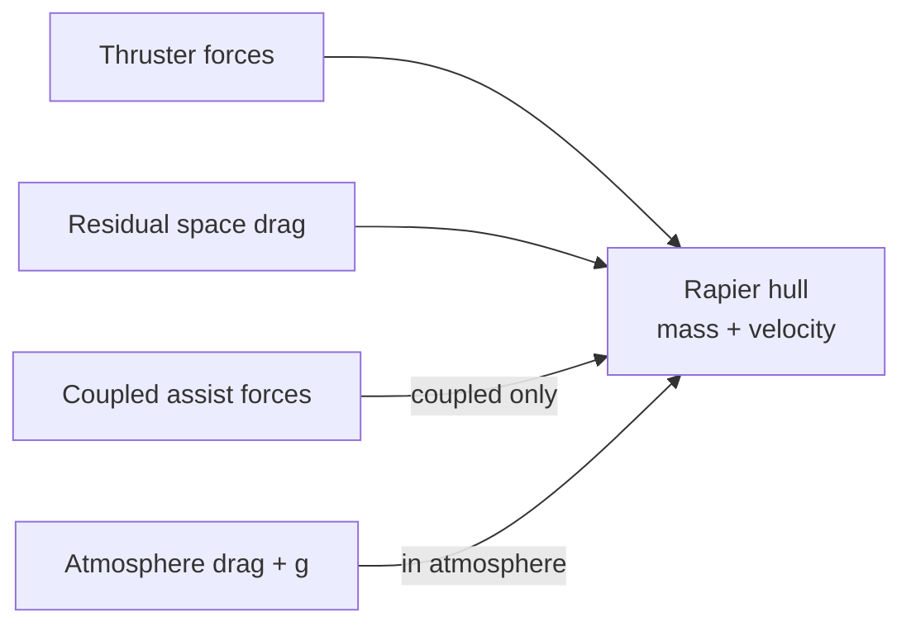
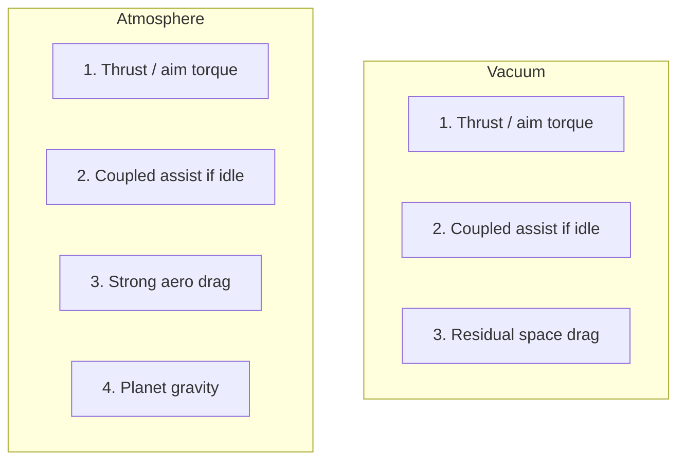

# Ship Physics Architecture

Authoritative mental model for **how a flying hull moves** under thrusters,
planet forces, and vacuum — and how **controls** (pitch / yaw / thrust) lean
into that physics. Pilot modes (Traverse / Combat / Nav) and quantum live in
[Ship flight](./ship-flight). This doc is the **motion + control-to-force law**.

Related: [Ship flight](./ship-flight) (modes, boost, quantum, atmospheric
*g*), [Ship combat](./ship-combat) (Combat mode weapons / lead while coasting),
[Space traversal](./space-traversal) (Open Space host), planet schema
(`gravityMetersPerSecond2`, `atmosphereHeightMeters`).

## Permanent decision: Newton in vacuum, with authored bleed

In space, a ship is a **Rapier rigid body** under Newton’s laws. Releasing
thrust does **not** slam velocity to zero. An object in motion stays in motion
until forces act. We still do **not** let a hull coast forever at full cruise
with no input — residual vacuum drag plus (when coupled) active thruster
braking bring speed down over a readable time.

| Regime | Linear motion when pilot releases thrust |
| --- | --- |
| **Vacuum + decoupled** | Near-Newtonian coast. Velocity holds; only weak residual space drag bleeds it over a long time. Pilot must counter-burn (or brake) to stop. |
| **Vacuum + coupled** (default) | Flight computer fires opposing thruster forces so velocity decays toward zero on a tuned time scale — still **not** instant. Heavy / fast ships skid farther. |
| **Atmosphere** | Real aerodynamic drag (stronger) + planetward gravity ([Ship flight](./ship-flight)). Coast dies faster; climb fights *g*. |

### Real physics (why this is not hand-wavy)

Newton’s first law: with no net force, velocity is constant. In deep vacuum
there is no air to stop a ship; real spacecraft coast until they thrust, hit
atmosphere, or accumulate tiny perturbations. Standard orbital mechanics
assumes thrust-free coast along a Keplerian path until another force appears
([orbital mechanics overview](https://en.wikipedia.org/wiki/Orbital_mechanics);
[Basics of Space Flight — orbital mechanics](http://www.braeunig.us/space/orbmech.htm)).

Even “space” near a planet is not perfect vacuum. Thin upper atmosphere still
exerts **drag** opposite the velocity vector; over time that removes energy and
can decay low orbits (weeks to years depending on altitude — see e.g.
[LEO drag / decay modeling](https://arxiv.org/html/2508.19549v2) and
Braeunig’s drag/decay notes). Drag is weak at high altitude and strong in dense
air — our atmosphere shell uses the strong end; vacuum uses a **tiny residual**
so play sessions stay readable.

### Game design (why we do not coast forever)

Pure infinite coast is correct physics and often bad UX for dogfights and
station approaches: no landmarks, no “foot off the pedal” stop, every burn
needs an equal counter-burn. Common products solve this with an **assist
layer** that auto-fires thrusters to cancel unwanted velocity when the stick
is idle — the same idea as science-fiction “inertial dampeners” (e.g. the
[Space Engineers inertial dampeners](https://spaceengineers.wiki.gg/wiki/Inertial_Dampeners)
design notes: vacuum has no friction; assists simulate familiar braking without
deleting inertia).

Our names:

| Product term | Meaning |
| --- | --- |
| **Coupled** | Assist on. Idle stick → opposing thruster forces bleed linear (and settle angular) velocity toward zero. |
| **Decoupled** | Assist off. Coast is nearly free; residual space drag only. |
| **Brake** | Explicit opposing thrust demand (stronger than idle coupled bleed). |
| **Residual space drag** | Always-on weak force ∝ −velocity in vacuum so eternal cruise without input is impossible. |

Coupled assist is **flight-computer policy** (forces), not a second physics
engine and not “fake friction that zeros velocity in one frame.”

## Force budget (what may act on the hull)

Every simulation step, net force / torque on the flying body is the sum of:

| Source | When | Notes |
| --- | --- | --- |
| Pilot thruster demands | Always (except quantum override) | Forward / back / strafe / lift / roll from stick; boost scales forward. |
| Aim-track torque | Dual-reticle | PD torque so nose tracks aim; angular inertia still lags. |
| Coupled assist | Coupled + no thrust demand | Opposing linear (and angular settle) forces — finite accel, mass-scaled. |
| Brake | Brake held | Stronger opposing linear force. |
| Residual space drag | Vacuum | Weak −v (or −v²) term; never zero forever at cruise. |
| Atmosphere drag | In atmosphere | Much stronger than residual; quadratic feel OK. |
| Atmospheric gravity | In atmosphere | `mass × gravityMetersPerSecond2` planetward — [Ship flight](./ship-flight). |
| Contacts | Gear / crash / ship–ship | Rapier impulses. |
| Quantum travel | Quantum phases | Scripted motion; thruster budget suspended. |

## Linear motion law

### Inertia (must feel)

1. Apply forward thrust → ship **accelerates**; release → ship **keeps going**.
2. Time to stop under coupled assist ≈ function of speed, mass, available reverse
   / lateral thrust, and coupled damping rate — capitals skid; fighters bite
   sooner.
3. Instant zero velocity on stick release is **illegal** in both vacuum regimes.
4. Decoupled: releasing thrust must not invoke coupled assist; only residual
   drag + voluntary brake / reverse.

### Speed caps

Cruise / boost caps ([Ship flight](./ship-flight)) clamp **how hard** thrusters
may push the speed ceiling. Caps are not an excuse to delete residual momentum
when under the cap — a ship at 80% cruise that cuts thrust still coasts down
through coupled/residual forces.

### Angular motion

Same story for rotation — **controls lean into physics**, in vacuum **and** in
atmosphere:

- Default mouse path: **cursor aims, ship turns toward cursor** (see below).
- Pitch / yaw / roll never **snap** the hull’s orientation in one frame.
- Heavy hulls / weak torque → longer chase to the cursor; fighters catch up
  sooner but still coast angularly when settling.
- Angular damping / coupled settle remove spin over time (stronger when aim
  demand is idle).
- No auto-level that fights the pilot’s roll/pitch attitude.

Full control → force map: **Controls and attitude** below.

## Controls and attitude (lean into physics)

Pilot input is not a teleport of the transform. Every axis either demands a
**force** (translation) or a **torque** (rotation). The Rapier body carries
linear and angular momentum in **both** atmosphere and vacuum.

### Mouse cursor → ship turns to target (primary path)

**Player fantasy (authoritative):** move the mouse and a **cursor** (aim pip)
moves on the HUD. The **ship turns toward that cursor** — the nose chases the
target. The cursor is immediate; the hull is not. That chase is flight-computer
torque on a Rapier body, so mass and thruster authority decide how fast the
nose catches up.

| What the pilot sees | What the sim does |
| --- | --- |
| Cursor jumps / slides with the mouse | Aim direction updates the same frame |
| Second pip / ghost (nose) trails the cursor | Hull forward from Rapier ω integration |
| Ship “points at” where they aimed | Torque demand from aim error until nose aligns |
| Flicking too hard → overshoot / slide | Angular momentum; counter-torque needed to settle |

**Law**

1. **Mouse owns the cursor, not the hull transform.** Never set ship orientation
   equal to mouse each frame.
2. **Ship moves to the mouse target** = continuous turn-toward-aim until the
   nose matches (within deadzone), limited by torque, `maxAngularRateRadps`,
   and mass.
3. Dual reticle is mandatory on this path: **cursor (aim)** + **nose** so the
   lag is readable.
4. Same in **atmosphere and vacuum**. Atmosphere may add aero moments later;
   it must not replace “turn toward cursor” with arcade snap-turn.
5. Hold free-look (camera only) moves the view **without** moving the aim
   cursor or feeding turn-toward torque.
6. Q / E roll stays a separate torque axis (bank), not mouse-cursor aim.

| Layer | Instant? | Owns |
| --- | --- | --- |
| **Aim cursor (pip)** | Yes — follows mouse | Desired look / fire / turn-toward target |
| **Nose pip** | No — trails under inertia | Actual hull forward |
| **Torque** | Demand updates immediately; effect accumulates | Flight computer (aim error → pitch/yaw torque) |
| **Translation** | No — aiming does **not** displace position by itself | Thruster forces + existing **v** only |

### Direct rate inputs (HOTAS / gamepad pitch-yaw)

When bindings drive pitch/yaw axes as **rate demands** (not mouse cursor aim):

- Stick deflection = desired ω (or torque demand), still mass-limited.
- Centering the stick does **not** zero ω instantly — coupled/angular settle
  or an explicit counter-deflection must kill the rate.
- Never map stick deflection to “set euler angles = stick.”
- Prefer documenting mouse-cursor aim as the default product path; rate stick
  is the alternate binding family.

### Translation vs rotation

| Input family | Physics effect |
| --- | --- |
| W / S / A / D / Space / C / boost / brake | **Linear** forces on the hull |
| Mouse → aim cursor → turn-toward; stick pitch/yaw; Q / E | **Angular** torques only |
| Coupled idle | Linear (and angular settle) **opposing** forces/torques |

Turning toward the cursor while decoupled does **not** magically bend the
velocity vector to match — the ship can “slide” (nose ≠ **v**) until thrusters
or coupled assist realign. That slide is intentional physics, not a bug.

## Coupled vs decoupled (physics view)

| | Coupled | Decoupled |
| --- | --- | --- |
| Idle linear | Assist forces drive **v → 0** | **v** nearly constant (residual drag only) |
| Idle angular | Settle ω toward 0 | ω holds longer; weak angular damping only |
| Pilot expectation | “Spaceship with brakes when I let go” | “Reaction-control craft; I cancel burns myself” |
| Default | On | Opt-in (Alt+C) |

Toggle is not a third flight mode (Traverse / Combat / Nav). It is a physics
assist flag on the same Rapier body.

## Atmosphere vs vacuum (physics view)

Hand-off is continuous at the atmosphere shell:

| Quantity | Atmosphere | Vacuum |
| --- | --- | --- |
| Planet *g* | On (authored m/s²) | Off |
| Aero drag | Strong | Off (replaced by residual) |
| Residual space drag | Off or negligible | On (weak) |
| Coupled assist | Allowed | Allowed |
| Quantum | Blocked | Allowed when other gates pass |

Do not apply both strong aero drag and residual space drag at full strength in
the same band — blend across the edge fade used for gravity.

## What this rejects

- Instant stop when thrust is released (arcade hover, not space).
- Mouse that **is** the ship orientation with no separate cursor / nose lag
  (no dual reticle, no turn-toward-target chase).
- Instant snap of pitch / yaw / roll attitude (arcade turn, not rigid-body
  torque). The ship turns **to** the cursor; it does not become the cursor.
- Pitch/yaw / aim that translates the centre of mass without thruster forces.
- Infinite zero-drag coast at cruise with no residual and no need for coupled
  or brake (session-breaking, hard to approach stations).
- Treating coupled as “set velocity = 0 this frame.”
- Full Keplerian orbital sim as the default Open Space thruster loop (out of
  scope; vacuum *g* stays off per [Ship flight](./ship-flight)).
- A second integrator that writes pose beside Rapier.
- Inferring stop time from HUD fiction instead of mass + thrust + damping
  constants.

## Ownership

| Concern | Owns |
| --- | --- |
| Mass, thrust, torque | `ship-controller` → `ShipSpec` |
| Residual / coupled / angular damping knobs | flight config (global) + optional per-hull overrides later |
| Demand mix (thrust, couple, brake) | `flight/` pure |
| Integrate contacts + apply forces | Rapier (`physics/` + sim-core) |
| Atmosphere *g* / shell | planet document + [Ship flight](./ship-flight) |
| Pilot modes / quantum | [Ship flight](./ship-flight) |

## Invariants

- Vacuum obeys inertia: release thrust → coast, then bleed — never a one-frame
  halt.
- Pitch / yaw mouse path: **cursor aims, ship turns toward cursor** (dual
  reticle); aim may update instantly; nose and ω never snap.
- Something always eventually kills unbounded free cruise: residual space drag
  and/or coupled assist and/or brake and/or atmosphere.
- Coupled assist = thruster forces from the flight computer, mass-limited.
- Atmosphere adds real drag + *g*; vacuum does not keep planet *g*.
- Angular inertia matches linear philosophy (lag in, settle out) in atmosphere
  and vacuum alike.
- One Rapier pose owner; flight computer only emits forces/torques.

## References (external)

Use these when tuning or arguing the model — not as product branding:

- [Newton / orbital mechanics (Wikipedia)](https://en.wikipedia.org/wiki/Orbital_mechanics) — coast without thrust; Kepler until other forces.
- [Basics of Space Flight — Orbital Mechanics (Braeunig)](http://www.braeunig.us/space/orbmech.htm) — drag, decay, engineering frame.
- [LEO atmospheric drag / orbital decay (arxiv overview)](https://arxiv.org/html/2508.19549v2) — why thin air still matters at speed.
- [Inertial dampeners (Space Engineers wiki)](https://spaceengineers.wiki.gg/wiki/Inertial_Dampeners) — clear write-up of assist-vs-pure-Newton UX.

## Open / later

- Authorable residual-drag and coupled time-to-stop curves per hull class.
- Optional aim-assist softening near targets (precision blend on pitch/yaw
  input — never forced aim lock).
- Visual / audio of RCS correcting under coupled idle (without flickering junk).
- Optional “near-station” assist bias (stronger bleed in approach volumes).
- Whether deep-system vacuum residual should scale with local gas / weather
  fields if those ship later.
- Atmosphere-specific aero moments on pitch/yaw (still torque-integrated, never
  snap).
