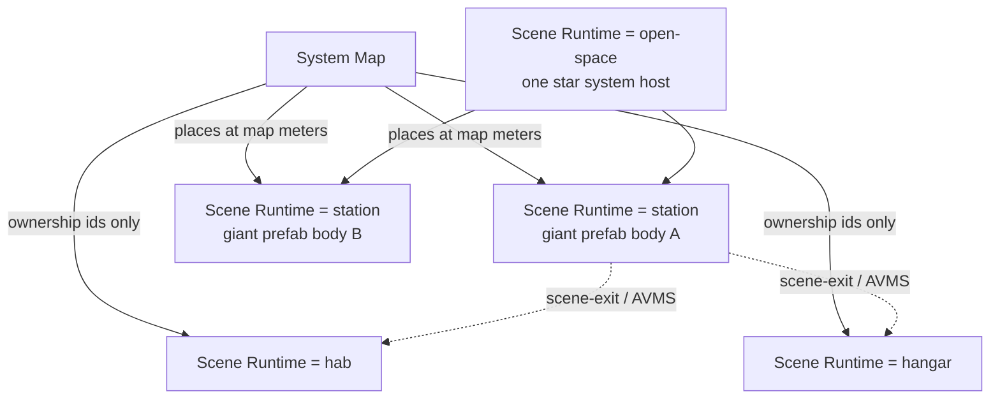
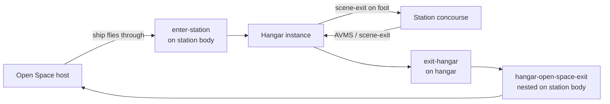
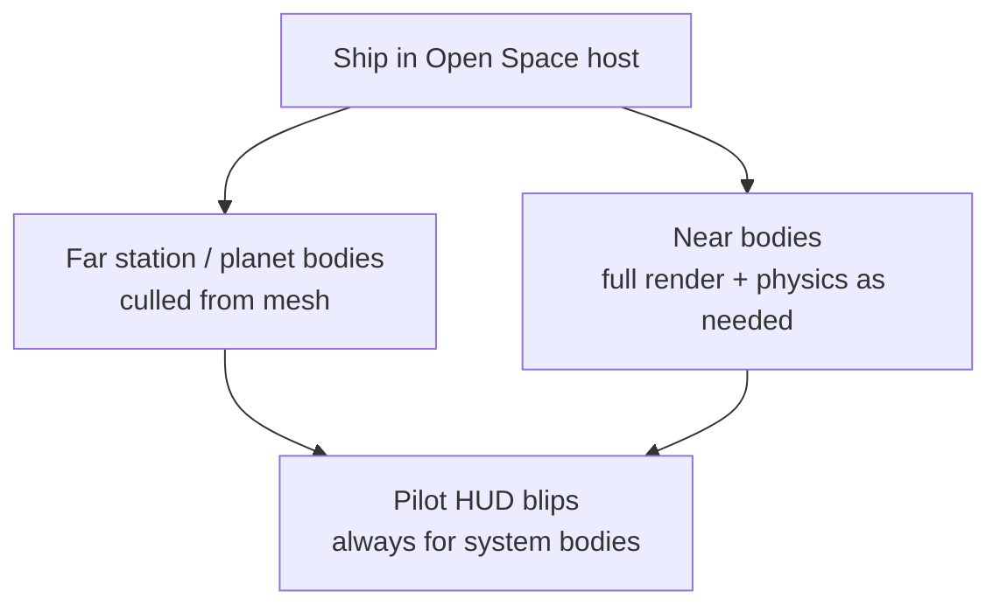

# Space Traversal Architecture

Authoritative mental model for how a ship moves *inside* a star system once the
player has left a hangar for Open Space — and what a "station scene" actually
**is**.

Related: [Basic game loop](./game-loop) (Hab → Station → Hangar → Open Space),
[System Map](../editor/system-map) (ecliptic authorship),
[Hangar Open Space Exit](../editor/components/hangar-open-space-exit).

## Permanent decision: scene document, prefab runtime

We keep calling the authoring unit a **scene** (`.scene.json`, GameObject tree,
Scene tab, Scene Settings). That does **not** mean every scene is a separate
play world you teleport between.

For stations (and anything else that must sit as a body inside Open Space), the
document is really a **giant prefab**:

- Same GameObject / component authoring surface as today.
- System Map / Open Space **places** that document at ecliptic meters like a
  hull, not like a full page navigation target.
- Walk physics, markers, `scene-exit`, hangar mouth, etc. live on that tree —
  they travel with the body when it is placed.

**Scene Settings gains a `Runtime` field.** `Runtime` is the permanent switch
that tells play *how* to treat the document. Do not infer this from vibes,
folder names, or "it has a planet component." Agents and features must read
`Runtime`.

| Runtime | Meaning |
| --- | --- |
| `open-space` | **System host.** The current star system's play surface. Planets and station bodies are placed into *this* scene at 1:1 System Map meters. |
| `station` | **Giant prefab body.** Authored as a scene; loaded / culled / blipped / walked as a placeable orbital (or surface-orbit) body inside an `open-space` host. System Map `sceneId` points here. |
| `hab` | Per-player interior cell for that station family. Entered via `scene-exit` / boot hop — not an ecliptic marker. |
| `hangar` | Per-player hangar cell for that station family. Same rule as Hab. |
| `flow` | Menu / boot / loading / character-create documents. Never a world body. |

Existing Scene Settings `kind` (boot, title, instance, …) can keep serving
editor taxonomy and back-compat; **`Runtime` is the world-model truth.** When
they disagree, fix the document — do not invent a third path.

### What this rejects

- Treating every station `sceneId` as a full world swap that leaves Open Space
  behind as an empty void.
- Requiring a separate `*.prefab.json` *and* a scene for the same station hull
  just to satisfy naming. One scene document with `Runtime: station` is enough.
- Dual long-lived paths (`sceneId` XOR `stationPrefabId`) as the *design*.
  Legacy prefab entries may exist until migrated; new work uses
  `Runtime: station` scenes.
- Inferring Open Space vs station vs hab from `kind` alone once `Runtime`
  exists.

## Open Space = the current star system

**Open Space** is whatever star system the player is in right now — the scene
with `Runtime: open-space`.

- One system → one Open Space play surface.
- Every planet, moon, and `Runtime: station` body the System Map places in that
  system lives in that same host.
- Positions and distances are **1:1 with the System Map** (authored meters are
  play meters). Drag a station farther from its parent on the map and it is
  that far in orbit when you fly.

Ship boarding in and out of a station family uses dedicated markers on the
station body and hangar — see **Station boarding** below. That path does not
invent a second coordinate system; arrival always re-enters the same
`open-space` host at the station body's hangar mouth. On-foot Hab / Station /
Hangar hops stay in [Basic game loop](./game-loop).

## Station boarding (ship ↔ hangar ↔ station)

Stations come in two flavors; **both** use the same boarding components:

| Flavor | Feel |
| --- | --- |
| **Open-air** | Pads / bay mouth exposed to space; ship approaches in the open. |
| **Closed** | Enclosed bay / docking tunnel; ship still crosses an enter volume, then is inside the hangar cell. |

The difference is art and collider layout on the `Runtime: station` body — not
a second travel system.

### Components

| Component | Lives on | Trigger | Destination |
| --- | --- | --- | --- |
| `enter-station` | Station body (`Runtime: station`), nested GameObject | Ship **flies through** the volume | That station family's **hangar instance** (`Runtime: hangar` / System Map `hangarSceneId`) |
| `scene-exit` | Hangar (and Hab / Station as today) | On foot, interact (or authored trigger) | Station concourse, Hab, etc. — **not** Open Space for hangar departure |
| `exit-hangar` | Hangar instance | Ship / player leaves the hangar for space | Open Space host, ship spawned at the owning station body's nested GameObject that has `hangar-open-space-exit` |
| `hangar-open-space-exit` | Station body (`Runtime: station`), nested GameObject at the bay mouth | Pose only — arrival / departure mouth | Local **+Z** = ship nose facing on spawn |

`hangar-open-space-exit` is **not** the teleporter. It is the **mouth pose** on
the giant-prefab station tree. `exit-hangar` is the hangar-side trigger that
resolves the owning station (System Map `hangarSceneId` → station entry →
station body) and places the ship at that nested marker in the Open Space host.

Do **not** use a hangar `scene-exit` targeting `@space` as the designed
departure path once `exit-hangar` exists. One exit primitive for hangar →
space.

### Invariants (boarding)

- `enter-station` always lands in the **hangar instance**, never directly in
  the station concourse and never by “falling into” the station body as a
  world swap that drops the Open Space host.
- From the hangar, on-foot travel to the station uses **`scene-exit`** (existing
  portal rules).
- From the hangar back to space uses **`exit-hangar`** → owning station's
  nested `hangar-open-space-exit` pose in the Open Space host.
- Mouth marker stays authored on the **station** document (giant prefab), not
  on the hangar instance — hangar does not know ecliptic meters; the station
  body does.
- Open-air vs closed does not fork these component names or destinations.

## Real flight is legal — and absurdly slow

Because the layout is real scale, a player *can* point the nose at a distant
body and burn the whole way on thrusters alone. That is intentional and
allowed. It is also usually a terrible idea: star-system distances at 1:1 can
take on the order of **an hour** (or worse) of real wall-clock time.

That gap is why **quantum travel** exists. Quantum is the designed way to
cross interplanetary / long orbital ranges without abandoning the single
shared host or inventing a second teleporter stack.

| Mode | When | Cost |
| --- | --- | --- |
| Thruster / IFCS flight | Local maneuvre, approach, combat, scenic | Real time at ship speeds |
| Quantum travel | Distant planet / station / POI | Short travel sequence; same host, same meters |

Quantum approaches the same ecliptic markers the System Map authored. It does
**not** swap to a different system host mid-hop inside one star system, and it
does **not** replace `scene-exit` for Hab / Hangar / deep interior cells.

## Distant bodies: culled mesh, visible blip

A system may hold many planets and station bodies. Rendering every body at
full fidelity from anywhere would destroy the frame budget. Distance policy:

1. **Cull from view / render** — far planets and `Runtime: station` bodies drop
   out of the visible mesh / render set. No distant hull sitting as a full
   scene-graph cost when the player is hours of flight away.
2. **Keep a pilot blip** — while the player is **piloting a ship** in Open
   Space, those same distant bodies still appear as **HUD / screen blips**
   (nav markers). The pilot always knows where system content lives even when
   the mesh is gone.
3. **Restore on approach** — when the ship closes to the body's activation
   range (quantum exit, thruster approach, or handoff threshold), the body
   streams / spawns back into the render set at its true ecliptic pose —
   still the same giant-prefab scene document, not a different world.

On-foot inside `Runtime: hab` / `hangar` / a boarded station interior does not
need the full open-space blip set. Blips are an **in-ship Open Space**
navigation signal.

## Invariants

- Open Space ≡ the active System Map document's star system, one
  `Runtime: open-space` host.
- System Map meters = Open Space meters. No second scale, no fake compressed
  skybox distances for authored bodies.
- A station on the map is a scene with `Runtime: station` — authored like a
  scene, placed like a giant prefab into the Open Space host.
- Hab / Hangar are `Runtime: hab` / `hangar` ownership scenes, not ecliptic
  bodies. On-foot travel into Hab / Station uses `scene-exit` / AVMS; ship
  travel Open Space ↔ Hangar uses `enter-station` / `exit-hangar`.
- Thruster transit A → B is valid and slow; quantum is the practical bridge.
- Far bodies cull from rendering; they must still show as pilot blips in ship
  mode so navigation never depends on seeing the mesh.
- Quantum and thruster both target the same ecliptic markers — quantum is
  speed, not a different world model.
- Do not invent a second long-range teleporter that bypasses the Open Space
  host or System Map placement.
- Do not reintroduce "stations are only prefabs" *or* "stations are only
  world-swap scenes" as competing truths. **Scene document + `Runtime`** is
  the law.
- Hangar → Open Space is `exit-hangar` → station nested `hangar-open-space-exit`,
  not a hangar `scene-exit` `@space` as the designed path.

## Open / later (implementation, not design)

Design above is settled. Remaining work is product/engine detail:

- Wire Scene Settings `Runtime` through schema, editor UI, and play host
  (until then, treat this doc as the target; do not add a second model).
- Author `enter-station` and `exit-hangar` components (schema, registry,
  editor fields, play triggers); migrate hangar `@space` `scene-exit` callers
  to `exit-hangar`.
- Exact cull / stream radii per body type (planet vs station vs POI).
- Blip UX (range rings, selection, quantum lock, threat filters).
- Quantum phases (spool, travel, drop-out) vs IFCS ownership during the hop.
- Multiplayer: who sees whom during quantum; interest / cell sizing across
  system-scale distances.
- Cross-system jumps (leaving this star system entirely) — out of scope until
  a multi-system product path exists.
- Migration off legacy `stationPrefabId` map entries onto `Runtime: station`
  scenes.
- How inactive-planet stations re-enter the render set relative to planet
  handoff.
