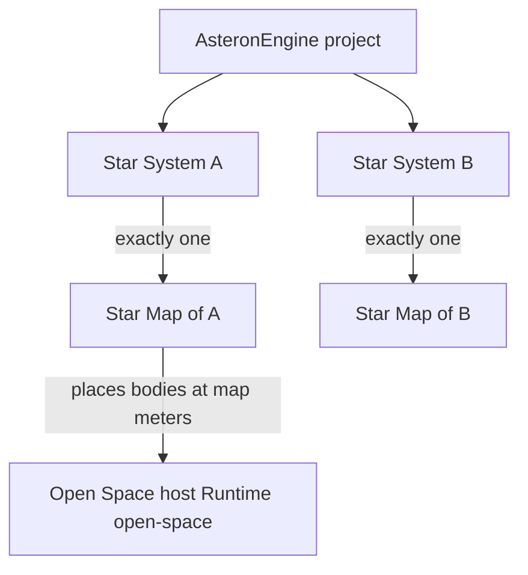
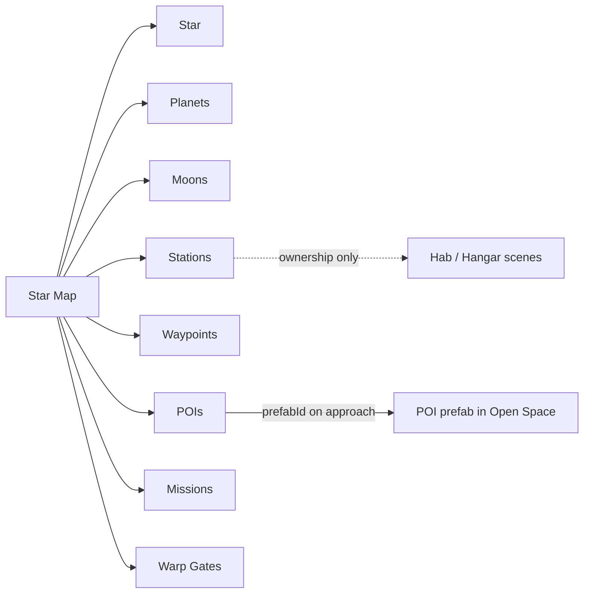
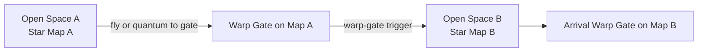

# Star Map / Star System Architecture

Authoritative mental model for how a project authors **star systems** and the
**Star Map** that places everything in them. Written for refactoring — the
intended world model, not a changelog of today's schema.

Related: [Space traversal](./space-traversal) (Open Space host at 1:1 map meters),
[Basic game loop](./game-loop) (station family Hab / Hangar ownership),
[Scene flow](./scene-flow) (boot picks starting system),
[Multiplayer](./multiplayer) (cells during travel / Warp Gate),
[Ship flight](./ship-flight) (Nav mode / quantum to map markers),
[System Map](../editor/system-map) (editor how-to; code still names the tab /
document this way).

## Permanent decision: one system, one map

A **Star System** is a named place in the galaxy of a project (e.g. Asteron
System). A **Star Map** is that system's ecliptic catalog — every body and
marker you can put in orbit or on the map plane.

| Rule | Meaning |
| --- | --- |
| One system ↔ one Star Map | The system document *is* the map. Do not invent a second layout file or a parallel catalog. |
| Many systems per project | AsteronEngine authors as many `*.system.json` documents as the project needs. |
| Map meters = play meters | What you drag on the Star Map is the distance you fly in Open Space. |
| Hab / Hangar stay off the ecliptic | Station family interiors are ownership fields on a station entry, not separate map markers. |



### What this rejects

- Merging every system's bodies into one global map.
- A second coordinate system for "map only" decoration — map meters are play
  meters (see [Space traversal](./space-traversal)).
- Treating Hab / Hangar scenes as ecliptic markers.
- Inferring "which system" from folder names or scene `kind` instead of an
  explicit system id (`game-manager.systemId` and travel that changes system).

## Naming

| Product term | Meaning | Code / editor aliases (today) |
| --- | --- | --- |
| **Star System** | One star + its map; selectable world | `SystemDocument`, `systemId`, `*.system.json` |
| **Star Map** | That system's ecliptic authoring surface | System Map tab, `src/world/systems/` |

Prefer **Star Map** / **Star System** in architecture and product copy. Code may
keep `SystemDocument` and "System Map" until a rename refactor; those are
aliases, not a second product.

## What lives on the Star Map

Everything placeable in a system is authored on that system's Star Map in
AsteronEngine:

| Kind | Role |
| --- | --- |
| **Star** | Origin of the ecliptic (`(0, 0)` in v1 flat map). One per system. |
| **Planet** | References a planet document; position in meters from the star. |
| **Moon** | Body parented to a planet (or as the map model requires); ecliptic / orbital placement on the same map. |
| **Station** | Giant-prefab body (`Runtime: station` scene preferred); parent + offset; owns Hab / Hangar scene ids. |
| **Waypoint** | Navigation / quantum / blip target without full station geometry or streamed content. |
| **POI** | Point of interest on the ecliptic. Authors create it on the Star Map and **assign a prefab** that Open Space loads when the player arrives (approach / activation range). Explore sites, wrecks, landmarks, narrative hooks. |
| **Mission** | Mission encounter or objective placed on the map (authorship lives with the map entry; mission content may reference it). |
| **Warp Gate** | Cross-system portal body. Prefab with a `warp-gate` component; place on this map; configure destination Star System. |

Station entries still carry **family ownership** (`habSceneId` / `hangarSceneId`)
as today — see [Basic game loop](./game-loop). Those ids are catalog fields, not
extra ecliptic pins.



## Authoring UX — right-click to place

Star Map placement is **map-first**: authors put content where they click, not
only through a detached sidebar list.

**Right-click empty map** (or the ecliptic at the cursor) opens a context menu
to **Add** any placeable kind at that ecliptic pose:

| Add… | Creates |
| --- | --- |
| Planet | Planet entry (pick / link a planet document); pose = click meters from star |
| Moon | Moon entry parented as authored (often under the nearest / selected planet) |
| Station | Station family entry at click offset from chosen parent |
| Waypoint | Marker-only entry |
| POI | POI entry — then assign `prefabId` in the inspector |
| Mission | Mission marker entry |
| Warp Gate | Warp Gate body / prefab reference + `warp-gate` destination fields |

Further actions on an existing body (select / right-click body): edit, reparent,
remove, duplicate — exact menu items can grow; the invariant is **every catalog
kind is creatable from the map context menu**, not hidden behind one-off
sidebar buttons alone.

Sidebar **Add planet / Add station** (and later peers) may remain as shortcuts;
they must create the same entry types the context menu does. Click pose wins
when the add came from the map.

Editor how-to today: [System Map](../editor/system-map) (sidebar-only add is
current; context menu is the refactor target).

## POIs — map marker + streamed prefab

A **POI** is a first-class Star Map entry, not a free-floating spawn.

### Authoring

1. On the Star Map, **create a POI** (name, parent / ecliptic offset — same meter
   placement as stations and Warp Gates).
2. **Assign a prefab** (`prefabId`) that play should load for that site.
3. Optionally tune blip / quantum targeting like other ecliptic markers.

The POI entry owns *where* and *which prefab*. The prefab owns geometry,
markers, and any gameplay components. Do not bake a second copy of the site
into the Open Space scene document.

### Play

1. Far away: POI stays a **blip** / quantum target (mesh culled — same distant-
   body idea as stations; see [Space traversal](./space-traversal)).
2. Player **flies** or **quantums** to the POI.
3. On arrival / inside activation range, Open Space **loads the assigned
   prefab** at the POI's map pose into the current system host.
4. Leaving range may unload or keep the instance per streaming policy — still
   one Open Space host, still 1:1 map meters.

### POI vs Station vs Waypoint

| Kind | Content | Family Hab / Hangar |
| --- | --- | --- |
| **Waypoint** | Marker only — no streamed prefab | No |
| **POI** | Map entry + **assigned prefab** loaded on arrival | No |
| **Station** | `Runtime: station` scene (giant prefab body) + ownership scenes | Yes |

A wreck, asteroid base, or story landmark that does not own a Hab/Hangar is a
**POI**, not a Station. If it needs the station family loop, author a Station.

**Within** a system, ships thruster or quantum between ecliptic markers — see
[Space traversal](./space-traversal). **Between** Star Systems, the designed
path is a **Warp Gate**.

## Warp Gate (cross-system)

### Authoring

1. Create a **Warp Gate** prefab in AsteronEngine (hull / VFX / volumes as
   needed).
2. Put a **`warp-gate`** component on it. Configure at least the destination
   **Star System** id (`targetSystemId` — the other system's document id).
3. Place that prefab on the **source** Star Map as an ecliptic body (parent +
   offset like a station / POI). It is a real map meter position — pilots can
   see a blip, quantum to it, or burn thrusters to it.
4. On the **destination** Star Map, place the reciprocal gate (or another
   authored arrival gate). The departing gate names which system (and which
   arrival gate, when multiple exist) the ship should exit into.

Do **not** treat cross-system travel as a free `systemId` swap from any
quantum hop, menu, or floating teleporter. The gate is the portal; the map
places it.

### Play loop



1. Player is in-ship in system A's Open Space.
2. Player **flies** or **quantums** to the Warp Gate body on Map A (same
   approach rules as any other ecliptic marker).
3. Crossing / activating the gate (`warp-gate`) loads Star System B's Star Map
   into a replaced Open Space host — systems still do not merge.
4. Ship arrives **in-ship** at the destination gate pose on Map B.

Quantum remains **intra-system**. Warp Gate is the **inter-system** hop.
Boarding stations stays `enter-station` / `exit-hangar`; on-foot stays
`scene-exit` / AVMS.

## Relationship to Open Space

The **active** Star System's Star Map feeds the Open Space play surface
(`Runtime: open-space`):

- One active system → one Open Space host.
- Bodies and markers the map places in that system live in that host at **1:1**
  authored meters.
- Boarding, far-body culling, pilot blips, and quantum live in
  [Space traversal](./space-traversal) — this doc does not fork those rules.

`src/world/systems/placement.ts` remains the **only** place map meters become
play meters. Do not re-derive body positions elsewhere.

## Multiple star systems

A project can author many Star Systems. Selection:

- Boot / play pick a system via `game-manager.systemId` (and related play
  params).
- **In-play** travel from one system to another uses a **Warp Gate** on the
  source Star Map (`warp-gate` → `targetSystemId`). That loads the destination
  Star Map into a new (or replaced) Open Space host — systems do **not** share
  one merged map.
- Inactive systems stay on disk until activated; their bodies are not mixed
  into the current host's ecliptic.

## Baseline today (for refactor)

Schema and editor today (`src/world/systems/schema.ts`, System Map tab) ship:

- Star name
- Planets (`SystemPlanetEntry`)
- Stations (`SystemStationEntry` with scene / legacy prefab geometry + Hab /
  Hangar ownership)

**Not shipped yet** (intended map kinds above): moons as first-class map
entries, waypoints, **POI entries with assigned `prefabId` + load-on-arrival**,
mission markers, **Warp Gate** map placement + `warp-gate` component / play
trigger. Treat gaps as refactor targets, not as proof those kinds are out of
product scope.

Document location (alias path):

```text
src/world/systems/data/<id>.system.json
```

## Invariants

- One Star System ↔ one Star Map; many systems per project.
- Star Map meters are play meters; Open Space does not invent a second scale.
- Station Hab / Hangar are ownership on the station entry — not map markers.
- Placement of map bodies into play goes through `placement.ts` only.
- Do not invent a second system catalog beside the Star Map document.
- A **POI** is created on the Star Map and must be able to **assign a prefab**;
  that prefab loads into the Open Space host when the player arrives. Do not
  hard-code POI content only inside the open-space scene tree.
- Authors **right-click the map** to add planet, moon, station, waypoint, POI,
  mission, Warp Gate (etc.) at the cursor pose. Do not leave new kinds
  sidebar-only while the map itself cannot place them.
- Read `Runtime` on scene documents for how bodies behave in play; the Star Map
  decides *where* they sit, not how a station walks or boards.
- **Cross-system travel is Warp Gate only** — fly or quantum *to* the gate in
  the current system; the gate swaps the active Star System / Open Space host.
  Do not let quantum, boot, or a floating teleporter become a second
  inter-system path.

## Open / later (refactor targets)

- First-class **moon** map entries (parent, offset, planet document link).
- **Waypoint**, **POI** (create on map + assign prefab for load-on-arrival),
  and **mission** marker kinds in schema + Star Map UI.
- **Right-click map → Add** context menu for every placeable kind at cursor
  meters (planet, moon, station, waypoint, POI, mission, Warp Gate, …);
  sidebar adds stay optional shortcuts to the same entry types.
- **Warp Gate** map entry + `warp-gate` component (destination `systemId`,
  arrival gate id), prefab, fly-through / activate trigger, Open Space host
  swap, reciprocal gate on the destination map.
- Editor / code rename from "System Map" / `SystemDocument` toward Star Map
  product naming when the refactor budget allows.
- Align in-ship HaloBand / nav UI language with Star Map
  ([HaloBand](./haloband)).
