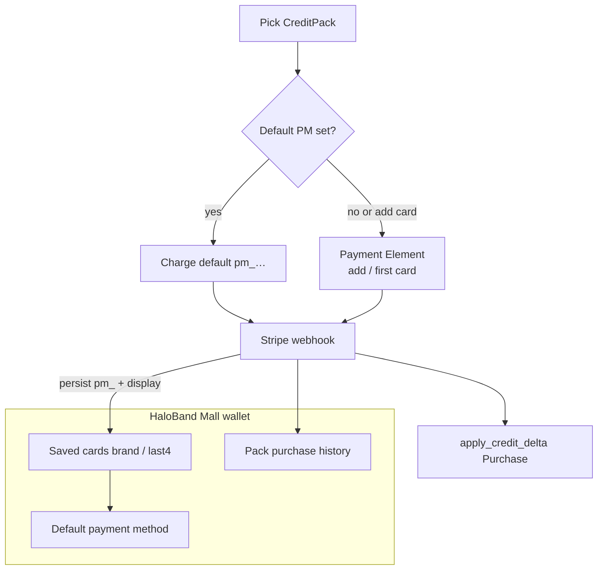

# Stripe Architecture

Authoritative mental model for **how ClaudeCitizen collects real-money
payment** for AsteronCredit packs — in-game pay UI, **saved cards**,
**default payment method**, and **player-visible purchase history**. Currency,
ledger, and Mall spend law live in [Item Mall](./item-mall). Operator Stripe
setup lives in [Payments](../server-console/payments).

Related: [Item Mall](./item-mall) (AC packs / ledger / Mall spend),
[HaloBand](./haloband) (Mall tab hosts pay + wallet UI),
[Content delivery](./content-delivery) (provider config is environment-local).

**This doc is law.** Baseline still uses **hosted Checkout redirect**
(`session.url` → external browser) with no saved-card wallet. Target law is
**Stripe Elements in HaloBand** plus a **customer wallet** (cards, default,
history). Gaps are refactor targets — not permission to grant AC from the
client, store PAN, or pull React into Play just for Stripe.

## Permanent decision: in-game wallet + Elements, not hosted pages

Players buy credit packs and manage payment methods **inside** HaloBand Mall.
Sensitive card entry uses **Stripe.js Payment Element**. Saved methods and
history are **our Mall UI** over Stripe Customer + PaymentMethod ids — not
Stripe Customer Portal / hosted Checkout as the product path.

### Why not hosted pages / Portal

- Game stays one surface (Electron + web).
- Mall chrome owns pay, cards, and history.
- Elements keep PAN in Stripe’s iframe; we only store **ids + display fields**.

### What this rejects

- Hosted Checkout **redirect** or Stripe **Customer Portal** as the lasting
  play path (baseline redirect only until Elements + wallet land).
- Custom forms that touch raw card numbers / full PAN.
- Granting AC on client confirm, success URL, or poll —
  **webhook fulfillment only** ([Item Mall](./item-mall)).
- React (or `@stripe/react-stripe-js`) as a Play dependency.
- Secret / webhook secrets on any client.
- A second payment provider without an architecture change.
- Showing full card numbers or CVV in game UI or logs.

## React not required

Play UI is **vanilla DOM** (HaloBand). Stripe.js + Payment Element mount into
a host node. React wrappers are never required for Play. Server Console may
stay React for operator config only.

## Stripe Customer and saved cards

Each player with payment capability has one Stripe **Customer**
(`cus_…`), stored on the player (or equivalent durable link). All saved
cards hang off that Customer.

### What we store (safe display)

Stripe returns a **PaymentMethod id** (`pm_…`) and **non-sensitive** card
metadata. Persist and show only:

| Field | Use |
| --- | --- |
| `paymentMethodId` (`pm_…`) | Charge / set default / detach |
| Brand (visa, mastercard, …) | Wallet label |
| Last4 | Wallet label |
| Exp month / year | Expiry display |
| Funding / wallet hints (optional) | Debit vs credit badge if useful |

Never store PAN, CVV, or full track data. Never log them.

### Default payment method

- Player may **choose** which saved card is **default**.
- That default is what pack purchase uses when charging without re-entering
  the card.
- **Exactly one saved card → that card is auto-default.** No empty default
  while a single method exists; removing the last card clears default;
  adding a second does not steal default from the first unless the player
  picks another.
- Zero cards → no default; next pack buy (or explicit “Add card”) opens
  Payment Element.

Default is stored as our pointer to `pm_…` (and mirrored to Stripe Customer
`invoice_settings.default_payment_method` when we charge off-session so
Stripe and game agree).

### Wallet UI (HaloBand Mall)

In-game surface (Mall section or sub-panel):

- List saved cards (brand + last4 + expiry + default badge).
- Set default.
- Remove card (detach PaymentMethod; re-apply auto-default rule).
- Add card → Payment Element (Setup / save-for-future), then refresh list.
- **Purchase / transaction history** — player-visible rows from our
  `CreditPurchase` (and related ledger context): pack name, amount paid,
  AC granted, status, time. Not a raw Stripe Dashboard dump; our durable
  purchase log is the source of truth for “what I bought.”

Do not send players to Stripe Customer Portal for these jobs.

## Pack purchase flow (target)

Credit packs are bought **only** through this Stripe path (then webhook →
AC). Mall **listings** spend AC afterward — [Item Mall](./item-mall).

1. Player picks a **CreditPack** in HaloBand Mall.
2. If a **default payment method** exists:
   - Server creates pending `CreditPurchase` and charges that `pm_…` on the
     player’s Customer (Checkout Session or PaymentIntent with
     `payment_method` + customer — same webhook fulfill story).
   - No Payment Element required for the happy path.
3. If **no** default (no cards):
   - Server creates session with **`ui_mode: elements`** (+ customer,
     save card for future use).
   - Client mounts Payment Element, confirms.
   - On success, persist `pm_…` + display fields; **auto-default** if this
     is the only card.
4. Stripe webhook → verify HMAC on **raw bytes** → `fulfill_checkout` →
   `apply_credit_delta(Purchase)` idempotent on event id.
5. Client polls / refreshes balance, wallet, and history — poll never grants.

Optional UX: “Pay with another card” or “Add card” always available even when
a default exists (Elements or method picker).

### First-time vs returning

| State | Pack buy UI |
| --- | --- |
| No cards | Payment Element; save method; auto-default that one card |
| One card (default) | One-tap / confirm charge on default |
| Several cards | Charge **current default**; picker to change default or pay with another |

## Session / Elements model

Keep **Checkout Sessions** with Elements where the player must enter or pick
a new method. Off-session / default-PM charges may use Session or
PaymentIntent attached to Customer + `pm_…` — implementation choice, same
invariants (pending `CreditPurchase`, webhook grant, no client-side AC).

When Elements is required:

1. `POST /payments/checkout` (or sibling) returns **`clientSecret`**, not a
   hosted `url` as the primary product field.
2. Client: publishable key → Stripe.js → mount Payment Element → confirm.
3. Return URLs may exist for Stripe completeness; they must not grant AC.

## Keys

| Key | Where | Role |
| --- | --- | --- |
| **Secret** (`sk_…`) | Server only | Customers, charges, sessions, detach |
| **Webhook signing** (`whsec_…`) | Server only | HMAC on webhook body |
| **Publishable** (`pk_…`) | Client | Stripe.js + Elements |

Target: serve publishable key to authenticated play. Never return decrypted
`sk_` / `whsec_` to any client.

## Play surface

- Pack buy, wallet, and history live under **HaloBand Mall**.
- HaloBand input-suppress rules apply ([HaloBand](./haloband)).
- `checkoutEnabled` false → hide pack CTAs and wallet pay actions.
- Electron and Build Web share the same in-game path (no `openExternalUrl`
  once Elements + wallet ship).

## Ownership

| Concern | Layer |
| --- | --- |
| Customer, PM attach/detach, charge, webhook | `backend/.../payments/` |
| Persist `cus_` / `pm_` / default / display | Postgres (player + payment-method rows or equivalent) |
| AC grant on money | `apply_credit_delta` — [Item Mall](./item-mall) |
| Pack purchase rows | `CreditPurchase` (player history + admin Purchases) |
| Stripe.js + wallet DOM | HaloBand Mall |
| Operator keys / packs | Console Commerce |

## Invariants

- Pack real-money purchase goes through Stripe; AC lands only via webhook +
  ledger.
- In-game Elements for card entry; no hosted Checkout / Portal as product UI.
- Saved cards: store `pm_…` + brand/last4/exp only — never PAN.
- Player can set **default** payment method; pack buy charges that default
  when set.
- **One saved card → auto-default** that card.
- Zero cards → Elements on next buy (or Add card).
- Player can list cards, change default, remove cards, and see pack purchase
  history in HaloBand Mall.
- No React required in Play for Stripe.
- Publishable key only on client; secrets server-only.
- One provider (Stripe) unless architecture is revised.

## Baseline vs law (today)

| Piece | Baseline | Law |
| --- | --- | --- |
| Pay UI | Hosted Checkout redirect | Payment Element + in-Mall wallet |
| Saved cards / default | Absent | Customer + `pm_…` + auto-default when one card |
| Pack charge | Hosted page each time | Default PM when set; else Elements |
| Purchase history (player) | Poll balance only | Mall history from `CreditPurchase` |
| Publishable key | Not wired to play | Required |
| Webhook grant | Live | Unchanged |
| React in Play | None | Stay none |
| Customer Portal | Unused | Stay unused for play |

## Key files (today / target)

| Path | Role |
| --- | --- |
| `backend/crates/server/src/payments/stripe.rs` | Session / charge helpers |
| `backend/crates/server/src/payments/routes.rs` | Checkout, webhook, (target) wallet routes |
| `backend/crates/server/src/payments/provider.rs` | Stripe config |
| `backend/migrations/0018_asteron_credits.sql` | `CreditPurchase` (+ later customer / PM tables) |
| `src/render/effects/hud/haloband-mall.ts` | Pack buy / (target) wallet + history |
| `src/app/play-session-overlays-helpers.ts` | Checkout wiring (baseline URL) |

## Open / later

- Elements + `clientSecret`; retire hosted URL primary path.
- Stripe Customer per player; PaymentMethod persistence; default +
  auto-default rule.
- Off-session / default-PM pack charge endpoint.
- HaloBand wallet UI (list / default / remove / add) + purchase history.
- Publishable key in Console / env → play.
- Appearance API so Element matches HaloBand chrome.
- Remove `openExternalUrl` checkout once stable.

Operator webhook / secret setup: [Payments](../server-console/payments).
AC ledger and Mall spend: [Item Mall](./item-mall).
