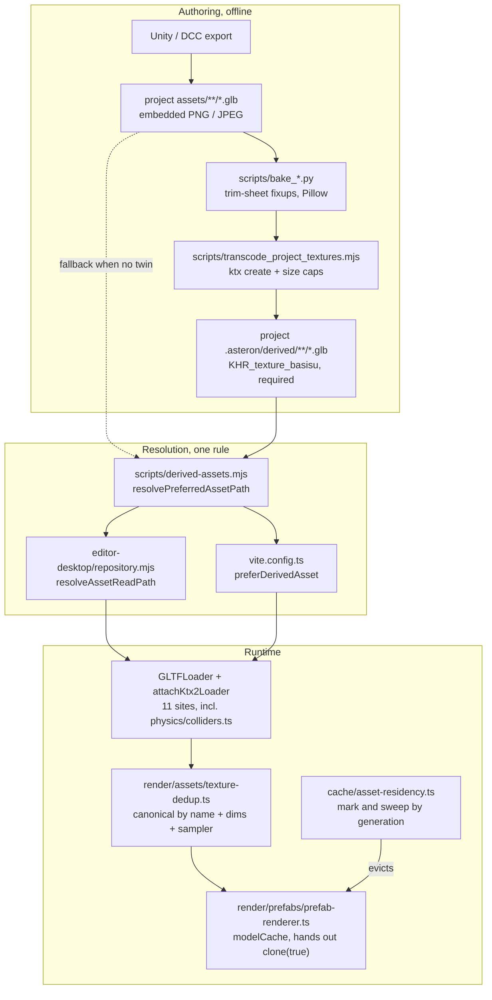
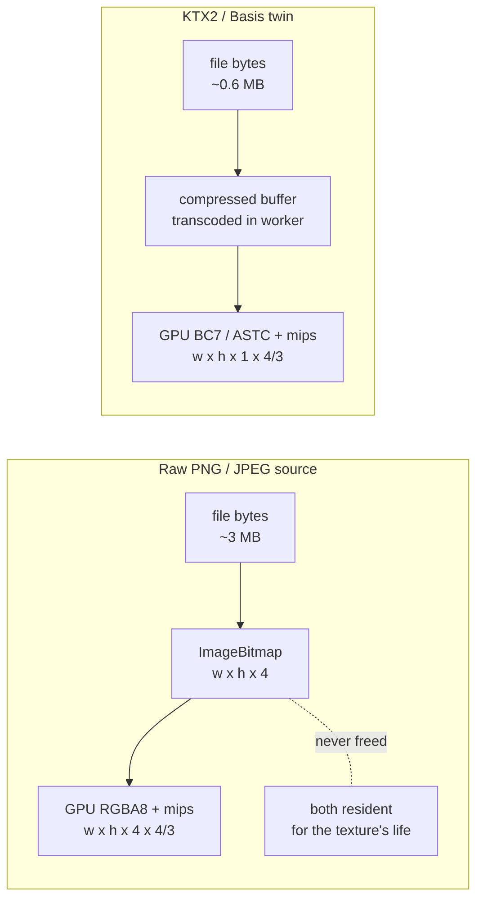
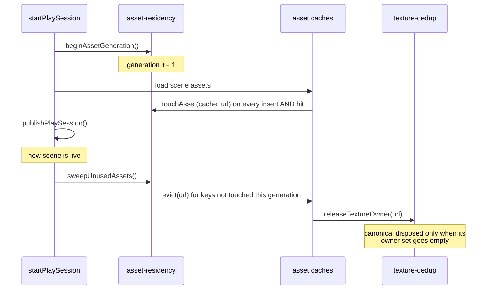

# Texture Memory Architecture

Authoritative mental model for **what a scene's textures cost and which stage
bounds that cost**. Texture bytes are the single largest memory line in this
engine — larger than terrain, vegetation, meshes, and physics combined — and
four independent mechanisms bound them. Each is invisible until it breaks, and
each fails silently.

Related: [Content delivery](./content-delivery) (how project files reach play),
[Assets](../assets), [Packages and textures](../editor/packages-and-textures)
(how-to), [Build Web](../editor/build-web),
[Decoded texture source release](../tech-debt/texture-source-release) (parked
mechanism), [Planets](./planets).

**This doc is law for byte budgets.** A texture that reaches the GPU
uncompressed costs the same whether or not anyone measured it.

## Permanent decision: source resolution is not a runtime concern

The runtime never knows a derived twin exists. `scripts/derived-assets.mjs` is
the **single** resolution rule, imported by both `editor-desktop/repository.mjs`
(editor asset reads) and `vite.config.ts` (release copy). It prefers the KTX2
twin when present and not older than its source, and falls back to the source on
any doubt — so a project with no derived tree behaves exactly as it did before
the pipeline existed.

Consequences that are easy to violate:

- Never route a **write** path (save / upload / move / delete) through the
  derived resolver. A rename would move the twin over its own source. That is
  why `resolveAssetPath` and `resolveAssetReadPath` are separate functions.
- Source GLBs are **never mutated**. `scripts/bake_*.py` parse the embedded
  PNG/JPEG with Pillow and must keep working after every fresh Unity export.
  Run the bake scripts first, then transcode.

## The pipeline



The extension is written as **required**, so a `GLTFLoader` without a KTX2
loader attached throws on parse. Every loader site must call
`attachKtx2Loader` — including geometry-only ones like collider baking. One
shared `KTX2Loader` app-wide (`src/render/assets/ktx2.ts`); its worker pool is
never disposed on a scene switch, because each worker holds its own
`basis_transcoder.wasm` instance.

## Where the bytes actually land

A texture occupies memory in up to three places at once. Which ones depend on
the format it arrived in.



The raw path pays its decoded size **twice** — once as the `ImageBitmap` Three
leaves in `texture.source.data`, once on the GPU. The release path that would
free the CPU copy is parked; see
[Decoded texture source release](../tech-debt/texture-source-release). KTX2 has
no equivalent problem: the compressed buffer *is* the source, and it is what the
GPU stores.

Measured against the Asteron project (931 GLBs, 74 unique textures after dedup,
2026-08-04):

| Configuration | GPU resident | Notes |
| --- | --- | --- |
| Raw PNG, no transcode | 2,715 MB **+ 2,036 MB CPU** | What ships if nobody runs the transcode |
| KTX2, no size caps | 679 MB | Codec alone |
| KTX2 + `--max-normal-size 2048` | 567 MB | Recommended baseline |
| KTX2 + both caps at 2048 | 247 MB | Albedo atlases lose texel density — an art call |

## Compression does not fix resolution

The two levers are independent, and only one of them is a codec.

Source packs ship textures authored for offline renders. The Synty SciFi pack's
`PolygonScifiWorlds_Texture_A_01_Normal_8k.png` is 8192² — 256 MB decoded, and
still ~85 MB as UASTC with mips, four times any other texture in the pack — for
a flat-shaded low-poly atlas whose texel density never justified it. It is
embedded in 572 of this project's GLBs, and 510 of those carry no 4k twin to
remap onto, so **resize is the only lever that helps**.

**The caps belong to the project, not to the command.** They live in
`asteron.project.json`; a CLI flag overrides for a one-off.

```json
{
  "textures": {
    "maxTextureSize": 0,
    "maxNormalSize": 2048
  }
}
```

```bash
# reads the project setting — same result as Tools → Transcode Project Textures…
node scripts/transcode_project_textures.mjs --project <dir>

# one-off override
node scripts/transcode_project_textures.mjs --project <dir> --max-normal-size 4096
```

This is not a convenience. Both caps are part of the manifest's settings
signature, so changing one invalidates every twin and re-encodes the whole tree.
The editor menu passes only `--project` (`editor-desktop/main.mjs`), so a cap
that lived only in someone's shell history would be **silently undone** the
first time anyone used the menu — hours of re-encoding, back to full resolution,
with nothing in the output to say so. Reading the caps from the project makes
both paths agree by construction.

Caps halve repeatedly rather than scaling to a target, so power-of-two atlases
stay power-of-two and the aspect ratio stays exact.

The run is parallel over files (`--jobs`, default `cores - 2` capped at 16).
`ktx` at these settings is effectively single-threaded — a serial run of one
3-texture GLB measured 1m29s wall against 1m49s user — so the parallelism has to
live at the file level, not inside the encoder. It is resumable: re-running
skips work already recorded in the manifest as long as the flags match.

## Runtime dedup

Different protected GLBs embed the *same* named atlas, so `GLTFLoader` cannot
share it by URL — each parse produces a separate `THREE.Texture` over separate
bytes. `deduplicateObjectTextures` rebinds equivalent large textures
(≥ 1024 px) onto one canonical instance before the object reaches a scene, so
duplicates are never uploaded.

The canonical key is **not** the texture name alone. It includes the material
slot, decoded dimensions, every sampler field, and the UV transform, so only
genuinely interchangeable bindings converge.

This is why the transcode script **refuses to write a file whose textures lost
their names**. `GLTFLoader` names a texture from `textures[].name ||
images[].name`, and a KTX2 image is a bufferView with no URI fallback. Nameless
textures make `canonicalTextureKey` return `null`, dedup stops entirely, and the
result is *worse* than no compression.

## Residency: mark and sweep, never refcount



The sweep runs **after** the incoming scene is published, never during teardown.
An asset the new scene also uses already carries the current generation and
survives untouched, so reuse across a scene switch costs no re-fetch and no
re-parse.

Mark-and-sweep rather than reference counting because the loaders are
fire-and-forget (`void loadPrefabModel(...)`, collider preloads, catalog
resolution) with no owner handle to release. A correct refcount would need an
exactly-once release at call sites spread across three layers: **a missed
decrement pins gigabytes forever, a double decrement blanks live materials, and
a missed `touchAsset` costs one reload.** The asymmetry decides the design.

Two rules that break it:

- `loadPrefabModel` hands out `template.clone(true)`. Clones **share** geometry
  and materials. Use `disposeOwnedGpuResources` on an instance (frees only what
  `userData.ownedGpu` collected) and `disposeCacheTemplate` only on a cache
  template. `disposeCacheTemplate` skips canonical textures — another live
  template may still bind them.
- Authoring surfaces holding clones outside a play session must pass
  `{ pin: true }` / `{ pinModels: true }` — editor viewport, material panels,
  equipment preview. Without the pin, a sweep triggered by Play tears down
  geometry their own renderer is still drawing.

## Diagnosing

The HUD stats panel (`src/render/effects/hud/stats-panel.ts`) reports `GPU`,
`Tex Mem`, and `Assets`. `Tex Mem` says there is a problem but not which asset
caused it — for that, `getLargestTextures` and `getTextureBytesByOwner` in
`texture-dedup.ts` rank resident bytes by texture and by owning URL. Call them
from a debug readout on demand; both sort the registry and are not frame work.

| Symptom | Likely cause |
| --- | --- |
| `Tex Mem` in gigabytes | No derived tree, or the resolver is not being hit |
| `Tex Mem` **jumps** after a transcode | Texture names were lost; dedup is off |
| Memory grows across scene switches | A cache never registered with `registerAssetCache`, or `touchAsset` is missing on cache *hits* |
| Blank materials after a scene switch | A canonical texture was disposed by a template walk |
| Editor viewport blanks when Play starts | Missing `{ pin: true }` on an authoring load |
| `dedupCallsByOwner` count climbing with frame count | That asset is being re-loaded every frame — a cache that is not holding |

## Known gap

`RELEASE_DECODED_TEXTURE_SOURCES` in `src/render/assets/texture-upload.ts` is
**`false`** — the CPU-side `ImageBitmap` release is forced off engine-wide, not
only under authoring. Re-enabling it as-is black-screens WebGPU. Full analysis,
the three candidate fixes, and the smoke checklist live in
[Decoded texture source release](../tech-debt/texture-source-release).

While it is off, every **uncompressed** texture costs its decoded size twice.
Transcoding to KTX2 sidesteps the gap entirely rather than waiting on it.
