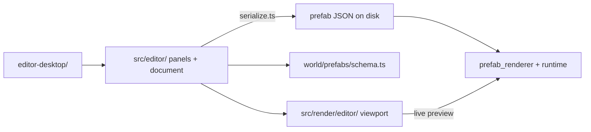

# CC Editor overview

The **CC Editor** is ClaudeCitizen's standalone Electron authoring
environment. It manages launchable **scenes**, reusable **prefabs**, world
settings, Play Mode, and web release builds in one Unity-style workspace.

Launch it with `npm run editor`; no development server is required. Browser
release builds still strip editor code.


The screenshot shows the Unity-style layout: hierarchy, scene view, inspector, and project browser. Here a station corridor is being assembled from modular GLB pieces with colliders and transform gizmos.

## Builder + prefab author

Think of the CC Editor in three layers:

| Layer | What you do |
| --- | --- |
| **Scene settings** | Create launchable title, loading, character, main-game, test, and instance scenes |
| **Prefab building** | Drag GLBs into the viewport, add boxes and empties, parent and transform entities, edit GLB sub-meshes, tune materials, place lights |
| **Prefab authoring** | Pick a **prefab kind** (station, ship, site, prop, item), attach **gameplay components** (spawn points, doors, colliders, interactions), save to `src/world/prefabs/data/<id>.prefab.json` |

Saved prefabs are plain JSON tracked in git (metadata only — asset URLs may point at gitignored protected files). The game bundles them via Vite and the production build copies only referenced assets.

## Prefab kinds at a glance

| Kind | Purpose |
| --- | --- |
| **station** | Orbital stations — modular interiors with spawn, elevators, hangar pads, AVMS terminals |
| **ship** | Flyable ships — hull, deck colliders, doors, pilot seats, landing gear, boarding ramp |
| **site** | General-purpose world sites (outposts, landmarks) — colliders, interactions, lights |
| **prop** | Placeable hangar/apartment decorations for the player build system |
| **item** | Inventory item visuals — world pickup or icon-only catalog entries |

See [Prefab kinds](./prefab-kinds) for when to use each.

## Architecture



| Path | Role |
| --- | --- |
| `editor-desktop/` | Sandboxed project access, Play Mode window, File → Build Web |
| `src/editor/` | Document store, panels, commands, serialization, local API client |
| `src/render/editor/` | Three.js viewport, base-characters stage, thumbnails |
| `src/world/scenes/` | Scene documents and runtime adapters |
| `src/world/prefabs/schema.ts` | Canonical prefab JSON contract and validators |
| `src/world/prefabs/component_registry.ts` | Component palette metadata per prefab kind |
| Electron `/__editor/*` routes | Constrained save/load and asset listing |

Domain simulation rules stay in `world/`, `flight/`, and `player/`. The editor writes prefab data; it does not own gameplay logic.

## Open the editor

```bash
npm run editor
```

## Doc map

- [Getting started](./getting-started) — first session workflow
- [Interface](./interface) — panels, toolbar, shortcuts, scene tabs
- [Building scenes](./building-scenes) — entities, transforms, GLB editing
- [Components](./components) — gameplay component system
- [Station authoring](./station-authoring)
- [Ship authoring](./ship-authoring)
- [Props and items](./props-and-items)
- [Material manager](./material-manager)
- [Planet authoring](./planet-authoring)
- [System Map](./system-map)
- [Menu Manager](./menu-manager)
- [Assets and GLB](./assets-and-glb)
- [Preview and playtest](./preview-and-playtest)
