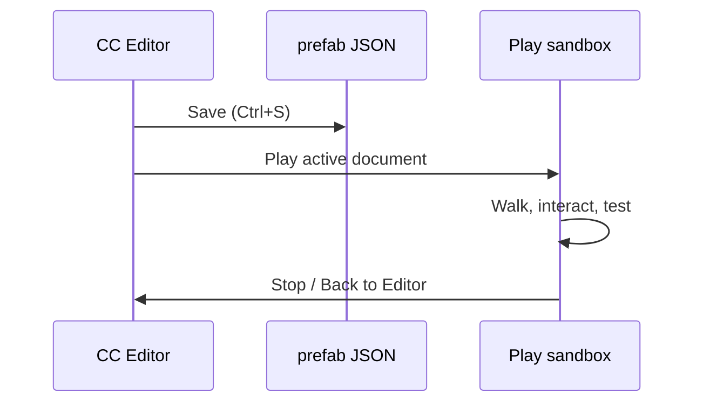

# Preview and playtest

The CC Editor has one universal **Play** button. It saves the active document,
opens a separate Electron Play Mode window, and chooses the correct runtime
adapter for the active scene, prefab, planet, system, or character test.

## Universal Play

Press **Play** or `F6` to start. Press it again, use **Play → Stop**, or close the
Play Mode window to stop. Play always saves first, so the runtime reads the
same project data a web build would package.

## Deep-link URLs

| Scene/runtime | Internal route |
| --- | --- |
| Scene asset | `/?boot=scene&sceneId=<id>` |
| Station prefab stage | `/?stationPrefab=<id>` |
| Ship prefab stage | `/?shipPrefab=<id>` |
| Planet surface test | `/?boot=play&planetId=<id>&spawn=surface&from=editor` |

### Examples

```text
?stationPrefab=demo-station
?shipPrefab=phobos-starhopper
?boot=play&planetId=asteron&spawn=surface&from=editor
?boot=scene&sceneId=main-game
```

## Station playtest

Loads the prefab station instead of the default procedural layout in Play Mode.

What comes from the prefab:

- Visual geometry and materials
- Collider-based walking
- Spawn point, elevators, hangar pads
- Interactions and animated doors
- AVMS terminal zones

Some UI flows (terminal/hangar-bank) may still use procedural hooks until full station cutover.

## Ship sandbox

Isolated test pad — no planet, orbital station, or free flight.

Verify in the sandbox:

| Check | How |
| --- | --- |
| Deck colliders | Walk the interior |
| Doors | F to interact; all `ship-door` ids |
| Ramp | F at ramp interact; walk up when lowered |
| Pilot seat | F at seat — cockpit camera from `eye` offset |
| Landing gear | **G** toggles gear |

## Back to editor

Play sandboxes show a **Back to Editor** banner. In Electron this closes Play
Mode and returns focus to the unchanged editor window.

## Round-trip workflow



The Electron editor bundle enables authoring routes. Browser releases exclude
the editor UI but bundle scene documents so released scene links can resolve.

## Catalog integration

Station and ship prefabs referenced by the [Admin App](/admin-app) catalog are the same JSON files you author here. After playtesting locally, create or update definitions so online players receive the content.

## Related

- [Getting started](./getting-started) — save/load basics
- [Station authoring](./station-authoring)
- [Ship authoring](./ship-authoring)
