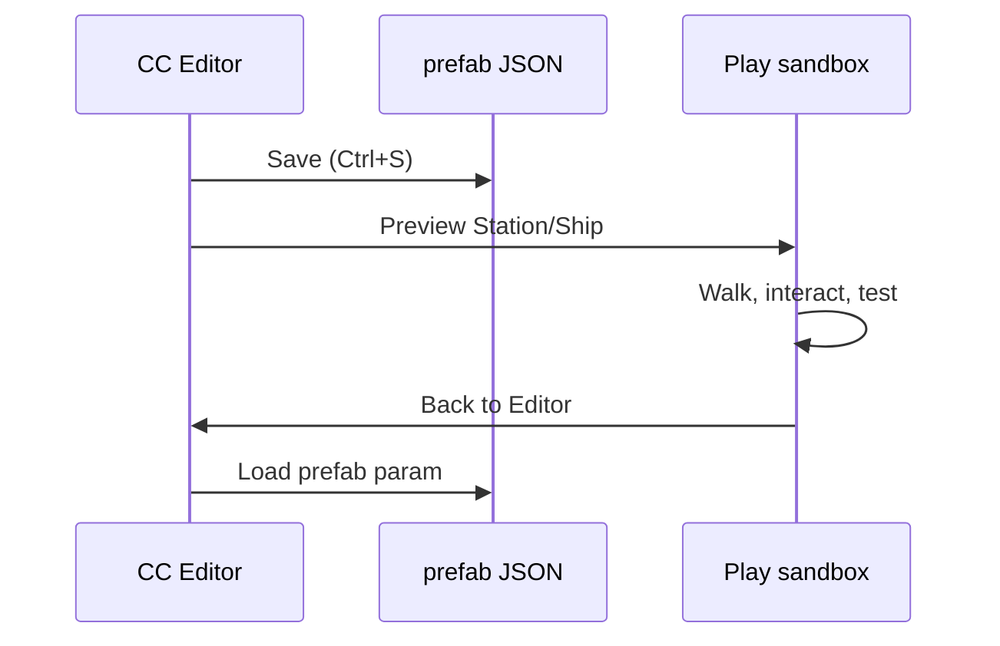

# Preview and playtest

The CC Editor integrates with dev play modes so you can verify prefabs in context without manual URL editing.

## Preview buttons

After saving, the toolbar shows:

| Button | When visible | Action |
| --- | --- | --- |
| **Preview Station** | `kind: "station"` | Save → navigate to station playtest |
| **Preview Ship** | `kind: "ship"` | Save → navigate to ship sandbox |

Other kinds show a toast: *"Preview in Play supports station and ship prefabs."*

Preview always **saves first** — you test the on-disk JSON, not unsaved buffer state.

## Deep-link URLs

| Mode | URL |
| --- | --- |
| Station playtest | `http://localhost:4173/?stationPrefab=<id>` |
| Ship sandbox | `http://localhost:4173/?shipPrefab=<id>` |
| Reopen editor | `http://localhost:4173/?boot=editor&prefab=<id>` |

### Examples

```text
?stationPrefab=demo-station
?shipPrefab=phobos-starhopper
?boot=editor&prefab=demo-station
```

## Station playtest

Loads the prefab station instead of the default procedural layout (dev only).

What comes from the prefab:

- Visual geometry and materials
- Collider-based walking
- Spawn point, elevators, hangar pads
- Interactions and animated doors
- AVMS terminal zones

Some UI flows (terminal/hangar-bank) may still use procedural hooks until full station cutover.

## Ship sandbox

Isolated test pad — no planet, orbital station, or free flight.

Verify in the sandbox:

| Check | How |
| --- | --- |
| Deck walk zones | Walk the interior |
| Doors | F to interact; all `ship-door` ids |
| Ramp | F at ramp interact; walk up when lowered |
| Pilot seat | F at seat — cockpit camera from `eye` offset |
| Landing gear | **G** toggles gear |

## Back to editor

Play sandboxes show a **Back to Editor** banner at the top.

1. Press **Esc** to release pointer lock
2. Click **Back to Editor**

Navigates to `/?boot=editor&prefab=<id>` and reloads the saved document.

## Round-trip workflow



## Dev-only gates

Preview URLs and the editor itself require `import.meta.env.DEV`. Production builds exclude editor code and dev boot paths.

## Catalog integration

Station and ship prefabs referenced by the [Admin App](/admin-app) catalog are the same JSON files you author here. After playtesting locally, create or update definitions so online players receive the content.

## Related

- [Getting started](./getting-started) — save/load basics
- [Station authoring](./station-authoring)
- [Ship authoring](./ship-authoring)
