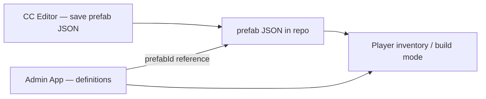

# Props and items

Three smaller prefab kinds — **prop**, **item**, and **site** — cover placeable decorations, inventory visuals, and general world sites.

## prop

Hangar and apartment **decorations** players place in personal build areas.

### Structure

A typical prop prefab:

```text
root (prop-frame)
└── body — GLB or box primitive + collider
```

On save, the root automatically receives `prop-frame` marking the placement origin.

### Examples in the repo

| Prefab id | Description |
| --- | --- |
| `hangar-crate-01` | Box primitive crate with box collider |
| `hangar-bench-01` | Seating prop |
| `hangar-lamp-01` | Light fixture |
| `hangar-panel-01` | Wall panel |
| `hangar-tool-rack-01` | Tool rack |

### Authoring tips

- Keep the footprint sensible — players snap props to a grid in hangar build mode
- Match **collider** bounds to the visible mesh for placement feedback
- Props can include `interaction` components for inspect prompts
- Register definitions in the [Admin App](/admin-app/prop-definitions) to appear in the player catalog

### snapGridM and maxPerHangar

Server-side prop definitions (not in the prefab JSON itself) control shop cost, `maxPerHangar`, `snapGridM`, and `allowRotateY`. The prefab id links catalog rows to your authored geometry.

## item

**Inventory item** visuals — what the player sees when holding or dropping an item.

### Structure

```text
root (item-frame)
└── visual — small GLB, primitive, or empty (icon-only items skip prefab)
```

`item-frame` marks the origin for world pickup/drop rendering.

### itemType alignment

Server catalog `itemType` values (`consumable`, `weapon`, `armor`, `clothing`, `material`, `misc`) are set in the Admin App, not the prefab. The prefab supplies the 3D representation when `prefabId` is set on the item definition.

### Icon-only items

Items without a prefab can use `iconUrl` in the Admin App item definition — HUD renders the icon via `item_icon.ts`.

### Authoring tips

- Keep item prefabs compact — they may appear in the player's hand or on the ground
- `collider` is optional; most items do not block walking
- List bundled item prefabs via `list_item_prefabs.ts` for the admin picker

## site

**General-purpose world sites** — surface outposts, landmarks, derelicts, mission POIs.

### What site includes

- Full shared palette: `collider`, `interaction`, `animation`, all light types
- No auto-injected frame component on save (unlike station/ship/prop/item)
- Intended for content that lives on the planet surface rather than in orbit

### Current status

Site prefab **runtime placement** is still evolving. You can author and save site JSON today so assets are ready when world streaming hooks land.

Use colliders for walkable areas and interactions for prompts — same patterns as [Station authoring](./station-authoring), without station-specific markers like elevators or hangar pads unless you adapt them creatively.

## Kind selection guide

| I am building… | Kind |
| --- | --- |
| A crate the player buys and places in their hangar | `prop` |
| A medpen or rifle the player carries | `item` |
| A planetary research outpost | `site` |
| An orbital concourse | `station` (not `site`) |

## Catalog pipeline



Author geometry in the CC Editor, then create matching rows in the Admin App so players can receive or purchase the content.
