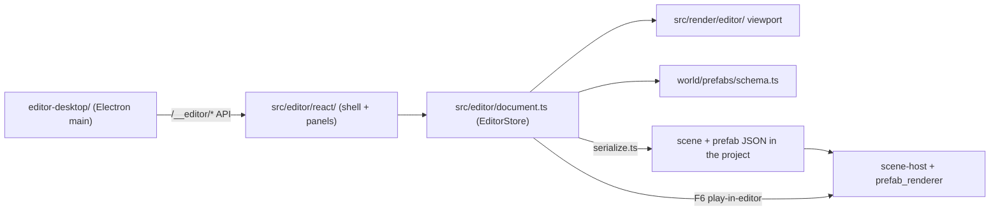

# AsteronEngine overview

**AsteronEngine** is ClaudeCitizen's Electron authoring workspace — the only
place content is authored. It manages **projects**, launchable **scenes**,
reusable **prefabs**, planets, systems, characters, menus, Play mode, and browser
release builds in one Unity-style app.

Launch it with `npm run editor:dev` (HMR) or `npm run editor` (production-like
build). Release builds of the game strip editor code.

The screenshot shows the Unity-style layout: hierarchy, scene view, inspector, and
project browser. Here a station corridor is being assembled from modular GLB
pieces with colliders and transform gizmos.

## Projects come first

Cold start opens the **Projects** hub. You create a new project or open an
existing one, and only then does the editor workspace load on that project root.

A valid project folder has `package.json` and an `assets/` library. Display name,
backend URL, default scene, and build output live in `asteron.project.json`
(**File → Project Settings…**). Authoring assets live in the project's single
library root `assets/` — not in the engine repository. The engine checkout's
`src/assets/` is engine-owned only (skybox, brand art) and is
reached through ESM imports, not the Project panel. Atmosphere LUT EXRs live
under `public/atmosphere/` (served at `/atmosphere/`).

## Three layers

| Layer | What you do |
| --- | --- |
| **Scenes** | Create launchable boot, title, loading, character-creator, main-game, and instance scenes as GameObject trees |
| **Scene building** | Drag GLBs into the viewport, add boxes and empties, parent and transform entities, edit GLB sub-meshes, tune materials, place lights |
| **Prefab authoring** | Pick a **prefab kind** (station, ship, site, prop, item), attach **gameplay components** (spawn points, doors, colliders, interactions), save to `<any assets folder>/<id>.prefab.json` |

Saved documents are plain JSON. Prefabs store only asset *paths*, so they are safe
to commit even when they reference gitignored protected packs — checkouts without
those packs simply show missing-model placeholders.

## Scenes own everything

Scene documents (`*.scene.json`, schema v3) are GameObject trees. There is no
global settings block: **components decide what a scene is**. Older v1/v2
documents migrate forward automatically on read.

| Component | Role |
| --- | --- |
| `game-manager` | System, planet, spawn mode **and the entry pipeline** — Title, Character Create, Starting Hab, Open Space, Loading |
| `planet` | Planet document reference |
| `player-start` | Spawn pose and mode |
| `prefab-instance` | Places a reusable prefab |
| `ui-screen` | Mounts title / login / character-create / loading UI |
| `scene-link` | Menu scene transition (`auto` + `delaySeconds` for timed hops) |
| `instanced-scene` | Per-player or shared instance content (habs, hangars) |
| `scene-exit` | In-play F portal that loads another scene (hab → station) |

At runtime, `src/app/scene-host.ts` loads a scene, mounts its UI screens or starts
play from its GameObjects, and switches scenes **in-process** — never by reloading
the page. A `boot` scene runs no gameplay: its Game Manager names each hop, and
the runtime follows that pipeline (sign in → character create when needed →
starting hab). Private habs use `scene-exit` to enter a shared station scene; a
`fly-through` exit takes a ship out to open space. See
[Game flow](./game-flow).

## Prefab kinds at a glance

| Kind | Purpose |
| --- | --- |
| **station** | Orbital stations — modular interiors with spawn, elevators, hangar pads, AVMS terminals |
| **ship** | Flyable ships — hull, deck colliders, doors, pilot seats, landing gear, boarding ramp |
| **site** | General-purpose world sites (outposts, landmarks) — colliders, interactions, lights |
| **prop** | Placeable hangar/apartment decorations for the player build system |
| **item** | Inventory item visuals — world pickup or icon-only catalog entries |

See [Prefab kinds](./prefab-kinds) for when to use each.

## Authoring tabs

The center column switches between authoring surfaces:

| Tab | Purpose |
| --- | --- |
| **Scene** | The 3D viewport for the open scene or prefab |
| **Material Manager** | Batch material overrides across the document |
| **Base Characters** | Character equipment, animation controllers, play-test stage |
| **Planet Authoring** | Planet terrain, biome, hydrology, and vegetation documents |
| **System Map** | Star / planet / station ecliptic layout |
| **Menu Manager** | Live HaloBand and play-menu previews |
| **Server** | Operator console for the Rust backend |

All tabs except **Server** author project files. The [Server console](/server-console)
edits persistent backend data.

## Architecture

| Path | Role |
| --- | --- |
| `editor-desktop/` | Electron shell: `cceditor:` protocol, project access, backend proxy, Build Web |
| `editor-desktop/project_hub.mjs` | Recent projects, validation, new-project scaffolding |
| `src/editor/` | Document store, commands, serialization, API client |
| `src/editor/react/` | React shell and all panel/form UI |
| `src/editor/play-in-editor.ts` | Play / Pause / Stop of the open document in the Game view |
| `src/render/editor/` | Three.js viewport, base-character stage, thumbnails |
| `src/world/scenes/` | Scene documents and runtime resolution |
| `src/world/prefabs/schema.ts` | Canonical prefab and scene component contract |
| `src/world/prefabs/component-registry.ts` | Component palette metadata per prefab kind |

React owns the editor chrome and every panel; `EditorStore` stays
framework-agnostic. WebGL and canvas preview stages (viewport, planet terrain,
system map, base characters, menu HUD) stay imperative behind React hosts.

Domain simulation rules live in `world/`, `flight/`, `player/`, and `npc/`. The
editor writes document data; it does not own gameplay logic.

## Doc map

- [Getting started](./getting-started) — projects and first session
- [Projects and settings](./projects-and-settings) — hub, `asteron.project.json`, backend proxy
- [Interface](./interface) — panels, toolbar, tabs, shortcuts
- [Building scenes](./building-scenes) — entities, transforms, GLB editing
- [Scene components](./scene-components) — game-manager, ui-screen, scene-link, scene-exit, …
- [Components](./components) — gameplay component system
- [Station authoring](./station-authoring)
- [Ship authoring](./ship-authoring)
- [Props and items](./props-and-items)
- [Base Characters](./base-characters)
- [Material manager](./material-manager)
- [Planet authoring](./planet-authoring)
- [System Map](./system-map)
- [Menu Manager](./menu-manager)
- [Assets and GLB](./assets-and-glb)
- [Preview and playtest](./preview-and-playtest)
- [Build Web](./build-web) — release browser builds
