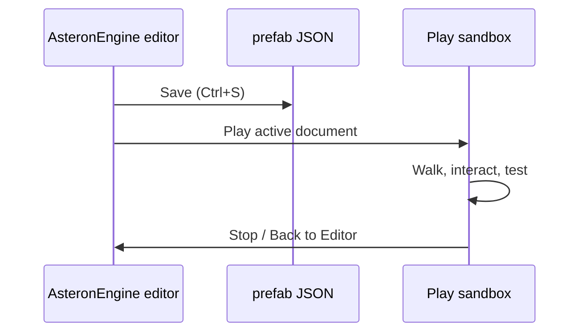

# Preview and playtest

The AsteronEngine editor plays the open document in-window, Unity-style. **Play** runs the
active scene — or wraps the active prefab in a throwaway stage scene — in the
Game view layered over the workspace.

## Play, pause, stop

| Action | Shortcut |
| --- | --- |
| Play / Stop | `F6` |
| Pause / Resume | `F7` |
| Stop | `Shift+F6` |

Play reads the **live editor document**, unsaved edits included, so you can
tweak a transform and press Play without saving first. Stop disposes the runtime
and restores the editor viewport. There is no separate Play Mode window.

Play mounts into `#editor-play-host`, a fixed overlay over the Game region, so the
HUD's `position: fixed` elements stay contained inside that region instead of
escaping across the whole workspace. The host is a sibling of `#editor-root` and
must outrank it in `z-index` (currently `260` vs the shell's `250`); otherwise
Play runs under the opaque editor chrome and looks like a blank blue screen while
audio still works. Pause feeds the game loop's `isPaused()` check rather than
tearing the session down.

## Deep-link URLs

These are the internal routes the editor's own preview commands use. You rarely
type them by hand, but they are useful for debugging a single surface.

| Scene/runtime | Internal route |
| --- | --- |
| Scene asset | `/?boot=scene&sceneId=<id>` |
| Station prefab stage | `/?stationPrefab=<id>` |
| Ship prefab stage | `/?shipPrefab=<id>` |
| Planet surface test | `/?boot=play&planetId=<id>&spawn=surface&from=editor` |

### Examples

```text
?stationPrefab=demo-station
?shipPrefab=phobos-starhopper
?boot=play&planetId=asteron&spawn=surface&from=editor
?boot=scene&sceneId=main-game
```

## Station playtest

Loads the prefab station instead of the default procedural layout in Play Mode.

What comes from the prefab:

- Visual geometry and materials
- Collider-based walking
- Spawn point, elevators, hangar pads
- Interactions and animated doors
- AVMS terminal zones

Some UI flows (terminal/hangar-bank) may still use procedural hooks until full station cutover.

## Ship tab

The **Ship** tab is where ships are authored and flown. It reuses the scene
viewport, hierarchy, and inspector — ship components (`ship-controller`,
`ship-door`, `cockpit-control`, `bed`, `collider`) live in the normal prefab
palette, and the toolbar's ship group still previews gear, ramp, and door
articulation statically. What the tab adds is a bar with three things:

- **Ship picker / New Ship / Save** — the ship prefabs in the open project.
- **Validation summary** — builds the open ship's layout and lists what would
  break the playtest: no hull GLB, no deck colliders, no pilot-role seat, doors
  that animate with no collider bound. Click it to re-check after edits.
- **Test** — starts the playtest in the selected environment.

### Test environments

| Env | What it boots | Use it for |
| --- | --- | --- |
| **Pad** | Isolated flat pad, no terrain or station | Deck colliders, doors, ramp, seats, flight feel — fastest loop |
| **Planet** | The full stage scene on `asteron` | Landing clamp, gravity, walking off the ship onto the surface |

Both spawn you **on foot beside the ship with the ramp already down**, so a
single run covers the whole loop. `F6` starts and stops it; `F7` pauses.

Verify in either environment:

| Check | How |
| --- | --- |
| Deck colliders | Walk the interior |
| Doors | F to interact; all `ship-door` ids |
| Ramp | F at ramp interact; walk up when lowered |
| Pilot seat | F at seat — cockpit camera from `eye` offset |
| Leave the seat | Hold **Y** — works at any time, settling onto the pad when nearby |
| Landing gear | **G** toggles gear |
| Flight feel | Sit the pilot, then take off using the normal flight model |

Stat edits (mass, thrust, torque) apply on the next **Test**, not live.

`/?shipPrefab=<id>` still boots the same pad sandbox as a standalone page. It is
a debugging fallback now, not the way in.

## Back to editor

The standalone `?shipPrefab=` page shows a **Back to Editor** banner. In-editor
playtests stop in place with **Stop** / `Shift+F6` and leave the editor window
untouched.

## Round-trip workflow



The Electron editor bundle enables authoring routes. Browser releases exclude
the editor UI but bundle scene documents so released scene links can resolve.

## Build Web

When a build is worth sharing, **File → Build Web** (`Ctrl+B`) saves the active
document and produces the browser release:

1. Builds the game runtime (`index.html` → `src/game-main.ts`) into the output
   directory from **File → Project Settings…**.
2. Writes `asteron.runtime.json` beside it with the backend URL and boot scene, so
   the same bundle can be re-pointed at a different backend without rebuilding.
3. Copies only the assets that saved prefab JSON actually references, leaving the
   rest of your protected library out of the deploy.

Serve that directory from any static host. Everything in it is publicly
downloadable — see [Assets](/assets) for what may safely ship.

## Catalog integration

Station and ship prefabs referenced by the [Server console](/server-console) catalog are the same JSON files you author here. After playtesting locally, create or update definitions so online players receive the content.

## Related

- [Getting started](./getting-started) — save/load basics
- [Station authoring](./station-authoring)
- [Ship authoring](./ship-authoring)
