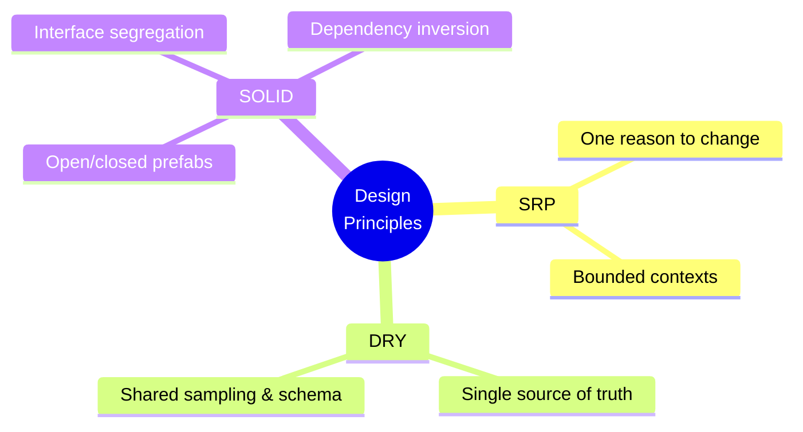
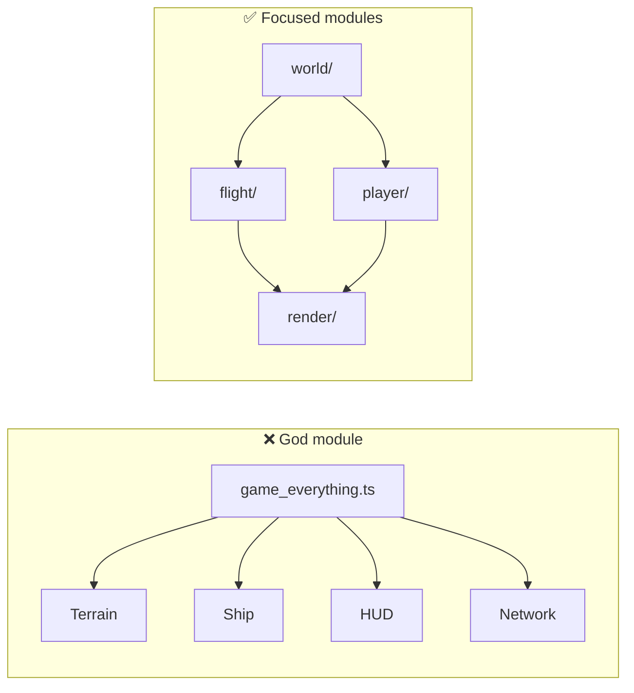
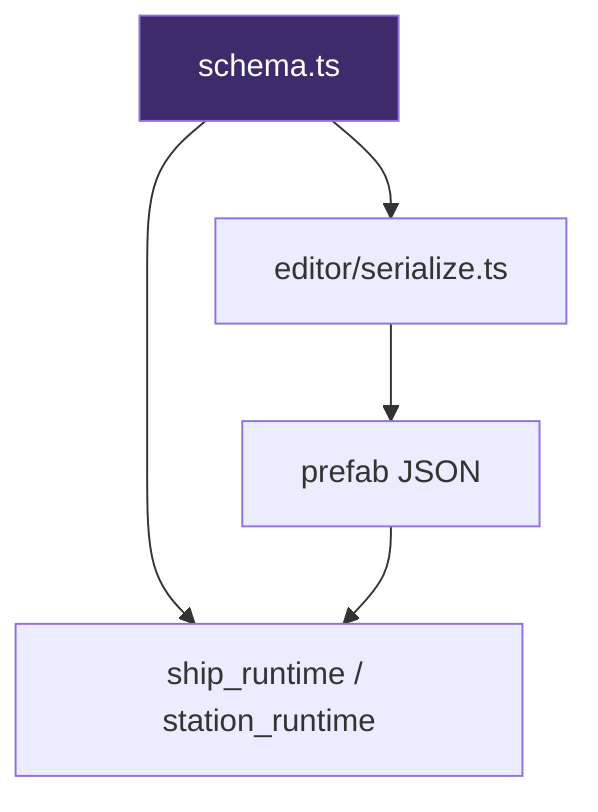
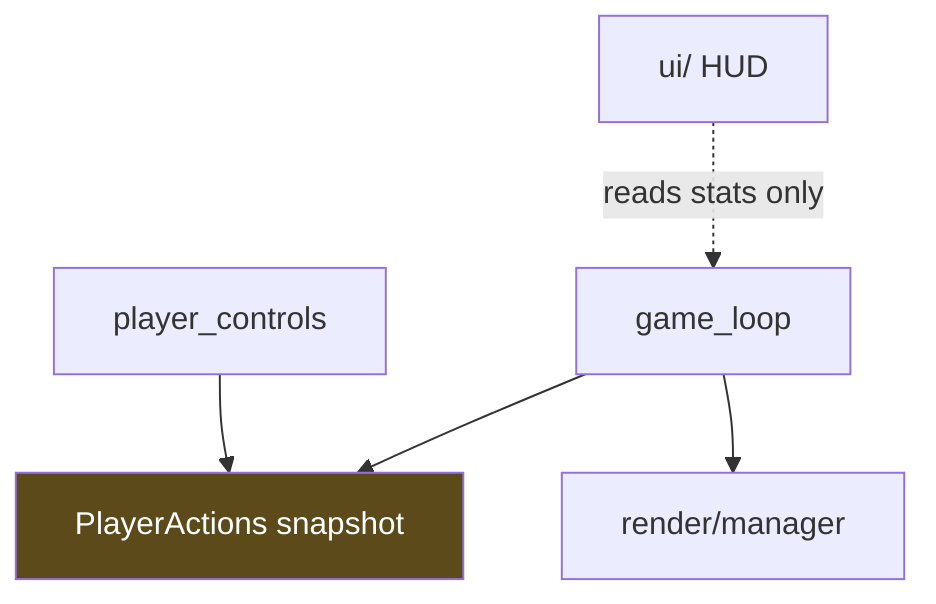
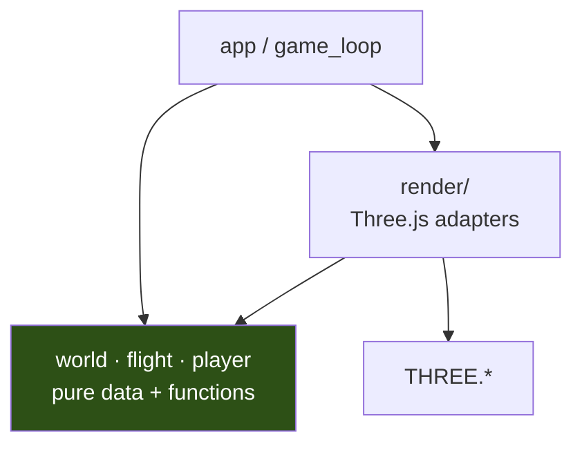

# Design Principles

ClaudeCitizen is vibe-coded, but not chaos-coded. These principles keep the codebase navigable as features pile on — procedural planets, ship interiors, FPS combat, and a future MMO backend.

## At a glance

---

## SRP — Single Responsibility Principle

> A module should have **one reason to change**.

If terrain LOD logic and HUD font sizing live in the same file, every graphics tweak risks breaking foot placement. We split by **job**, not by file count.

### How it shows up in the repo

| Module | Single responsibility |
| --- | --- |
| `world/planet_surface.ts` | Height & normal sampling |
| `render/planet_tiles/` | Which tiles to build and draw |
| `flight/flight_body.ts` | Ship rigid-body integration |
| `player/ship_deck.ts` | Deck movement & capsule collision |
| `world/prefabs/schema.ts` | Validate prefab component shapes |
| `editor/serialize.ts` | Editor state ↔ prefab JSON |

### Practical rule

Before adding code, ask: *"If this requirement changes, is there exactly one folder I'd expect to edit?"* If the answer is "it depends," extract a function or move the logic.

**Example:** Station door colliders toggle in `game_loop.ts` because animation state lives there — but the **rules** for binding colliders to animations live in `station_runtime.ts`. State orchestration ≠ layout rules.

---

## DRY — Don't Repeat Yourself

> Every piece of knowledge should have **a single, unambiguous representation**.

DRY is not "never copy a line." It means don't maintain two competing truths — especially for terrain height, prefab fields, and coordinate transforms.

### Single sources of truth

| Knowledge | Authoritative location |
| --- | --- |
| Prefab component fields | `world/prefabs/schema.ts` |
| Foot height sampling | `world/planet_surface.ts` → `sampleFootPlanetSurface()` |
| Renderable height sampling | `world/planet_surface.ts` → `sampleRenderablePlanetSurface()` |
| Ship door open threshold | `colliders.ts` + `ship_rig.ts` (same `0.85` semantics) |
| GLB node overrides | Persisted by **node name**, resolved in `serialize.ts` |

### When duplication is OK

- **Thin adapters** — `render/` may reformat domain data for Three.js without re-deriving rules.
- **Performance copies** — cached corner heights on a tile are a snapshot, not a second noise implementation.
- **Dev vs prod** — editor viewport and runtime renderer both apply GLB overrides, but through shared serialize output.

### DRY trap to avoid

Do **not** sample raw terrain noise in the character controller while the mesh uses bilinear grid interpolation. That looks DRY (one noise function) but produces **floating feet**. The shared truth is the **grid**, not the analytic function.

---

## SOLID

SOLID is a bundle of object-oriented design principles. ClaudeCitizen is mostly **functions + data**, but the ideas still apply.

### S — Single Responsibility

Covered above. Same letter, same goal.

### O — Open/Closed

> Open for extension, closed for modification.

**Prefabs are the main extension point.** New station elevators, ship doors, or hangar pads ship as new component types in JSON — not forks of `game_loop.ts`.

Adding a `hangar-pad` component extends behavior through schema + runtime flattening; it should not require editing ship physics.

### L — Liskov Substitution

> Subtypes must be substitutable for their base types.

We apply this lightly via **consistent interfaces**:

- All gameplay colliders expose the same resolution path (`GameplayCollider` shape).
- Character avatars retarget to different GLB skeletons but honor the same animation state names (`Idle_Loop`, `Walk_Loop`, …).
- Quality presets (`performance` / `balanced` / `high`) swap budgets without breaking call sites.

If a "special case" ship door needs a different code path than every other door, that's a smell — fix the model, not the call site.

### I — Interface Segregation

> Clients should not depend on interfaces they do not use.

Large god-objects are avoided:

- `RenderManager` does not expose tile worker internals to the HUD.
- `PlayerControls` returns **action snapshots** (`interactPressed`, `wasKeyPressed`) — not the entire keyboard DOM API.
- Nest modules (`auth`, `game`, `world`) expose narrow service APIs.

### D — Dependency Inversion

> Depend on abstractions, not concretions.

High-level flow depends on **domain concepts**, not Three.js meshes:

| High level | Depends on | Not on |
| --- | --- | --- |
| `game_loop.ts` | `ShipLayout`, blend values, mode FSM | `THREE.Mesh` |
| `player/` movement | `sampleFootPlanetSurface()`, collider rigs | GPU buffers |
| Future `GameService` | intent DTOs, tick state | client render details |

**Factories over classes:** domain modules export `createX()` and pure helpers. Three.js objects are created at the boundary in `render/`, keeping `world/` and `flight/` portable to a future server or headless sim (`npm run demo`).

---

## Principles × performance

These principles are not academic — they protect the frame budget:

| Principle | Performance payoff |
| --- | --- |
| **SRP** | Tile meshing stays in workers; HUD does not trigger terrain rebuilds |
| **DRY** | One foot-surface LOD level prevents expensive desync debugging |
| **Dependency inversion** | Domain hot paths avoid Three.js allocation churn |
| **Open/closed** | New prefab components reuse existing animation/collider pipelines |

When a change risks main-thread stalls, treat it as a **design failure** first — unbounded sync loops violate both SRP and the performance budget.

---

## Quick checklist for contributors

Before opening a PR (or merging a vibe session):

1. **SRP** — Does this file/module have one clear job?
2. **DRY** — Is there already a canonical function or schema field for this data?
3. **Boundaries** — Does `world/`/`flight/`/`player/` avoid importing `three`?
4. **Extension** — Can the next ship/station ship as prefab JSON instead of a core edit?
5. **Performance** — Is work bounded per frame or offloaded to a worker?

See also: [Domain-Driven Design](./domain-design) for context boundaries, [Physical Guards](./physical-guards) for ESLint and AI enforcement, [Technology Stack](./stack) for runtime details.
