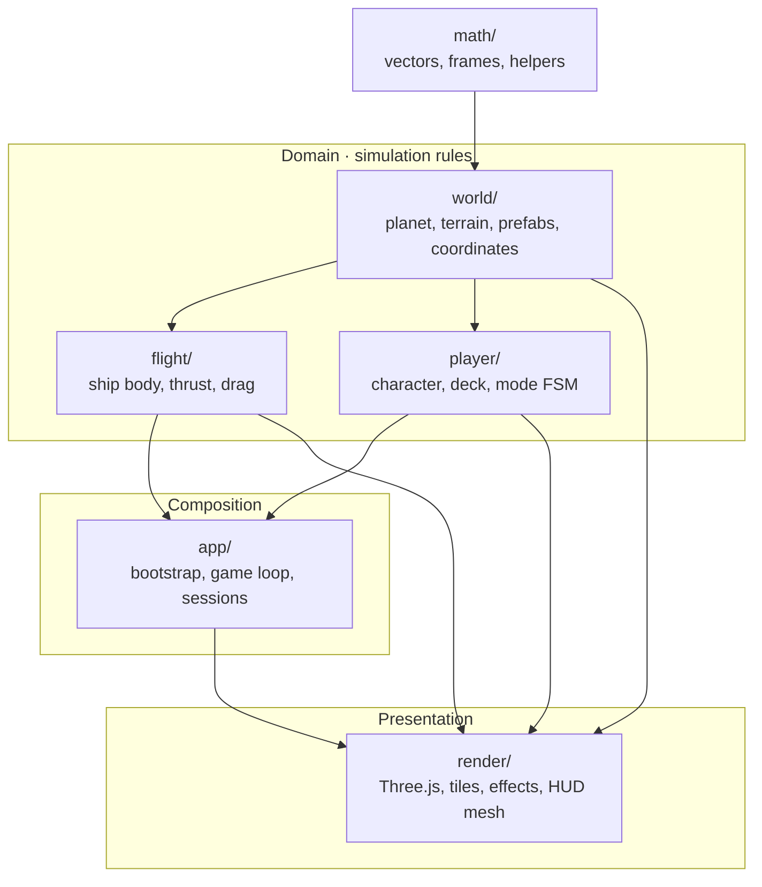
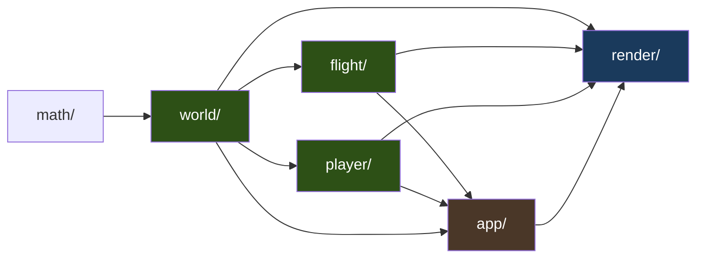
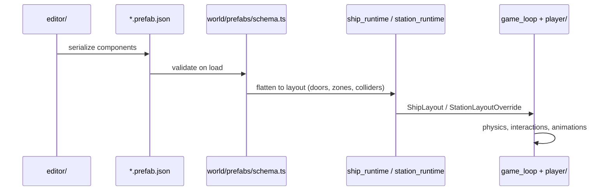
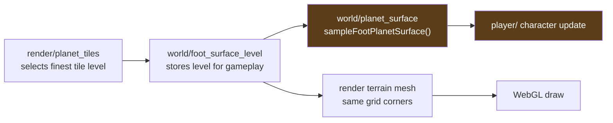
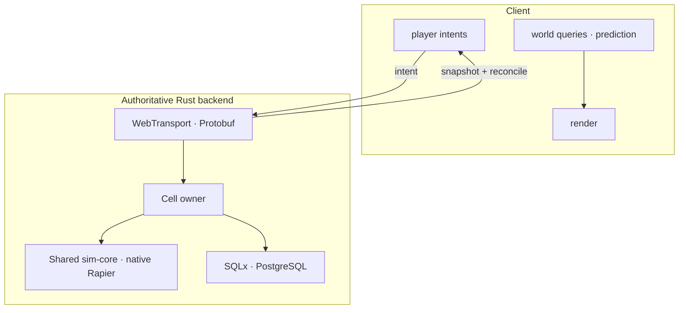

# Domain-Driven Design

ClaudeCitizen uses **Domain-Driven Design (DDD)** to keep a Star Citizen–scale simulation maintainable in the browser. The idea is simple: each part of the game owns a **bounded context** with explicit boundaries. Simulation rules live in domain modules; rendering only **reads** that state.

## Why DDD here?

A procedural planet, ship physics, on-foot movement, and a Three.js renderer could easily become one tangled file. DDD gives us:

- **Clear ownership** — terrain bugs start in `world/`, not in a shader.
- **Testable logic** — domain modules export pure functions and factories (no Three.js types).
- **Performance guardrails** — `render/` cannot silently mutate simulation state mid-frame.
- **Shared authority semantics** — browser prediction and native authority share Rust simulation primitives.

## Bounded contexts

| Context | Path | Owns |
| --- | --- | --- |
| **World** | `src/world/` | Planet geometry, terrain sampling, lakes, prefab schema & runtime flattening |
| **Flight** | `src/flight/` | Ship rigid-body dynamics, input mapping, radial gravity |
| **Player** | `src/player/` | Character controller, boarding, deck collision, pilot-seat FSM |
| **Render** | `src/render/` | Meshes, materials, LOD tiles, atmosphere, post-FX — **read-only** toward domain |
| **App** | `src/app/` | Wires contexts together; `game_loop.ts` orchestrates, does not own rules |

Supporting modules sit outside the core simulation boundary:

| Module | Role |
| --- | --- |
| `math/` | Shared vector math — no game rules |
| `physics/` | Rapier world for stations |
| `editor/` | Dev-only prefab authoring (not shipped in prod) |
| `ui/` | DOM HUD panels |
| `net/` | WebTransport, Protobuf codecs, interpolation, and WASM prediction |

## Dependency direction

Dependencies flow **inward toward domain**, never from domain into Three.js:

### Import rules (enforced by ESLint + agent docs)

See [Physical Guards](./physical-guards) for the full rule list. Summary:

| From | May import | Must not import |
| --- | --- | --- |
| `world/`, `flight/`, `player/` | `math/`, each other (sparingly) | `three`, `render/`, DOM |
| `render/` | `world/`, `player/`, `flight/` (read) | Mutating simulation state |
| `app/` | All contexts | Inline domain logic |
| `editor/` | `world/prefabs`, `render/editor` | Game loop hot path |

**Green rule:** if you need a height sample for gameplay, call `sampleFootPlanetSurface()` in `world/` — do not raycast the mesh in `render/`.

## Ubiquitous language

Terms mean the same thing in code, docs, and prefabs:

| Term | Meaning |
| --- | --- |
| **Tile** | Quadtree cell on the cube-sphere at a given LOD level |
| **Prefab** | JSON tree of entities + components (`*.prefab.json`) |
| **Walk zone** | Authoring volume for on-foot collision (ship deck or station floor) |
| **Foot surface** | Discrete height grid used by the character controller |
| **Mode FSM** | Player state machine: on foot, on deck, in pilot seat, in flight |
| **Intent** | Client request evaluated by the authoritative cell owner |

## Prefabs as the world model

Prefabs are the bridge between **authoring** (editor) and **runtime** (domain flattening):

- **Schema** (`schema.ts`) is the single source of truth for component fields.
- **Runtime flatteners** turn entity trees into gameplay structures (door rigs, deck colliders, spawn points).
- **Render** loads GLBs and applies animation blends; **player** and **physics** consume the flattened layout.

## Critical invariant: terrain mesh ↔ foot placement

The most important cross-context contract is that **visible terrain** and **foot physics** sample the **same LOD grid**:

Character update runs **before** render each frame, so foot sampling intentionally uses the **previous frame's** tile level (one-frame lag is acceptable; desync is not).

## Mapping to the authoritative backend

Browser domain state is predicted locally, while the Rust cell owner evaluates intents and returns authoritative reconciliation:

Clients send **intents**; the cell owner owns outcomes. `backend/crates/sim-core/` compiles to both native code and WebAssembly so prediction does not drift into a second implementation. Rendering remains presentation-only.

## Further reading

- [Physical Guards](./physical-guards) — ESLint boundaries and AI rule layers
- Agent conventions: `AGENTS.md` (architecture section)
- [Design Principles](./design-principles) — SRP, DRY, SOLID applied to this layout
- [Technology Stack](./stack) — frameworks and runtime details
