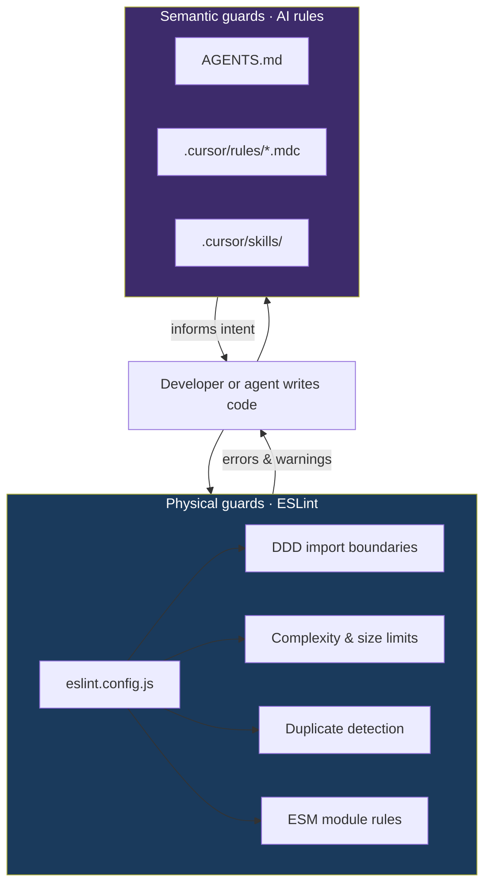
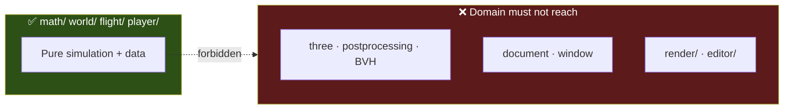
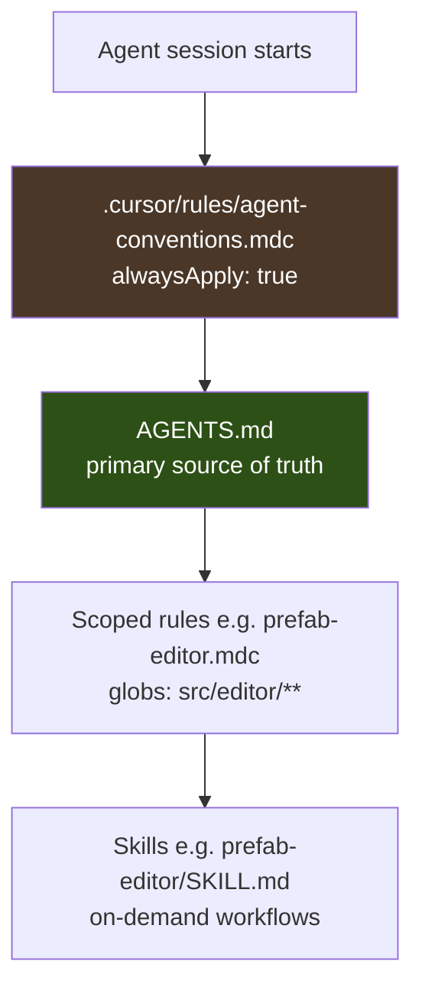
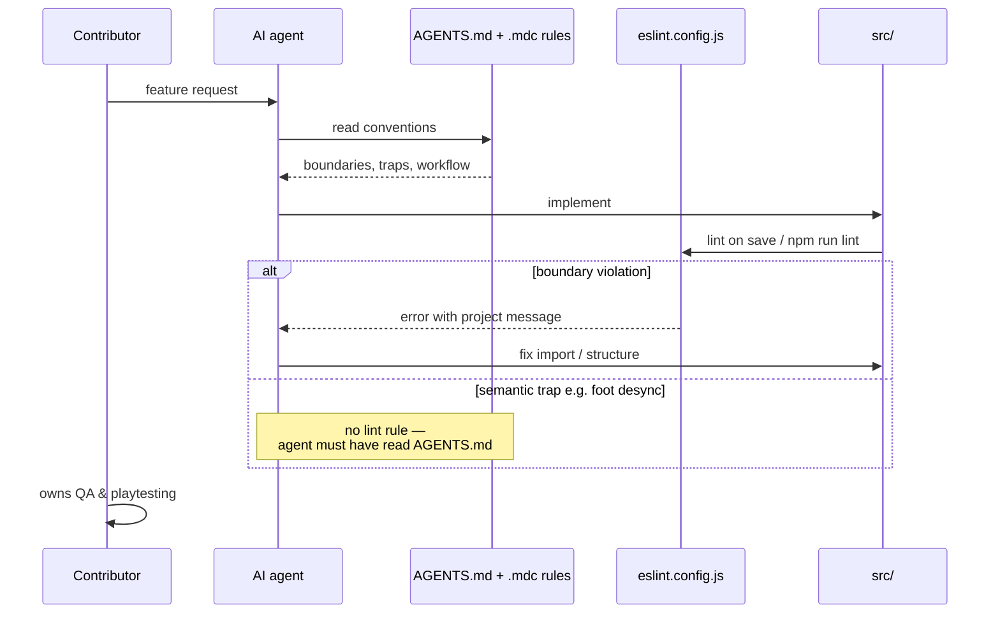

# Physical Guards

ClaudeCitizen is vibe-coded with AI agents, but **vibe is not enough** for architecture. We use two complementary guardrails:

| Layer | What it is | When it bites |
| --- | --- | --- |
| **Physical guards** | ESLint rules in `eslint.config.js` | `npm run lint`, editor diagnostics, agent edits |
| **Semantic guards** | `AGENTS.md`, `.cursor/rules/`, skills | Every agent session — context, traps, workflow |

Physical guards are **machine-enforced**: a bad import in `world/` fails lint with an explicit message. Semantic guards cover what linters cannot see — terrain foot desync, frame budgets, protected assets, prefab door wiring — and steer agents *before* they write the wrong code.

Together they turn [Domain-Driven Design](./domain-design) and [Design Principles](./design-principles) from documentation into **defaults agents and humans hit automatically**.

---

## Running the linter

| Command | Purpose |
| --- | --- |
| `npm run lint` | Check browser and utility TypeScript under `src/` and `scripts/` |
| `npm run lint:fix` | Auto-fix where rules support it (e.g. type-import style) |

**Plugins:** `@eslint/js`, `typescript-eslint`, `eslint-plugin-import-x`, `eslint-plugin-sonarjs`.

**Ignored paths:** `dist/`, `target/`, `docs/`, `vendor/`, `**/*.d.ts`, `vite.config.ts`, legacy `scripts/**/*.mjs`.

Most project-specific rules are **warnings** (complexity, duplication) so existing code can evolve gradually. **Architectural boundaries are errors** — domain layers must not import Three.js or the DOM.

---

## DDD boundaries (errors)

These rules encode the dependency graph from [Domain-Driven Design](./domain-design). Violations are `error` unless noted.

### Pure domain — `math/`, `world/`, `flight/`, `player/`

Domain modules must stay free of presentation and platform APIs.

**Blocked imports (`no-restricted-imports`):**

| Import | Message intent |
| --- | --- |
| `three` | Rendering belongs in `render/` |
| `three-mesh-bvh` | Mesh/BVH work belongs in `render/` |
| `postprocessing` | Post-FX belongs in `render/` |
| `@dimforge/rapier3d` | Physics bindings belong in `physics/` or app wiring |
| `**/render/**`, `**/editor/**` | Presentation and dev tools stay at the edge |

**Blocked globals (`no-restricted-globals`):**

| Global | Message intent |
| --- | --- |
| `document`, `window`, `HTMLElement` | DOM access belongs in `render/`, `ui/`, or `app/` |

### Render — `src/render/**/*.ts`

| Pattern | Rule |
| --- | --- |
| `**/app/**` | **Error** — dependency flows `app → render → domain`, not the reverse |

Render may **read** domain state; it must not pull in app orchestration.

### App — `src/app/**/*.ts`

| Rule | Limit | Rationale |
| --- | --- | --- |
| `max-lines` | 900 (warn) | Bootstrap wires modules; it should not become a god file |
| `sonarjs/cognitive-complexity` | 20 (warn) | Slightly higher than default — orchestration is inherently branchy |

### Rust backend

Rust is checked separately in CI:

- `cargo fmt --all -- --check` enforces formatting.
- `cargo clippy --workspace --all-targets -- -D warnings` rejects warnings across the server, protocol, and shared simulation crates.
- `cargo build --release -p cc-server` and the WebAssembly build compile both native and browser targets from the same workspace.

### Relaxed zones

`scripts/**/*.ts` turns off architectural restrictions so utilities have more freedom.

---

## Design principles (warnings)

ESLint cannot prove SRP, but it **nudges** toward [Design Principles](./design-principles) with measurable thresholds.

### DRY

| Rule | What it catches |
| --- | --- |
| `import-x/no-duplicates` | Same module imported twice in one file |
| `sonarjs/no-identical-functions` | Copy-pasted functions |
| `sonarjs/no-all-duplicated-branches` | Identical `if`/`else` bodies |
| `sonarjs/no-duplicate-string` | Same literal repeated ≥ 5 times |

### SRP / complexity

| Rule | Threshold |
| --- | --- |
| `complexity` | cyclomatic complexity ≤ 15 |
| `max-depth` | nesting depth ≤ 4 |
| `max-params` | ≤ 5 parameters |
| `max-lines-per-function` | ≤ 120 lines (blank lines and comments skipped) |
| `sonarjs/cognitive-complexity` | ≤ 15 (≤ 20 in `app/`) |

When a function trips multiple warnings, that is a signal to extract helpers or move logic to the owning bounded context.

### SOLID (what ESLint can enforce)

| Rule | SOLID idea |
| --- | --- |
| `@typescript-eslint/no-extraneous-class` | Avoid empty/static-only classes (prefer functions) |
| `@typescript-eslint/consistent-type-imports` | `import type` for types — cleaner dependency graph |
| `import-x/no-cycle` | Circular imports (max depth 4) — breaks dependency inversion |
| `class-methods-use-this` | Methods that do not use `this` may belong as functions |
| `@typescript-eslint/no-empty-function` | Empty stubs (with narrow decorated-function exceptions) |

### Module style

| Rule | Note |
| --- | --- |
| `@typescript-eslint/no-require-imports` | Prefer ESM `import` in browser and utility TypeScript |

---

## Semantic guards for AI agents

Physical guards catch **syntax-level mistakes**. They do not know that foot placement must use `sampleFootPlanetSurface()`, that tile build budgets prevent 0 FPS, or that station doors wire through `interactionType: "animation"`. That knowledge lives in semantic guards.

### Rule hierarchy

| File | Scope | Role |
| --- | --- | --- |
| `.cursor/rules/agent-conventions.mdc` | Every chat | Points agents at AGENTS.md; performance as first-class constraint; QA/dev-server boundaries |
| `AGENTS.md` | Architecture & ops | Bounded contexts, terrain/foot invariant, prefab animation wiring, security, editor model |
| `.cursor/rules/prefab-editor.mdc` | `src/editor/**`, `src/render/editor/**` | Selection model, GLB node names, component placement paths |
| `.cursor/skills/**` | Task-specific | Deep workflows (e.g. prefab editor troubleshooting) |

### What semantic guards cover that ESLint cannot

| Topic | Guard type | Why ESLint is not enough |
| --- | --- | --- |
| Terrain mesh ↔ foot LOD sync | AGENTS.md | Cross-module runtime contract, not an import |
| Per-frame tile build budget | agent-conventions.mdc | Performance policy, not AST shape |
| `sampleFootPlanetSurface()` vs raycast | AGENTS.md | Correct API choice |
| Station door animation → collider → F-key | AGENTS.md | Multi-file behavioral trace |
| Protected assets / no secrets in client | AGENTS.md | Security process |
| No unit tests; user owns QA | AGENTS.md | Workflow, not code structure |
| Do not start dev servers | AGENTS.md | Agent behavior |

### How physical + semantic guards reinforce AI coding

1. **Before writing** — `agent-conventions.mdc` loads every session. Agents read AGENTS.md for boundaries, so they reach for `world/` APIs instead of `THREE.Mesh` in domain code.
2. **While writing** — Scoped rules (`prefab-editor.mdc`) add file-specific truth when editing the editor. Skills supply step-by-step procedures for complex tasks.
3. **After writing** — ESLint runs in the IDE and via `npm run lint`. Import restrictions produce **actionable messages** that mirror AGENTS.md wording — agents can self-correct without guessing project norms.
4. **Gaps** — If agents repeatedly violate something ESLint *could* enforce, add a rule to `eslint.config.js`. If the issue is behavioral or cross-cutting, extend AGENTS.md or a `.mdc` rule.

### Keeping guards aligned

When architecture changes:

1. Update **`eslint.config.js`** if the rule is expressible as imports, globals, file patterns, or metrics.
2. Update **`AGENTS.md`** for domain knowledge, invariants, and agent workflow.
3. Update **`.cursor/rules/agent-conventions.mdc`** only for short, always-on triggers — it should defer to AGENTS.md, not duplicate it.
4. Add or update **scoped `.mdc` rules** when a whole subtree has its own conventions (like the prefab editor).

Drift between layers confuses agents. Prefer matching error messages in ESLint to the prose in AGENTS.md so both humans and models see the same vocabulary.

---

## Quick reference

### “Where does this belong?”

| Question | Physical guard | Semantic guard |
| --- | --- | --- |
| Can `flight/` import `three`? | **No** — `no-restricted-imports` error | AGENTS.md import rules |
| Can `render/` import `app/`? | **No** — error | DDD dependency diagram |
| Is this function too big? | `max-lines-per-function`, complexity warnings | SRP checklist in design principles |
| Foot height for character? | — | `sampleFootPlanetSurface()` in AGENTS.md |
| Browser prediction rule duplicated in TypeScript? | — | Shared Rust/WASM core rule in AGENTS.md |

### Contributor checklist

1. Run `npm run lint` before handoff (or rely on IDE diagnostics).
2. If adding a cross-layer import, check the tables above — errors are intentional.
3. For agent sessions, ensure `AGENTS.md` reflects any new invariant you expect AI to follow.
4. Prefer promoting repeated agent mistakes into ESLint rules when possible.

---

## Further reading

- [Domain-Driven Design](./domain-design) — bounded contexts and dependency direction
- [Design Principles](./design-principles) — SRP, DRY, SOLID behind the lint thresholds
- [Technology Stack](./stack) — `npm run lint` in the build toolchain
- Repo: `eslint.config.js`, `AGENTS.md`, `.cursor/rules/`
