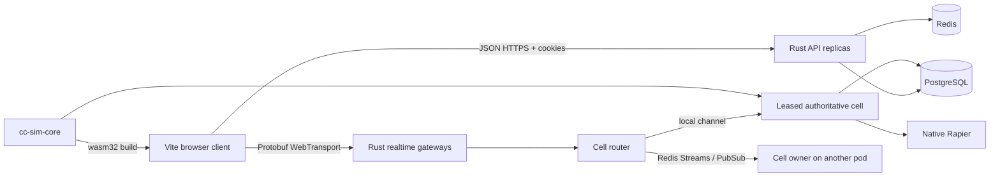

# Rust Backend Hard Cutover PRD

**Status:** Approved for implementation  
**Owner:** ClaudeCitizen engineering  
**Cutover model:** One-way hard cutover; no dual-write, shadow, proxy, or fallback backend  
**Last updated:** 2026-07-16

## 1. Summary

ClaudeCitizen replaces the legacy TypeScript API and client-authoritative WebSocket presence relay with one horizontally scalable Rust backend. The new backend owns authentication, account and catalog APIs, persistence, authoritative realtime simulation, interest management, chat, and operations. Realtime clients use WebTransport and Protobuf. Simulation cells run native Rapier on the server, and the browser uses prediction code compiled to WebAssembly from the same Rust simulation crate.

The cutover preserves the existing PostgreSQL data model and user-facing REST response shapes where they remain useful. Existing Prisma migration history is converted into SQLx migrations without recreating or renaming live tables. The final repository contains only the Rust server implementation and no transitional path to the retired runtime.

## 2. Problem

The existing backend provides useful product services—cookie authentication, Discord login, password reset, the operator API, catalogs, starter grants, inventory, construction persistence, and multiplayer visibility—but realtime state is accepted from clients as authoritative JSON presence. A single in-memory gateway cannot safely own an MMO simulation, cannot coordinate ownership across replicas, and has no deterministic client prediction contract.

ClaudeCitizen needs a backend foundation that:

- scales out without two servers simulating the same spatial cell;
- validates input and owns accepted entity state;
- uses the same movement/prediction math in native server code and browser WASM;
- supports low-latency unreliable snapshots and reliable commands;
- preserves durable account/economy/catalog data;
- can be deployed and drained safely on Kubernetes.

## 3. Goals

1. Replace the entire backend with a Rust workspace and remove every runnable legacy TypeScript/Prisma backend artifact.
2. Preserve all current HTTP product capabilities and in-progress weapon purchasing behavior.
3. Make simulation state authoritative inside a single leased owner for each cell.
4. Run server simulation with native Rapier at a fixed tick rate.
5. Share deterministic prediction primitives between the native server and browser WebAssembly.
6. Replace realtime JSON/WebSocket traffic with versioned Protobuf over WebTransport.
7. Use SQLx with the existing PostgreSQL schema and forward-only migrations.
8. Use Redis for short-lived auth coordination, rate limits, cell leases, cross-pod commands, and snapshot fan-out—not as the durable source of truth.
9. Provide container, Kubernetes, health, readiness, metrics, shutdown, and migration paths suitable for horizontal replicas.
10. Complete one hard cutover with no dual backend, compatibility proxy, or rollback to the retired runtime.

## 4. Non-goals

- Rewriting the Three.js renderer, prefab editor, procedural terrain, or offline ship-preview experience in Rust.
- Moving durable player/catalog records out of PostgreSQL.
- Making Redis a durable event store.
- Implementing combat, NPC AI, cross-region global orchestration, or seamless inter-cluster travel in this cutover.
- Preserving the old WebSocket wire protocol.
- Running two backend implementations in production or retaining one as a fallback.

## 5. Users and critical journeys

### Players

- Register or sign in with password or Discord.
- Refresh/logout through secure HTTP-only cookies.
- Request and complete password reset.
- Bootstrap account, spawn, ships, character, inventory, apartment, and hangar state.
- Save character appearance.
- Purchase weapon inventory and construction props atomically with ARC balance updates.
- Place, move, and remove owned props.
- Join a world cell, move, see nearby entities, transition instances, and chat.

### Operators

- Sign in to the existing admin application.
- Inspect users and owned ships.
- Create/update ship and prop definitions.
- Create/update/delete item, weapon, and backpack definitions.
- Read/update starter loadouts and starting balance.
- Observe health, readiness, metrics, cell ownership, tick health, and transport sessions.

### Platform operators

- Apply forward SQL migrations exactly once before application rollout.
- Scale replicas without duplicate cell authority.
- Drain a pod, release/expire its leases, and allow another pod to recover cells.
- Rotate JWT, Discord, SMTP, database, Redis, and WebTransport certificate secrets.

## 6. Product requirements

### 6.1 REST parity

The Rust service must retain the current browser contracts under `/auth/*`, `/game/*`, and `/admin/*`, including status behavior and HTTP-only cookie names (`cc_at`, `cc_rt`, `cc_admin`). The cutover must include the local in-progress `POST /game/inventory/purchase` contract: weapons only, sufficient balance, stack limit enforcement, one atomic balance/inventory transaction, and a refreshed inventory response.

### 6.2 Authoritative cells

- A cell is identified by the current instance plus a deterministic spatial partition for open planet/space instances. Private apartment/hangar instances are single cells.
- Exactly one live server lease owns a cell epoch at a time.
- A cell accepts ordered input intents, steps at 30 Hz, performs native Rapier collision/kinematic resolution, and emits snapshots at 20 Hz.
- Client target state is input evidence, never authoritative state. The cell constrains acceleration, speed, displacement, finite values, and legal instance transitions before updating its entity.
- Every input carries a monotonically increasing sequence. Every reconciliation reports the last processed sequence, cell tick, cell epoch, and accepted state.
- Ownership changes increment the epoch. Clients discard stale-epoch snapshots.
- Authoritative snapshots are periodically persisted to PostgreSQL. Redis carries leases and transient routing only.

### 6.3 Prediction and reconciliation

- `cc-sim-core` exposes pure, fixed-step movement primitives plus native Rapier cell integration.
- The Rust backend links the native crate.
- The browser loads a WebAssembly build of the same crate and uses it to advance predicted axis state before sending an intent.
- Server reconciliation rewinds the predicted state to the accepted sequence and replays unacknowledged inputs.
- Constants that affect prediction are protocol-visible and versioned; no independent TypeScript copy owns those rules.

### 6.4 WebTransport and Protobuf

- HTTP REST remains JSON for the existing UI. Realtime traffic is Protobuf only.
- The browser exchanges a valid access cookie for a single-use, short-lived world ticket over REST. Long-lived access/refresh credentials never appear in the WebTransport URL.
- Reliable bidirectional streams carry join, leave, transitions, chat, readiness, errors, and control messages.
- Datagrams carry sequenced input, snapshots, acknowledgements, and ping/pong where loss is preferable to head-of-line blocking.
- Payloads have a maximum size and unknown fields remain forward compatible.
- Protocol version mismatches fail closed with a specific error.

### 6.5 Horizontal routing

- Redis `SET NX PX` leases assign a cell to a node and compare-and-renew prevents a stale node extending another epoch.
- Commands arriving on a non-owner pod are sent to the owner through a bounded Redis Stream.
- Owner snapshots are published for remote gateway pods; local sessions use an in-process broadcast path.
- Backpressure drops superseded realtime snapshots before reliable control messages.
- A pod is unready when PostgreSQL or Redis is unavailable, migrations are behind, or the WebTransport endpoint cannot accept sessions.

### 6.6 Persistence

- Existing table/column names and records remain intact.
- SQLx owns new and historical migrations. Migrations are forward-only and idempotent where the imported history was idempotent.
- Economy/inventory/construction mutations use database transactions and row locking.
- New durable simulation snapshot records include `cell_id`, `epoch`, `tick`, Protobuf payload, and update timestamp.
- Cell recovery loads the newest compatible snapshot, then starts a new epoch.

### 6.7 Security

- Passwords remain bcrypt cost 12 compatible with existing hashes.
- Access, refresh, and admin JWT types/audiences are checked independently.
- Refresh tokens rotate, are stored only as SHA-256 hashes, and revoke their predecessor.
- Origin/CORS and secure-cookie settings are explicit per environment.
- Login, password reset, world-ticket issuance, chat, and command submission are rate limited through Redis.
- Input decoding rejects oversized messages, non-finite floats, invalid enum/range values, unauthorized private instances, and replayed sequences.
- Logs redact cookies, authorization values, passwords, tokens, tickets, and reset URLs.

## 7. Architecture

### Workspace boundaries

| Path | Responsibility |
| --- | --- |
| `backend/crates/protocol` | Protobuf-generated transport types and protocol constants |
| `backend/crates/sim-core` | Shared fixed-step prediction plus native Rapier cell state |
| `backend/crates/server` | Axum REST, auth, SQLx repositories, Redis coordination, WebTransport, cell lifecycle |
| `backend/migrations` | Imported schema history plus authoritative simulation additions |
| `proto/` | Canonical Protobuf schemas |
| `src/net/` | Browser REST client, Protobuf codec, WebTransport session, WASM prediction adapter |
| `deploy/k8s/` | Kubernetes deployment, service, autoscaling, disruption, config, and migration job |

## 8. Data and protocol compatibility

- The live schema is migrated in place; there is no export/import or Prisma-created parallel schema.
- Pre-cutover JWTs are invalidated because the Rust service requires audience claims; users sign in once after cutover and all new access/refresh cookies rotate through Rust.
- REST JSON continues camelCase to avoid an unrelated UI migration.
- WebSocket sessions are intentionally not compatible and must reconnect through WebTransport after deployment.
- `protocol_version = 1` and `simulation_version = 1` gate decoding and snapshot recovery.

## 9. Deployment and cutover

1. Build and publish the Rust backend image and browser assets containing the matching WASM/protocol version.
2. Run the SQLx migration job against PostgreSQL.
3. Stop the old deployment before starting Rust replicas; there is no overlap window.
4. Deploy Rust replicas with PostgreSQL, Redis, JWT, SMTP/OAuth, origin, and WebTransport TLS configuration.
5. Wait for readiness and migration/version checks.
6. Publish the browser build configured for the Rust HTTP and WebTransport endpoints.
7. Monitor session creation, cell lease contention, tick lag, rejection/reconciliation rate, Redis routing lag, and HTTP error rate.

Rollback is application-forward: fix and redeploy the Rust image against the same compatible schema. The repository and runbooks do not retain a legacy runtime rollback path.

## 10. Service levels and observability

| Signal | Initial objective |
| --- | --- |
| REST availability | 99.9% monthly |
| World ticket issuance p95 | under 150 ms |
| Realtime input-to-owner p95 | under 50 ms within region |
| Cell tick | 30 Hz, p99 tick under 25 ms |
| Snapshot cadence | 20 Hz full LOD; reduced by interest tier |
| Cell recovery | under 10 seconds after lease expiry |
| Durable mutation loss | zero committed PostgreSQL transactions |

Structured tracing includes request/session IDs, node ID, cell ID, epoch, tick, and input sequence. Prometheus metrics cover HTTP, SQL pool, Redis operations, WebTransport sessions/datagrams, cell counts, routed commands, tick duration, snapshot sizes, input rejection, and reconciliation distance.

## 11. Acceptance criteria

- `server/` and its package workspace no longer exist.
- Package manifests and lockfiles contain no Prisma or backend WebSocket/TypeScript runtime dependencies.
- No client code constructs a WebSocket for world networking.
- One Rust server binary exposes all existing auth/game/admin REST routes, health, readiness, and metrics.
- The eight existing schema migrations and preserved loadout/catalog additions are present in SQLx history, followed by the simulation migration.
- The in-progress weapon shop purchase path is preserved.
- The canonical realtime schema is Protobuf and both client and server implement version 1.
- A server cell uses native Rapier and an exclusive Redis lease/epoch.
- Non-owner pods route inputs to the owner and can fan snapshots back to their sessions.
- Browser prediction calls the WASM build of `cc-sim-core`; the server links that same crate.
- Kubernetes manifests provide migration job, multi-replica deployment, TCP/UDP service, HPA, PDB, probes, security context, and graceful termination.
- Documentation and agent conventions describe only the Rust backend as the current server architecture.
- Repository lint completes without errors. Agents may run non-interactive builds and typechecks; tests, browser QA, screenshots, and dev servers require separate authorization.

## 12. Risks and mitigations

| Risk | Mitigation |
| --- | --- |
| Browser/proxy WebTransport support | Detect support before joining and surface a hard compatibility error; do not retain a WebSocket fallback. |
| UDP load-balancer behavior | Expose an explicit UDP service, document cloud requirements, and probe transport readiness. |
| Duplicate cell owners during partitions | Lease value includes node and epoch; compare-and-renew plus PostgreSQL snapshot fencing rejects stale epochs. |
| Prediction drift | Same Rust functions/constants, fixed timestep, sequence reconciliation, version gates. |
| Redis outage | Stop accepting new realtime work, mark pods unready, preserve durable data in PostgreSQL. |
| Oversized scope hides parity gaps | Route inventory and mechanical scans are cutover gates; preserve existing REST shapes before cleanup. |
| Hard cutover rollback pressure | Keep schema changes backward-tolerant but make operational rollback a forward Rust redeploy, not dual runtime. |
