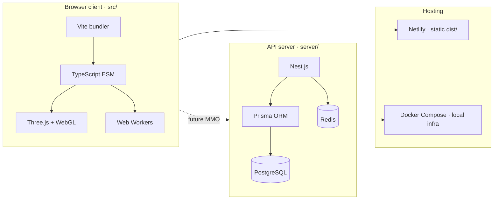
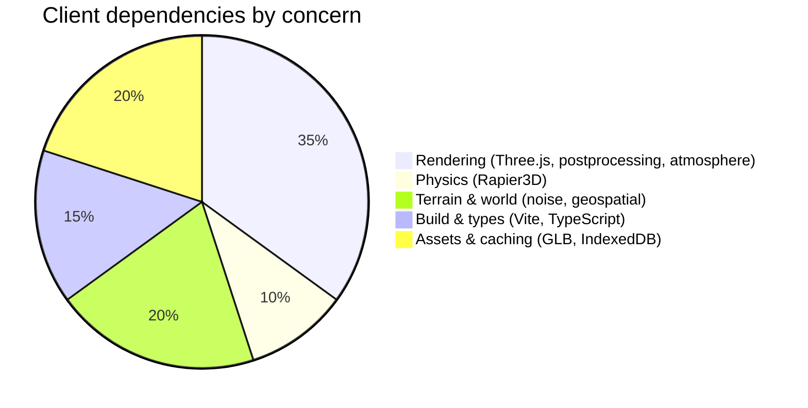
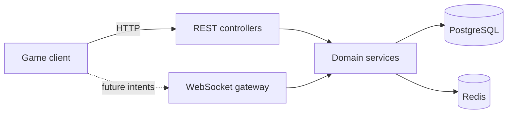
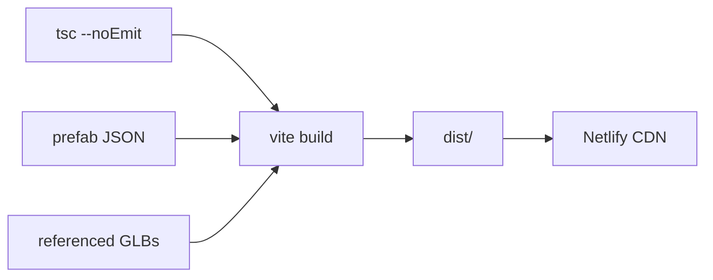

# Technology Stack

ClaudeCitizen is a **real-time browser game** with a **future MMO backend**. The stack is chosen for TypeScript end-to-end, fast iteration in dev, and a clear split between simulation (domain) and presentation (render).

## Monorepo layout

The repo is an npm workspace with three packages:

| Package | Path | Role |
| --- | --- | --- |
| **Game client** | `src/` | Vite + Three.js browser runtime (ESM) |
| **API server** | `server/` | Nest.js REST + WebSocket API (CommonJS) |
| **Docs** | `docs/` | Docusaurus site (this site) |



## Client stack

The game runs entirely in the browser. There is no React in the hot render loop — UI panels are lightweight DOM, and Three.js owns the frame budget.



| Layer | Technology | Purpose |
| --- | --- | --- |
| **Language** | TypeScript 5.x | Type-safe game + editor code |
| **Bundler** | Vite 8 | Dev server (port 4173), production build |
| **Graphics** | Three.js 0.180 | Scene graph, materials, WebGL |
| **Post-processing** | `postprocessing`, `n8ao` | Bloom, AO, tone mapping, motion blur |
| **Atmosphere** | `@takram/three-atmosphere`, `three-clouds`, `three-geospatial` | Sky shell, volumetric clouds, planetary scale |
| **Physics** | `@dimforge/rapier3d` | Station character controller, static colliders |
| **Collision (ships)** | Custom capsule resolver | Deck doors, ramps, animated colliders |
| **Terrain** | `simplex-noise`, Web Workers | Procedural height, async tile meshing |
| **Acceleration** | `three-mesh-bvh` | Raycast / spatial queries on meshes |
| **Assets** | GLB/GLTF, prefab JSON | Ships, stations, vegetation, characters |
| **Cache** | IndexedDB | Terrain tile disk cache |

### Runtime flow (one frame)

```mermaid
sequenceDiagram
  autonumber
  participant Input as Input / controls
  participant Loop as game_loop.ts
  participant Domain as world · flight · player
  participant Render as render/
  participant GPU as WebGL

  Input->>Loop: actions (keys, mouse)
  Loop->>Domain: simulate physics & modes
  Domain-->>Loop: positions, states
  Loop->>Render: camera rig, animation blends
  Render->>GPU: draw calls + post-FX
  Note over Loop,GPU: Character update runs before render;<br/>foot LOD uses previous frame's tile level.
```

### Dev-only tooling

| Tool | When | Notes |
| --- | --- | --- |
| **CC Editor** | `npm run dev` only | World builder — hierarchy, inspector, scene view, prefab authoring |
| **Quality presets** | `?quality=performance\|balanced\|high` | Render budget tuning |
| **Headless demo** | `npm run demo` | Scripted orbit / landing spike |

Production builds strip editor code and unreferenced protected assets.

## Server stack (future online)

The `server/` workspace is a Nest.js API aimed at auth, persistence, and authoritative multiplayer. It is not required to play the single-player browser build today.

| Layer | Technology | Purpose |
| --- | --- | --- |
| **Framework** | Nest.js 11 | Modules, DI, guards, WebSockets |
| **ORM** | Prisma 7 + `@prisma/adapter-pg` | Schema migrations, typed queries |
| **Database** | PostgreSQL | Accounts, world state, persistence |
| **Cache / pub-sub** | Redis (ioredis) | Sessions, rate limits, future realtime fan-out |
| **Auth** | JWT + bcrypt | Login, refresh tokens |
| **Realtime** | `@nestjs/platform-ws` | Future intent → state sync |
| **Email** | Nodemailer + Mailpit (dev) | Verification, password reset |
| **Logging** | Pino (`nestjs-pino`) | Structured HTTP logs |



Local server development:

```bash
npm run dev:infra      # postgres, redis, mailpit
npm run dev:server     # Nest on port 3000
npm run prisma:migrate # apply schema
```

## Build & deploy

| Command | What it does |
| --- | --- |
| `npm run dev` | Vite dev server, hot reload, editor |
| `npm run build` | `tsc --noEmit` then `vite build` → `dist/` |
| `npm run typecheck` | Client + server TypeScript |
| `npm run docs:dev` | This Docusaurus site |
| `npm run deploy:netlify:prod` | Production static deploy |



## Design constraints that shape the stack

- **Main thread is sacred** — heavy mesh work runs in Web Workers; per-frame tile build budgets prevent 0 FPS stalls.
- **Floating origin** — planetary-scale coordinates recentre each frame so WebGL math stays stable.
- **No secrets in the client** — JWT, DB URLs, and API keys live server-side only.
- **Prefab-first content** — stations and ships are JSON component trees, not hardcoded scene graphs.

For how code is organized inside `src/`, see [Domain-Driven Design](./domain-design) and [Design Principles](./design-principles).
