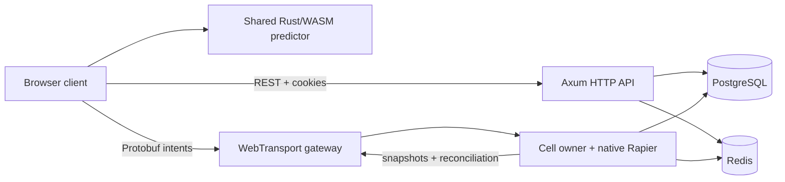

# Technology Stack

ClaudeCitizen has one browser client and one horizontally scalable Rust backend. Realtime gameplay is cell-authoritative; there is no alternate backend or legacy transport path.

## At a glance

| Layer | Path | Technology |
| --- | --- | --- |
| Browser game | `src/` | TypeScript, Vite, Three.js |
| Prediction | `backend/crates/sim-core/` | Shared Rust compiled to WebAssembly |
| HTTP API | `backend/crates/server/` | Rust, Tokio, Axum |
| Realtime | `backend/crates/server/` | WebTransport over QUIC, Protobuf |
| Authority | `backend/crates/sim-core/` | Native Rapier 3D, fixed-step simulation |
| Durable state | `backend/migrations/` | PostgreSQL, SQLx |
| Coordination | backend runtime | Redis leases, streams, Pub/Sub, tickets |
| Deployment | `deploy/k8s/` | Kubernetes Deployment, Service, HPA, PDB |



## Browser

The browser owns presentation, input capture, interpolation, and prediction. It does not decide authoritative outcomes.

- `src/net/world_client.ts` creates a one-use session ticket and connects with WebTransport.
- `src/net/world_protocol.ts` encodes and decodes the canonical messages in `proto/world.proto`.
- `src/net/prediction_wasm.ts` loads `cc_sim_core.wasm`; no separate TypeScript prediction algorithm exists.
- Reliable streams carry joins, transitions, chat, and reconciliation. Datagrams carry time-sensitive intents and snapshots.

## Backend

The backend is a Rust workspace with three crates:

| Crate | Responsibility |
| --- | --- |
| `cc-server` | HTTP/auth/admin/game APIs, WebTransport sessions, cell routing and ownership |
| `cc-sim-core` | Deterministic prediction primitives and native Rapier authority |
| `cc-protocol` | prost-generated Protobuf messages and length-delimited framing |

Each cell has one active writer. A Redis lease selects the owner, and a PostgreSQL epoch fences stale owners. Non-owner pods forward commands through Redis Streams and receive snapshots through Redis Pub/Sub. Owners checkpoint versioned snapshots to PostgreSQL.

## Persistence and coordination

SQLx migration files under `backend/migrations/` are the only schema history. The baseline is idempotent so databases created before the Rust cutover can be adopted without replay failures.

PostgreSQL stores accounts, tokens, catalog, inventory/loadout, player builds, ships, cell epochs, and cell checkpoints. Redis stores only ephemeral coordination state: rate limits, one-use WebTransport tickets, cell leases, routed command streams, and snapshot fan-out.

## Local commands

```bash
npm run dev:infra       # PostgreSQL, Redis, Mailpit
npm run backend:migrate # apply SQLx migrations
npm run dev:server      # watch/rebuild/restart Rust HTTP + WebTransport backend
npm run start:server    # one-shot Rust backend
npm run dev             # build shared WASM and start Vite
```

Environment variables are documented in `backend/.env.example`. WebTransport uses a generated self-signed development identity unless certificate paths are configured; production supplies a trusted certificate through Kubernetes secrets.

## Deployment

`backend/Dockerfile` builds one server image. `deploy/k8s/` runs at least three replicas behind TCP/UDP services, with readiness/liveness probes, a migration Job, horizontal autoscaling, disruption protection, and restricted network policy. Browser delivery remains separate from backend orchestration.

See [Rust Backend Cutover PRD](./rust-backend-cutover-prd) and [Cutover Implementation Plan](./rust-backend-cutover-plan) for requirements and acceptance criteria.
