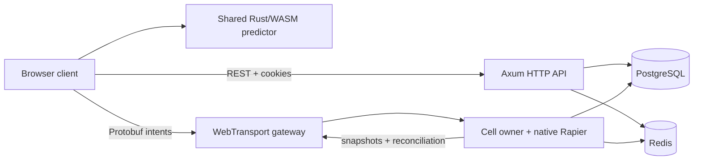

# Technology Stack

ClaudeCitizen ships **two surfaces**: the AsteronEngine Electron editor and one
horizontally scalable Rust backend. The browser game is a build target of the
first. Realtime gameplay is cell-authoritative; there is no alternate backend or
legacy transport path.

## At a glance

| Layer | Path | Technology |
| --- | --- | --- |
| Editor | `editor-desktop/`, `src/editor/` | Electron, React 19, Vite |
| Game runtime | `src/` | TypeScript, Vite, Three.js |
| Prediction | `backend/crates/sim-core/` | Shared Rust compiled to WebAssembly |
| HTTP API | `backend/crates/server/` | Rust, Tokio, Axum |
| Realtime | `backend/crates/server/` | WebTransport over QUIC, Protobuf |
| Authority | `backend/crates/sim-core/` | Native Rapier 3D, fixed-step simulation |
| Durable state | `backend/migrations/` | PostgreSQL, SQLx |
| Coordination | backend runtime | Redis leases, streams, Pub/Sub, tickets |
| Deployment | `backend/Dockerfile` + host compose | Container image; Postgres/Redis external or compose |


```mermaid
flowchart LR
  Browser["Browser client"]
  WASM["Shared Rust/WASM predictor"]
  API["Axum HTTP API"]
  WT["WebTransport gateway"]
  Cell["Cell owner + native Rapier"]
  PG[(PostgreSQL)]
  Redis[(Redis)]

  Browser --> WASM
  Browser -->|"REST + cookies"| API
  Browser -->|"Protobuf intents"| WT
  WT --> Cell
  Cell -->|"snapshots + reconciliation"| WT
  API --> PG
  Cell --> PG
  API --> Redis
  Cell --> Redis
```

## Browser

The browser owns presentation, input capture, interpolation, and prediction. It does not decide authoritative outcomes.

- `src/net/world-client.ts` creates a one-use session ticket and connects with WebTransport.
- `src/net/world-protocol.ts` encodes and decodes the canonical messages in `proto/world.proto`.
- `src/net/prediction-wasm.ts` loads `cc_sim_core.wasm`; no separate TypeScript prediction algorithm exists.
- `src/net/runtime-config.ts` resolves the backend URL at startup — from project settings in the editor, from `asteron.runtime.json` in a shipped release. There is no build-time `VITE_API_BASE_URL`.
- Reliable streams carry joins, transitions, chat, and reconciliation. Datagrams carry time-sensitive intents and snapshots.

## Backend

The backend is a Rust workspace with three crates:

| Crate | Responsibility |
| --- | --- |
| `cc-server` | HTTP/auth/admin/game APIs, WebTransport sessions, cell routing and ownership |
| `cc-sim-core` | Deterministic prediction primitives and native Rapier authority |
| `cc-protocol` | prost-generated Protobuf messages and length-delimited framing |

Each cell has one active writer. A Redis lease selects the owner, and a PostgreSQL epoch fences stale owners. Non-owner pods forward commands through Redis Streams and receive snapshots through Redis Pub/Sub. Owners checkpoint versioned snapshots to PostgreSQL.

## Persistence and coordination

SQLx migration files under `backend/migrations/` are the only schema history.

PostgreSQL stores accounts, tokens, catalog, inventory/loadout, player builds, ships, cell epochs, and cell checkpoints. Redis stores only ephemeral coordination state: rate limits, one-use WebTransport tickets, cell leases, routed command streams, and snapshot fan-out.

## Local commands

```bash
npm run dev:infra       # PostgreSQL, Redis, Mailpit
npm run backend:migrate # apply SQLx migrations
npm run dev:server      # watch/rebuild/restart Rust HTTP + WebTransport backend
npm run start:server    # one-shot Rust backend
npm run editor:dev      # launch AsteronEngine with Vite HMR
npm run editor          # build the editor renderer, then launch AsteronEngine
```

Environment variables are documented in `backend/.env.example`. WebTransport uses a generated self-signed development identity unless certificate paths are configured; production supplies a trusted certificate on the host.

## Deployment

`backend/Dockerfile` builds one server image. Run it on your host (for example Vultr) with Docker Compose alongside Postgres and Redis, or point the image at managed databases. Browser delivery remains separate from backend orchestration — ship the web build via **File → Build Web**.

See [Deployment](./deployment) for env vars, health endpoints, and web release steps; [Realtime](./realtime) for WebTransport / cell ownership.